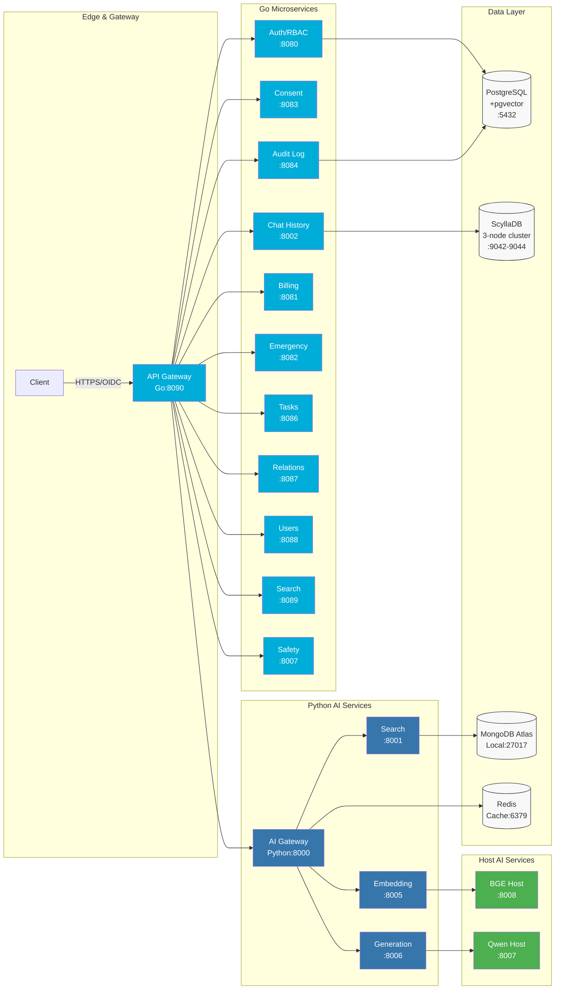

# MultiDB Therapeutic AI Chatbot

> **HIPAA-Compliant Therapeutic AI Companion for Senior Care**

A production-ready, HIPAA-compliant therapeutic AI platform designed for senior living facilities and Medicare Advantage health plans. Provides emotion-aware conversational support with real-time safety monitoring and crisis intervention capabilities.

## System Overview

The MultiDB Therapeutic AI Chatbot is a microservices-based healthcare AI platform that combines **11+ Go microservices** for business logic with **Python AI services** for machine learning workloads. The system uses specialized data stores (PostgreSQL+pgvector, MongoDB, Redis, ScyllaDB) to optimize for both compliance and performance.



## Quick Start

### Prerequisites
- Docker and Docker Compose
- Python 3.11+
- Go 1.21+ (for microservices development)
- 8GB RAM minimum, 16GB recommended

### Development Setup

```bash
# 1. Clone and setup
git clone <repository-url>
cd Lilo_EmotionalAI_Backend
make setup

# 2. Deploy infrastructure
make infrastructure

# 3. Start all services
make start

# 4. Verify system health
make health && make test
```

### Production Deployment

```bash
# Complete deployment validation
make production-ready

# HIPAA compliance verification (required)
make test-hipaa

# Interactive demo
make demo
```

## Service Directory

### Go Microservices (Business Logic)

| Service | Purpose | Port | APIs | Datastore | Links |
|---------|---------|------|------|-----------|-------|
| **API Gateway** | Request routing, authentication proxy | 8090 | REST | Redis (cache) | [README](microservices/api-gateway/README.md) |
| **Auth/RBAC** | Authentication, role-based access control | 8080 | REST | PostgreSQL | [README](microservices/auth-rbac/README.md) |
| **Chat History** | Conversation storage, retrieval | 8002 | REST | ScyllaDB | [README](microservices/chat-history/README.md) |
| **Consent** | HIPAA consent management | 8083 | REST | PostgreSQL | [README](microservices/consent/README.md) |
| **Audit Logging** | Compliance audit trails | 8084 | REST | PostgreSQL | [README](microservices/audit-logging/README.md) |
| **Billing** | Usage tracking, subscriptions | 8081 | REST | PostgreSQL | [README](microservices/billing/README.md) |
| **Emergency Access** | Break-glass access controls | 8082 | REST | PostgreSQL | [README](microservices/emergency-access/README.md) |
| **Background Tasks** | Async job processing | 8086 | REST | Redis | [README](microservices/background-tasks/README.md) |
| **Relationship Management** | Patient-provider relationships | 8087 | REST | PostgreSQL | [README](microservices/relationship-management/README.md) |
| **User Subscriptions** | Subscription lifecycle | 8088 | REST | PostgreSQL | [README](microservices/user-subscription/README.md) |
| **Search Service (Go)** | Business search operations | 8089 | REST | MongoDB | [README](microservices/search-service/README.md) |
| **Content Safety (Go)** | PHI detection, emotion analysis | 8007 | REST | Redis | [README](microservices/content-safety/README.md) |

### Python AI Services (Machine Learning)

| Service | Purpose | Port | APIs | Datastore | Links |
|---------|---------|------|------|-----------|-------|
| **AI Gateway** | AI orchestration, RAG pipeline | 8000 | REST | All DBs | [README](ai_services/README.md) |
| **Search Service** | Vector search, knowledge retrieval | 8001 | REST | MongoDB | [README](ai_services/core/README.md) |
| **Embedding Service** | Text vectorization (BGE) | 8005 | REST | Redis | [README](ai_services/embedding/README.md) |
| **Generation Service** | Response generation (Qwen) | 8006 | REST | Redis | [README](ai_services/generation/README.md) |

### Host AI Services (GPU-Accelerated)

| Service | Purpose | Port | Technology | Acceleration | Links |
|---------|---------|------|-----------|-------------|-------|
| **BGE Host Server** | BGE-large-en-v1.5 embeddings | 8008 | PyTorch + MPS | GPU/MPS | [README](host_services/README.md) |
| **Qwen Host Server** | Qwen2.5-7B generation | 8007 | PyTorch + MPS | GPU/MPS | [README](host_services/README.md) |

## Security & Compliance Highlights

> **Security:** All PHI data encrypted with AES-256-GCM at rest and TLS 1.3 in transit

> **Compliance:** Full HIPAA technical safeguards implementation with automated compliance monitoring

> **Access Control:** Role-based access with healthcare-specific roles (Provider, Caregiver, Resident, Admin)

> **Audit Trails:** Immutable audit logs with tamper detection and 6-year retention

### HIPAA Implementation Status
- ✅ **Access Control (§164.312(a))**: Unique user IDs, automatic logoff, encryption
- ✅ **Audit Controls (§164.312(b))**: Comprehensive logging with integrity protection
- ✅ **Integrity (§164.312(c))**: Data versioning with cryptographic signatures
- ✅ **Authentication (§164.312(d))**: Multi-factor auth for healthcare providers
- ✅ **Transmission Security (§164.312(e))**: TLS 1.3 with service-to-service encryption

## Documentation Navigation

### 🏗️ Architecture & Design
- **[System Architecture](docs/architecture/ARCHITECTURE.md)** - Comprehensive system design and C4 model documentation
- **[Microservices Architecture](docs/architecture/Microservices_Architecture.md)** - Deep dive into 12 Go microservices
- **[Data Stores and Schemas](docs/architecture/Data_Stores_and_Schemas.md)** - Multi-database architecture guide
- **[Performance and Caching](docs/architecture/Performance_and_Caching.md)** - Caching strategies and performance optimization

### 🤖 AI/ML Systems
- **[AI Architecture](docs/ai/AI_Architecture.md)** - AI service orchestration and model implementation
- **[RAG Pipeline](docs/ai/RAG_Pipeline.md)** - Retrieval-augmented generation architecture
- **[AI Model Quality](docs/ai/AI_Model_Quality.md)** - Model evaluation and quality metrics
- **[Safety and Therapeutic Guards](docs/ai/Safety_and_Therapeutic_Guards.md)** - Crisis detection and safety filters
- **[Search Optimization](docs/ai/Search_Optimization.md)** - Vector search and ranking improvements

### 🔒 Security & Compliance
- **[Security Architecture](docs/security/Security_Architecture.md)** - Zero-trust security design and authentication flows
- **[Threat Model](docs/security/Threat_Model.md)** - STRIDE analysis and healthcare-specific threats
- **[HIPAA Controls Matrix](docs/compliance/HIPAA_Controls_Matrix.md)** - Complete HIPAA technical safeguards mapping
- **[Audit Trail Guide](docs/compliance/Audit_Trail_Guide.md)** - Comprehensive audit logging implementation
- **[Consent Management](docs/compliance/Consent_Management.md)** - HIPAA consent workflows and procedures
- **[PHI Data Inventory](docs/compliance/PHI_Data_Inventory.md)** - Protected health information tracking

### 🖥️ User Interface & Experience
- **[User Guide](docs/web-ui/User_Guide.md)** - Comprehensive feature usage guide for healthcare staff
- **[UI Implementation Plan](docs/web-ui/ui_implementation_plan.md)** - Frontend development specifications
- **[UI Product Requirements](docs/web-ui/ui_prd.md)** - Product requirements for frontend development

### 🔧 Operations & Deployment
- **[Deployment Guide](docs/operations/Deployment_Guide.md)** - Production deployment procedures
- **[Runbooks](docs/operations/Runbooks.md)** - Incident response procedures  
- **[Monitoring Guide](docs/operations/Monitoring_and_Alerting.md)** - Observability and alerting
- **[Backup & Recovery](docs/operations/Backup_and_Recovery.md)** - Data protection procedures

### 📋 Complete Navigation
- **[Documentation Index](docs/TOC.md)** - Full documentation table of contents
- **[Testing Guide](TESTING_GUIDE.md)** - Comprehensive testing framework and procedures
- **[Glossary](docs/GLOSSARY.md)** - Technical terms and healthcare terminology
- **[Change Log](docs/CHANGELOG.md)** - System evolution and updates

## Development Commands

```bash
# Daily development workflow
make dev                 # Start with auto-reload
make test               # Quick validation tests
make health             # Service health check

# Infrastructure management  
make infrastructure     # Deploy databases
make database          # Run migrations
make seed              # Seed knowledge base

# Testing & validation
make test-quick        # Fast feedback (<5 min)
make test-hipaa        # HIPAA compliance (required)
make test-all          # Full test suite (15-20 min)

# Service management
make start             # Start all services
make stop              # Stop all services
make restart           # Full restart

# Utilities
make clean             # Clean caches
make reset             # Complete system reset
make docs              # Show documentation links
```

## System Requirements

### Production Environment
- **CPU**: 8+ cores, ARM64 or x86_64
- **Memory**: 16GB minimum, 32GB recommended
- **Storage**: 100GB SSD for databases and AI models
- **Network**: HTTPS with valid TLS certificates
- **OS**: Linux (Ubuntu 22.04+), macOS (ARM64), Docker support

### Development Environment
- **CPU**: Apple M1/M2 recommended for MPS acceleration
- **Memory**: 8GB minimum, 16GB recommended  
- **Storage**: 20GB for local development
- **Tools**: Docker, Python 3.11+, Go 1.21+, Terraform

## Healthcare Role Support

The system supports healthcare-specific user roles with appropriate access controls:

- **👤 Resident**: Access to personal health data and therapeutic conversations
- **👨‍⚕️ Health Provider**: Clinical access to assigned patients with audit trails
- **👩‍⚕️ Care Staff**: Daily care coordination with limited PHI access
- **👨‍👩‍👧‍👦 Family Member**: Delegated access with explicit patient consent
- **👨‍💼 System Admin**: Infrastructure management with no clinical data access

## Crisis Intervention & Safety

> **Emergency Protocols:** Automated crisis detection with immediate escalation to human caregivers and emergency services

The platform includes comprehensive safety measures:
- **Real-time Crisis Detection**: Sentiment analysis for mental health emergencies
- **Automated Escalation**: Direct alerts to care coordinators and emergency contacts
- **PHI Protection**: Automatic detection and masking of personally identifiable information
- **Therapeutic Guidelines**: AI responses follow evidence-based therapeutic conversation patterns

## License

MIT License - See [LICENSE](LICENSE) for details.

## Support

For technical issues, deployment questions, or security concerns:
- **Documentation**: Start with [docs/TOC.md](docs/TOC.md)
- **Development Issues**: Check [troubleshooting guide](docs/operations/Runbooks.md)
- **Security Issues**: Review [security architecture](docs/security/Security_Architecture.md)
- **HIPAA Questions**: Consult [compliance controls](docs/compliance/HIPAA_Controls_Matrix.md)

---

**🏥 Ready for Healthcare Deployment** | **🔒 HIPAA-Compliant** | **🤖 Production AI/ML** | **📊 Enterprise Monitoring**