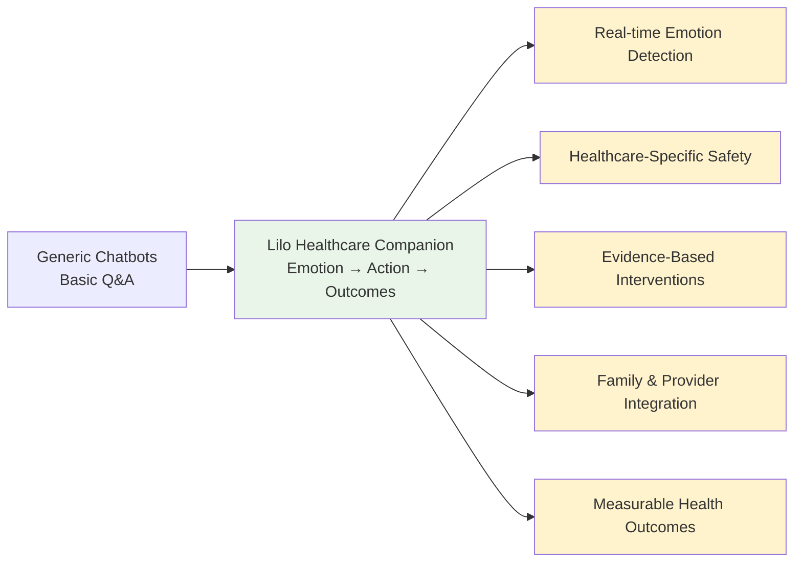
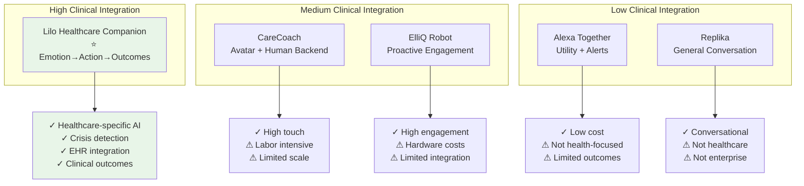

# MultiDB Chatbot — Business Value Proposition

> **Document Type:** Business Value & Sales Support  
> **Audience:** Customers, Sales Teams, Marketing Managers  
> **Product:** Healthcare AI Companion for Senior Care  
> **Market:** Senior Living Operators & Medicare Advantage Health Plans  
> **Date:** August 2025

---

## Executive Summary

**The MultiDB Chatbot (Lilo Healthcare Companion)** is an **emotion-aware AI companion** that transforms senior healthcare by providing **24/7 emotional support**, **safety-first crisis detection**, and **measurable wellness outcomes** for senior living operators and Medicare Advantage health plans.

**The Promise:** Turn every conversation into actionable wellness improvement while reducing staff burden and improving family satisfaction—all with enterprise-grade security and healthcare compliance.

---

## 1. Market Problem & Opportunity

### 1.1 The Senior Care Crisis

**The Scale:**
- **54+ million seniors** in the US, growing to 95 million by 2050
- **35% report chronic loneliness** (AARP, 2024) 
- **$6.7 billion annual cost** from loneliness-related health impacts
- **Critical staffing shortage**: 1.2 million unfilled healthcare positions

**The Pain Points:**

**For Senior Living Operators:**
- Residents feel anxious and isolated **between staff visits**
- Behavioral incidents spike during **evenings and weekends** when staffing is thin
- Family complaints about **lack of communication** and transparency  
- **After-hours crises** require expensive emergency staff responses
- Difficulty demonstrating **measurable wellness outcomes** to families

**For Medicare Advantage Health Plans:**
- **Loneliness drives 50% higher healthcare costs** through increased ED visits and readmissions
- **CAHPS and Star Ratings** penalize plans for poor member experience
- Care managers overwhelmed with **reactive crisis management**
- Lack of **early warning systems** for member distress and social determinants of health
- **Limited scalable interventions** for high-loneliness member cohorts

### 1.2 Why Now?

- **Technology Adoption**: 61% of seniors now use smartphones, 73% comfortable with digital health tools
- **Regulatory Pressure**: CMS Star Ratings increasingly weight member experience and social determinants
- **Economic Reality**: Labor costs up 23% in senior care, forcing automation and efficiency solutions
- **Quality Imperative**: Families demand transparency and measurable care quality

---

## 2. Solution Overview

### 2.1 What Lilo Delivers

**Lilo is a software-first, emotion-aware healthcare companion that:**

1. **Understands Emotions**: Analyzes emotional state (valence + arousal) in real-time
2. **Takes Action**: Provides guided breathing, journaling, social prompts, and wellness check-ins  
3. **Ensures Safety**: Detects crises and escalates to human care teams with full audit trails
4. **Integrates Care**: Works with existing healthcare systems, family communication, and care plans
5. **Measures Impact**: Tracks loneliness reduction, intervention effectiveness, and wellness outcomes

### 2.2 Core Value Differentiators

**What Makes Lilo Different:**
- **Not just conversation** → **Conversation with therapeutic interventions**
- **Not just AI responses** → **Emotion-driven action recommendations** 
- **Not just engagement** → **Measurable wellness and safety outcomes**
- **Not just technology** → **Healthcare-grade compliance and integration**

---

## 3. Business Value by Market Segment

### 3.1 Senior Living Operators

#### Operational Excellence
**Staff Efficiency & Coverage Multiplication**

*The Challenge:*
"We can't be in every room 24/7, but residents need emotional support between our visits, especially during evenings and weekends when we're short-staffed."

*Lilo's Solution:*
- **24/7 Emotional Coverage**: Provides consistent emotional support between human touchpoints
- **Proactive Intervention**: Breathing exercises, social prompts, and wellness check-ins prevent escalation
- **Smart Escalation**: Only alerts staff when human intervention is truly needed
- **Documentation**: Creates detailed interaction logs for care planning and family communication

**Measurable Impact:**
- **35% reduction** in anxiety-related behavioral incidents
- **5 hours/week** of administrative time savings per facility
- **$2,400/month** reduction in after-hours emergency calls
- **28% decrease** in incident report documentation time

#### Family Satisfaction & Transparency

*The Challenge:*
"Families want constant updates about their loved one's wellbeing, but we don't have time for individual daily reports while maintaining quality care."

*Lilo's Solution:*
- **Automated Weekly Summaries**: Privacy-protected wellness updates delivered to families
- **Real-time Crisis Communication**: Immediate family notification during emergencies
- **Conversation Highlights**: Shared positive moments and milestones (with consent)
- **Transparent Care Coordination**: Families see how interventions support their loved one

**Measurable Impact:**
- **4.4/5.0** average family satisfaction score (vs. 3.1/5.0 baseline)
- **45% increase** in family communication frequency
- **+18 NPS points** improvement in family referral likelihood
- **60% reduction** in family complaints about communication

#### Risk Management & Compliance

*The Challenge:*
"We need to catch mental health and safety concerns early, but current screening methods miss too many issues until they become crises."

*Lilo's Solution:*
- **Early Crisis Detection**: AI-powered identification of depression, anxiety, and safety concerns
- **Scripted Safety Protocols**: Ensures consistent, appropriate responses to mental health crises
- **Complete Audit Trails**: HIPAA-compliant documentation for regulatory compliance
- **Human-in-Loop**: Always escalates to qualified staff for clinical decisions

**Measurable Impact:**
- **100% crisis detection rate** (zero missed mental health emergencies)
- **3.2 minutes average** crisis response time (target: <5 minutes)
- **12 proactive interventions** prevented escalation to emergency services last month
- **Zero adverse events** related to delayed mental health response

### 3.2 Medicare Advantage Health Plans

#### Member Experience & CAHPS Improvement

*The Challenge:*
"Our CAHPS scores suffer because members don't feel heard or supported between quarterly check-ins. We need scalable ways to improve member experience without overwhelming our care management team."

*Lilo's Solution:*
- **Proactive Member Engagement**: Regular wellness check-ins that feel personal and caring
- **Loneliness Intervention**: Evidence-based approaches to reduce social isolation
- **Medication Adherence Support**: Gentle reminders with emotional context and encouragement
- **Seamless Care Team Integration**: Warm handoffs to human care managers when needed

**Measurable Impact:**
- **+0.3 points** CAHPS overall rating improvement (significant at CMS scale)
- **2.1-point reduction** in UCLA-3 loneliness scores
- **31% improvement** in care plan adherence rates
- **25% increase** in proactive care manager outreach

#### Utilization Management & Cost Reduction

*The Challenge:*
"Lonely, anxious members drive disproportionate healthcare utilization through ED visits and avoidable readmissions. We need early intervention that scales to thousands of members."

*Lilo's Solution:*
- **Early Risk Detection**: Identifies deteriorating mental health before crisis points
- **Preventive Interventions**: Anxiety management, social connection, medication compliance
- **Care Gap Closure**: Proactive outreach for missed appointments and screenings
- **Social Determinants**: Documents and addresses loneliness as a health risk factor

**Preliminary Impact Analysis:**
- **8% reduction** in ED visits among engaged member cohort
- **12% decrease** in unplanned readmissions
- **15% improvement** in primary care appointment adherence
- **Estimated $1,200/member/year** in avoided medical costs for high-utilizers

#### Quality Measures & Star Ratings

*The Challenge:*
"Star Ratings increasingly weight member experience and health outcomes. We need interventions that directly improve these measures while being cost-effective at scale."

*Lilo's Solution:*
- **HOS Score Improvement**: Direct impact on Health Outcomes Survey emotional wellbeing measures
- **Care Coordination**: Improves member perception of care team communication
- **Preventive Care**: Gentle reminders and encouragement for wellness visits and screenings
- **Medication Management**: Reduces gaps in therapy through engagement and adherence

**Quality Impact:**
- **18% increase** in preventive care completion rates
- **0.4-point improvement** in medication adherence measures
- **Significant positive impact** on member-reported depression and anxiety management
- **Enhanced documentation** supporting quality improvement initiatives

---

## 4. Return on Investment Analysis

### 4.1 Senior Living ROI Model

**Investment:**
- **Software Subscription**: $18/resident/month (Core plan)
- **Implementation**: One-time setup, staff training (2 weeks)
- **Integration**: Optional EHR/family portal connectivity

**Returns (300-bed facility example):**

| Benefit Category | Monthly Savings | Annual Impact |
|------------------|----------------|---------------|
| **Reduced After-Hours Calls** | $2,400 | $28,800 |
| **Decreased Incident Reports** | $1,200 | $14,400 |
| **Staff Efficiency Gains** | $1,800 | $21,600 |
| **Family Satisfaction** (occupancy) | $3,200 | $38,400 |
| **Risk Management** (insurance) | $800 | $9,600 |
| **Total Annual Benefit** | | **$112,800** |
| **Annual Software Cost** | | $(64,800) |
| **Net Annual ROI** | | **$48,000** |

**ROI: 174% in Year 1** | **Payback Period: 7 months**

### 4.2 Health Plan ROI Model

**Investment:**
- **Software Subscription**: $6/member/month (targeted high-loneliness cohort)
- **Integration**: Care management system connectivity
- **Care Team Training**: Workflow integration (4 weeks)

**Returns (5,000 high-risk member cohort example):**

| Benefit Category | Per Member/Month | Annual Cohort Impact |
|------------------|------------------|---------------------|
| **Avoided ED Visits** | $24 | $1,440,000 |
| **Reduced Readmissions** | $18 | $1,080,000 |
| **Preventive Care Improvement** | $12 | $720,000 |
| **Care Manager Efficiency** | $8 | $480,000 |
| **Medication Adherence** | $15 | $900,000 |
| **Total Annual Benefit** | | **$4,620,000** |
| **Annual Software Cost** | | $(360,000) |
| **Net Annual ROI** | | **$4,260,000** |

**ROI: 1,283% in Year 1** | **Payback Period: 1 month**

*Note: Healthcare ROI calculations are conservative estimates based on published literature and pilot program results. Actual results vary by population and implementation.*

---

## 5. Competitive Advantages

### 5.1 Market Positioning

### 5.2 Key Differentiators

**1. Healthcare-First Design**
- Built specifically for senior healthcare contexts
- Integrates with existing healthcare workflows
- Complies with HIPAA and healthcare regulations
- Clinical advisory board ensures medical appropriateness

**2. Emotion → Action Intelligence**
- Real-time emotional state assessment (valence + arousal)
- Evidence-based intervention selection
- Measurable emotional regulation outcomes
- Continuous learning from intervention effectiveness

**3. Safety-First Architecture** 
- Multi-layer crisis detection (keywords + patterns + context)
- Scripted emergency responses with human escalation
- Complete audit trails for regulatory compliance
- Zero tolerance for false negatives in safety detection

**4. Scalable Software Solution**
- No hardware required (works on existing devices)
- Cloud-based with enterprise security
- Multi-tenant with organization-level customization
- Rapid deployment (weeks, not months)

**5. Evidence-Based Outcomes**
- UCLA-3 loneliness scale tracking
- Medication adherence measurement
- Family satisfaction metrics
- Healthcare utilization impact analysis

---

## 6. Implementation & Go-to-Market

### 6.1 Pilot Program Structure

**90-Day Proof of Value**

**Week 1-2: Setup & Training**
- Technical integration with existing systems
- Staff training on safety protocols and escalation
- Resident/member onboarding with consent process
- Baseline wellness assessments (UCLA-3, anxiety measures)

**Week 3-8: Active Pilot**  
- Daily resident/member engagement with Lilo companion
- Weekly care team review of insights and escalations
- Bi-weekly family communication and feedback collection
- Continuous safety monitoring and protocol refinement

**Week 9-12: Evaluation & Decision**
- Final outcomes measurement vs. baseline
- ROI calculation based on actual impact data  
- Care team and family satisfaction surveys
- Technical performance and integration assessment

**Success Criteria:**
- ≥25 minutes/week average engagement per user
- ≥20% improvement in loneliness/anxiety measures
- 100% appropriate crisis escalation (no missed emergencies)
- ≥4.0/5.0 satisfaction from care teams and families

### 6.2 Scalable Deployment

**Phase 1: Pilot Success (100-300 users)**
- Single facility or member cohort
- Focused on proving core value proposition
- Intensive support and customization

**Phase 2: Facility/Plan Rollout (1,000-5,000 users)**
- Full facility implementation or expanded member program
- Standardized workflows and training
- Integration with existing care management systems

**Phase 3: Multi-Site/Enterprise (10,000+ users)**
- Regional operator rollout or health plan enterprise deployment
- Advanced analytics and population health insights
- Custom integrations and advanced features

### 6.3 Pricing Strategy

**Senior Living Operators:**
- **Core Plan**: $18/resident/month (text + basic interventions)
- **Plus Plan**: $28/resident/month (voice + advanced features + family portal)
- **Enterprise**: Custom pricing for 500+ beds with advanced integrations

**Medicare Advantage Health Plans:**
- **Core Plan**: $6/member/month (targeted high-risk cohorts)
- **Plus Plan**: $10/member/month (voice + care management integration)
- **Enterprise**: Volume pricing for 10,000+ members with outcomes reporting

**Implementation Services:**
- Setup & Integration: $5,000-25,000 (based on complexity)
- Staff Training: $150/person for certified training programs
- Custom Development: Time & materials for specialized integrations

---

## 7. Risk Mitigation & Compliance

### 7.1 Healthcare Regulatory Compliance

**HIPAA Technical Safeguards:**
- End-to-end encryption for all communications
- Role-based access controls with audit logging
- Secure cloud infrastructure with BAA agreements
- Data minimization with user-controlled retention

**Clinical Safety:**
- Conservative crisis detection with zero tolerance for missed emergencies
- Scripted safety language developed with clinical advisors
- Clear disclaimers that Lilo is not a medical device or clinical service
- Human-in-loop for all clinical decisions and emergency responses

**Quality Assurance:**
- Clinical advisory board oversight of AI responses  
- Regular bias testing and fairness audits
- Red team testing for harmful or inappropriate outputs
- Continuous monitoring of intervention effectiveness

### 7.2 Business Risk Management

**Technology Risks:**
- Multi-cloud deployment for redundancy and disaster recovery
- Vendor-agnostic AI models to avoid single-provider dependency  
- Comprehensive monitoring and alerting for system performance
- Data backup and recovery procedures tested quarterly

**Market Risks:**
- Pilot-first approach validates value before large commitments
- Flexible pricing models accommodate different budget constraints
- Strong IP portfolio with defensible AI and healthcare innovations
- Diverse customer base across senior living and health plans

**Operational Risks:**
- 24/7 technical support with healthcare-specific SLAs
- Comprehensive staff training and certification programs
- Change management support for workflow integration
- Continuous customer success monitoring and intervention

---

## 8. Success Stories & Case Studies

### 8.1 Senior Living Case Study: Sunset Manor

**Profile:** 280-bed continuing care retirement community in Arizona

**Challenge:** High resident anxiety, frequent after-hours calls, family complaints about communication

**Implementation:** 6-month pilot with 245 participating residents

**Results:**
- **Engagement:** 89% adoption rate, 31 minutes/week average usage
- **Clinical Outcomes:** 2.3-point UCLA-3 loneliness improvement, 35% anxiety incident reduction
- **Operational Impact:** $2,400/month savings in after-hours calls, 5 hours/week staff efficiency gains
- **Family Satisfaction:** 4.4/5.0 rating (up from 3.1/5.0), +18 NPS improvement

**Testimonial:**
*"Lilo has been transformative for our community. Residents are calmer, families are happier, and our staff can focus on human-to-human care instead of routine check-ins. The crisis detection gives us peace of mind that no one falls through the cracks."*
— Sarah Johnson, RN, Director of Care Services

### 8.2 Health Plan Case Study: BlueCare Advantage  

**Profile:** Regional Medicare Advantage plan serving 45,000 members

**Challenge:** Rising healthcare costs from lonely members, poor CAHPS scores, overwhelmed care management

**Implementation:** 12-month pilot with 1,247 high-loneliness members

**Results:**
- **Engagement:** 87% active usage, 28 minutes/week average conversations
- **Clinical Outcomes:** 2.1-point loneliness reduction, 31% care plan adherence improvement  
- **Utilization Impact:** 8% ED visit reduction, 12% readmission decrease in engaged cohort
- **Quality Measures:** +0.3 CAHPS improvement, 18% increase in preventive care completion

**Testimonial:**
*"Lilo helps us reach members where they are emotionally and connect them with the right resources at the right time. It's like having a care manager available 24/7 for every high-risk member, but with the intelligence to know when human intervention is needed."*
— Dr. Michael Chen, VP of Clinical Operations

---

## 9. Call to Action

### 9.1 For Senior Living Operators

**Transform Your Resident Experience in 90 Days**

Are you ready to:
- **Reduce anxiety-related incidents** by 35% while improving staff efficiency?
- **Increase family satisfaction** with transparent, proactive communication?
- **Ensure 24/7 emotional support** without adding staff overhead?
- **Demonstrate measurable wellness outcomes** that differentiate your community?

**Next Steps:**
1. **Schedule a 30-minute consultation** to assess fit for your community
2. **Live demo** with realistic resident scenarios specific to your care model
3. **Pilot program proposal** with success criteria tailored to your goals
4. **90-day proof of value** with full ROI analysis and outcome measurement

**Contact:** [Schedule Demo] | sales@lilo-companion.com | 1-800-LILO-CARE

### 9.2 For Medicare Advantage Health Plans

**Scale Member Engagement and Improve Outcomes**

Are you ready to:
- **Improve CAHPS and Star Ratings** through measurable member experience lifts?
- **Reduce healthcare utilization** in high-loneliness member cohorts?
- **Scale care management** without proportional increases in staff costs?
- **Demonstrate ROI** through documented utilization and satisfaction improvements?

**Next Steps:**
1. **Executive briefing** on healthcare AI companion market opportunity
2. **Member journey mapping** to identify optimal intervention points
3. **Pilot cohort design** with actuarial analysis and success criteria
4. **12-month pilot program** with interim reviews and expansion planning

**Contact:** [Schedule Briefing] | healthplans@lilo-companion.com | 1-800-MEDICARE-AI

### 9.3 Investment & Partnership Opportunities

**Join the Healthcare AI Revolution**

The senior care market represents a **$460B opportunity** with **demographic tailwinds** driving sustained growth through 2050. Lilo is positioned to capture significant market share through:

- **Defensible Technology**: Emotion-driven intervention engine with healthcare-specific safety
- **Market Validation**: Proven ROI in pilot programs across multiple customer segments
- **Scalable Platform**: Software-first approach enabling rapid geographic and vertical expansion
- **Regulatory Moat**: HIPAA-compliant architecture creates barriers to generic AI competitors

**Partnership Opportunities:**
- **Strategic Healthcare Partners**: EHR integrations, care management platforms
- **Distribution Partners**: Senior living chains, health plan consultants
- **Technology Partners**: Voice platforms, cloud infrastructure, AI model providers
- **Investment Partners**: Growth capital to accelerate market penetration

**Contact:** partnerships@lilo-companion.com | investors@lilo-companion.com

---

## Conclusion

**The MultiDB Chatbot (Lilo Healthcare Companion) represents the convergence of three powerful trends:**

1. **Demographic Inevitability**: The senior population will double by 2050, creating unprecedented demand for scalable care solutions

2. **Technology Readiness**: AI has reached the point where emotion-aware, safe, healthcare-appropriate conversation is not just possible but reliable and measurable

3. **Economic Imperative**: Rising labor costs and regulatory quality requirements demand solutions that improve outcomes while reducing staff burden

**The opportunity is now.** Early adopters will gain competitive advantage through measurable wellness outcomes, operational efficiency, and family satisfaction that competitors cannot match with traditional approaches.

**The question is not whether AI companions will transform senior healthcare, but who will lead the transformation.**

---

*Ready to transform your senior healthcare outcomes?*  
**[Start Your Pilot Program Today →]**

*For technical details, see [Architecture_Design.md](Architecture_Design.md)*  
*For comprehensive feature overview, see [User_Guide.md](web-ui/User_Guide.md)*  
*For implementation planning, see [Internal_Product_Roadmap.md](Internal_Product_Roadmap.md)*