# System Diagrams

> **Comprehensive visual documentation of system architecture, data flows, and operational processes**

## Table of Contents

1. [High-Level Architecture](#high-level-architecture)
2. [Microservices Architecture](#microservices-architecture)
3. [Data Architecture](#data-architecture)
4. [Security Architecture](#security-architecture)
5. [AI/ML Pipeline](#aiml-pipeline)
6. [Crisis Intervention Flow](#crisis-intervention-flow)
7. [Deployment Architecture](#deployment-architecture)
8. [Monitoring and Observability](#monitoring-and-observability)

## High-Level Architecture

### System Context Diagram

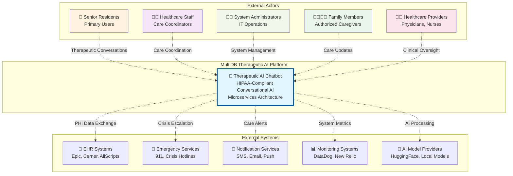

## Microservices Architecture

### Complete Service Topology

```mermaid
flowchart TB
    subgraph "Client Layer"
        WEB[🌐 Web Interface<br/>React/Next.js<br/>Port: 3000]
        MOBILE[📱 Mobile App<br/>React Native<br/>iOS/Android]
        API_DOCS[📋 API Documentation<br/>OpenAPI/Swagger<br/>Auto-generated]
    end

    subgraph "API Gateway Layer"
        GATEWAY[🚪 API Gateway<br/>Go + Gin<br/>Port: 8090]
    end

    subgraph "Go Microservices Tier"
        AUTH[🔐 Auth/RBAC<br/>Go + PostgreSQL<br/>Port: 8080]
        CONSENT[📝 Consent<br/>Go + PostgreSQL<br/>Port: 8083]
        CHAT_HIST[💬 Chat History<br/>Go + ScyllaDB<br/>Port: 8002]
        AUDIT[📋 Audit Logging<br/>Go + PostgreSQL<br/>Port: 8084]
        BILLING[💳 Billing<br/>Go + PostgreSQL<br/>Port: 8081]
        EMERGENCY[🚨 Emergency Access<br/>Go + PostgreSQL<br/>Port: 8082]
        TASKS[⚙️ Background Tasks<br/>Go + Redis<br/>Port: 8086]
        RELATIONSHIPS[👥 Relationship Mgmt<br/>Go + PostgreSQL<br/>Port: 8087]
        SUBSCRIPTIONS[📄 User Subscriptions<br/>Go + PostgreSQL<br/>Port: 8088]
        SEARCH_GO[🔍 Search Service<br/>Go + MongoDB<br/>Port: 8089]
        CONTENT_SAFETY_GO[🛡️ Content Safety<br/>Go + Redis<br/>Port: 8007]
    end

    subgraph "Python AI Services Tier"
        AI_GATEWAY[🤖 AI Gateway<br/>FastAPI + Python<br/>Port: 8000]
        SEARCH_PY[🔍 Search Service<br/>Python + MongoDB<br/>Port: 8001]
        EMBEDDING[🧠 Embedding Service<br/>BGE + FastAPI<br/>Port: 8005]
        GENERATION[✍️ Generation Service<br/>Qwen + FastAPI<br/>Port: 8006]
    end

    subgraph "Host AI Services (GPU)"
        BGE_HOST[🧠 BGE Host Server<br/>PyTorch + MPS<br/>Port: 8008]
        QWEN_HOST[✍️ Qwen Host Server<br/>PyTorch + MPS<br/>Port: 8007]
    end

    subgraph "Data Layer"
        POSTGRES[(🐘 PostgreSQL 15<br/>HIPAA Schema + pgvector<br/>Port: 5432)]
        MONGODB[(🍃 MongoDB Atlas Local<br/>Knowledge Base + Vector Search<br/>Port: 27017)]
        REDIS[(⚡ Redis 7<br/>Sessions + Cache<br/>Port: 6379)]
        SCYLLADB[(🏛️ ScyllaDB Cluster<br/>Chat History + Analytics<br/>Ports: 9042-9044)]
    end

    %% Client Connections
    WEB --> GATEWAY
    MOBILE --> GATEWAY
    API_DOCS --> GATEWAY

    %% Gateway to Services
    GATEWAY --> AUTH
    GATEWAY --> AI_GATEWAY
    GATEWAY --> CHAT_HIST
    GATEWAY --> CONSENT
    GATEWAY --> AUDIT

    %% Go Service Dependencies
    AUTH --> POSTGRES
    CONSENT --> POSTGRES
    CHAT_HIST --> SCYLLADB
    AUDIT --> POSTGRES
    BILLING --> POSTGRES
    EMERGENCY --> POSTGRES
    TASKS --> REDIS
    RELATIONSHIPS --> POSTGRES
    SUBSCRIPTIONS --> POSTGRES
    SEARCH_GO --> MONGODB
    CONTENT_SAFETY_GO --> REDIS

    %% AI Service Dependencies
    AI_GATEWAY --> SEARCH_PY
    AI_GATEWAY --> EMBEDDING
    AI_GATEWAY --> GENERATION
    AI_GATEWAY --> POSTGRES
    AI_GATEWAY --> REDIS
    
    SEARCH_PY --> MONGODB
    SEARCH_PY --> EMBEDDING
    
    EMBEDDING --> BGE_HOST
    EMBEDDING --> REDIS
    
    GENERATION --> QWEN_HOST
    GENERATION --> REDIS

    %% Styling
    classDef client fill:#e3f2fd,stroke:#1976d2
    classDef gateway fill:#fff3e0,stroke:#f57c00
    classDef go fill:#00ADD8,color:#fff,stroke:#006064
    classDef python fill:#3776ab,color:#fff,stroke:#1565c0
    classDef ai fill:#4caf50,color:#fff,stroke:#2e7d32
    classDef data fill:#f8f8f8,stroke:#333

    class WEB,MOBILE,API_DOCS client
    class GATEWAY gateway
    class AUTH,CONSENT,CHAT_HIST,AUDIT,BILLING,EMERGENCY,TASKS,RELATIONSHIPS,SUBSCRIPTIONS,SEARCH_GO,CONTENT_SAFETY_GO go
    class AI_GATEWAY,SEARCH_PY,EMBEDDING,GENERATION python
    class BGE_HOST,QWEN_HOST ai
    class POSTGRES,MONGODB,REDIS,SCYLLADB data
```

## Data Architecture

### Multi-Database Strategy

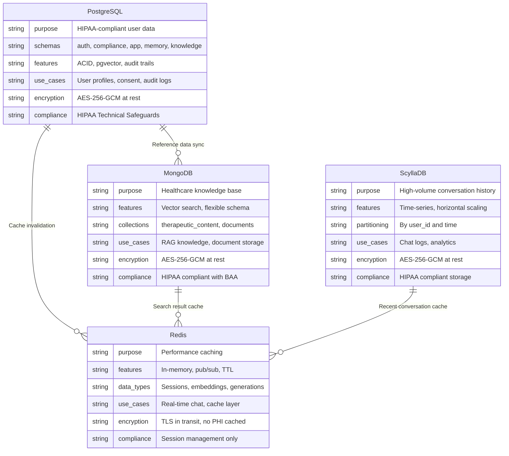

### Data Flow Architecture

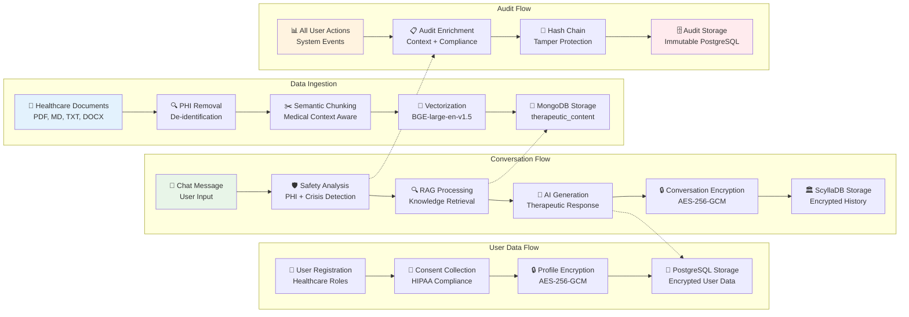

## Security Architecture

### Zero-Trust Network Model

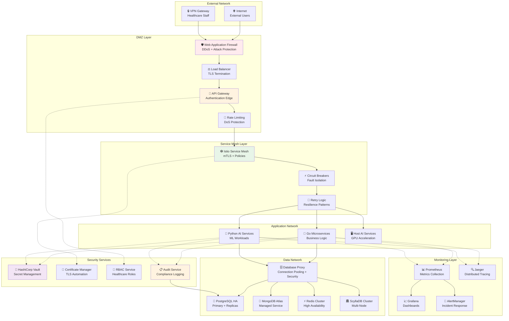

### Authentication and Authorization Flow

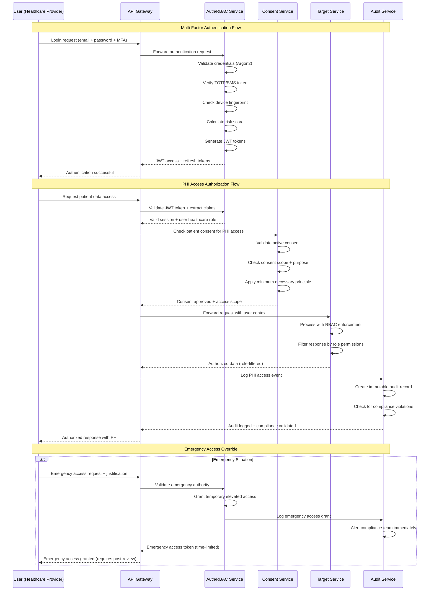

## AI/ML Pipeline

### Complete RAG Pipeline Architecture

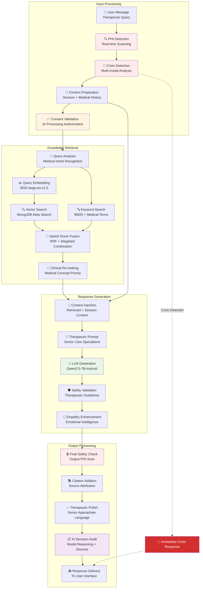

### AI Model Architecture

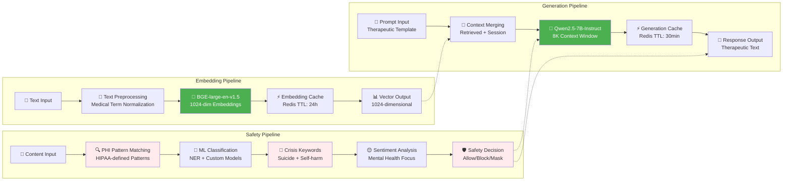

## Crisis Intervention Flow

### Emergency Response System

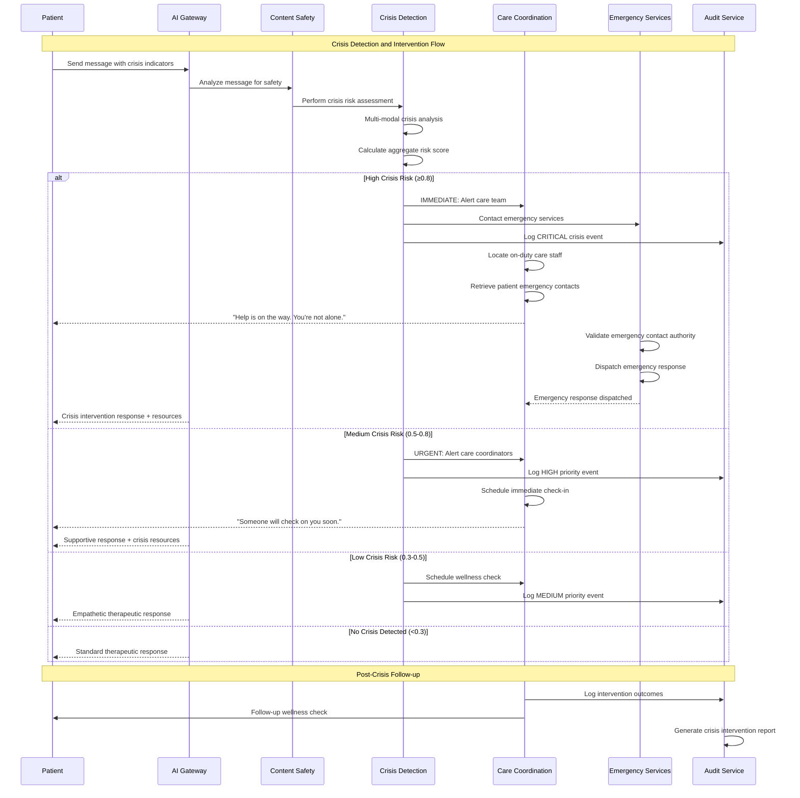

### Crisis Escalation Matrix

```mermaid
flowchart TD
    subgraph "Crisis Assessment"
        MESSAGE[💬 User Message]
        ANALYSIS[🔍 Multi-Modal Analysis<br/>Keywords + Sentiment + ML]
        RISK_SCORE[📊 Risk Score<br/>0.0 - 1.0 Scale]
    end
    
    subgraph "Risk Level 0.9-1.0: IMMINENT DANGER"
        IMMEDIATE[🚨 IMMEDIATE RESPONSE]
        EMERGENCY_911[📞 Emergency Services (911)]
        CARE_ALERT[🏥 Care Team STAT Alert]
        FAMILY_NOTIFY[👨‍👩‍👧‍👦 Emergency Contact Notification]
        CONTINUOUS_MONITOR[👁️ Continuous Monitoring]
    end
    
    subgraph "Risk Level 0.7-0.9: HIGH RISK"
        URGENT[⚠️ URGENT RESPONSE]
        CRISIS_TEAM[🏥 Facility Crisis Team]
        CLINICAL_ASSESS[👩‍⚕️ Clinical Assessment<br/>Within 1 Hour]
        SAFETY_PLAN[📋 Safety Planning]
        FREQUENT_CHECK[📅 Frequent Check-ins]
    end
    
    subgraph "Risk Level 0.5-0.7: MODERATE RISK"
        ELEVATED[📈 ELEVATED CONCERN]
        CARE_COORD[👩‍⚕️ Care Coordinator Alert]
        NEXT_DAY[📅 Next Day Check-in]
        SUPPORT_RESOURCES[📚 Mental Health Resources]
        DOCUMENT_CONCERN[📝 Document in Care Plan]
    end
    
    subgraph "Risk Level 0.3-0.5: LOW RISK"
        SUPPORTIVE[💝 SUPPORTIVE RESPONSE]
        WELLNESS_CHECK[📅 Routine Wellness Check]
        PEER_SUPPORT[👥 Peer Support Groups]
        ACTIVITY_SUGGEST[🎨 Activity Suggestions]
        GENTLE_MONITOR[👁️ Gentle Monitoring]
    end
    
    subgraph "Risk Level 0.0-0.3: MINIMAL RISK"
        STANDARD[💬 STANDARD RESPONSE]
        THERAPEUTIC[🤖 Therapeutic Conversation]
        ROUTINE_CARE[📅 Routine Care Planning]
        WELLNESS_PROMOTE[🌱 Wellness Promotion]
    end
    
    MESSAGE --> ANALYSIS --> RISK_SCORE
    
    RISK_SCORE -->|0.9-1.0| IMMEDIATE
    RISK_SCORE -->|0.7-0.9| URGENT
    RISK_SCORE -->|0.5-0.7| ELEVATED
    RISK_SCORE -->|0.3-0.5| SUPPORTIVE
    RISK_SCORE -->|0.0-0.3| STANDARD
    
    IMMEDIATE --> EMERGENCY_911
    IMMEDIATE --> CARE_ALERT
    IMMEDIATE --> FAMILY_NOTIFY
    IMMEDIATE --> CONTINUOUS_MONITOR
    
    URGENT --> CRISIS_TEAM
    URGENT --> CLINICAL_ASSESS
    URGENT --> SAFETY_PLAN
    URGENT --> FREQUENT_CHECK
    
    ELEVATED --> CARE_COORD
    ELEVATED --> NEXT_DAY
    ELEVATED --> SUPPORT_RESOURCES
    ELEVATED --> DOCUMENT_CONCERN
    
    SUPPORTIVE --> WELLNESS_CHECK
    SUPPORTIVE --> PEER_SUPPORT
    SUPPORTIVE --> ACTIVITY_SUGGEST
    SUPPORTIVE --> GENTLE_MONITOR
    
    STANDARD --> THERAPEUTIC
    STANDARD --> ROUTINE_CARE
    STANDARD --> WELLNESS_PROMOTE
    
    style IMMEDIATE fill:#d32f2f,color:#fff
    style URGENT fill:#ff5722,color:#fff
    style ELEVATED fill:#ff9800,color:#fff
    style SUPPORTIVE fill:#4caf50,color:#fff
    style STANDARD fill:#2196f3,color:#fff
```

## Deployment Architecture

### Local Development Environment

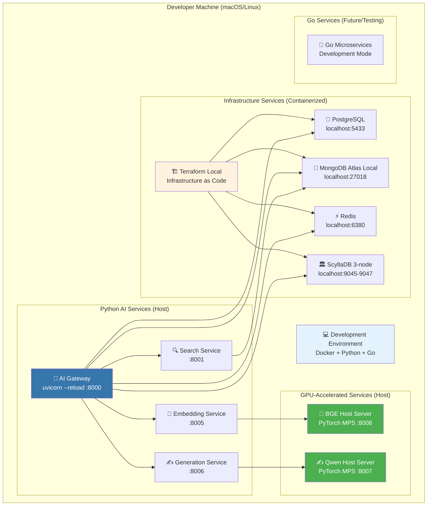

### Production Kubernetes Architecture

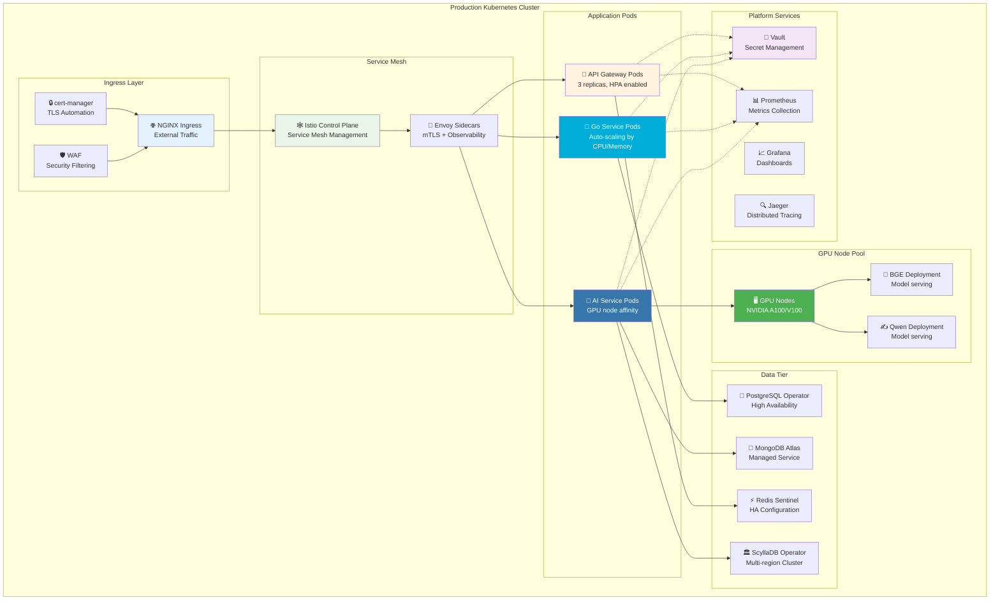

## Monitoring and Observability

### Observability Stack Architecture

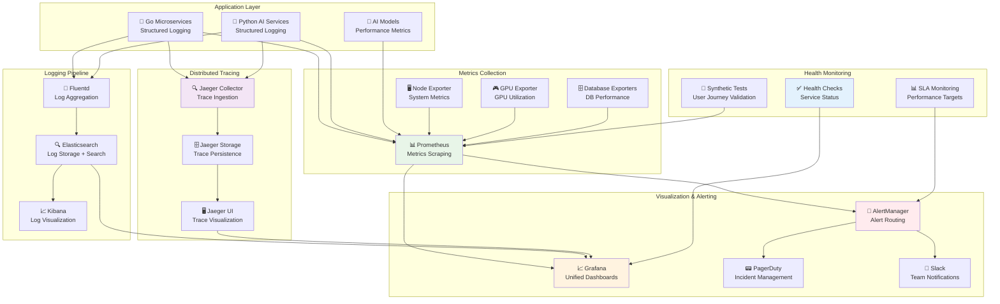

### Real-Time Dashboards

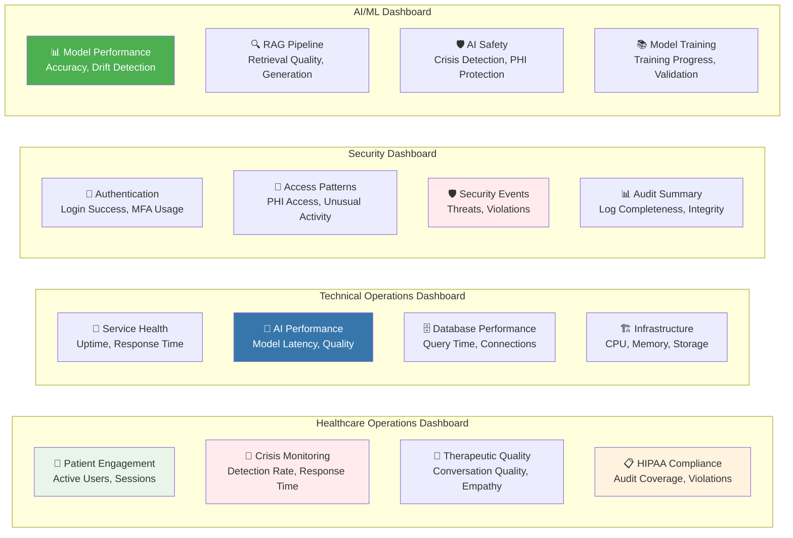

---

**Diagram Library Version**: 2.0  
**Mermaid Version**: 10.6+  
**Last Visual Review**: 2025-09-01  
**Maintained By**: Platform Architecture Team + Technical Documentation Team