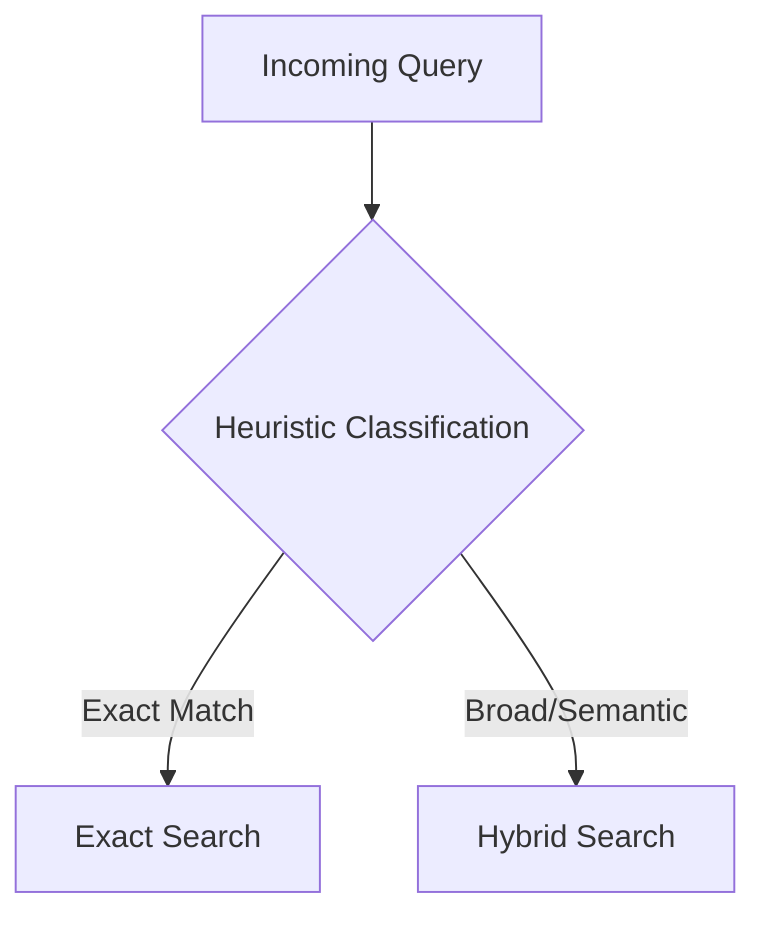
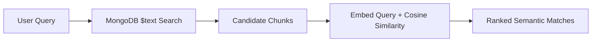
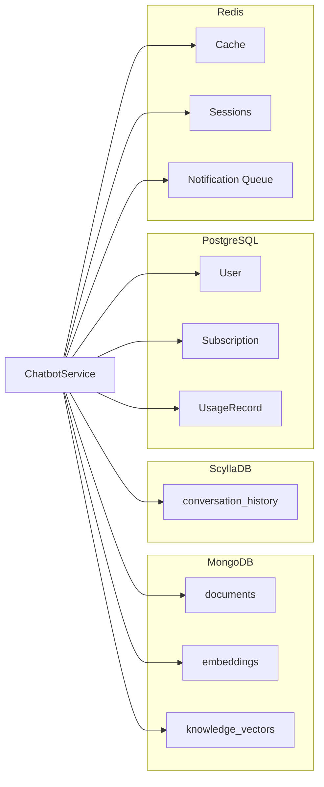
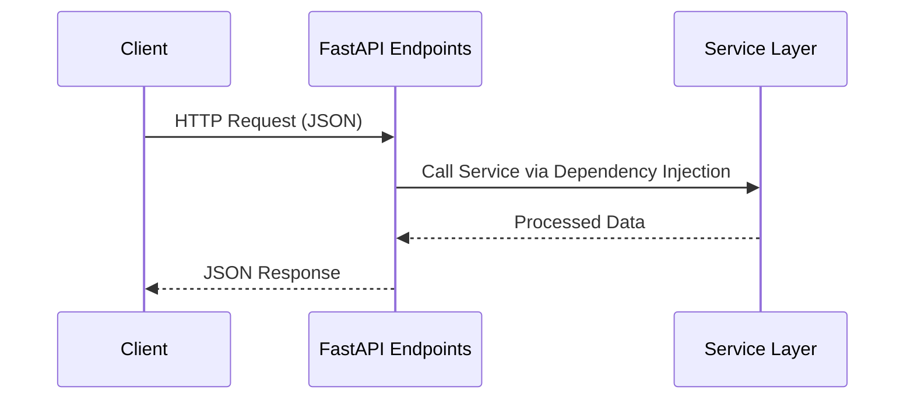

------

~~~markdown
# MultiDB Chatbot System Documentation

This document explains the architecture and implementation of the MultiDB Chatbot System, organized into **Service**, **Database**, and **API** layers, with visual flows and architecture diagrams.

---

## 1. Service Layer

The Service Layer implements the **core business logic** using a modular, service-oriented architecture.  
Key components:  
- **ChatbotService** – Orchestrates the RAG pipeline.  
- **KnowledgeService** – Performs retrieval and ranking from multiple data sources.

### Service Layer Architecture

```mermaid
flowchart LR
    A[User Query] --> B[Chatbot Service]
    B -->|Delegates Retrieval| C[Knowledge Service]
    C -->|Find Relevant Info| B
    B -->|Generate Final Response| D[User Output]
~~~

------

### 1.1 `chatbot_service.py`

#### Class: `ChatbotService`

**Purpose:**
 Acts as the main orchestrator for handling user interactions, managing the **Retrieval-Augmented Generation (RAG)** pipeline.

**RAG Pipeline Flow**

```mermaid
sequenceDiagram
    participant User
    participant Chatbot as ChatbotService
    participant Knowledge as KnowledgeService
    participant LLM as LLM API (Placeholder)

    User->>Chatbot: Send Message
    Chatbot->>Knowledge: search_router(query)
    Knowledge-->>Chatbot: Search Results
    Chatbot->>Chatbot: _build_context_from_snippets()
    Chatbot->>Chatbot: _compose_prompt()
    Chatbot->>LLM: _llm_generate(prompt)
    LLM-->>Chatbot: Generated Answer
    Chatbot-->>User: Final Response
```

**Key Methods:**

- `answer_user_message(...)` – Executes the RAG pipeline.
- `_build_context_from_snippets(...)` – Sorts and curates snippets.
- `_llm_generate(...)` – Sends prompt to LLM (placeholder in current version).

------

### 1.2 `knowledge_service.py`

#### Class: `KnowledgeService`

**Purpose:**
 Specialized "research assistant" for searching multiple data sources.

**Query Routing Logic**



**Hybrid Search Process**



------

## 2. Database Layer

The system uses **polyglot persistence**, leveraging four databases for different roles.

**Polyglot Architecture**



------

### 2.1 MongoDB

- **Role:** Flexible storage for RAG pipeline.
- **Collections:**
  - `documents` – Metadata.
  - `embeddings` – Text chunks & vectors.
  - `knowledge_vectors` – Mirrored FAQs.
- **Feature:** `$text` indexes for fast hybrid search.

### 2.2 ScyllaDB

- **Role:** High-throughput storage for conversation history.
- **Schema:**
  - Partition Key: `session_id`
  - Clustering Key: `timestamp`
- **Usage:** Efficient chronological sorting per session.

### 2.3 PostgreSQL

- **Role:** Source of truth for structured business data.
- **Tables:** `User`, `Subscription`, `UsageRecord`, `AuditLog`.
- **Feature:** SQLAlchemy ORM with relationships for data integrity.

### 2.4 Redis

- **Role:** High-speed in-memory cache and session store.
- **Patterns:**
  - Caching with TTL.
  - Session management.
  - FIFO queues for background notifications.

------

## 3. API Layer

The API layer exposes system functionality using **FastAPI**.

**API Flow**



**Features:**

- **Dependency Injection:** Uses `Depends()` for singleton service instances.
- **Pydantic Models:** Request validation & response serialization.
- **Routers:** Logical grouping (`auth.py`, `chat.py`, `search.py`).

------

## Summary

This system integrates:

- **Service Layer:** Orchestrates RAG pipeline & search.
- **Database Layer:** Multi-database design optimized for different data needs.
- **API Layer:** Clean, testable endpoints with validation & DI.

The architecture is modular, testable, and ready for production scaling with ANN vector search, real LLM integration, and improved search heuristics.

```
---

AJ, this `.md` file would render **interactive diagrams** if your markdown viewer supports **Mermaid** (e.g., GitHub, Obsidian, MkDocs).  

Do you want me to **also produce a PDF version** with these diagrams rendered so it’s presentation-ready? That would make it more visual for non-technical stakeholders.
```