# MultiDB Chatbot — Internal Product Roadmap

> **Document Type:** Strategic Product Planning (Confidential)  
> **Audience:** Product Team, Engineering Leadership, Executive Team  
> **Product:** Healthcare AI Companion Platform  
> **Planning Horizon:** 18 Months (Phase 1.1 → Phase 3.0)  
> **Date:** August 2025  
> **Classification:** Internal Use Only

---

## Executive Summary

This document outlines the **strategic product evolution** of the MultiDB Chatbot platform from the current **Phase 1 microservices foundation** to a comprehensive **emotional AI healthcare ecosystem**. The roadmap balances **immediate market opportunities** with **long-term vision** for transforming senior healthcare through AI-powered emotional intelligence.

**Strategic Objectives:**
- **Market Leadership**: Establish dominant position in healthcare AI companionship
- **Technology Advantage**: Build defensible emotional AI and safety technology
- **Customer Success**: Deliver measurable wellness outcomes at enterprise scale
- **Platform Evolution**: Create extensible architecture for future healthcare AI applications

---

## Table of Contents

1. [Current State Assessment](#1-current-state-assessment)
2. [Market Analysis & Opportunity](#2-market-analysis--opportunity)
3. [Technology Roadmap](#3-technology-roadmap)
4. [Product Feature Evolution](#4-product-feature-evolution)
5. [Architecture Evolution](#5-architecture-evolution)
6. [Go-to-Market Evolution](#6-go-to-market-evolution)
7. [Business Model Evolution](#7-business-model-evolution)
8. [Risk Assessment & Mitigation](#8-risk-assessment--mitigation)
9. [Resource Requirements](#9-resource-requirements)
10. [Success Metrics & KPIs](#10-success-metrics--kpis)

---

## 1. Current State Assessment

### 1.1 Phase 1 Achievements (Complete)

**Technical Foundation:**
- ✅ **Microservices Architecture**: 4 decoupled services with HTTP communication
- ✅ **Multi-Database Design**: PostgreSQL (primary), MongoDB (documents), ScyllaDB (time-series), Redis (cache)
- ✅ **Healthcare Compliance**: HIPAA-ready with audit trails, consent management, right-to-erasure
- ✅ **Integration Testing**: 25 test scenarios with 100% pass rate
- ✅ **Development Workflow**: Auto-reload development environment with comprehensive documentation

**Product Capabilities:**
- ✅ **Basic Conversational AI**: Healthcare-appropriate responses with safety boundaries
- ✅ **Document Processing**: Ingestion pipeline for healthcare documents with chunking
- ✅ **Vector Search**: Semantic search through medical knowledge base
- ✅ **Health Monitoring**: Comprehensive service health checks and monitoring
- ✅ **Demo System**: Professional demonstration capabilities with multiple scenarios

**Market Validation:**
- ✅ **Target Market Identified**: Senior living operators + Medicare Advantage plans
- ✅ **Business Value Quantified**: ROI models developed for both customer segments
- ✅ **Competitive Analysis**: Clear differentiation vs. existing solutions
- ✅ **Pilot Framework**: 90-day proof of value methodology established

### 1.2 Current Limitations & Gaps

**Technology Gaps:**
- ❌ **No Emotion Detection**: Missing real-time emotional state analysis
- ❌ **No Crisis Detection**: Lacking safety monitoring and escalation systems
- ❌ **No Voice Interface**: Text-only interaction limits senior accessibility
- ❌ **No Personalization**: Generic responses without user context or memory
- ❌ **Limited Interventions**: No guided breathing, journaling, or wellness activities

**Product Gaps:**
- ❌ **No Care Team Integration**: Missing healthcare provider dashboards and workflows
- ❌ **No Family Portal**: No family communication and transparency features
- ❌ **No Analytics**: Limited insights and outcome measurement capabilities
- ❌ **No Mobile Apps**: Web-only interface limits accessibility and convenience

**Market Readiness Gaps:**
- ❌ **No Pilot Customers**: No active customer deployments or validation
- ❌ **No Clinical Evidence**: Missing outcomes data and effectiveness studies
- ❌ **No Regulatory Clearance**: No FDA guidance or clinical advisory board
- ❌ **No Sales Infrastructure**: Missing sales team, pricing, and go-to-market execution

---

## 2. Market Analysis & Opportunity

### 2.1 Total Addressable Market (TAM)

**Senior Living Market:**
- **1.9M senior living units** across IL/AL/MC in the US
- **Average resident fee**: $4,500/month with 5% annual growth
- **Software budget allocation**: 2-3% of revenue ($90-135/resident/month)
- **Target software price**: $18-28/resident/month (20-31% of software budget)
- **TAM**: $410M - $640M annual opportunity

**Medicare Advantage Market:**
- **34M MA beneficiaries** in 2025, growing to 45M+ by 2030
- **High-loneliness cohort**: 8-12% of MA population (2.7M - 4.1M members)
- **PMPM software budget**: $15-25 for supplemental benefits
- **Target software price**: $6-10/member/month (24-67% of supplemental budget)
- **TAM**: $195M - $490M annual opportunity

**Combined Healthcare AI Companion TAM: $605M - $1.13B**

### 2.2 Market Timing & Competitive Landscape

**Market Tailwinds:**
- **Demographic Inevitability**: Baby Boomers entering senior care (10,000/day through 2030)
- **Technology Adoption**: 73% of seniors now use digital health tools
- **Regulatory Support**: CMS Star Ratings incentivize member experience and social determinants
- **Labor Crisis**: 1.2M unfilled healthcare positions driving automation adoption

**Competitive Positioning:**

```mermaid
graph TB
    subgraph "High Healthcare Integration + High AI Sophistication"
        A[Lilo<br/>🎯 Target Position]
    end
    
    subgraph "Medium Healthcare Integration"
        B[CareCoach<br/>Avatar + Human]
        C[ElliQ Robot<br/>Proactive Engagement]
    end
    
    subgraph "Low Healthcare Integration"
        D[Alexa Together<br/>Utility Focus]
        E[Replika<br/>General Chat]
        F[Character.AI<br/>Entertainment]
    end
    
    A --> A1[✓ Emotion Detection<br/>✓ Healthcare Safety<br/>✓ Clinical Integration<br/>✓ Measurable Outcomes]
    B --> B1[✓ High Touch<br/>❌ Not Scalable<br/>❌ High Cost]
    C --> C1[✓ Engagement<br/>❌ Hardware Costs<br/>❌ Limited Integration]
    
    style A fill:#e8f5e8
    style A1 fill:#e8f5e8
```


**Competitive Advantages to Build:**
1. **Emotion-to-Action Engine**: Proprietary emotional intelligence with therapeutic interventions
2. **Healthcare Safety Architecture**: Crisis detection with zero false negatives
3. **Clinical Outcomes Platform**: Measurable wellness improvements with evidence base
4. **Enterprise Integration**: Deep healthcare workflow and EHR connectivity

### 2.3 Market Entry Strategy

**Phase 1.1: Pilot Customer Acquisition (3-6 months)**
- Target: 3-5 senior living pilot sites (500-1,500 total residents)
- Target: 2-3 Medicare Advantage pilot programs (2,000-5,000 members)
- Objective: Prove core value proposition with measurable outcomes
- Success Criteria: >90% user adoption, >20% wellness improvement, >4.0/5.0 satisfaction

**Phase 2.0: Market Validation (6-12 months)**
- Target: 20-30 customer deployments (15,000-25,000 total users)
- Geographic: 3-5 US regions with different demographics
- Objective: Establish product-market fit and referenceable customer base
- Success Criteria: >$2M ARR, >110% net retention, 3+ case studies

**Phase 3.0: Scale & Expansion (12-18 months)**
- Target: 100+ customer deployments (75,000+ total users)
- Market: Multi-state coverage with enterprise customers
- Objective: Market leadership position with category definition
- Success Criteria: >$15M ARR, >120% net retention, market category leadership

---

## 3. Technology Roadmap

### 3.1 Core AI Technology Evolution

#### Phase 1.1: Emotion Detection & Safety (Months 1-3)

**Emotion Engine Development:**


**Technical Implementation:**
- **Base Model**: Fine-tuned BERT for healthcare sentiment analysis
- **Training Data**: Senior-specific conversation datasets with emotion labels
- **Real-time Processing**: <200ms latency for emotion analysis
- **Accuracy Target**: 85%+ accuracy on valence detection, 80%+ on arousal

**Crisis Detection System:**
- **Multi-Layer Detection**: Keywords + patterns + emotional state analysis
- **Healthcare-Specific Training**: Suicidal ideation, medical emergencies, medication issues
- **False Negative Tolerance**: Zero missed crises (high false positive tolerance acceptable)
- **Escalation SLA**: <5 minutes from detection to human notification

#### Phase 1.2: Voice Interface & Accessibility (Months 2-4)

**Voice Technology Stack:**
- **Speech-to-Text**: Azure Cognitive Services (HIPAA-compliant)
- **Text-to-Speech**: Custom voice models optimized for senior hearing
- **Noise Reduction**: Background noise filtering for senior living environments
- **Latency Target**: <500ms end-to-end voice processing

**Accessibility Features:**
- **Hearing Impairment**: Visual indicators, high-contrast mode
- **Motor Limitations**: Large touch targets, voice-only navigation
- **Cognitive Support**: Simple language, clear instructions, memory aids
- **Vision Support**: Screen reader compatibility, zoom features

#### Phase 2.0: Advanced Personalization (Months 4-8)

**Personal Memory System:**


**Technical Components:**
- **Memory Extraction**: NER + relationship extraction from conversations
- **Pattern Recognition**: Time-series analysis of emotional states
- **Intervention Optimization**: A/B testing framework for personalization
- **Privacy Controls**: User-controlled TTL, granular consent management

**Advanced AI Capabilities:**
- **Context Awareness**: Multi-turn conversation understanding
- **Proactive Outreach**: Intelligent timing for check-ins based on patterns
- **Intervention Sequencing**: Chained micro-interventions for complex emotional states
- **Outcome Prediction**: ML models predicting intervention success likelihood

### 3.2 Integration Technology Evolution

#### Phase 1.1: Healthcare System Integration (Months 1-4)

**EHR Integration Architecture:**


**Integration Capabilities:**
- **Read Access**: Medications, appointments, care plans, basic clinical data
- **Write Access**: Wellness assessments, intervention outcomes, safety events
- **Real-time Sync**: Bi-directional updates for critical clinical information
- **Privacy Protection**: Minimum necessary data access with audit trails

**Care Management Platform Integration:**
- **Popular Platforms**: Salesforce Health Cloud, Epic Care Everywhere, Cerner HealtheLife
- **Workflow Integration**: Care manager dashboards, member risk alerts, intervention tracking
- **Outcome Reporting**: Automated outcomes reporting with clinical context

#### Phase 2.0: Advanced Analytics & Population Health (Months 6-12)

**Population Health Analytics Platform:**
- **Individual Tracking**: Longitudinal wellness trajectories with intervention correlation
- **Cohort Analysis**: Population-level insights for care management and quality improvement
- **Predictive Analytics**: Risk stratification and early intervention recommendations
- **Outcome Measurement**: Clinical outcomes integration with healthcare utilization data

**Research & Evidence Generation:**
- **Clinical Study Platform**: Built-in randomized controlled trial infrastructure
- **Outcomes Research**: Academic partnerships for peer-reviewed publications
- **Real-World Evidence**: Large-scale observational studies with health plan partners
- **Regulatory Submission**: FDA Digital Health pathway preparation

---

## 4. Product Feature Evolution

### 4.1 User Experience Evolution

#### Phase 1.1: Core Companion Features (Months 1-3)

**Emotional Support Conversations:**
- **Empathetic Responses**: Context-aware emotional validation and support
- **Active Listening**: Reflective listening patterns with appropriate follow-up questions
- **Mood Tracking**: Daily emotional check-ins with trend analysis
- **Crisis Support**: Immediate emotional stabilization with human escalation

**Micro-Intervention Library:**


**Intervention Categories:**
1. **Breathing & Mindfulness**: Progressive relaxation, box breathing, body scans
2. **Physical Wellness**: Chair exercises, walking encouragement, posture reminders
3. **Social Connection**: Family call prompts, friend outreach, group activity suggestions
4. **Cognitive Support**: Memory games, orientation assistance, medication reminders
5. **Creative Expression**: Music recommendations, art activities, storytelling prompts

#### Phase 1.2: Healthcare Integration (Months 2-4)

**Care Team Dashboard:**
```
Senior Living Staff Dashboard:
├── Real-time Resident Emotional Status
├── Crisis Alerts & Response Times
├── Daily Intervention Summary
├── Family Communication Log
├── Medication Adherence Tracking
└── Wellness Trend Analysis

Key Widgets:
- Residents Needing Attention (risk scores)
- Successful Interventions Today
- Family Engagement Summary  
- Staff Action Items
- Emergency Protocol Status
```

**Family Portal Features:**
- **Weekly Wellness Summaries**: Privacy-protected highlights with emotional trends
- **Milestone Celebrations**: Positive achievement sharing (first successful breathing exercise, social call, etc.)
- **Care Plan Visibility**: Transparent view of wellness goals and progress
- **Emergency Notifications**: Real-time alerts for safety escalations
- **Communication Tools**: Secure messaging with care team and resident

#### Phase 2.0: Advanced Personalization (Months 6-12)

**Adaptive Personality System:**
- **Communication Style**: Adapts formality, humor, directness based on user preferences
- **Cultural Sensitivity**: Incorporates cultural background and family traditions
- **Interest Integration**: Weaves personal interests into conversations and activities
- **Relationship Awareness**: Understands family dynamics and social connections

**Proactive Wellness Management:**
- **Pattern Recognition**: Identifies optimal intervention timing based on personal patterns
- **Seasonal Adjustments**: Adapts to seasonal depression, holiday stress, weather impacts
- **Health Event Response**: Adjusts support during illness, procedure recovery, grief
- **Routine Optimization**: Suggests daily routine improvements based on wellness outcomes

### 4.2 Clinical Feature Evolution

#### Phase 1.1: Safety & Compliance (Months 1-3)

**Crisis Detection & Management:**
- **Multi-Modal Detection**: Text analysis + voice tone analysis + behavioral patterns
- **Risk Stratification**: Low/Medium/High risk classification with appropriate responses
- **Escalation Protocols**: Customizable workflows for different types of crises
- **Documentation**: Complete clinical documentation for care team review

**Clinical Safety Features:**
- **Medical Disclaimer Management**: Clear boundaries around medical advice
- **Medication Safety**: Drug interaction awareness, side effect monitoring
- **Fall Prevention**: Environmental safety reminders, balance assessments
- **Cognitive Assessment**: Gentle screening for cognitive changes

#### Phase 2.0: Clinical Outcomes (Months 6-12)

**Evidence-Based Interventions:**
- **Clinical Protocol Integration**: Follows established clinical guidelines for depression, anxiety, loneliness
- **Outcome Measurement**: Validated assessment tools (UCLA-3, PHQ-2, GAD-2)
- **Intervention Effectiveness**: Tracks which interventions work for which users
- **Clinical Documentation**: Generates clinical notes for provider review

**Population Health Features:**
- **Cohort Management**: Risk stratification and intervention targeting for populations
- **Quality Metrics**: HEDIS, Star Ratings, and clinical quality measure support
- **Research Platform**: Built-in clinical research capabilities with IRB support
- **Registry Participation**: Automatic enrollment in relevant clinical registries

---

## 5. Architecture Evolution

### 5.1 Current Architecture Assessment

**Strengths:**
- ✅ Microservices foundation provides flexibility and scalability
- ✅ Multi-database design optimized for different data patterns
- ✅ HIPAA-compliant security architecture
- ✅ Infrastructure as Code enables consistent deployments

**Scalability Limitations:**
- ❌ Current architecture not optimized for real-time AI workloads
- ❌ No dedicated ML model serving infrastructure
- ❌ Limited streaming data processing for real-time interventions
- ❌ No built-in A/B testing or experimentation framework

### 5.2 Phase 1.1: Real-Time AI Architecture (Months 1-4)

**ML Model Serving Layer:**


**Technical Components:**
- **Model Serving**: TensorFlow Serving or MLflow for model deployment
- **Real-time Processing**: Apache Kafka for streaming emotion analysis
- **Feature Store**: Feast for consistent feature engineering across models
- **Model Monitoring**: Evidently AI for model drift and performance tracking

### 5.3 Phase 2.0: Scalable Cloud Architecture (Months 6-12)

**Cloud-Native Architecture:**


**Cloud Migration Benefits:**
- **Auto-scaling**: Automatic horizontal scaling based on demand
- **Global Distribution**: Multi-region deployment for performance and reliability
- **Managed Services**: Reduced operational overhead with cloud-managed databases
- **Cost Optimization**: Pay-per-use pricing with reserved instance optimization

### 5.4 Phase 3.0: Multi-Tenant SaaS Platform (Months 12-18)

**Enterprise SaaS Architecture:**
- **Multi-Tenancy**: Secure data isolation with shared infrastructure
- **White-Label Support**: Customer-branded deployments with custom domains
- **Enterprise SSO**: SAML, OAuth, Active Directory integration
- **Compliance Controls**: Organization-level compliance settings and audit controls

**Advanced Analytics Platform:**
- **Real-Time Dashboards**: Live operational dashboards for care teams
- **Predictive Analytics**: ML-powered predictions for intervention optimization
- **Custom Reporting**: Self-service analytics with healthcare-specific metrics
- **Data Export**: API and bulk export capabilities for customer analytics

---

## 6. Go-to-Market Evolution

### 6.1 Phase 1.1: Pilot Customer Success (Months 1-6)

**Customer Development Strategy:**
- **Design Partner Program**: 3-5 senior living partners for co-development
- **Medicare Advantage Pilots**: 2-3 health plan innovation partnerships
- **Clinical Advisory Board**: 5-7 geriatricians, psychologists, and care specialists
- **Academic Partnerships**: 2-3 universities for clinical research collaboration

**Sales Infrastructure Development:**
- **Sales Team**: Hire VP of Sales + 2 enterprise AEs
- **Sales Process**: Develop pilot-to-expansion sales methodology
- **Pricing Strategy**: Finalize pilot pricing with expansion path
- **Customer Success**: Hire Customer Success Manager for pilot support

**Marketing Foundation:**
- **Thought Leadership**: CEO speaking at 6+ healthcare conferences
- **Content Marketing**: 24 pieces of educational content (blog, whitepapers, case studies)
- **Industry Recognition**: Apply for healthcare innovation awards
- **PR Strategy**: Launch PR campaign around clinical outcomes

### 6.2 Phase 2.0: Market Category Creation (Months 6-12)

**Category Definition Strategy:**
- **Market Education**: Define "Healthcare AI Companion" category
- **Competitive Positioning**: Establish clear differentiation vs. generic chatbots
- **Industry Analyst Relations**: Engage Gartner, Forrester for market recognition
- **Clinical Evidence**: Publish 2-3 peer-reviewed studies on outcomes

**Scaled Sales Operations:**
- **Sales Team Expansion**: 8-10 enterprise AEs covering major US regions
- **Channel Partners**: Develop partnerships with healthcare consultants and integrators
- **Inside Sales**: Build SDR team for lead qualification and pipeline generation
- **Customer Success**: Scale to 3-4 CSMs with healthcare backgrounds

**Marketing Scale-Up:**
- **Digital Marketing**: SEM, social media, and content marketing automation
- **Event Marketing**: Own booth at 12+ major healthcare conferences
- **Webinar Series**: Monthly educational webinars for prospects
- **Customer Marketing**: Case study program with video testimonials

### 6.3 Phase 3.0: Market Leadership (Months 12-18)

**Market Dominance Strategy:**
- **Geographic Expansion**: Enter Canadian and European markets
- **Vertical Expansion**: Expand into home health, PACE programs, and assisted living
- **Platform Partnerships**: Integrate with major EHR vendors (Epic, Cerner, Allscripts)
- **Acquisition Strategy**: Acquire complementary technologies (voice AI, analytics)

**Enterprise Sales Excellence:**
- **Enterprise Sales Team**: 15+ AEs with major account specialization
- **Customer Success Organization**: 8+ CSMs with outcome optimization focus
- **Sales Engineering**: Technical sales support for complex integrations
- **Professional Services**: Implementation and integration services team

---

## 7. Business Model Evolution

### 7.1 Current Business Model Framework

**Revenue Streams:**
1. **Software Subscriptions**: Per-resident/member recurring revenue
2. **Professional Services**: Implementation, training, and custom development
3. **Data & Analytics**: Advanced analytics and benchmarking services
4. **Integration Services**: EHR and platform integration fees

**Pricing Strategy Evolution:**

| Phase | Customer Segment | Core Pricing | Advanced Features | Enterprise Add-ons |
|-------|------------------|--------------|-------------------|-------------------|
| **1.1** | Pilot Customers | $12/month | $18/month | Custom |
| **2.0** | Market Entry | $18/month | $28/month | $5-15K setup |
| **3.0** | Market Leadership | $22/month | $35/month | $15-50K setup |

### 7.2 Unit Economics Model

**Senior Living Unit Economics (300-bed facility):**

| Metric | Phase 1.1 | Phase 2.0 | Phase 3.0 |
|--------|-----------|-----------|-----------|
| **Monthly Subscription** | $3,600 | $5,400 | $6,600 |
| **Annual Contract Value** | $43,200 | $64,800 | $79,200 |
| **Customer Acquisition Cost** | $8,640 (20%) | $12,960 (20%) | $15,840 (20%) |
| **Gross Margin** | 75% | 80% | 82% |
| **Payback Period** | 10.7 months | 10.0 months | 9.7 months |
| **LTV:CAC Ratio** | 4.2:1 | 5.0:1 | 5.5:1 |

**Health Plan Unit Economics (5,000 high-risk members):**

| Metric | Phase 1.1 | Phase 2.0 | Phase 3.0 |
|--------|-----------|-----------|-----------|
| **Monthly Subscription** | $25,000 | $40,000 | $50,000 |
| **Annual Contract Value** | $300,000 | $480,000 | $600,000 |
| **Customer Acquisition Cost** | $60,000 (20%) | $96,000 (20%) | $120,000 (20%) |
| **Gross Margin** | 70% | 75% | 78% |
| **Payback Period** | 11.4 months | 10.7 months | 10.3 months |
| **LTV:CAC Ratio** | 3.5:1 | 4.2:1 | 4.8:1 |

### 7.3 Revenue Projections

**3-Year Revenue Projection:**

| Year | Customer Count | Average ACV | Total ARR | Growth Rate |
|------|----------------|-------------|-----------|-------------|
| **Year 1** | 8 customers | $150K | $1.2M | - |
| **Year 2** | 25 customers | $240K | $6.0M | 400% |
| **Year 3** | 65 customers | $350K | $22.8M | 280% |

**Revenue Mix Evolution:**
- **Year 1**: 80% Subscription, 15% Professional Services, 5% Data/Analytics
- **Year 2**: 85% Subscription, 10% Professional Services, 5% Data/Analytics  
- **Year 3**: 87% Subscription, 8% Professional Services, 5% Data/Analytics

---

## 8. Risk Assessment & Mitigation

### 8.1 Technology Risks

**Risk: AI Model Performance Degradation**
- **Probability**: Medium (30-40%)
- **Impact**: High (customer churn, safety incidents)
- **Mitigation**: Comprehensive model monitoring, A/B testing, clinical oversight
- **Contingency**: Model rollback procedures, human-in-loop escalation

**Risk: Scalability Bottlenecks**
- **Probability**: High (60-70% as we scale)
- **Impact**: Medium (customer experience degradation)
- **Mitigation**: Cloud-native architecture, auto-scaling, performance monitoring
- **Contingency**: Manual scaling procedures, customer communication protocols

**Risk: Healthcare Integration Complexity**
- **Probability**: High (70-80%)
- **Impact**: Medium (delayed implementations, customer frustration)
- **Mitigation**: Standard integration patterns, professional services team
- **Contingency**: Manual data exchange procedures, phased integration approach

### 8.2 Market Risks

**Risk: Competitive Response from Big Tech**
- **Probability**: High (80%+ over 18 months)
- **Impact**: High (price compression, customer acquisition challenges)
- **Mitigation**: Strong IP portfolio, clinical differentiation, customer lock-in
- **Contingency**: Acquisition by strategic buyer, partnership strategy

**Risk: Regulatory Changes (FDA, CMS)**
- **Probability**: Medium (40-50%)
- **Impact**: High (product modifications, compliance costs)
- **Mitigation**: Regulatory advisory board, FDA pre-submission process
- **Contingency**: Product pivot to non-regulated features, compliance investment

**Risk: Healthcare Adoption Slower Than Expected**
- **Probability**: Medium (40-50%)
- **Impact**: High (revenue shortfall, runway extension needed)
- **Mitigation**: Pilot-first approach, strong ROI demonstration, clinical evidence
- **Contingency**: Market expansion, adjacent verticals, strategic partnerships

### 8.3 Operational Risks

**Risk: Key Personnel Departure**
- **Probability**: Medium (30-40% for key roles)
- **Impact**: High (product delays, customer impact)
- **Mitigation**: Competitive compensation, equity participation, knowledge documentation
- **Contingency**: Accelerated hiring, consultant engagement, customer communication

**Risk: Clinical Safety Incidents**
- **Probability**: Low (10-15%) but high visibility
- **Impact**: Very High (regulatory scrutiny, customer churn, legal liability)
- **Mitigation**: Conservative safety protocols, clinical oversight, comprehensive testing
- **Contingency**: Incident response plan, legal support, customer communication

---

## 9. Resource Requirements

### 9.1 Team Scaling Plan

**Phase 1.1 Team (3-6 months): 12-15 people**

| Function | Current | Add | Total | Key Roles |
|----------|---------|-----|-------|-----------|
| **Engineering** | 4 | 3 | 7 | ML Engineer, Mobile Developer, DevOps |
| **Product** | 1 | 1 | 2 | Senior Product Manager |
| **Sales/Marketing** | 0 | 3 | 3 | VP Sales, AE, Marketing Manager |
| **Customer Success** | 0 | 1 | 1 | Customer Success Manager |
| **Clinical** | 0 | 1 | 1 | Clinical Affairs Manager |
| **Operations** | 1 | 1 | 2 | VP Operations, Security Specialist |

**Phase 2.0 Team (6-12 months): 25-30 people**

| Function | Phase 1.1 | Add | Total | Key Additions |
|----------|-----------|-----|-------|---------------|
| **Engineering** | 7 | 5 | 12 | Senior ML Engineers, Frontend Team |
| **Product** | 2 | 2 | 4 | Product Marketing Manager, Designer |
| **Sales/Marketing** | 3 | 4 | 7 | 3 AEs, Marketing Specialist |
| **Customer Success** | 1 | 2 | 3 | Senior CSMs |
| **Clinical** | 1 | 2 | 3 | Clinical Research, Safety Specialist |
| **Operations** | 2 | 1 | 3 | Data Analyst |

**Phase 3.0 Team (12-18 months): 45-55 people**

| Function | Phase 2.0 | Add | Total | Key Additions |
|----------|-----------|-----|-------|---------------|
| **Engineering** | 12 | 6 | 18 | Platform Team, Site Reliability |
| **Product** | 4 | 3 | 7 | Senior Product Leaders |
| **Sales/Marketing** | 7 | 8 | 15 | Regional Sales, Marketing Team |
| **Customer Success** | 3 | 4 | 7 | CS Operations, Implementation |
| **Clinical** | 3 | 2 | 5 | Clinical Data, Regulatory Affairs |
| **Operations** | 3 | 3 | 6 | Finance, Legal, People Ops |

### 9.2 Technology Investment Plan

**Phase 1.1 Technology Investments:**
- **ML Infrastructure**: $15K/month (AWS/Azure ML services)
- **Development Tools**: $5K/month (monitoring, testing, CI/CD)
- **Security & Compliance**: $10K/month (security tools, auditing)
- **Integration Platforms**: $8K/month (healthcare API platforms)
- **Total Monthly**: $38K ($456K annually)

**Phase 2.0 Technology Scaling:**
- **Cloud Infrastructure**: $45K/month (scaled compute, storage)
- **ML Model Serving**: $25K/month (dedicated inference infrastructure) 
- **Data Platform**: $15K/month (analytics, data pipelines)
- **Security & Compliance**: $20K/month (enterprise security)
- **Total Monthly**: $105K ($1.26M annually)

### 9.3 Capital Requirements

**Funding Needs by Phase:**

| Phase | Duration | Team Size | Technology | Marketing | Total Need |
|-------|----------|-----------|------------|-----------|------------|
| **1.1** | 6 months | $900K | $275K | $150K | $1.325M |
| **2.0** | 12 months | $2.4M | $1.26M | $500K | $4.16M |
| **3.0** | 18 months | $4.5M | $2.5M | $1.2M | $8.2M |

**Total 18-Month Capital Requirement: $13.7M**

**Funding Strategy:**
- **Seed Round**: $2M (current) - covers Phase 1.1
- **Series A**: $8M (month 4-6) - covers Phase 2.0 + runway
- **Series B**: $15-20M (month 12-15) - covers Phase 3.0 + expansion

---

## 10. Success Metrics & KPIs

### 10.1 Product Development KPIs

**Technical Performance Metrics:**

| Metric | Phase 1.1 Target | Phase 2.0 Target | Phase 3.0 Target |
|--------|------------------|------------------|------------------|
| **Emotion Detection Accuracy** | 85% | 90% | 93% |
| **Crisis Detection Sensitivity** | 100% (no false negatives) | 100% | 100% |
| **Response Latency** | <500ms | <300ms | <200ms |
| **System Uptime** | 99.9% | 99.95% | 99.99% |
| **User Satisfaction** | 4.2/5.0 | 4.4/5.0 | 4.6/5.0 |

**Clinical Outcome Metrics:**

| Metric | Phase 1.1 Target | Phase 2.0 Target | Phase 3.0 Target |
|--------|------------------|------------------|------------------|
| **UCLA-3 Loneliness Improvement** | 1.5 points | 2.0 points | 2.5 points |
| **Anxiety Reduction** | 20% | 30% | 40% |
| **Medication Adherence** | 15% improvement | 25% improvement | 35% improvement |
| **Family Satisfaction** | 4.0/5.0 | 4.3/5.0 | 4.6/5.0 |
| **Care Team Efficiency** | 10% time savings | 20% time savings | 30% time savings |

### 10.2 Business Performance KPIs

**Customer Metrics:**

| Metric | Phase 1.1 Target | Phase 2.0 Target | Phase 3.0 Target |
|--------|------------------|------------------|------------------|
| **Customer Count** | 8 | 25 | 65 |
| **Total Users** | 3,000 | 15,000 | 50,000 |
| **Net Retention Rate** | 90% | 110% | 120% |
| **Customer Satisfaction** | 4.2/5.0 | 4.4/5.0 | 4.6/5.0 |
| **Implementation Success Rate** | 90% | 95% | 98% |

**Financial Metrics:**

| Metric | Phase 1.1 Target | Phase 2.0 Target | Phase 3.0 Target |
|--------|------------------|------------------|------------------|
| **Annual Recurring Revenue** | $1.2M | $6.0M | $22.8M |
| **Average Contract Value** | $150K | $240K | $350K |
| **Gross Margin** | 75% | 80% | 82% |
| **Customer Acquisition Cost** | $15K | $24K | $35K |
| **LTV:CAC Ratio** | 4.0:1 | 4.5:1 | 5.0:1 |

**Market Position Metrics:**

| Metric | Phase 1.1 Target | Phase 2.0 Target | Phase 3.0 Target |
|--------|------------------|------------------|------------------|
| **Market Share** (Senior Living) | 0.1% | 0.5% | 2.0% |
| **Brand Recognition** | 5% | 15% | 35% |
| **Industry Awards** | 1 | 3 | 5 |
| **Published Studies** | 0 | 2 | 5 |
| **Conference Speaking** | 6 | 12 | 20 |

### 10.3 Milestone-Based Success Criteria

**Phase 1.1 Success Criteria (Month 6):**
- ✅ 8+ pilot customers successfully deployed
- ✅ 85%+ emotion detection accuracy achieved
- ✅ Zero missed crisis events in production
- ✅ 90%+ user adoption rate in pilot programs
- ✅ 4.2/5.0+ customer satisfaction score
- ✅ $1.2M+ ARR with clear expansion pipeline

**Phase 2.0 Success Criteria (Month 12):**
- ✅ 25+ customers with $6M+ ARR
- ✅ 110%+ net retention rate demonstrating expansion
- ✅ 2+ peer-reviewed publications on clinical outcomes
- ✅ Market category recognition (Gartner/Forrester mention)
- ✅ Series A fundraising completed ($8M+)
- ✅ Regional market leadership in 3+ US regions

**Phase 3.0 Success Criteria (Month 18):**
- ✅ 65+ customers with $22.8M+ ARR
- ✅ 120%+ net retention with strong expansion revenue
- ✅ Category leadership position established
- ✅ International expansion begun (Canada/Europe)
- ✅ Series B fundraising positioned ($15-20M)
- ✅ Clear path to profitability demonstrated

---

## Conclusion

**The MultiDB Chatbot represents a transformative opportunity** to establish market leadership in the emerging **Healthcare AI Companion** category. Our strategic roadmap balances **immediate customer value** with **long-term platform development**, ensuring sustainable competitive advantages while addressing the urgent needs of an aging population.

**Key Success Factors:**

1. **Customer-Centric Development**: Pilot-first approach ensures product-market fit before scaling
2. **Clinical Rigor**: Healthcare-first design with safety, compliance, and outcomes focus  
3. **Technology Differentiation**: Proprietary emotion-to-action engine with measurable therapeutic impact
4. **Market Timing**: Perfect convergence of demographic need, technology readiness, and regulatory support
5. **Execution Excellence**: Experienced team with healthcare, AI, and enterprise software expertise

**The Next 18 Months Will Define Our Market Position.** Success requires disciplined execution against this roadmap while maintaining flexibility to adapt to market feedback and competitive dynamics.

**Investment in this roadmap positions us to capture significant market share** in a **$605M - $1.13B total addressable market** while creating measurable improvements in the lives of millions of seniors and their families.

---

*For technical implementation details, see [Architecture_Design.md](Architecture_Design.md)*  
*For business value context, see [Business_Value_Proposition.md](Business_Value_Proposition.md)*  
*For operational guidance, see [User_Guide.md](web-ui/User_Guide.md)*

*This document is confidential and proprietary. Distribution limited to authorized personnel only.*