# Therapeutic AI Platform — Consolidated Enterprise Dossier

**Prepared:** September 01, 2025  
**Scope:** Consolidated briefing across Executive Summary, Architecture, Security, and HIPAA Controls.

---

## Table of Contents

- [Executive Summary](#executive-summary)
- [System Overview & Architecture](#system-overview--architecture)
- [Security Architecture](#security-architecture)
- [HIPAA Controls Matrix](#hipaa-controls-matrix)
- [HIPAA Compliance Controls Guide](#hipaa-compliance-controls-guide)
- [Appendix: Full Source Documents](#appendix-full-source-documents)

---


## Executive Summary


### Source: `Therapeutic AI Assistant Enterprise Briefing.md`

### Therapeutic Emotional AI Assistant for Seniors

**Product Vision and Roadmap**  
---

#### 0\) Executive Summary

**Mission:** Reduce loneliness, improve adherence to care plans, and lighten caregiver load by delivering a **therapeutic, HIPAA‑compliant AI companion for seniors** that feels natural, safe, and clinically responsible.

**What it is:** A voice‑first and chat interface that provides **emotional support, routine assistance, cognitive engagement, and safety checks**, backed by explainable Retrieval‑Augmented Generation (RAG), strong privacy controls, and out‑of‑the‑box interoperability with healthcare IT.

**Why now:** Health systems and payers are under pressure to **improve outcomes at lower cost** while staff shortages persist. Seniors want **dignified independence**; caregivers want **reliable, scalable support**. Our assistant is purpose‑built for these needs, with **HIPAA‑by‑design**, **auditable decision trails**, and an **enterprise‑grade architecture** (Go microservices \+ Python RAG) that deploys in the customer’s VPC or private cloud.

**Business value (examples):**

- Reduce unnecessary call center load by **15–30%** via first‑line triage & reminders.  
- Improve **medication adherence** and **care‑plan follow‑through** through personalized nudges.  
- Lower **loneliness and depression scores** via sustained, empathetic engagement.  
- Free up **care team time** with automated journaling, structured notes, and secure hand‑offs.

**What’s unique:** Clinically‑aligned empathy, privacy by design, **explainability with citations**, rigorous **model risk management**, and **interoperability** for easy EHR integration and caregiver workflows.

---

#### 1\) Product Vision

Our north star is a **compassionate, dependable companion** that delivers the right blend of **emotional care** and **practical assistance**, never overstepping clinical boundaries, always **escalating to a human** when it should, and meeting enterprise requirements from day one.

##### 1.1 Jobs‑to‑Be‑Done (JTBD)

1. **Emotional support:** Validate feelings; reduce loneliness and anxiety through active listening and supportive conversation.  
2. **Routine adherence:** Medication, hydration, movement, and appointment reminders tailored to the person’s **care plan**.  
3. **Cognitive stimulation:** Short activities (stories, recollection prompts, brain games) that keep seniors engaged.  
4. **Safety & escalation:** Wellness checks, mood change detection, and **structured escalation** to caregivers/clinicians.  
5. **Care team efficiency:** Structured, **audit‑ready notes**; trend summaries; and explainable interactions that slot into existing workflows.

##### 1.2 Target Customers

- **Provider & payer orgs** supporting seniors (MA plans, ACOs, IDNs, home‑health, SNFs, assisted living).  
- **Health IT platforms** that want a ready‑made, compliant, empathic conversational layer.  
- **Care management vendors** seeking outcomes and operational lift without heavy integration costs.

##### 1.3 Value Proposition (Differentiators)

- **HIPAA‑by‑Design:** End‑to‑end PHI minimization, encryption, access controls, auditability, BAA‑friendly.  
- **Explainable RAG:** All responses can attach **citations**. Transparent **“why this answer”** with safety checks pre/post.  
- **Care‑Plan Graph:** A personalization layer mapping routines, preferences, and risk factors to **targeted nudges**.  
- **Enterprise‑Ready:** Deploy in **your VPC**, private cloud, or on‑prem; SSO/SAML; observability; infra as code.  
- **Model Risk Management:** Guardrails, redaction, fallback behaviors; continuous evaluation and drift monitoring.  
- **Interoperability:** **FHIR/HL7** adapters; low‑friction integrations to care‑team tools and EHR sandboxes.  
- **“Human in the Loop” by default:** Designed to **augment**, not replace, clinicians and caregivers.

---

#### 2\) Current Capabilities 

- **Empathic Conversation:** Chat with persona tuned for seniors (polite, patient, warm tone).  
- **Routine Support:** Smart reminders (meds/appointments/hydration), contextual small talk, “walk‑me‑through” tasks.  
- **Cognitive Engagement:** Recollection prompts, short stories, gratitude and mood journaling.  
- **Wellness Check‑Ins:** Daily mood and symptom check, **structured flags** for caregiver review.  
- **Caregiver/Admin Portal:** Session history with **citations**, structured notes, and export to EHR inbox/sandbox.  
- **Audit & Observability:** Per‑turn **audit events** (who/what/why), logs/metrics/traces; explainability metadata.  
- **Privacy Controls:** PHI minimization, privacy settings, share permissions, **consent tracking**.  
- **Deployment:** Local demo \+ VPC‑ready architecture; IaC templates; feature flags for integrations.

---

#### 3\) In‑Flight & Planned Capabilities (Roadmap)

##### 3.1 Near‑Term 

- **Voice‑first mode** with barge‑in and turn‑taking improvements.  
- **Care‑Plan Graph** v1: personal routines & preferences drive nudges and conversation topics.  
- **Eval Harness v1:** Offline test sets, safety probes, hallucination and empathy rubrics; dashboard.  
- **FHIR R4 Sandbox Adapter:** Patient (PT), CarePlan, Task, Observation, Communication resources.  
- **BAA Template Pack** and **Security Package** for IT review (policies, diagrams, DPIA/DLAs).

##### 3.2 Mid‑Term 

- **Multilingual support** (top 3 languages) for voice and chat.  
- **On‑Prem / Private Cloud** deployment including **customer‑managed keys (CMEK)**.  
- **Agentic Workflows:** Scheduling calls, arranging transport reminders, capturing vitals (where devices are available).  
- **Bias/Drift Monitoring:** Periodic re‑evals, dataset freshness checks, and canary rollouts.  
- **EHR Inbox Integration** (production pilots): secure messaging, encounter notes, attachments.

##### 3.3 Longer‑Term 

- **Outcomes Dashboards:** Adherence, loneliness, PROs (patient‑reported outcomes), and utilization signals.  
- **Content Marketplace:** Curated cognitive activities; cultural packs; seasonal programs.  
- **3rd‑Party Connectors:** Telehealth, caregiver scheduling, transportation, social services.

---

#### 4\) Architecture (High‑Level)

**Stack:** 11+ **Go** microservices for core APIs, auth, and orchestration; **Python** for RAG & ML workflows.  
**Data:** **Postgres \+ pgvector** (canonical store for documents/chunks/embeddings), **Redis** for low‑latency cache, **ScyllaDB** for high‑throughput session/audit events, optional **MongoDB** for raw ingest staging.  
**Observability:** logs/metrics/traces; audit pipeline to **ScyllaDB**; policy/guardrail engine.  
**Interoperability:** **FHIR/HL7** adapters; export‑ready encounter notes; sandbox EHR endpoints.  
**Deployment:** Customer VPC or on‑prem; IaC templates; SSO/SAML; **zero PHI leaves the tenant boundary**.

##### 4.1 Mermaid: System Diagram

graph TB

  subgraph client\["Clients"\]

    voice\["Senior App (Voice/UI)"\]

    portal\["Caregiver/Admin Portal"\]

  end

  subgraph serving\["Serving Plane"\]

    api\["API Gateway"\]

    auth\["AuthN/Z"\]

    orch\["Orchestrator (LangGraph)"\]

    guard\["Guardrails / Policy Engine"\]

    llm\["LLM Provider (via API)"\]

    rr\["Reranker"\]

  end

  subgraph data\["Data Plane"\]

    pg\["Postgres \+ pgvector (docs/chunks/embeddings)"\]

    scylla\["ScyllaDB (session & audit events)"\]

    redis\["Redis (cache)"\]

    obj\["Object Store (S3-compatible)"\]

  end

  subgraph ingest\["Ingestion"\]

    etl\["Document ETL"\]

    embed\["Chunker \+ Embedder"\]

  end

  ehr\["EHR (FHIR/HL7)"\]

  obs\["Observability (logs/metrics/traces)"\]

  voice \--\> api

  portal \--\> api

  api \--\> auth \--\> orch

  orch \--\> guard \--\> llm

  orch \--\> rr

  orch \--\> redis

  orch \--\> pg

  etl \--\> embed \--\> pg

  orch \--\> scylla

  embed \--\> obj

  api \--\> scylla

  orch \--\> ehr

  orch \--\> obs

##### 4.2 Mermaid: RAG Interaction Flow

sequenceDiagram

  participant U as Senior User

  participant GW as API Gateway

  participant OR as Orchestrator

  participant VS as Vector Store (pgvector)

  participant RE as Reranker

  participant L as LLM

  participant G as Guardrails

  participant AU as Audit Log

  U-\>\>GW: utterance

  GW-\>\>OR: request \+ session ctx

  OR-\>\>VS: top‑k similarity search

  VS--\>\>OR: candidate chunks

  OR-\>\>RE: rerank(k)

  RE--\>\>OR: ordered context

  OR-\>\>G: safety checks (pre)

  G--\>\>OR: ok/transform

  OR-\>\>L: prompt \+ context \+ policy

  L--\>\>OR: draft \+ citations

  OR-\>\>G: safety checks (post)

  G--\>\>OR: ok/fallback/escalate

  OR-\>\>AU: structured audit event

  OR--\>\>GW: response \+ citations

---

#### 5\) Security, Privacy & Compliance (HIPAA‑by‑Design)

- **Data Minimization & Consent:** Only essential PHI; consent tracking; granular sharing preferences.  
- **Encryption:** TLS in transit; AES‑256 at rest; **CMEK** option; key rotation; HSM support.  
- **Access Controls:** SSO/SAML, RBAC/ABAC, least privilege, session timeouts, device attestation options.  
- **Auditability:** Per‑turn structured audit events (who/what/why), immutable log store, exportable for compliance.  
- **Isolation:** **Single‑tenant VPC** option; **no PHI leaves the customer boundary**; egress controls and VPC endpoints.  
- **Model Risk Management:** Prompt injection defenses; PII redaction; safety policies; policy‑enforced fallbacks; canary deploys.  
- **Resilience:** Backups, PITR for Postgres; multi‑AZ; disaster recovery runbooks; chaos drills.  
- **BAA & Security Package:** BAA templates, data‑flow diagrams, DPIA/DPA, risk assessments, SOPs for incident response.

---

#### 6\) Interoperability & Data Governance

- **FHIR Resources:** Patient, CarePlan, Task, Observation, Communication, Practitioner, and DocumentReference.  
- **HL7v2 Bridge:** ADT/ORM/ORU where applicable; transform to FHIR for internal use.  
- **SMART on FHIR:** OAuth2 handshake; launch within EHR contexts (roadmap).  
- **Lineage & Retention:** Documented **source→chunk→embedding→response** lineage; retention policies per PHI class.  
- **Export:** Structured encounter notes, wellness summaries, and conversation excerpts with **citations**.

---

#### 7\) Clinical Safety & Validation

- **Scope:** Non‑diagnostic, supportive care. Clear boundaries and **human escalation** pathways.  
- **Rubrics:** Empathy, relevance, factuality, safety. Offline evals \+ targeted adversarial probes.  
- **Pilot Design:** A/B cohorts; baseline vs assisted; pre/post loneliness and adherence measures.  
- **Governance:** Clinical advisory reviews; change management for content/policies; quarterly safety reviews.

---

#### 8\) Implementation & Customer Journey

**Timeline (typical 60–90 days):**

1. **Week 0–2:** Security review; BAA; VPC setup; SSO; data‑flow validation.  
2. **Week 2–4:** Ingestion of care content; Care‑Plan Graph config; baseline evals.  
3. **Week 4–8:** Pilot cohort launch; caregiver portal training; feedback loops.  
4. **Week 8–12:** Outcomes review; ROI model; scale‑up decision; EHR integration hardening.

**Success Criteria:**

- Adherence uplift, loneliness score reduction, caregiver time saved, positive patient/Caregiver CSAT, safety incidents \= 0\.

---

#### 9\) Pricing & ROI (Illustrative)

- **Model:** Per‑member‑per‑month (PMPM) for seniors, plus optional caregiver/admin seats. Volume tiers.  
- **ROI Drivers:** Lower call volume, improved adherence, fewer missed appointments, caregiver productivity, improved HCAHPS‑like measures.  
- **Example:** If 1,000 members reduce 0.3 calls/day each at $4/call handling, that’s **$1,200/day (\~$36k/month)** savings, excluding adherence and engagement benefits.

---

#### 10\) SLOs / SLAs (Target)

- **Uptime:** 99.9% monthly; maintenance windows announced.  
- **Latency:** P95 \< 2.5s (chat), \< 600ms (portal API); voice turn‑taking tuned per pilot.  
- **Response Quality:** Eval gates before release; regression alarms on safety/factuality.  
- **Support:** Business hours \+ emergency on‑call; shared Slack/Teams channel during pilots.

---

#### 11\) Risks & Mitigations

| Risk | Mitigation |
| :---- | :---- |
| Hallucination / unsafe advice | Guardrails pre/post; citations; strict scope; instant human escalation |
| Data leakage | VPC isolation; no PHI egress; redaction; DLP scanning; allow‑list outbound |
| Model drift / bias | Scheduled re‑evals; canaries; dataset audits; human QA |
| Integration complexity | FHIR adapters; sandbox first; phased rollout; reference implementations |
| Adoption & engagement | Care‑Plan Graph personalization; caregiver reinforcement; tailored content |
| Regulatory changes | Policy engine; configuration‑driven content; governance cadence |

---

#### 12\) KPIs & OKRs

**Product KPIs:** Daily active seniors, session length, return rate, adherence completion, successful escalations, CSAT.  
**Safety KPIs:** Zero critical incidents, redaction success rate, policy violation rate, time‑to‑escalate.  
**Operational KPIs:** P95 latency, error rate, SLO attainment, audit coverage, integration uptime.  
**Business KPIs:** PMPM gross margin, churn, cost‑to‑serve, ROI realized.

---

#### 13\) Data‑Flow & PHI Map (Condensed)

| Stage | Data Elements | PHI? | Controls |
| :---- | :---- | :---- | :---- |
| Ingestion | Care docs, protocols | Yes (if supplied) | Static scan, redaction, classification |
| Embedding | Vectorization metadata | May | Tenant encryption, no cross‑tenant mixing |
| Retrieval | Query text, top‑k chunks | Yes | In‑VPC; request‑scoped encryption; TTL |
| Generation | Draft \+ citations | Yes | Guardrails, safe prompts, policy filters |
| Audit | Timestamps, actors, hashes | Metadata only | Immutable store, exportable |
| Export | Structured notes to EHR | Yes | FHIR/HL7 secure channel, consent checks |

---

#### 14\) CEO Questions (and Prepared Answers)

1. **What is the core business value and ROI?**  
   Lower call volume, better adherence, measurable engagement; **PMPM economics** with strong gross margins; rapid pilot to outcome proof.  
2. **How is this defensible?**  
   Clinical empathy tuning \+ Care‑Plan Graph \+ HIPAA‑by‑design \+ explainability \+ enterprise integrations and governance.  
3. **What about liability?**  
   Non‑diagnostic scope; safety guardrails; human escalation; BAA; robust incident response and audit trails.  
4. **Go‑to‑market focus?**  
   Providers/payers & home‑health partners first; land‑and‑expand via outcomes; co‑marketing case studies.  
5. **What does scale look like?**  
   Multi‑tenant control plane; single‑tenant data plane per customer; stateless microservices; horizontal scale on Kubernetes.  
6. **What are the unit economics?**  
   Compute‑bounded on conversation volume; caching and RAG reduce token costs; volume and on‑prem models optimize COGS.

---

#### 15\) Chief Data/Analytics/Information Officer Questions (and Prepared Answers)

1. **Exactly where does PHI flow and how is it protected?**  
   See PHI map; PHI stays in your VPC; encryption in transit/at rest; CMEK; no cross‑tenant mixing; strict egress controls.  
2. **What models and evals are used?**  
   Pluggable LLMs; RAG with pgvector; reranker; offline eval harness; safety probes; drift/bias monitoring; canary rollouts.  
3. **Can you integrate with our EHR and IAM?**  
   Yes—FHIR/HL7 adapters; SSO/SAML/OIDC; scoped service accounts; audit export to your SIEM.  
4. **What’s the deployment pattern?**  
   Helm/Terraform; customer VPC/on‑prem; private endpoints; horizontal scaling; blue/green upgrades.  
5. **How do you handle privacy requests and retention?**  
   Data lineage; retention policies; deletion upon request; export on demand; immutable audit trails kept per policy.  
6. **How do we monitor quality and safety?**  
   Eval dashboards, incident reports, guardrail statistics, audit sampling; quarterly governance reviews.

---

#### 16\) Appendix

##### A) Evaluation Rubric (excerpt)

- **Empathy (1–5)**  
- **Factuality (1–5)**  
- **Safety (pass/fail \+ severity)**  
- **Relevance (1–5)**  
- **Actionability (1–5)**

##### B) Example Admin/Audit Event (JSON)

{

  "tenant\_id": "acme-health",

  "member\_id": "12345",

  "timestamp": "2025-09-01T12:00:00Z",

  "actor": "assistant",

  "action": "utterance",

  "context\_citations": \["doc://careplan-567", "doc://hydration-edu-003"\],

  "policy\_checks": {"pre": "pass", "post": "pass"},

  "escalation": false,

  "hash": "sha256-..."

}

##### C) Deployment Options

- **Private Cloud/VPC** (recommended for pilots), **On‑Prem** (for strict environments).  
- **CMEK/HSM**, private endpoints, zero PHI egress.

---

#### 17\) One‑Page Summary (for the Email)

- **What:** Therapeutic AI companion for seniors; emotional support, routine adherence, cognitive engagement, safety checks.  
- **Why it matters:** Reduces loneliness and call volume; improves adherence; saves caregiver time; fits enterprise IT.  
- **Trust:** HIPAA‑by‑design, explainable RAG with citations, strong guardrails, BAA‑ready.  
- **Integrates:** FHIR/HL7, SSO/SAML, SIEM export; deployable in your VPC.  
- **Proof:** Pilot in 60–90 days with clear KPIs; outcomes dashboard; rapid ROI model.

---

*Prepared for enterprise evaluation meetings with CEO & Chief Data Officer.*  


## System Overview & Architecture


### Source: `README.md`

---
title: MultiDB Therapeutic AI Chatbot
owner: Platform Engineering Team
last_updated: 2025-09-01
status: authoritative
---

### MultiDB Therapeutic AI Chatbot

> **HIPAA-Compliant Therapeutic AI Companion for Senior Care**

A production-ready, HIPAA-compliant therapeutic AI platform designed for senior living facilities and Medicare Advantage health plans. Provides emotion-aware conversational support with real-time safety monitoring and crisis intervention capabilities.

#### System Overview

The MultiDB Therapeutic AI Chatbot is a microservices-based healthcare AI platform that combines **11 Go microservices** for business logic with **Python AI services** for machine learning workloads. The system uses specialized data stores (PostgreSQL+pgvector, MongoDB, Redis, ScyllaDB) to optimize for both compliance and performance.

```mermaid
flowchart LR
  subgraph Edge[Edge & Gateway]
    Client -->|HTTPS/OIDC| API[API Gateway<br/>Go:8090]
  end
  
  subgraph "Go Microservices"
    API --> AUTH[Auth/RBAC<br/>:8080]
    API --> CONSENT[Consent<br/>:8083]
    API --> CHAT[Chat History<br/>:8002]
    API --> AUDIT[Audit Log<br/>:8084]
  end
  
  subgraph "Python AI Services"
    API --> AI_GATEWAY[AI Gateway<br/>Python:8000]
    AI_GATEWAY --> SEARCH[Search<br/>:8001]
    AI_GATEWAY --> EMBED[Embedding<br/>:8005]
    AI_GATEWAY --> GEN[Generation<br/>:8006]
    AI_GATEWAY --> SAFETY[Safety<br/>:8007]
  end
  
  subgraph "Data Layer"
    AUTH --> PG[(PostgreSQL<br/>+pgvector)]
    CHAT --> SCY[(ScyllaDB<br/>History)]
    SEARCH --> MONGO[(MongoDB<br/>Knowledge)]
    AI_GATEWAY --> REDIS[(Redis<br/>Cache)]
    AUDIT --> STORE[(Audit Store)]
  end
  
  classDef db fill:#f8f8f8,stroke:#333
  classDef go fill:#00ADD8,color:#fff
  classDef python fill:#3776ab,color:#fff
  class PG,SCY,MONGO,REDIS,STORE db
  class API,AUTH,CONSENT,CHAT,AUDIT go
  class AI_GATEWAY,SEARCH,EMBED,GEN,SAFETY python
```



#### Quick Start

##### Prerequisites
- Docker and Docker Compose
- Python 3.11+
- Go 1.21+ (for microservices development)
- 8GB RAM minimum, 16GB recommended

##### Development Setup

```bash
### 1. Clone and setup
git clone <repository-url>
cd Lilo_EmotionalAI_Backend
make setup

### 2. Deploy infrastructure
make infrastructure

### 3. Start all services
make start

### 4. Verify system health
make health && make test
```

##### Production Deployment

```bash
### Complete deployment validation
make production-ready

### HIPAA compliance verification (required)
make test-hipaa

### Interactive demo
make demo
```

#### Service Directory

| Service | Purpose | Port | APIs | Datastore | Links |
|---------|---------|------|------|-----------|-------|
| **API Gateway** | Request routing, load balancing | 8090 | REST, GraphQL | - | [README](microservices/api-gateway/README.md) |
| **Auth/RBAC** | Authentication, authorization | 8080 | REST | PostgreSQL | [README](microservices/auth-rbac/README.md) |
| **Chat History** | Conversation storage, retrieval | 8002 | REST | ScyllaDB | [README](microservices/chat-history/README.md) |
| **Consent** | HIPAA consent management | 8083 | REST | PostgreSQL | [README](microservices/consent/README.md) |
| **Audit Logging** | Compliance audit trails | 8084 | REST | PostgreSQL | [README](microservices/audit-logging/README.md) |
| **Content Safety** | PHI detection, crisis intervention | 8007 | REST | Redis | [README](microservices/content-safety/README.md) |
| **AI Gateway** | AI orchestration, RAG pipeline | 8000 | REST | All DBs | [README](ai_services/README.md) |
| **Search Service** | Vector search, knowledge retrieval | 8001 | REST | MongoDB | [README](ai_services/core/README.md) |
| **Embedding** | Text vectorization (BGE) | 8005 | REST | Redis | [README](ai_services/embedding/README.md) |
| **Generation** | Response generation (Qwen) | 8006 | REST | Redis | [README](ai_services/generation/README.md) |
| **Billing** | Usage tracking, subscriptions | 8081 | REST | PostgreSQL | [README](microservices/billing/README.md) |

#### Security & Compliance Highlights

> **Security:** All PHI data encrypted with AES-256-GCM at rest and TLS 1.3 in transit

> **Compliance:** Full HIPAA technical safeguards implementation with automated compliance monitoring

> **Access Control:** Role-based access with healthcare-specific roles (Provider, Caregiver, Resident, Admin)

> **Audit Trails:** Immutable audit logs with tamper detection and 6-year retention

##### HIPAA Implementation Status
- ✅ **Access Control (§164.312(a))**: Unique user IDs, automatic logoff, encryption
- ✅ **Audit Controls (§164.312(b))**: Comprehensive logging with integrity protection
- ✅ **Integrity (§164.312(c))**: Data versioning with cryptographic signatures
- ✅ **Authentication (§164.312(d))**: Multi-factor auth for healthcare providers
- ✅ **Transmission Security (§164.312(e))**: TLS 1.3 with service-to-service encryption

#### Documentation Navigation

##### 📖 Core Documentation
- **[Architecture Overview](docs/ARCHITECTURE.md)** - System design and component interactions
- **[Security Architecture](docs/security/Security_Architecture.md)** - Authentication, authorization, and threat model
- **[HIPAA Controls Matrix](docs/compliance/HIPAA_Controls_Matrix.md)** - Technical safeguards mapping
- **[Deployment Guide](docs/operations/Deployment_Guide.md)** - Production deployment procedures

##### 🔧 Operations
- **[Runbooks](docs/operations/Runbooks.md)** - Incident response procedures
- **[Monitoring Guide](docs/operations/Monitoring_and_Alerting.md)** - Observability and alerting
- **[Backup & Recovery](docs/operations/Backup_and_Recovery.md)** - Data protection procedures

##### 🤖 AI/ML Systems
- **[RAG Pipeline](docs/ai/RAG_Pipeline.md)** - Retrieval-augmented generation architecture
- **[AI Architecture](docs/ai/AI_Architecture.md)** - Model registry and evaluation strategy
- **[Therapeutic Guards](docs/ai/Safety_and_Therapeutic_Guards.md)** - Safety filters and crisis detection

##### 📋 Complete Navigation
- **[Documentation Index](docs/TOC.md)** - Full documentation table of contents
- **[Glossary](docs/GLOSSARY.md)** - Technical terms and healthcare terminology
- **[Change Log](docs/CHANGELOG.md)** - System evolution and updates

#### Development Commands

```bash
### Daily development workflow
make dev                 # Start with auto-reload
make test               # Quick validation tests
make health             # Service health check

### Infrastructure management  
make infrastructure     # Deploy databases
make database          # Run migrations
make seed              # Seed knowledge base

### Testing & validation
make test-quick        # Fast feedback (<5 min)
make test-hipaa        # HIPAA compliance (required)
make test-all          # Full test suite (15-20 min)

### Service management
make start             # Start all services
make stop              # Stop all services
make restart           # Full restart

### Utilities
make clean             # Clean caches
make reset             # Complete system reset
make docs              # Show documentation links
```

#### System Requirements

##### Production Environment
- **CPU**: 8+ cores, ARM64 or x86_64
- **Memory**: 16GB minimum, 32GB recommended
- **Storage**: 100GB SSD for databases and AI models
- **Network**: HTTPS with valid TLS certificates
- **OS**: Linux (Ubuntu 22.04+), macOS (ARM64), Docker support

##### Development Environment
- **CPU**: Apple M1/M2 recommended for MPS acceleration
- **Memory**: 8GB minimum, 16GB recommended  
- **Storage**: 20GB for local development
- **Tools**: Docker, Python 3.11+, Go 1.21+, Terraform

#### Healthcare Role Support

The system supports healthcare-specific user roles with appropriate access controls:

- **👤 Resident**: Access to personal health data and therapeutic conversations
- **👨‍⚕️ Health Provider**: Clinical access to assigned patients with audit trails
- **👩‍⚕️ Care Staff**: Daily care coordination with limited PHI access
- **👨‍👩‍👧‍👦 Family Member**: Delegated access with explicit patient consent
- **👨‍💼 System Admin**: Infrastructure management with no clinical data access

#### Crisis Intervention & Safety

> **Emergency Protocols:** Automated crisis detection with immediate escalation to human caregivers and emergency services

The platform includes comprehensive safety measures:
- **Real-time Crisis Detection**: Sentiment analysis for mental health emergencies
- **Automated Escalation**: Direct alerts to care coordinators and emergency contacts
- **PHI Protection**: Automatic detection and masking of personally identifiable information
- **Therapeutic Guidelines**: AI responses follow evidence-based therapeutic conversation patterns

#### License

MIT License - See [LICENSE](LICENSE) for details.

#### Support

For technical issues, deployment questions, or security concerns:
- **Documentation**: Start with [docs/TOC.md](docs/TOC.md)
- **Development Issues**: Check [troubleshooting guide](docs/operations/Runbooks.md)
- **Security Issues**: Review [security architecture](docs/security/Security_Architecture.md)
- **HIPAA Questions**: Consult [compliance controls](docs/compliance/HIPAA_Controls_Matrix.md)

---

**🏥 Ready for Healthcare Deployment** | **🔒 HIPAA-Compliant** | **🤖 Production AI/ML** | **📊 Enterprise Monitoring**


### Source: `ARCHITECTURE.md`

---
title: System Architecture Documentation
owner: Platform Architecture Team
last_updated: 2025-09-01
status: authoritative
---

### System Architecture Documentation

> **Authoritative reference for MultiDB Therapeutic AI Chatbot architecture**

#### Table of Contents

1. [System Overview](#system-overview)
2. [Architecture Principles](#architecture-principles)
3. [System Context (C4 Level 1)](#system-context-c4-level-1)
4. [Container Architecture (C4 Level 2)](#container-architecture-c4-level-2)
5. [Component Architecture (C4 Level 3)](#component-architecture-c4-level-3)
6. [Service Communication Patterns](#service-communication-patterns)
7. [Data Architecture](#data-architecture)
8. [Security Architecture](#security-architecture)
9. [Deployment Architecture](#deployment-architecture)
10. [Architecture Decision Records](#architecture-decision-records)

#### System Overview

The MultiDB Therapeutic AI Chatbot is a **HIPAA-compliant, microservices-based therapeutic AI platform** designed for senior living facilities and Medicare Advantage health plans. The system provides emotion-aware conversational support with real-time safety monitoring and crisis intervention capabilities.

##### Key Characteristics
- **Hybrid Architecture**: 11 Go microservices + Python AI services
- **Multi-Database Strategy**: Specialized data stores for performance and compliance
- **HIPAA-Compliant**: Built-in healthcare regulatory compliance
- **Crisis-Aware**: Real-time safety monitoring with automated escalation
- **Scalable Design**: Horizontal scaling with container orchestration

#### Architecture Principles

1. **Security by Design**: HIPAA compliance built into every component
2. **Domain-Driven Design**: Clear service boundaries aligned with healthcare business domains
3. **Technology Specialization**: Go for business logic, Python for AI/ML workloads
4. **Data Sovereignty**: Each service owns its data with clear interfaces
5. **Fault Isolation**: Graceful degradation with circuit breakers
6. **Observability First**: Comprehensive logging, metrics, and distributed tracing

#### System Context (C4 Level 1)

```mermaid
flowchart TB
    subgraph "External Actors"
        SENIOR[👴 Senior Residents<br/>Primary Users]
        CAREGIVER[👩‍⚕️ Healthcare Staff<br/>Care Coordinators]  
        ADMIN[👨‍💼 System Administrators<br/>IT Operations]
        FAMILY[👨‍👩‍👧‍👦 Family Members<br/>Authorized Caregivers]
        CLINICIAN[👩‍⚕️ Healthcare Providers<br/>Physicians, Nurses]
    end

    subgraph "MultiDB Therapeutic AI Platform"
        PLATFORM[🤖 Therapeutic AI Chatbot<br/>HIPAA-Compliant Conversational AI<br/>Microservices Architecture]
    end

    subgraph "External Systems"
        EHR[🏥 EHR Systems<br/>Epic, Cerner, AllScripts]
        EMERGENCY[🚨 Emergency Services<br/>911, Crisis Hotlines]
        NOTIFICATION[📱 Notification Services<br/>SMS, Email, Push]
        MONITORING[📊 Monitoring Systems<br/>DataDog, New Relic]
        AI_PROVIDERS[🧠 AI Model Providers<br/>OpenAI, HuggingFace]
    end

    %% User Interactions
    SENIOR -.->|Therapeutic Conversations| PLATFORM
    CAREGIVER -.->|Care Coordination| PLATFORM
    ADMIN -.->|System Management| PLATFORM
    FAMILY -.->|Care Updates| PLATFORM
    CLINICIAN -.->|Clinical Oversight| PLATFORM
    
    %% External System Integrations
    PLATFORM -.->|PHI Data Exchange| EHR
    PLATFORM -.->|Crisis Escalation| EMERGENCY
    PLATFORM -.->|Care Alerts| NOTIFICATION
    PLATFORM -.->|System Metrics| MONITORING
    PLATFORM -.->|AI Processing| AI_PROVIDERS

    style PLATFORM fill:#e1f5fe,stroke:#01579b,stroke-width:3px
    style SENIOR fill:#fff3e0
    style CAREGIVER fill:#f3e5f5
    style FAMILY fill:#e8f5e8
    style CLINICIAN fill:#fce4ec
    style ADMIN fill:#f1f8e9
```



#### Container Architecture (C4 Level 2)


#### Component Architecture (C4 Level 3)

##### Therapeutic Conversation Flow


##### RAG Pipeline Architecture


#### Service Communication Patterns

##### Synchronous Communication (HTTP REST)


##### Asynchronous Communication (Message Queue)


#### Data Architecture

##### Database Specialization Strategy


##### Data Flow Architecture


#### Security Architecture

##### Authentication & Authorization Flow


##### Zero-Trust Network Architecture

```mermaid
flowchart TB
    subgraph "External Network"
        INTERNET[🌐 Internet<br/>External Users]
        VPN[🔒 VPN Gateway<br/>Healthcare Staff]
    end
    
    subgraph "DMZ Layer"
        WAF[🛡️ Web Application Firewall<br/>DDoS Protection]
        LB[⚖️ Load Balancer<br/>TLS Termination]
        API_GW[🚪 API Gateway<br/>Authentication Edge]
    end
    
    subgraph "Application Network"
        SERVICES[🔧 Microservices<br/>Internal Communication]
        SERVICE_MESH[🕸️ Service Mesh<br/>mTLS + Observability]
    end
    
    subgraph "Data Network"
        DB_PROXY[🗄️ Database Proxy<br/>Connection Pooling]
        DATABASES[💾 Data Layer<br/>Encrypted Storage]
    end
    
    subgraph "Management Network"
        MONITORING[📊 Monitoring<br/>Observability Stack]
        SECRETS[🔐 Secret Management<br/>Key Rotation]
        BACKUP[💾 Backup Services<br/>Encrypted Backups]
    end
    
    INTERNET --> WAF
    VPN --> WAF
    WAF --> LB
    LB --> API_GW
    API_GW --> SERVICE_MESH
    SERVICE_MESH --> SERVICES
    SERVICES --> DB_PROXY
    DB_PROXY --> DATABASES
    
    SERVICES -.-> MONITORING
    SERVICES -.-> SECRETS
    DATABASES -.-> BACKUP
    
    style WAF fill:#ffebee
    style API_GW fill:#fff3e0
    style SERVICE_MESH fill:#e8f5e8
    style SECRETS fill:#f3e5f5
```



#### Deployment Architecture

##### Local Development Environment

```mermaid
flowchart TB
    subgraph "Development Machine"
        DEV_ENV[💻 Developer Environment<br/>macOS/Linux + Docker]
        
        subgraph "Terraform-Managed Infrastructure"
            TF[🏗️ Terraform<br/>Local Provider]
            DOCKER_COMPOSE[🐳 Docker Compose<br/>Infrastructure Services]
        end
        
        subgraph "Python Services (Host)"
            MAIN_API[🚀 Main API<br/>uvicorn --reload]
            AI_SERVICES[🤖 AI Services<br/>GPU-accelerated]
        end
        
        subgraph "Go Services (Containerized)"
            GO_SERVICES[🐹 Go Microservices<br/>Docker Containers]
        end
        
        subgraph "Data Services (Containerized)"
            PG_DEV[🐘 PostgreSQL<br/>localhost:5433]
            MONGO_DEV[🍃 MongoDB<br/>localhost:27018]
            REDIS_DEV[⚡ Redis<br/>localhost:6380]
            SCYLLA_DEV[🏛️ ScyllaDB<br/>localhost:9045-9046]
        end
    end
    
    TF --> DOCKER_COMPOSE
    DOCKER_COMPOSE --> GO_SERVICES
    DOCKER_COMPOSE --> PG_DEV
    DOCKER_COMPOSE --> MONGO_DEV
    DOCKER_COMPOSE --> REDIS_DEV
    DOCKER_COMPOSE --> SCYLLA_DEV
    
    MAIN_API --> PG_DEV
    MAIN_API --> MONGO_DEV
    MAIN_API --> REDIS_DEV
    
    AI_SERVICES --> REDIS_DEV
    GO_SERVICES --> PG_DEV
    
    style DEV_ENV fill:#e3f2fd
    style TF fill:#fff3e0
    style MAIN_API fill:#e8f5e8
    style AI_SERVICES fill:#f3e5f5
```



##### Production Deployment Architecture

```mermaid
flowchart TB
    subgraph "Production Kubernetes Cluster"
        subgraph "Edge Services"
            INGRESS[🌐 Ingress Controller<br/>NGINX/Traefik]
            CERT_MGR[🔒 Cert Manager<br/>Auto TLS Renewal]
        end
        
        subgraph "Application Tier"
            API_PODS[🚪 API Gateway Pods<br/>High Availability]
            GO_PODS[🐹 Go Service Pods<br/>Auto-scaling]
            AI_PODS[🤖 AI Service Pods<br/>GPU Nodes]
        end
        
        subgraph "Data Tier"
            PG_CLUSTER[🐘 PostgreSQL Cluster<br/>Primary + Replicas]
            MONGO_CLUSTER[🍃 MongoDB Atlas<br/>Managed Service]
            REDIS_CLUSTER[⚡ Redis Cluster<br/>High Availability]
            SCYLLA_CLUSTER[🏛️ ScyllaDB Cluster<br/>Multi-Region]
        end
        
        subgraph "Infrastructure"
            OBSERVABILITY[📊 Observability<br/>Prometheus + Grafana]
            SECRET_MGR[🔐 Secret Manager<br/>Vault/K8s Secrets]
            BACKUP_SVC[💾 Backup Service<br/>Automated Backups]
        end
    end
    
    INGRESS --> API_PODS
    API_PODS --> GO_PODS
    API_PODS --> AI_PODS
    
    GO_PODS --> PG_CLUSTER
    AI_PODS --> MONGO_CLUSTER
    GO_PODS --> REDIS_CLUSTER
    AI_PODS --> SCYLLA_CLUSTER
    
    API_PODS -.-> OBSERVABILITY
    GO_PODS -.-> OBSERVABILITY
    AI_PODS -.-> OBSERVABILITY
    
    API_PODS -.-> SECRET_MGR
    GO_PODS -.-> SECRET_MGR
    
    PG_CLUSTER -.-> BACKUP_SVC
    MONGO_CLUSTER -.-> BACKUP_SVC
    
    style INGRESS fill:#e3f2fd
    style API_PODS fill:#fff3e0
    style GO_PODS fill:#00ADD8,color:#fff
    style AI_PODS fill:#3776ab,color:#fff
    style PG_CLUSTER fill:#f8f8f8
```



#### Architecture Decision Records

##### ADR-001: Hybrid Language Strategy (Go + Python)

**Status**: Accepted  
**Date**: 2025-08-01  
**Participants**: Platform Architecture Team, AI Engineering Team

**Context**: Need to balance business logic performance with AI/ML ecosystem requirements.

**Decision**: Use Go for business microservices and Python for AI/ML services.

**Rationale**:
- **Go Benefits**: Type safety, performance, concurrency, small binary size
- **Python Benefits**: Rich AI/ML ecosystem, scientific computing libraries, rapid AI prototyping
- **Clear Boundaries**: Business logic vs AI processing have different requirements

**Consequences**:
- ✅ **Positive**: Optimal performance for each domain, clear separation of concerns
- ❌ **Negative**: Two language ecosystems to maintain, increased complexity
- 🔧 **Mitigation**: Standardize on HTTP APIs for service communication

##### ADR-002: Multi-Database Architecture

**Status**: Accepted  
**Date**: 2025-08-01  
**Participants**: Data Architecture Team, Compliance Team

**Context**: Need to optimize for HIPAA compliance, AI performance, and operational scalability.

**Decision**: Use specialized databases for different data patterns:
- **PostgreSQL + pgvector**: User data, compliance, audit trails
- **MongoDB**: Healthcare knowledge base, flexible documents
- **Redis**: Session management, caching, pub/sub
- **ScyllaDB**: High-volume conversation history

**Rationale**:
- **PostgreSQL**: ACID compliance required for healthcare data
- **MongoDB**: Document flexibility for knowledge base
- **Redis**: Sub-millisecond caching for real-time chat
- **ScyllaDB**: High-write throughput for conversation logs

**Consequences**:
- ✅ **Positive**: Optimal performance per data pattern, specialized indexing
- ❌ **Negative**: Operational complexity, multiple backup strategies
- 🔧 **Mitigation**: Unified connection management, Infrastructure as Code

##### ADR-003: HIPAA-First Design

**Status**: Accepted  
**Date**: 2025-08-01  
**Participants**: Compliance Team, Security Team, Platform Architecture

**Context**: Healthcare deployment requires HIPAA technical safeguards compliance.

**Decision**: Build HIPAA compliance into architecture foundation, not as an afterthought.

**Implementation**:
- **Audit-first**: Every action generates audit events
- **Encryption by default**: AES-256-GCM for PHI at rest
- **Access control**: Role-based with healthcare role mappings
- **Data minimization**: Minimum necessary principle in all APIs

**Consequences**:
- ✅ **Positive**: Compliance-ready architecture, reduced security debt
- ❌ **Negative**: Additional complexity, performance overhead
- 🔧 **Mitigation**: Automated compliance testing, performance optimization

##### ADR-004: Microservices Communication Strategy

**Status**: Accepted  
**Date**: 2025-08-01  
**Participants**: Platform Architecture Team, DevOps Team

**Context**: Need reliable, observable, and secure service-to-service communication.

**Decision**: 
- **Primary**: HTTP REST APIs with OpenAPI specifications
- **Secondary**: Redis pub/sub for event-driven patterns
- **Future**: gRPC for high-performance internal communication

**Rationale**:
- **HTTP REST**: Universal compatibility, excellent tooling, easy debugging
- **OpenAPI**: Self-documenting APIs, client generation, contract testing
- **Redis pub/sub**: Decoupled event processing, reliable delivery

**Consequences**:
- ✅ **Positive**: Language-agnostic, excellent observability, standard tooling
- ❌ **Negative**: HTTP overhead vs binary protocols, serialization costs
- 🔧 **Mitigation**: HTTP/2, connection pooling, response compression

#### Performance Characteristics

##### Service Performance Targets

| Service Type | Response Time | Throughput | Availability |
|-------------|---------------|------------|--------------|
| **API Gateway** | <100ms | 1000 req/sec | 99.9% |
| **Auth/RBAC** | <50ms | 500 req/sec | 99.95% |
| **AI Gateway** | <2s | 100 req/sec | 99.5% |
| **Search Service** | <500ms | 200 req/sec | 99.5% |
| **Content Safety** | <100ms | 500 req/sec | 99.9% |
| **Chat History** | <200ms | 1000 req/sec | 99.9% |

##### Database Performance Targets

| Database | Read Latency | Write Latency | Throughput | Use Case |
|----------|-------------|---------------|------------|----------|
| **PostgreSQL** | <10ms | <50ms | 10K TPS | HIPAA data, audit |
| **MongoDB** | <20ms | <100ms | 5K TPS | Knowledge search |
| **Redis** | <1ms | <5ms | 100K ops/sec | Cache, sessions |
| **ScyllaDB** | <5ms | <10ms | 50K writes/sec | Chat history |

#### Scaling Strategies

##### Horizontal Scaling Patterns


#### Technology Stack Summary

##### Language & Framework Choices

| Component | Technology | Version | Rationale |
|-----------|-----------|---------|-----------|
| **Business Services** | Go + Gin | 1.21+ | Performance, type safety, concurrency |
| **AI/ML Services** | Python + FastAPI | 3.11+ | ML ecosystem, async support |
| **Embedding Model** | BGE-large-en-v1.5 | Latest | Healthcare knowledge optimization |
| **Generation Model** | Qwen2.5-7B-Instruct | Latest | Instruction following, safety alignment |
| **Primary Database** | PostgreSQL | 15+ | HIPAA compliance, ACID properties |
| **Vector Database** | pgvector + MongoDB | Latest | Hybrid vector search strategy |
| **Cache Layer** | Redis | 7+ | In-memory performance, pub/sub |
| **Time-Series DB** | ScyllaDB | 5+ | High-write throughput, Cassandra compatibility |
| **Container Runtime** | Docker | 20+ | Standardized deployment |
| **Orchestration** | Kubernetes | 1.28+ | Production container management |
| **Infrastructure** | Terraform | 1.5+ | Infrastructure as Code |

##### Security Technology Stack

| Security Domain | Technology | Purpose |
|----------------|-----------|---------|
| **Authentication** | JWT + OAuth 2.0 | Standard token-based auth |
| **Encryption (Transit)** | TLS 1.3 | Modern transport security |
| **Encryption (Rest)** | AES-256-GCM | HIPAA-compliant data protection |
| **Key Management** | HashiCorp Vault | Secure key storage and rotation |
| **Secret Management** | Kubernetes Secrets | Runtime secret injection |
| **Certificate Management** | cert-manager | Automated TLS certificate lifecycle |
| **Network Security** | Istio Service Mesh | mTLS, traffic policies, observability |

---

**Architecture Version**: 3.0  
**Last Reviewed**: 2025-09-01  
**Next Review**: 2025-10-01  
**Maintained By**: Platform Architecture Team


## Security Architecture


### Source: `Security_Architecture.md`

---
title: Security Architecture
owner: Security Team
last_updated: 2025-09-01
status: authoritative
---

### Security Architecture

> **Comprehensive security design for HIPAA-compliant therapeutic AI platform**

#### Security Overview

The MultiDB Therapeutic AI Chatbot implements a **zero-trust security architecture** designed specifically for healthcare environments. All security controls are built around protecting Protected Health Information (PHI) while enabling therapeutic AI conversations with real-time safety monitoring.

##### Security Principles

1. **Zero Trust Architecture**: Never trust, always verify
2. **Defense in Depth**: Multiple security layers with fail-safe defaults
3. **Least Privilege Access**: Minimum necessary permissions for healthcare roles
4. **Continuous Monitoring**: Real-time threat detection and response
5. **HIPAA Compliance**: Built-in healthcare regulatory requirements
6. **Incident Response**: Automated detection with human escalation

#### Authentication Architecture

##### Healthcare Provider Authentication Flow


##### JWT Token Architecture

```go
// JWT Claims Structure for Healthcare
type HealthcareJWTClaims struct {
    UserID           string              `json:"user_id"`
    Email            string              `json:"email"`
    HealthcareRole   string              `json:"healthcare_role"`
    NPI              string              `json:"npi,omitempty"`
    FacilityID       string              `json:"facility_id,omitempty"`
    Permissions      []string            `json:"permissions"`
    PHIAccessLevel   string              `json:"phi_access_level"`
    
    // Standard JWT claims
    jwt.RegisteredClaims
    
    // Security claims
    DeviceFingerprint string            `json:"device_fingerprint"`
    TrustLevel       string             `json:"trust_level"`
    RiskScore        float64            `json:"risk_score"`
    
    // HIPAA compliance
    AccessPurpose    string             `json:"access_purpose"`
    ConsentVerified  bool               `json:"consent_verified"`
    EmergencyAccess  bool               `json:"emergency_access,omitempty"`
}
```

#### Authorization Architecture

##### Role-Based Access Control (RBAC)

```mermaid
flowchart TD
    subgraph "Healthcare Roles"
        RESIDENT[👤 Resident<br/>Self-access only]
        FAMILY[👨‍👩‍👧‍👦 Family Member<br/>Delegated access]
        CARE_STAFF[👩‍⚕️ Care Staff<br/>Assigned patients]
        PROVIDER[👨‍⚕️ Health Provider<br/>Clinical access]
        ADMIN[👨‍💼 System Admin<br/>No PHI access]
    end
    
    subgraph "PHI Access Levels"
        NO_PHI[No PHI Access<br/>System metadata only]
        LIMITED_PHI[Limited PHI<br/>Care coordination]
        FULL_PHI[Full PHI Access<br/>Clinical treatment]
        EMERGENCY_PHI[Emergency PHI<br/>Life-threatening situations]
    end
    
    subgraph "Resource Access"
        OWN_DATA[Own Profile Data]
        CARE_DATA[Care Coordination Data]
        CLINICAL_DATA[Clinical Records]
        SYSTEM_DATA[System Configuration]
        AUDIT_DATA[Audit Logs - Read Only]
    end
    
    RESIDENT --> LIMITED_PHI
    FAMILY --> LIMITED_PHI
    CARE_STAFF --> LIMITED_PHI
    PROVIDER --> FULL_PHI
    ADMIN --> NO_PHI
    
    LIMITED_PHI --> OWN_DATA
    LIMITED_PHI --> CARE_DATA
    FULL_PHI --> CLINICAL_DATA
    NO_PHI --> SYSTEM_DATA
    FULL_PHI --> AUDIT_DATA
    
    style PROVIDER fill:#e8f5e8
    style FULL_PHI fill:#ffebee
    style CLINICAL_DATA fill:#ffebee
```



##### Permission Matrix

| Role | Own Data | Assigned Patients | All Patients | System Config | Audit Logs |
|------|----------|------------------|--------------|---------------|------------|
| **Resident** | Read/Write | - | - | - | - |
| **Family Member** | Read/Write | Read (delegated) | - | - | - |
| **Care Staff** | Read/Write | Read/Write | - | - | - |
| **Health Provider** | Read/Write | Read/Write | Read/Write (consented) | - | Read |
| **System Admin** | Read | - | - | Read/Write | Read |

#### Data Protection Architecture

##### Encryption Standards

**Encryption at Rest**:
```yaml
Database_Encryption:
  PostgreSQL:
    algorithm: "AES-256-GCM"
    key_management: "HashiCorp Vault"
    key_rotation: "90 days"
    backup_encryption: "AES-256-CBC"
  
  MongoDB:
    algorithm: "AES-256-GCM"  
    key_management: "MongoDB Key Management"
    field_level: "PHI fields only"
    
  Redis:
    algorithm: "AES-256-GCM"
    key_management: "Redis AUTH + TLS"
    persistence_encryption: "RDB/AOF encrypted"
    
  ScyllaDB:
    algorithm: "AES-256-GCM"
    key_management: "ScyllaDB Enterprise"
    transparent_encryption: "All SSTables"
```

**Encryption in Transit**:
```yaml
Transport_Security:
  External_Clients:
    protocol: "TLS 1.3"
    cipher_suites: ["TLS_AES_256_GCM_SHA384", "TLS_CHACHA20_POLY1305_SHA256"]
    certificate_validation: "Full chain validation"
    
  Service_to_Service:
    protocol: "mTLS 1.3"
    client_certificates: "Required"
    certificate_rotation: "30 days"
    
  Database_Connections:
    postgresql: "TLS 1.3 required"
    mongodb: "TLS 1.3 + SCRAM-SHA-256"
    redis: "TLS 1.3 + AUTH"
    scylladb: "TLS 1.3 + client certificates"
```

##### PHI Protection Pipeline


#### Network Security Architecture

##### Zero-Trust Network Design

```mermaid
flowchart TB
    subgraph "External Zone"
        INTERNET[🌐 Internet<br/>External Users]
        VPN[🔒 Healthcare VPN<br/>Staff Access]
    end
    
    subgraph "DMZ Zone"
        WAF[🛡️ Web Application Firewall<br/>Rate Limiting + DDoS]
        LB[⚖️ Load Balancer<br/>TLS Termination]
        BASTION[🏰 Bastion Host<br/>Admin Access]
    end
    
    subgraph "Application Zone"
        API_GW[🚪 API Gateway<br/>Authentication Proxy]
        SERVICES[🔧 Microservices<br/>mTLS Communication]
        AI_SERVICES[🤖 AI Services<br/>GPU-accelerated]
    end
    
    subgraph "Data Zone"
        DB_PROXY[🗄️ Database Proxy<br/>Connection Pooling]
        DATABASES[💾 Encrypted Databases<br/>PHI Storage]
    end
    
    subgraph "Management Zone"
        VAULT[🔐 HashiCorp Vault<br/>Secret Management]
        MONITORING[📊 Monitoring Stack<br/>SIEM + Observability]
        BACKUP[💾 Backup Services<br/>Encrypted Backups]
    end
    
    %% Network Flow
    INTERNET --> WAF
    VPN --> WAF
    WAF --> LB
    LB --> API_GW
    API_GW --> SERVICES
    SERVICES --> AI_SERVICES
    SERVICES --> DB_PROXY
    DB_PROXY --> DATABASES
    
    %% Management Access
    BASTION -.-> SERVICES
    BASTION -.-> DATABASES
    SERVICES -.-> VAULT
    SERVICES -.-> MONITORING
    DATABASES -.-> BACKUP
    
    style WAF fill:#ffebee
    style API_GW fill:#fff3e0
    style VAULT fill:#f3e5f5
    style DATABASES fill:#f8f8f8
```



##### Network Segmentation

| Zone | Purpose | Access Rules | Monitoring |
|------|---------|-------------|------------|
| **DMZ** | External-facing services | Internet → WAF only | Full packet inspection |
| **Application** | Business logic services | Authenticated requests only | Service mesh observability |
| **Data** | Database and storage | Application zone only | Database activity monitoring |
| **Management** | Infrastructure services | Admin access only | Privileged access monitoring |

#### Threat Model

##### Healthcare-Specific Threats

| Threat | Impact | Likelihood | Mitigation | Status |
|--------|---------|------------|------------|---------|
| **PHI Data Breach** | Critical | Medium | Encryption + access controls + audit | ✅ Mitigated |
| **Insider Threat** | High | Medium | RBAC + continuous monitoring + audit | ✅ Mitigated |
| **Crisis Mishandling** | Critical | Low | Automated detection + human escalation | ✅ Mitigated |
| **Service Impersonation** | High | Low | mTLS + certificate pinning | ✅ Mitigated |
| **Database Compromise** | Critical | Low | Encryption + network segmentation | ✅ Mitigated |
| **AI Model Poisoning** | Medium | Low | Model versioning + validation | 📋 Planned |
| **Consent Bypass** | High | Low | Immutable consent logs + validation | ✅ Mitigated |

##### Attack Surface Analysis


#### Key Management Architecture

##### Secret Management Strategy


##### Key Rotation Schedule

| Key Type | Rotation Frequency | Automated | Grace Period | Owner |
|----------|-------------------|-----------|--------------|--------|
| **JWT Signing Keys** | 90 days | ✅ Yes | 24 hours | Security Team |
| **Database Passwords** | 60 days | ✅ Yes | 1 hour | Platform Team |
| **API Keys** | 180 days | ✅ Yes | 7 days | AI Team |
| **TLS Certificates** | 90 days | ✅ Yes | 30 days | Platform Team |
| **Encryption Keys** | 365 days | ❌ Manual | 7 days | Security Team |

#### Security Controls Implementation

##### Access Control Matrix

```go
// Healthcare Role Permissions
type HealthcareRolePermissions struct {
    Role        HealthcareRole
    Permissions []Permission
    PHIAccess   PHIAccessLevel
    Conditions  []AccessCondition
}

var SecurityPermissionsMatrix = map[HealthcareRole]HealthcareRolePermissions{
    RoleResident: {
        Role: RoleResident,
        Permissions: []Permission{
            {Resource: "own_profile", Actions: []string{"read", "update"}},
            {Resource: "own_conversations", Actions: []string{"read"}},
            {Resource: "own_consent", Actions: []string{"read", "update"}},
        },
        PHIAccess: PHIAccessSelf,
        Conditions: []AccessCondition{
            {Type: "data_owner", Value: "self"},
        },
    },
    
    RoleHealthProvider: {
        Role: RoleHealthProvider,
        Permissions: []Permission{
            {Resource: "patient_profiles", Actions: []string{"read", "update"}},
            {Resource: "patient_conversations", Actions: []string{"read"}},
            {Resource: "clinical_notes", Actions: []string{"read", "create", "update"}},
            {Resource: "emergency_access", Actions: []string{"read", "update"}},
        },
        PHIAccess: PHIAccessClinical,
        Conditions: []AccessCondition{
            {Type: "treatment_relationship", Value: "active"},
            {Type: "patient_consent", Value: "granted"},
            {Type: "facility_authorization", Value: "valid"},
        },
    },
    
    RoleSystemAdmin: {
        Role: RoleSystemAdmin,
        Permissions: []Permission{
            {Resource: "system_config", Actions: []string{"read", "update"}},
            {Resource: "audit_logs", Actions: []string{"read"}},
            {Resource: "service_health", Actions: []string{"read"}},
        },
        PHIAccess: PHIAccessNone,
        Conditions: []AccessCondition{
            {Type: "no_phi_access", Value: "enforced"},
            {Type: "audit_required", Value: "all_actions"},
        },
    },
}
```

##### Security Middleware Stack

```go
// Security middleware chain for all requests
func SecurityMiddlewareChain() []gin.HandlerFunc {
    return []gin.HandlerFunc{
        // 1. Rate limiting (DDoS protection)
        RateLimitMiddleware(100, time.Minute), // 100 req/min per IP
        
        // 2. CORS handling
        CORSMiddleware([]string{"https://app.healthcare.com"}),
        
        // 3. Security headers
        SecurityHeadersMiddleware(),
        
        // 4. Request sanitization
        InputSanitizationMiddleware(),
        
        // 5. Authentication
        JWTAuthenticationMiddleware(),
        
        // 6. Authorization
        RBACAuthorizationMiddleware(),
        
        // 7. PHI protection
        PHIProtectionMiddleware(),
        
        // 8. Audit logging
        AuditLoggingMiddleware(),
        
        // 9. Request tracing
        DistributedTracingMiddleware(),
    }
}
```

#### Incident Response Architecture

##### Security Event Detection

```mermaid
flowchart TD
    subgraph "Event Sources"
        AUTH_EVENTS[Authentication Events<br/>Login failures, MFA]
        ACCESS_EVENTS[Access Events<br/>PHI access, unauthorized]
        SYSTEM_EVENTS[System Events<br/>Service failures, anomalies]
        CRISIS_EVENTS[Crisis Events<br/>Mental health, safety]
    end
    
    subgraph "Detection Engine"
        RULE_ENGINE[Security Rules<br/>Pattern matching]
        ML_DETECTION[ML Anomaly Detection<br/>Behavioral analysis]
        CORRELATION[Event Correlation<br/>Attack pattern detection]
    end
    
    subgraph "Response Actions"
        ALERT[Security Alerts<br/>PagerDuty + Slack]
        AUTO_RESPONSE[Automated Response<br/>Account lockout]
        HUMAN_ESCALATION[Human Response<br/>Security team]
        CRISIS_ESCALATION[Crisis Response<br/>Clinical team]
    end
    
    AUTH_EVENTS --> RULE_ENGINE
    ACCESS_EVENTS --> ML_DETECTION
    SYSTEM_EVENTS --> CORRELATION
    CRISIS_EVENTS --> CRISIS_ESCALATION
    
    RULE_ENGINE --> ALERT
    ML_DETECTION --> AUTO_RESPONSE
    CORRELATION --> HUMAN_ESCALATION
    
    ALERT --> HUMAN_ESCALATION
    AUTO_RESPONSE --> AUDIT[Audit Logging]
    HUMAN_ESCALATION --> AUDIT
    CRISIS_ESCALATION --> AUDIT
    
    style CRISIS_EVENTS fill:#ffebee
    style CRISIS_ESCALATION fill:#ffebee
    style AUTO_RESPONSE fill:#fff3e0
```

##### Incident Classification

| Severity | Definition | Response Time | Escalation | Examples |
|----------|------------|---------------|------------|----------|
| **Critical** | PHI breach or system compromise | 15 minutes | CISO + Legal | Data exfiltration, unauthorized PHI access |
| **High** | Security control failure | 1 hour | Security Team | Authentication bypass, encryption failure |
| **Medium** | Compliance violation | 4 hours | Compliance Team | Audit log tampering, consent violation |
| **Low** | Security policy deviation | 24 hours | Service Owner | Weak password, expired certificate |
| **Crisis** | Patient safety emergency | Immediate | Clinical Team | Suicide ideation, medical emergency |

#### Compliance Security Controls

##### HIPAA Security Control Implementation

```yaml
Access_Control_164_312_a:
  unique_user_identification:
    implementation: "UUID + email uniqueness"
    validation: "Database constraints + API validation"
    testing: "Automated daily checks"
    
  automatic_logoff:
    implementation: "Session timeout middleware"
    idle_timeout: "2 hours (HIPAA maximum)"
    absolute_timeout: "8 hours maximum"
    cleanup: "Automated every 15 minutes"
    
  encryption_decryption:
    algorithm: "AES-256-GCM"
    key_management: "HashiCorp Vault"
    key_rotation: "90 days automated"
    validation: "Daily encryption tests"

Audit_Controls_164_312_b:
  comprehensive_logging:
    events: "All PHI access, authentication, admin actions"
    format: "Structured JSON with correlation IDs"
    storage: "PostgreSQL + immutable audit schema"
    retention: "6 years (HIPAA minimum)"
    
  tamper_protection:
    implementation: "Hash chains + digital signatures"
    verification: "Daily integrity checks"
    alerting: "Immediate notification on tampering"
    
  access_monitoring:
    real_time: "Stream processing for suspicious patterns"
    reporting: "Weekly compliance reports"
    dashboard: "Real-time compliance dashboard"

Transmission_Security_164_312_e:
  tls_enforcement:
    version: "TLS 1.3 minimum"
    ciphers: "AEAD ciphers only"
    certificates: "Valid CA + certificate pinning"
    
  service_encryption:
    internal: "mTLS for all service communication"
    phi_transit: "Additional payload encryption"
    key_exchange: "Perfect forward secrecy"
```

#### Security Monitoring & Alerting

##### Security Metrics Dashboard

**Key Security KPIs**:
```prometheus
### Authentication Security Metrics
auth_attempts_total{result="success|failure", role="healthcare_role"}
auth_session_duration_seconds{role="healthcare_role", logout_reason="timeout|manual|forced"}
auth_mfa_validation_total{result="success|failure", method="totp|sms"}

### Access Control Metrics  
rbac_permission_checks_total{result="granted|denied", resource="phi|system", role="healthcare_role"}
phi_access_events_total{access_type="read|write|export", patient_relationship="self|assigned|consented"}
emergency_access_events_total{justification="life_threatening|urgent_care|system_emergency"}

### Security Event Metrics
security_events_total{severity="critical|high|medium|low", category="auth|access|system|crisis"}
incident_response_time_seconds{severity="critical|high|medium|low"}
compliance_violations_total{regulation="hipaa|gdpr|ccpa", control="access|audit|integrity"}
```

##### Automated Security Responses

```go
// Automated security response system
type SecurityResponseSystem struct {
    alertManager    *AlertManager
    accessController *AccessController
    auditLogger     *AuditLogger
    complianceMonitor *ComplianceMonitor
}

func (srs *SecurityResponseSystem) ProcessSecurityEvent(event SecurityEvent) error {
    switch event.Severity {
    case SeverityCritical:
        // Immediate response for critical events
        return srs.handleCriticalSecurityEvent(event)
        
    case SeverityHigh:
        // Rapid response for high-severity events
        return srs.handleHighSecurityEvent(event)
        
    case SeverityMedium:
        // Standard response for medium-severity events
        return srs.handleMediumSecurityEvent(event)
        
    case SeverityLow:
        // Log and monitor for low-severity events
        return srs.handleLowSecurityEvent(event)
        
    case SeverityCrisis:
        // Immediate clinical escalation
        return srs.handleCrisisEvent(event)
    }
    
    return nil
}

func (srs *SecurityResponseSystem) handleCriticalSecurityEvent(event SecurityEvent) error {
    // 1. Immediate audit logging
    srs.auditLogger.LogCriticalSecurityEvent(event)
    
    // 2. Automated containment
    if event.RequiresContainment() {
        srs.accessController.SuspendUserAccess(event.UserID, "security_incident")
        srs.accessController.IsolateAffectedSystems(event.AffectedSystems)
    }
    
    // 3. Immediate escalation
    srs.alertManager.TriggerImmediateAlert(
        AlertTypeCriticalSecurity,
        event.Details,
        []string{"security-team", "ciso", "on-call-engineer"},
    )
    
    // 4. Compliance notification
    srs.complianceMonitor.NotifyComplianceTeam(event)
    
    return nil
}
```

#### Security Testing Framework

##### Penetration Testing Schedule

| Test Type | Frequency | Scope | External Auditor | Deliverables |
|-----------|-----------|-------|------------------|--------------|
| **External Penetration Test** | Quarterly | All external-facing services | Required | Executive summary + remediation plan |
| **Internal Network Assessment** | Semi-annually | Internal service communication | Recommended | Network security report |
| **Social Engineering Test** | Annually | Staff security awareness | Required | Security training recommendations |
| **Red Team Exercise** | Annually | End-to-end attack simulation | Required | Comprehensive security assessment |

##### Security Test Automation

```bash
### Automated security testing (daily)
make test-security

### HIPAA compliance validation (pre-deployment)
make test-hipaa

### Vulnerability scanning (weekly)
make scan-vulnerabilities

### Penetration testing (quarterly)
make pentest-external
```

---

**Security Architecture Version**: 2.0  
**Last Security Review**: 2025-09-01  
**Next Review**: 2025-10-01  
**Maintained By**: Security Team + Compliance Team


## HIPAA Controls Matrix


### Source: `HIPAA_Controls_Matrix.md`

---
title: HIPAA Controls Matrix
owner: Compliance Team
last_updated: 2025-09-01
status: authoritative
---

### HIPAA Controls Matrix

> **Complete mapping of HIPAA technical safeguards to system implementation**

#### Technical Safeguards Implementation

| Safeguard | Requirement | Control Implementation | Evidence/Link | Owner | Status |
|---|---|---|---|---|---|
| **§164.312(a)(1)** | Access Control | Role-based authentication with unique user IDs | [Auth Service](../microservices/auth-rbac/README.md) | Security Team | ✅ authoritative |
| **§164.312(a)(2)(i)** | Unique User ID | UUID-based identification with email uniqueness | [User Model](../microservices/auth-rbac/models/user.go:5) | Platform Team | ✅ authoritative |
| **§164.312(a)(2)(ii)** | Automatic Logoff | Session timeout (2h idle, 8h absolute) with cleanup | [Session Middleware](../microservices/auth-rbac/auth/middleware.go:86) | Security Team | ✅ authoritative |
| **§164.312(a)(2)(iii)** | Encryption/Decryption | AES-256-GCM encryption for ePHI at rest | [Encryption Service](../microservices/content-safety/healthcare_encryption.py) | Security Team | ✅ authoritative |
| **§164.312(a)(2)(iv)** | Encryption | TLS 1.3 for data in transit, service-to-service encryption | [TLS Config](../microservices/api-gateway/tls_config.go) | Platform Team | ✅ authoritative |
| **§164.312(b)** | Audit Controls | Comprehensive audit logging with tamper protection | [Audit Service](../microservices/audit-logging/README.md) | Compliance Team | ✅ authoritative |
| **§164.312(c)(1)** | Integrity | HMAC-SHA256 data integrity verification | [Integrity Service](../ai_services/core/data_integrity.py) | Security Team | ✅ authoritative |
| **§164.312(c)(2)** | Integrity Controls | Versioned healthcare records with change tracking | [Database Schema](../alembic/versions/user_profile_versions.sql) | Data Team | ✅ authoritative |
| **§164.312(d)** | Authentication | Multi-factor authentication for healthcare providers | [MFA Implementation](../microservices/auth-rbac/auth/mfa.go) | Security Team | ✅ authoritative |
| **§164.312(e)(1)** | Transmission Security | TLS 1.3 with AEAD ciphers, certificate validation | [Network Security](../docs/security/Transmission_Security.md) | Security Team | ✅ authoritative |
| **§164.312(e)(2)(i)** | Integrity | Message integrity with digital signatures | [Message Integrity](../ai_services/shared/secure_communication.py) | Security Team | ✅ authoritative |
| **§164.312(e)(2)(ii)** | Encryption | End-to-end encryption for service communication | [Service Encryption](../ai_services/shared/secure_communication.py) | Security Team | ✅ authoritative |

#### Administrative Safeguards Implementation

| Safeguard | Requirement | Control Implementation | Evidence/Link | Owner | Status |
|---|---|---|---|---|---|
| **§164.308(a)(1)** | Security Officer | Designated security officer with defined responsibilities | [Security Policies](../docs/security/Security_Policies.md) | CISO | ✅ authoritative |
| **§164.308(a)(2)** | Assigned Security | Healthcare-specific security responsibilities | [Role Definitions](../docs/security/Security_Roles.md) | HR/Security | ✅ authoritative |
| **§164.308(a)(3)** | Workforce Training | HIPAA training program with completion tracking | [Training Records](../docs/compliance/Training_Matrix.md) | Compliance Team | ✅ authoritative |
| **§164.308(a)(4)** | Information Access | Minimum necessary access with justification | [Access Control Model](../docs/security/Access_Control_Model.md) | Security Team | ✅ authoritative |
| **§164.308(a)(5)** | Access Management | User provisioning/deprovisioning with approval | [Access Management](../microservices/auth-rbac/rbac/permissions.go) | Security Team | ✅ authoritative |
| **§164.308(a)(6)** | Security Awareness | Security awareness training program | [Security Training](../docs/compliance/Security_Training.md) | Compliance Team | ✅ authoritative |
| **§164.308(a)(7)** | Security Incidents | Incident response plan with escalation procedures | [Incident Response](../docs/operations/Incident_Response.md) | Security Team | ✅ authoritative |
| **§164.308(a)(8)** | Contingency Plan | Business continuity and disaster recovery plan | [DR Plan](../docs/operations/Disaster_Recovery.md) | Operations Team | ✅ authoritative |

#### Physical Safeguards Implementation

| Safeguard | Requirement | Control Implementation | Evidence/Link | Owner | Status |
|---|---|---|---|---|---|
| **§164.310(a)(1)** | Facility Access | Physical access controls to computing systems | [Physical Security](../docs/security/Physical_Security.md) | Facilities Team | ✅ authoritative |
| **§164.310(b)** | Workstation Use | Workstation access controls and monitoring | [Workstation Policy](../docs/security/Workstation_Controls.md) | IT Team | ✅ authoritative |
| **§164.310(c)** | Device Controls | Mobile device management and encryption | [Device Management](../docs/security/Device_Controls.md) | IT Team | ✅ authoritative |
| **§164.310(d)(1)** | Media Controls | Secure media handling and disposal | [Media Controls](../docs/security/Media_Handling.md) | IT Team | ✅ authoritative |
| **§164.310(d)(2)** | Media Controls | Media reuse and disposal procedures | [Media Disposal](../docs/security/Secure_Disposal.md) | IT Team | ✅ authoritative |

#### Healthcare-Specific Controls

| Healthcare Domain | Control Implementation | Evidence/Link | Owner | Status |
|---|---|---|---|---|
| **Patient Consent** | Granular consent management with scope tracking | [Consent Service](../microservices/consent/README.md) | Compliance Team | ✅ authoritative |
| **PHI Minimization** | Minimum necessary principle in all data access | [Data Minimization](../docs/compliance/PHI_Minimization.md) | Data Team | ✅ authoritative |
| **Crisis Intervention** | Automated crisis detection with human escalation | [Crisis Detection](../ai_services/core/crisis_detection.py) | Clinical Team | ✅ authoritative |
| **Emergency Access** | Break-glass access with enhanced audit trails | [Emergency Access](../microservices/emergency-access/README.md) | Security Team | ✅ authoritative |
| **Relationship Management** | Patient-provider relationship verification | [Relationship Service](../microservices/relationship-management/README.md) | Clinical Team | ✅ authoritative |
| **Therapeutic Guidelines** | Evidence-based conversation patterns | [Therapeutic Guards](../ai_services/core/therapeutic_guidelines.py) | Clinical Team | ✅ authoritative |

#### Risk Assessment & Mitigation

| Risk Category | Risk Level | Mitigation Strategy | Control Reference | Owner |
|---|---|---|---|---|
| **Unauthorized PHI Access** | HIGH | Multi-factor authentication + RBAC | §164.312(a) | Security Team |
| **Data Breach** | HIGH | Encryption at rest/transit + audit logging | §164.312(a)(2)(iii) | Security Team |
| **Insider Threat** | MEDIUM | Comprehensive audit trails + monitoring | §164.312(b) | Compliance Team |
| **Data Integrity Loss** | MEDIUM | Cryptographic signatures + versioning | §164.312(c) | Data Team |
| **Service Impersonation** | MEDIUM | Certificate pinning + mutual TLS | §164.312(e) | Platform Team |
| **Crisis Mishandling** | HIGH | Automated detection + human escalation | Healthcare-specific | Clinical Team |
| **Consent Violations** | HIGH | Granular consent checking + scope validation | Healthcare-specific | Compliance Team |

#### Compliance Monitoring

##### Automated Compliance Checks

| Check Type | Frequency | Automated | Manual Review | Owner |
|---|---|---|---|---|
| **Access Control Validation** | Daily | ✅ | Monthly | Security Team |
| **Audit Log Integrity** | Hourly | ✅ | Weekly | Compliance Team |
| **Encryption Status** | Real-time | ✅ | Quarterly | Security Team |
| **Session Management** | Real-time | ✅ | Monthly | Platform Team |
| **PHI Access Patterns** | Daily | ✅ | Weekly | Compliance Team |
| **Emergency Access Usage** | Real-time | ✅ | Immediate | Security Team |
| **Consent Compliance** | Real-time | ✅ | Daily | Compliance Team |

##### Compliance Testing Schedule

| Test Category | Schedule | Duration | Pass Threshold | Owner |
|---|---|---|---|---|
| **HIPAA Technical Safeguards** | Pre-deployment | 30 min | 100% | QA Team |
| **Security Penetration Testing** | Quarterly | 2 weeks | No critical findings | Security Team |
| **Compliance Audit Simulation** | Annually | 1 week | Full compliance | Compliance Team |
| **Crisis Response Drill** | Semi-annually | 4 hours | <5min response | Clinical Team |
| **Disaster Recovery Test** | Annually | 1 day | <4h RTO | Operations Team |

#### Audit Trail Requirements

##### HIPAA-Required Audit Events

| Event Category | Event Types | Data Captured | Retention | Access |
|---|---|---|---|---|
| **Authentication** | Login, logout, session timeout, MFA | User ID, IP, device, success/failure | 6 years | Compliance + IT |
| **PHI Access** | View, modify, export, delete | User ID, patient ID, data accessed, purpose | 6 years | Compliance + Legal |
| **Administrative** | User creation, role changes, system config | Admin ID, changes made, justification | 6 years | Compliance + Security |
| **Security** | Authorization failures, suspicious activity | Details of security event, response taken | 6 years | Security + Legal |
| **Crisis Events** | Crisis detection, escalation, response | Crisis details, responders, outcome | 7 years | Clinical + Legal |

##### Audit Log Protection

```sql
-- Immutable audit log implementation
CREATE TABLE audit_logs (
    id UUID PRIMARY KEY DEFAULT gen_random_uuid(),
    user_id UUID,
    event_type VARCHAR(100) NOT NULL,
    category VARCHAR(50) NOT NULL,
    resource_accessed TEXT,
    event_data JSONB,
    ip_address INET NOT NULL,
    user_agent TEXT,
    access_purpose VARCHAR(50) NOT NULL,
    description TEXT,
    timestamp TIMESTAMPTZ NOT NULL DEFAULT NOW(),
    severity VARCHAR(20) NOT NULL DEFAULT 'INFO',
    
    -- Tamper detection
    hash_chain VARCHAR(64) NOT NULL,
    previous_hash VARCHAR(64),
    digital_signature TEXT,
    
    -- HIPAA compliance
    purpose_justification TEXT,
    minimum_necessary_applied BOOLEAN DEFAULT true,
    patient_notification_required BOOLEAN DEFAULT false,
    patient_notified_at TIMESTAMPTZ
);

-- Prevent audit log modification (HIPAA requirement)
REVOKE UPDATE, DELETE ON audit_logs FROM ALL;
GRANT INSERT, SELECT ON audit_logs TO application_user;
```

#### Data Subject Rights (GDPR/CCPA Compliance)

| Right | Implementation | Process | Automation Level | SLA |
|---|---|---|---|---|
| **Right to Access** | Patient data export functionality | Self-service portal + manual review | 80% automated | 30 days |
| **Right to Rectification** | Data correction workflows with audit | Approval-based correction system | 60% automated | 30 days |
| **Right to Erasure** | Secure data deletion with verification | Multi-stage deletion with compliance review | 40% automated | 45 days |
| **Right to Portability** | Structured data export in common formats | API-driven export with multiple formats | 90% automated | 30 days |
| **Right to Object** | Opt-out mechanisms for processing | Granular consent management | 95% automated | Immediate |

#### Third-Party Risk Management

| Integration | Data Shared | Security Controls | Compliance Review | Owner |
|---|---|---|---|---|
| **EHR Systems** | PHI for care coordination | mTLS, data encryption, audit logging | Quarterly BAA review | Integration Team |
| **Emergency Services** | Crisis alerts only | Secure API, rate limiting | Annual compliance review | Clinical Team |
| **Notification Services** | De-identified alerts | API keys, no PHI transmission | Quarterly security review | Platform Team |
| **AI Model Providers** | Non-PHI text only | API isolation, data residency | Annual compliance review | AI Team |
| **Monitoring Services** | System metrics only | No PHI, aggregated data only | Quarterly privacy review | Operations Team |

#### Business Associate Agreements (BAA)

| Vendor/Partner | Services Provided | BAA Status | Last Review | Next Review | Risk Level |
|---|---|---|---|---|---|
| **Cloud Provider** | Infrastructure hosting | ✅ Executed | 2025-08-01 | 2026-08-01 | LOW |
| **Monitoring SaaS** | System observability | ✅ Executed | 2025-07-15 | 2026-07-15 | LOW |
| **Backup Provider** | Encrypted data backup | ✅ Executed | 2025-06-01 | 2026-06-01 | MEDIUM |
| **AI Model Provider** | Language model API | ✅ Executed | 2025-08-15 | 2026-08-15 | MEDIUM |
| **SMS Provider** | Crisis notifications | ✅ Executed | 2025-05-01 | 2026-05-01 | LOW |

#### Compliance Testing Framework

##### Automated HIPAA Testing

```python
### Test suite for HIPAA compliance validation
class HIPAAComplianceTestSuite:
    """Comprehensive HIPAA compliance validation"""
    
    def test_access_control_164_312_a(self):
        """Test §164.312(a) Access Control implementation"""
        # Unique user identification
        assert self.validate_unique_user_ids()
        
        # Automatic logoff
        assert self.test_session_timeout()
        
        # Encryption/decryption
        assert self.test_ephi_encryption()
        
        # Role-based access
        assert self.test_rbac_enforcement()
    
    def test_audit_controls_164_312_b(self):
        """Test §164.312(b) Audit Controls implementation"""
        # Comprehensive event logging
        assert self.validate_audit_coverage()
        
        # Tamper protection
        assert self.test_audit_integrity()
        
        # Log retention
        assert self.validate_log_retention()
        
        # Real-time monitoring
        assert self.test_compliance_monitoring()
    
    def test_integrity_164_312_c(self):
        """Test §164.312(c) Integrity implementation"""
        # Data integrity verification
        assert self.test_data_signatures()
        
        # Version control
        assert self.test_data_versioning()
        
        # Change tracking
        assert self.validate_change_audit()
    
    def test_authentication_164_312_d(self):
        """Test §164.312(d) Authentication implementation"""
        # Person/entity verification
        assert self.test_identity_verification()
        
        # Multi-factor authentication
        assert self.test_mfa_enforcement()
        
        # Healthcare provider verification
        assert self.test_provider_credentials()
    
    def test_transmission_security_164_312_e(self):
        """Test §164.312(e) Transmission Security implementation"""
        # TLS enforcement
        assert self.validate_tls_configuration()
        
        # Certificate validation
        assert self.test_certificate_pinning()
        
        # Service-to-service encryption
        assert self.test_internal_encryption()
```

#### Privacy Impact Assessment

##### PHI Data Flow Analysis

| Data Type | Source | Processing | Storage | Retention | Protection Level |
|---|---|---|---|---|---|
| **Patient Demographics** | Registration | Identity verification | PostgreSQL encrypted | 7 years | HIGH |
| **Medical History** | EHR import | Care planning | MongoDB encrypted | 7 years | HIGH |
| **Conversation Logs** | Chat interface | Therapeutic analysis | ScyllaDB encrypted | 7 years | HIGH |
| **Medication Lists** | Provider input | Drug interaction checks | PostgreSQL encrypted | 7 years | HIGH |
| **Emergency Contacts** | Patient/family | Crisis escalation | PostgreSQL encrypted | 7 years | MEDIUM |
| **Care Plans** | Clinical team | Treatment coordination | MongoDB encrypted | 7 years | HIGH |
| **Consent Records** | Patient consent | Access authorization | PostgreSQL encrypted | 7 years | HIGH |

##### Data Minimization Implementation

| Access Role | PHI Access Scope | Data Elements | Justification | Monitoring |
|---|---|---|---|---|
| **Senior (Self)** | Own data only | Full access to personal PHI | Individual autonomy | Real-time |
| **Care Staff** | Assigned patients | Care coordination data only | Treatment necessity | Real-time |
| **Health Provider** | Consented patients | Clinical data as needed | Treatment relationship | Real-time |
| **Family Member** | Delegated access | Limited to consented scope | Patient authorization | Real-time |
| **System Admin** | System metadata | No clinical PHI access | Technical operations | Continuous |

#### Emergency Protocols

##### Break-Glass Access Controls

| Emergency Type | Access Level | Approval Required | Audit Requirements | Notification |
|---|---|---|---|---|
| **Life-Threatening** | Full patient access | Post-facto review | Enhanced audit trail | Immediate |
| **Urgent Care** | Limited clinical access | Supervisor approval | Standard audit + justification | 1 hour |
| **System Emergency** | Technical access only | Manager approval | Technical audit trail | 4 hours |
| **Security Incident** | Investigation access | CISO approval | Security audit + forensics | Immediate |

##### Crisis Detection & Response

```python
### Automated crisis detection and escalation
class CrisisDetectionSystem:
    """Real-time crisis detection with automated escalation"""
    
    async def analyze_message_for_crisis(self, message: str, user_context: dict) -> CrisisAnalysis:
        """Analyze message for crisis indicators"""
        
        crisis_indicators = [
            "suicide", "kill myself", "want to die", "end it all",
            "can't go on", "no point living", "better off dead",
            "hurt myself", "self-harm", "cut myself"
        ]
        
        # AI-powered sentiment analysis
        sentiment_analysis = await self.sentiment_analyzer.analyze(
            message, 
            context="elderly_therapeutic_chat"
        )
        
        # Keyword detection
        keyword_matches = self.detect_crisis_keywords(message, crisis_indicators)
        
        # Combined risk assessment
        crisis_score = self.calculate_crisis_score(sentiment_analysis, keyword_matches)
        
        if crisis_score > CRISIS_THRESHOLD:
            await self.trigger_emergency_response(user_context, crisis_score)
        
        return CrisisAnalysis(
            crisis_detected=crisis_score > CRISIS_THRESHOLD,
            risk_score=crisis_score,
            detected_indicators=keyword_matches,
            sentiment_score=sentiment_analysis.compound_score
        )
    
    async def trigger_emergency_response(self, user_context: dict, crisis_score: float):
        """Immediate crisis response with multiple escalation channels"""
        
        # 1. Immediate audit logging
        await self.audit_service.log_crisis_event(
            user_id=user_context["user_id"],
            crisis_score=crisis_score,
            response_triggered=True
        )
        
        # 2. Alert care coordination team
        await self.notification_service.send_crisis_alert(
            user_context=user_context,
            priority="IMMEDIATE",
            channels=["sms", "email", "in_app"]
        )
        
        # 3. Contact emergency services if warranted
        if crisis_score > EMERGENCY_SERVICES_THRESHOLD:
            await self.emergency_service.contact_emergency_services(
                user_context=user_context,
                crisis_details={
                    "automated_detection": True,
                    "risk_score": crisis_score,
                    "immediate_response_required": True
                }
            )
        
        # 4. Provide immediate therapeutic response
        return await self.therapeutic_responder.generate_crisis_response(
            user_context=user_context,
            crisis_level=crisis_score
        )
```

#### Ongoing Compliance Maintenance

##### Monthly Compliance Tasks

| Task | Owner | Automation Level | Documentation |
|---|---|---|---|
| **Access Review** | Security Team | 70% automated | User access reports |
| **Audit Log Analysis** | Compliance Team | 90% automated | Compliance dashboard |
| **Security Metrics Review** | Security Team | 95% automated | Security scorecard |
| **Crisis Response Review** | Clinical Team | 50% automated | Incident reports |
| **Training Completion** | HR Team | 100% automated | Training analytics |

##### Quarterly Compliance Activities

| Activity | Duration | Participants | Deliverable |
|---|---|---|---|
| **Risk Assessment** | 2 weeks | All teams | Updated risk register |
| **Penetration Testing** | 1 week | Security + External | Security test report |
| **Compliance Gap Analysis** | 1 week | Compliance Team | Gap remediation plan |
| **Business Associate Review** | 2 weeks | Legal + Compliance | Updated BAA status |
| **Incident Response Drill** | 1 day | All teams | Response readiness report |

##### Annual Compliance Review

| Review Area | External Auditor | Internal Review | Certification |
|---|---|---|---|
| **HIPAA Compliance** | Required | Continuous | SOC 2 Type II |
| **Security Posture** | Recommended | Quarterly | ISO 27001 |
| **Privacy Program** | Required | Continuous | Privacy certification |
| **Business Continuity** | Recommended | Annual | BCP certification |

---

**Compliance Framework Version**: 2.0  
**Last External Audit**: 2025-08-01  
**Next Compliance Review**: 2025-10-01  
**Maintained By**: Compliance Team + Security Team


## HIPAA Compliance Controls Guide


### Source: `08_HIPAA_Compliance_Controls.md`

### 🏥 HIPAA Compliance Controls Guide
> **Technical Safeguard Mappings and Compliance Implementation**

**Objective**: Complete mapping of HIPAA technical safeguards to concrete codebase implementations  
**Audience**: Compliance Officers, Security Engineers, Healthcare IT Professionals  
**Prerequisites**: Understanding of HIPAA regulations, healthcare data protection, and compliance frameworks

---

#### 📋 HIPAA Technical Safeguards Overview

##### Regulatory Foundation
**45 CFR §164.312 - Technical Safeguards**  
The MultiDB-Chatbot implements comprehensive technical safeguards required by HIPAA Security Rule to protect electronic protected health information (ePHI).

##### Compliance Framework
- **Administrative Safeguards**: Access management, workforce training, security officer assignment
- **Physical Safeguards**: Workstation use, device controls, facility access controls
- **Technical Safeguards**: Access control, audit controls, integrity, transmission security

---

#### 🔐 §164.312(a) Access Control

##### Implementation Mapping

**Standard**: Unique user identification, automatic logoff, encryption and decryption

**Codebase Implementation**:

###### (1) Unique User Identification
```go
// Location: microservices/auth-rbac/models/user.go
type User struct {
    ID               uuid.UUID         `json:"id" db:"id"`
    Email            string            `json:"email" db:"email"`
    HealthcareRole   rbac.HealthcareRole `json:"healthcare_role" db:"healthcare_role"`
    FacilityID       *uuid.UUID       `json:"facility_id,omitempty" db:"facility_id"`
    NPI              *string          `json:"npi,omitempty" db:"npi"`           // National Provider Identifier
    LicenseNumber    *string          `json:"license_number,omitempty" db:"license_number"`
    IsActive         bool             `json:"is_active" db:"is_active"`
}

// Unique identifier enforcement (auth-rbac/database/user_operations.go)
func (dm *Manager) CreateUser(user *models.User) error {
    // Ensure email uniqueness (primary identifier)
    _, err := dm.GetUserByEmail(user.Email)
    if err == nil {
        return fmt.Errorf("user with email %s already exists", user.Email)
    }
    
    // Ensure NPI uniqueness for healthcare providers
    if user.NPI != nil {
        existing, err := dm.GetUserByNPI(*user.NPI)
        if err == nil && existing.ID != user.ID {
            return fmt.Errorf("NPI %s already assigned to user %s", *user.NPI, existing.ID)
        }
    }
    
    return dm.insertUser(user)
}
```

###### (2) Automatic Logoff
```go
// Location: microservices/auth-rbac/auth/middleware.go:86-101
func (sm *ServiceManager) enforceSessionTimeout() {
    // Automatic session validation with configurable timeout
    const MAX_IDLE_TIME = 2 * time.Hour      // HIPAA recommended: 2 hours max
    const ABSOLUTE_TIMEOUT = 8 * time.Hour   // Maximum session duration
    
    if time.Since(session.LastActivity) > MAX_IDLE_TIME {
        sm.GetDB().RevokeSession(session.ID, "idle_timeout")
        return errors.New("session expired due to inactivity")
    }
    
    if time.Since(session.CreatedAt) > ABSOLUTE_TIMEOUT {
        sm.GetDB().RevokeSession(session.ID, "absolute_timeout") 
        return errors.New("session expired - maximum duration exceeded")
    }
}

// Automatic cleanup job (auth-rbac/main.go)
func startSessionCleanupJob(sm *ServiceManager) {
    ticker := time.NewTicker(15 * time.Minute)  // Check every 15 minutes
    go func() {
        for range ticker.C {
            expiredSessions, _ := sm.GetDB().GetExpiredSessions()
            for _, session := range expiredSessions {
                sm.GetDB().RevokeSession(session.ID, "automatic_cleanup")
            }
        }
    }()
}
```

###### (3) Encryption and Decryption
```python
### Location: ai_services/content-safety/healthcare_encryption.py
class HealthcareEncryptionService:
    """AES-256-GCM encryption for ePHI protection"""
    
    def __init__(self):
        # Healthcare-grade encryption configuration
        self.encryption_algorithm = "AES-256-GCM"
        self.key_size = 32  # 256 bits
        self.iv_size = 16   # 128 bits
        
    def encrypt_ephi_data(self, data: Any, context: Dict[str, Any] = None) -> EncryptionResult:
        """Encrypt ePHI with HIPAA-compliant AES-256-GCM"""
        
        # Generate cryptographically secure IV
        iv = os.urandom(self.iv_size)
        
        # AES-256-GCM encryption with authentication
        cipher = AES.new(self.encryption_key, AES.MODE_GCM, nonce=iv)
        encrypted_data = cipher.encrypt(serialized_data)
        auth_tag = cipher.digest()  # Integrity protection
        
        return EncryptionResult(
            encrypted_data=encrypted_data,
            iv=iv,
            auth_tag=auth_tag,
            encryption_metadata={
                "algorithm": self.encryption_algorithm,
                "key_version": self.key_version,
                "hipaa_compliant": True
            }
        )
```

---

#### 📋 §164.312(b) Audit Controls

##### Implementation Mapping

**Standard**: Hardware, software, and/or procedural mechanisms that record and examine access and other activity

**Codebase Implementation**:

###### Comprehensive Audit Logging System
```go
// Location: microservices/audit-logging/main.go:45-85
type AuditEvent struct {
    ID               uuid.UUID                `json:"id" db:"id"`
    UserID           *uuid.UUID              `json:"user_id,omitempty" db:"user_id"`
    EventType        string                  `json:"event_type" db:"event_type"`
    Category         string                  `json:"category" db:"category"`
    ResourceAccessed string                  `json:"resource_accessed" db:"resource_accessed"`
    EventData        map[string]interface{}  `json:"event_data" db:"event_data"`
    IPAddress        string                  `json:"ip_address" db:"ip_address"`
    UserAgent        string                  `json:"user_agent" db:"user_agent"`
    AccessPurpose    rbac.AccessPurpose      `json:"access_purpose" db:"access_purpose"`
    Description      string                  `json:"description" db:"description"`
    Timestamp        time.Time               `json:"timestamp" db:"timestamp"`
    Severity         AuditSeverity           `json:"severity" db:"severity"`
}

// HIPAA-required audit events
const (
    // Authentication events
    EVENT_LOGIN_SUCCESS     = "login_success"
    EVENT_LOGIN_FAILED      = "login_failed"
    EVENT_LOGOUT           = "logout"
    EVENT_SESSION_TIMEOUT  = "session_timeout"
    
    // Data access events  
    EVENT_PHI_ACCESS       = "phi_access"
    EVENT_PHI_EXPORT       = "phi_export"
    EVENT_PHI_MODIFICATION = "phi_modification"
    EVENT_PHI_DELETION     = "phi_deletion"
    
    // Security events
    EVENT_AUTHORIZATION_FAILURE = "authorization_failure"
    EVENT_PHI_DETECTION        = "phi_detection"
    EVENT_CRISIS_INTERVENTION  = "crisis_intervention"
    EVENT_EMERGENCY_ACCESS     = "emergency_access"
)
```

###### Tamper-Evident Audit Trail
```sql
-- Location: Database schema with integrity protection
-- PostgreSQL audit_logs table with tamper detection
CREATE TABLE audit_logs (
    id UUID PRIMARY KEY,
    user_id UUID,
    event_type VARCHAR(100) NOT NULL,
    category VARCHAR(50) NOT NULL,
    resource_accessed TEXT,
    event_data JSONB,
    ip_address INET NOT NULL,
    user_agent TEXT,
    access_purpose VARCHAR(50) NOT NULL,
    description TEXT,
    timestamp TIMESTAMPTZ NOT NULL DEFAULT NOW(),
    severity VARCHAR(20) NOT NULL DEFAULT 'INFO',
    
    -- Tamper detection fields
    hash_chain VARCHAR(64) NOT NULL,     -- SHA-256 chain for integrity
    previous_hash VARCHAR(64),           -- Previous log entry hash
    digital_signature TEXT,             -- Optional: Digital signature
    
    -- HIPAA compliance fields
    purpose_justification TEXT,         -- Why access was needed
    minimum_necessary_applied BOOLEAN DEFAULT true,
    patient_notification_required BOOLEAN DEFAULT false,
    patient_notified_at TIMESTAMPTZ
);

-- Prevent modification of audit logs (HIPAA requirement)
ALTER TABLE audit_logs OWNER TO audit_admin;
REVOKE UPDATE, DELETE ON audit_logs FROM ALL;
GRANT INSERT, SELECT ON audit_logs TO application_user;
```

###### Automated Audit Monitoring
```python
### Location: app/services/audit_monitoring.py
class HIPAAAuditMonitor:
    """Real-time monitoring for HIPAA compliance violations"""
    
    async def monitor_suspicious_activity(self):
        """Continuous monitoring for potential security breaches"""
        
        # 1. Multiple failed login attempts
        failed_logins = await self.audit_service.get_events(
            event_type="login_failed",
            since=datetime.now() - timedelta(minutes=30)
        )
        
        # Group by IP address to detect brute force attacks
        ip_failures = {}
        for event in failed_logins:
            ip = event.ip_address
            ip_failures[ip] = ip_failures.get(ip, 0) + 1
            
            if ip_failures[ip] > 5:  # More than 5 failures from same IP
                await self.security_alert_service.send_alert(
                    alert_type="POTENTIAL_BRUTE_FORCE",
                    source_ip=ip,
                    failure_count=ip_failures[ip]
                )
        
        # 2. Unusual data access patterns
        await self.detect_unusual_phi_access()
        
        # 3. Emergency access usage monitoring
        await self.monitor_emergency_access_patterns()
```

---

#### 🔒 §164.312(c) Integrity

##### Implementation Mapping

**Standard**: Protect ePHI from improper alteration or destruction

**Codebase Implementation**:

###### Data Integrity Protection
```python
### Location: ai_services/content-safety/healthcare_encryption.py
class DataIntegrityService:
    """Ensure ePHI integrity with cryptographic verification"""
    
    def create_data_integrity_signature(
        self, 
        data: Dict[str, Any], 
        user_context: Dict[str, Any]
    ) -> IntegrityResult:
        """Create tamper-evident signature for healthcare data"""
        
        # 1. Serialize data deterministically
        canonical_data = self._canonicalize_data(data)
        
        # 2. Create HMAC-SHA256 signature
        signature = hmac.new(
            self.integrity_key,
            canonical_data.encode('utf-8'),
            hashlib.sha256
        ).hexdigest()
        
        # 3. Create integrity metadata
        integrity_info = {
            "signature": signature,
            "algorithm": "HMAC-SHA256", 
            "created_by": user_context.get("user_id"),
            "timestamp": datetime.now(timezone.utc).isoformat(),
            "data_hash": hashlib.sha256(canonical_data.encode()).hexdigest()
        }
        
        return IntegrityResult(
            signature=signature,
            integrity_metadata=integrity_info,
            verification_key_id=self.key_version
        )
    
    def verify_data_integrity(
        self, 
        data: Dict[str, Any], 
        stored_signature: str,
        integrity_metadata: Dict[str, Any]
    ) -> bool:
        """Verify data has not been tampered with"""
        
        canonical_data = self._canonicalize_data(data)
        expected_signature = hmac.new(
            self.integrity_key,
            canonical_data.encode('utf-8'),
            hashlib.sha256
        ).hexdigest()
        
        return hmac.compare_digest(stored_signature, expected_signature)
```

###### Version Control for Healthcare Data
```sql
-- Location: Database schema for versioned healthcare records
CREATE TABLE user_profile_versions (
    version_id UUID PRIMARY KEY,
    user_id UUID NOT NULL REFERENCES users(id),
    profile_data JSONB NOT NULL,
    version_number INTEGER NOT NULL,
    created_by UUID NOT NULL REFERENCES users(id),
    created_at TIMESTAMPTZ NOT NULL DEFAULT NOW(),
    change_reason TEXT NOT NULL,
    data_signature VARCHAR(64) NOT NULL,    -- HMAC for integrity
    previous_version_id UUID REFERENCES user_profile_versions(version_id),
    
    -- Audit trail for changes
    change_type VARCHAR(20) NOT NULL CHECK (change_type IN ('CREATE', 'UPDATE', 'DELETE')),
    phi_modified BOOLEAN DEFAULT false,
    patient_consent_verified BOOLEAN DEFAULT true,
    
    UNIQUE(user_id, version_number)
);

-- Trigger to maintain version chain integrity
CREATE OR REPLACE FUNCTION maintain_version_integrity() 
RETURNS TRIGGER AS $$
BEGIN
    -- Verify signature chain
    IF NEW.previous_version_id IS NOT NULL THEN
        IF NOT EXISTS (
            SELECT 1 FROM user_profile_versions 
            WHERE version_id = NEW.previous_version_id 
            AND user_id = NEW.user_id
        ) THEN
            RAISE EXCEPTION 'Invalid version chain - previous version not found';
        END IF;
    END IF;
    
    RETURN NEW;
END;
$$ LANGUAGE plpgsql;
```

---

#### 👀 §164.312(d) Person or Entity Authentication

##### Implementation Mapping

**Standard**: Verify that a person or entity seeking access is the one claimed

**Codebase Implementation**:

###### Multi-Factor Authentication Framework
```go
// Location: microservices/auth-rbac/auth/mfa.go
type MFAManager struct {
    totpGenerator    *TOTPGenerator
    smsService      *SMSService  
    emailService    *EmailService
    auditLogger     *AuditLogger
}

func (mfa *MFAManager) ValidateHealthcareProviderAccess(
    userID uuid.UUID, 
    credentials AuthCredentials,
    mfaToken string,
) (*AuthenticationResult, error) {
    
    // 1. Primary authentication (password)
    user, err := mfa.validatePrimaryCredentials(userID, credentials)
    if err != nil {
        await mfa.auditLogger.LogEvent("mfa_primary_failed", userID)
        return nil, err
    }
    
    // 2. Multi-factor verification (required for healthcare roles)
    if user.RequiresMFA() {
        mfaValid, err := mfa.totpGenerator.ValidateToken(userID, mfaToken)
        if err != nil || !mfaValid {
            await mfa.auditLogger.LogEvent("mfa_secondary_failed", userID)
            return nil, fmt.Errorf("MFA validation failed")
        }
    }
    
    // 3. Device fingerprinting for known devices
    deviceTrust := mfa.validateDeviceFingerprint(credentials.DeviceFingerprint)
    
    // 4. Risk-based authentication
    riskScore := mfa.calculateLoginRisk(user, credentials)
    if riskScore > MEDIUM_RISK_THRESHOLD {
        // Require additional verification
        return mfa.requestAdditionalVerification(user, credentials)
    }
    
    await mfa.auditLogger.LogEvent("authentication_success", userID)
    return &AuthenticationResult{
        User: user,
        TrustLevel: calculateTrustLevel(deviceTrust, mfaValid),
        SessionDuration: calculateSessionDuration(riskScore),
    }, nil
}
```

###### Biometric Authentication Support
```go
// Future implementation for high-security healthcare environments
type BiometricAuthenticator struct {
    fingerprintService *FingerprintService
    faceIDService      *FaceIDService
    complianceLogger   *HIPAAComplianceLogger
}

func (ba *BiometricAuthenticator) AuthenticateHealthcareProvider(
    userID uuid.UUID,
    biometricData BiometricData,
) (*BiometricAuthResult, error) {
    
    // Verify biometric data meets healthcare security standards
    if !ba.validateBiometricQuality(biometricData) {
        return nil, fmt.Errorf("biometric data quality insufficient for healthcare access")
    }
    
    // Compare against stored template (encrypted in HSM)
    match, confidence := ba.fingerprintService.VerifyFingerprint(
        userID, 
        biometricData.FingerprintData,
    )
    
    if !match || confidence < HEALTHCARE_BIOMETRIC_THRESHOLD {
        // Log failed biometric authentication
        ba.complianceLogger.LogSecurityEvent(
            userID,
            "biometric_auth_failed",
            map[string]interface{}{
                "confidence_score": confidence,
                "required_threshold": HEALTHCARE_BIOMETRIC_THRESHOLD,
            },
        )
        return nil, fmt.Errorf("biometric authentication failed")
    }
    
    return &BiometricAuthResult{
        Authenticated: true,
        Confidence: confidence,
        BiometricType: "fingerprint",
    }, nil
}
```

---

#### 📊 §164.312(e) Transmission Security

##### Implementation Mapping

**Standard**: Guard against unauthorized access to ePHI being transmitted over electronic communications networks

**Codebase Implementation**:

###### TLS 1.3 Enforcement
```go
// Location: microservices/api-gateway/tls_config.go  
func setupTLSConfiguration() *tls.Config {
    return &tls.Config{
        MinVersion: tls.VersionTLS13,        // HIPAA requires TLS 1.2+, we use 1.3
        MaxVersion: tls.VersionTLS13,
        CipherSuites: []uint16{
            tls.TLS_AES_256_GCM_SHA384,      // AEAD cipher for integrity + confidentiality
            tls.TLS_CHACHA20_POLY1305_SHA256, // Alternative AEAD cipher
        },
        CurvePreferences: []tls.CurveID{
            tls.CurveP384,                   // NIST P-384 for government compliance
            tls.X25519,                      // Modern elliptic curve
        },
        PreferServerCipherSuites: true,      // Server controls cipher selection
        SessionTicketsDisabled: false,       // Enable session resumption for performance
    }
}

// HTTP server with enforced TLS
func startSecureServer(config *ServiceConfig, handler http.Handler) error {
    tlsConfig := setupTLSConfiguration()
    
    server := &http.Server{
        Addr:      ":" + config.Port,
        Handler:   handler,
        TLSConfig: tlsConfig,
        
        // Security hardening
        ReadTimeout:    30 * time.Second,
        WriteTimeout:   30 * time.Second,
        IdleTimeout:    60 * time.Second,
        MaxHeaderBytes: 1 << 16, // 64KB max headers
    }
    
    // Require TLS for all connections
    return server.ListenAndServeTLS(config.TLSCertFile, config.TLSKeyFile)
}
```

###### End-to-End Encryption for Service Communication
```python
### Location: app/services/secure_communication.py
class SecureServiceCommunication:
    """Encrypted communication between services for ePHI protection"""
    
    async def make_secure_service_call(
        self,
        target_service: str,
        endpoint: str, 
        data: Dict[str, Any],
        user_context: Dict[str, Any]
    ) -> Dict[str, Any]:
        """Make service-to-service call with ePHI protection"""
        
        # 1. Encrypt request payload if contains ePHI
        if self.contains_ephi(data):
            encrypted_data = await self.encryption_service.encrypt_ephi_data(
                data, 
                context={"service": target_service, "user_id": user_context.get("user_id")}
            )
            
            request_payload = {
                "encrypted": True,
                "data": encrypted_data.encrypted_data.hex(),
                "iv": encrypted_data.iv.hex(),
                "auth_tag": encrypted_data.auth_tag.hex(),
                "metadata": encrypted_data.encryption_metadata
            }
        else:
            request_payload = {"encrypted": False, "data": data}
        
        # 2. Add service authentication headers
        headers = {
            "Authorization": f"Bearer {await self.get_service_token()}",
            "X-Service-ID": "api-gateway",
            "X-Request-ID": str(uuid.uuid4()),
            "X-User-Context": json.dumps(user_context),
            "Content-Type": "application/json"
        }
        
        # 3. Make HTTPS request with certificate pinning
        async with aiohttp.ClientSession(
            connector=aiohttp.TCPConnector(
                ssl=self.get_ssl_context_with_pinning()
            )
        ) as session:
            async with session.post(
                f"{self.service_urls[target_service]}{endpoint}",
                headers=headers,
                json=request_payload,
                timeout=aiohttp.ClientTimeout(total=30)
            ) as response:
                
                if response.status != 200:
                    await self.audit_logger.log_security_event(
                        "service_communication_failed",
                        user_context.get("user_id"),
                        {
                            "target_service": target_service,
                            "status_code": response.status,
                            "endpoint": endpoint
                        }
                    )
                    raise SecurityException(f"Service call failed: {response.status}")
                
                result = await response.json()
                
                # 4. Decrypt response if encrypted
                if result.get("encrypted"):
                    decrypted_data = await self.encryption_service.decrypt_ephi_data(
                        bytes.fromhex(result["data"]),
                        bytes.fromhex(result["iv"]),
                        result["metadata"]
                    )
                    return decrypted_data.data
                
                return result["data"]
```

---

#### 🔍 Additional Technical Safeguards

##### PHI Access Controls (§164.312(a)(2)(i))

**Role-Based PHI Access Matrix**:
```python
### Location: app/core/rbac.py 
PHI_ACCESS_CONTROL_MATRIX = {
    # Resident: Full access to own data only
    HealthcareRole.RESIDENT: {
        "own_phi": ["read", "update"],
        "family_phi": [],
        "other_phi": [],
        "system_phi": []
    },
    
    # Care Staff: Limited PHI access for assigned patients
    HealthcareRole.CARE_STAFF: {
        "own_phi": ["read", "update"],
        "assigned_patient_phi": ["read", "update"],  # Only assigned patients
        "unassigned_phi": [],
        "system_phi": []
    },
    
    # Health Provider: Broader PHI access with treatment justification  
    HealthcareRole.HEALTH_PROVIDER: {
        "own_phi": ["read", "update"],
        "patient_phi": ["read", "update", "create"],  # With active treatment relationship
        "consultation_phi": ["read"],                # For consultations
        "emergency_phi": ["read", "update"],        # Emergency override
        "system_phi": []
    },
    
    # System Admin: Technical access only, no clinical PHI
    HealthcareRole.SYSTEM_ADMINISTRATOR: {
        "own_phi": ["read", "update"],
        "system_metadata": ["read", "update"],      # Technical data only
        "audit_logs": ["read"],                     # For compliance monitoring
        "patient_phi": [],                          # NO direct patient access
    }
}
```

##### Audit Controls (§164.312(b))

**Comprehensive Event Tracking**:
```python
### Location: tests/integration/test_comprehensive_hipaa_integration.py:15-74
class TestComprehensiveHIPAAIntegration:
    """Validate complete HIPAA audit trail implementation"""
    
    async def test_complete_audit_trail_coverage(self):
        """Test that all HIPAA-required events are properly audited"""
        
        required_audit_events = [
            # User authentication and session management
            "user_login", "user_logout", "session_timeout", "password_change",
            
            # PHI access events
            "phi_access", "phi_view", "phi_update", "phi_export", "phi_delete",
            
            # Administrative events  
            "user_created", "user_modified", "user_deactivated", "role_changed",
            
            # Security events
            "authorization_failure", "suspicious_activity", "emergency_access",
            
            # Crisis intervention
            "crisis_detected", "crisis_escalated", "emergency_contact_made"
        ]
        
        # Simulate each type of event and verify audit logging
        for event_type in required_audit_events:
            await self.simulate_event(event_type)
            
            # Verify event was logged with required HIPAA fields
            audit_logs = await self.get_recent_audit_logs(event_type)
            assert len(audit_logs) > 0, f"Missing audit log for {event_type}"
            
            log_entry = audit_logs[0]
            self.validate_hipaa_audit_fields(log_entry)
    
    def validate_hipaa_audit_fields(self, log_entry: Dict[str, Any]):
        """Validate audit log contains all HIPAA-required fields"""
        required_fields = [
            "user_id",              # Who performed the action
            "timestamp",            # When it occurred  
            "event_type",          # What happened
            "resource_accessed",   # What was accessed
            "ip_address",          # Where from
            "access_purpose",      # Why (treatment/payment/operations)
            "description"          # Human-readable description
        ]
        
        for field in required_fields:
            assert field in log_entry, f"Missing required HIPAA audit field: {field}"
        
        # Validate timestamp format (ISO 8601 with timezone)
        timestamp = datetime.fromisoformat(log_entry["timestamp"])
        assert timestamp.tzinfo is not None, "Timestamp must include timezone"
```

##### Person or Entity Authentication (§164.312(d))

**Healthcare Provider Authentication**:
```python
### Location: app/services/healthcare_authentication.py
class HealthcareProviderAuthenticator:
    """Enhanced authentication for healthcare providers"""
    
    async def authenticate_healthcare_provider(
        self,
        credentials: ProviderCredentials
    ) -> ProviderAuthResult:
        """Multi-step verification for healthcare providers"""
        
        # 1. Verify provider credentials against external registry
        npi_verification = await self.verify_npi_registry(credentials.npi)
        if not npi_verification.valid:
            return ProviderAuthResult(
                authenticated=False,
                reason="Invalid NPI or provider not found in registry"
            )
        
        # 2. Verify state license status
        license_verification = await self.verify_state_license(
            credentials.license_number,
            credentials.state
        )
        if not license_verification.active:
            return ProviderAuthResult(
                authenticated=False,
                reason="Healthcare license expired or inactive"
            )
        
        # 3. Check DEA registration for prescribing providers
        if credentials.requires_dea:
            dea_verification = await self.verify_dea_registration(credentials.dea_number)
            if not dea_verification.valid:
                return ProviderAuthResult(
                    authenticated=False,
                    reason="Invalid DEA registration"
                )
        
        # 4. Facility credential verification
        facility_auth = await self.verify_facility_privileges(
            credentials.provider_id,
            credentials.facility_id
        )
        
        return ProviderAuthResult(
            authenticated=True,
            provider_verified=True,
            facility_authorized=facility_auth.authorized,
            verification_details={
                "npi_verified": npi_verification.verified_at,
                "license_verified": license_verification.verified_at,
                "facility_verified": facility_auth.verified_at
            }
        )
```

---

#### 🛡️ HIPAA Security Controls Matrix

##### Technical Safeguard Implementation Status

| HIPAA Standard | Implementation | Location | Compliance Status |
|---------------|----------------|----------|-------------------|
| **§164.312(a)(1) Access Control** | Role-based authentication with unique IDs | `microservices/auth-rbac/` | ✅ **IMPLEMENTED** |
| **§164.312(a)(2)(i) Unique User ID** | UUID-based user identification | `auth-rbac/models/user.go:5` | ✅ **IMPLEMENTED** |
| **§164.312(a)(2)(ii) Automatic Logoff** | Session timeout + cleanup | `auth-rbac/auth/middleware.go:86` | ✅ **IMPLEMENTED** |
| **§164.312(a)(2)(iii) Encryption** | AES-256-GCM for ePHI | `content-safety/healthcare_encryption.py` | ✅ **IMPLEMENTED** |
| **§164.312(b) Audit Controls** | Comprehensive audit logging | `microservices/audit-logging/` | ✅ **IMPLEMENTED** |
| **§164.312(c)(1) Integrity** | Data integrity verification | `content-safety/healthcare_encryption.py` | ✅ **IMPLEMENTED** |
| **§164.312(c)(2) Integrity Controls** | Version control + signatures | Database schema versioning | ✅ **IMPLEMENTED** |
| **§164.312(d) Authentication** | Multi-factor healthcare auth | `auth-rbac/auth/mfa.go` | ✅ **IMPLEMENTED** |
| **§164.312(e)(1) Transmission Security** | TLS 1.3 + certificate pinning | `api-gateway/tls_config.go` | ✅ **IMPLEMENTED** |
| **§164.312(e)(2)(ii) Encryption** | End-to-end service encryption | `services/secure_communication.py` | ✅ **IMPLEMENTED** |

##### Additional Security Controls

| Control Area | Implementation | Compliance Benefit |
|-------------|----------------|-------------------|
| **PHI Detection** | Real-time content analysis | Prevents accidental PHI exposure |
| **Crisis Intervention** | Automated emergency escalation | Ensures patient safety compliance |
| **Rate Limiting** | Token bucket per user | Prevents DoS attacks on ePHI systems |
| **Consent Management** | Granular consent tracking | Supports patient rights compliance |
| **Emergency Access** | Override with audit trail | Enables life-threatening emergency care |
| **Data Minimization** | Role-based data filtering | Implements minimum necessary rule |

---

#### 🧪 Compliance Testing & Validation

##### Automated HIPAA Compliance Testing

**Comprehensive Test Suite** (`tests/integration/test_comprehensive_hipaa_integration.py`):
```python
class TestHIPAAComplianceValidation:
    """Automated validation of HIPAA technical safeguards"""
    
    async def test_access_control_compliance(self):
        """Test §164.312(a) Access Control implementation"""
        
        # Test unique user identification
        user1 = await self.create_test_user("provider1@hospital.com", role="health_provider")
        user2 = await self.create_test_user("provider2@hospital.com", role="care_staff")
        
        assert user1.id != user2.id, "Users must have unique identifiers"
        assert user1.email != user2.email, "Users must have unique email addresses"
        
        # Test automatic logoff
        session = await self.create_user_session(user1)
        
        # Simulate idle timeout
        await asyncio.sleep(2)  # Wait beyond idle threshold
        auth_result = await self.validate_session(session.session_id)
        assert not auth_result.valid, "Session should expire after idle timeout"
        
        # Test encryption of ePHI
        phi_data = {"ssn": "123-45-6789", "medical_record": "MR123456"}
        encrypted = await self.encryption_service.encrypt_ephi_data(phi_data)
        
        assert encrypted.encrypted, "PHI data must be encrypted"
        assert encrypted.algorithm == "AES-256-GCM", "Must use HIPAA-approved encryption"
    
    async def test_audit_controls_compliance(self):
        """Test §164.312(b) Audit Controls implementation"""
        
        # Generate various audit events
        test_user = await self.create_test_user("test@provider.com")
        
        # Test authentication auditing
        await self.simulate_login(test_user.email, "correct_password")
        await self.simulate_login(test_user.email, "wrong_password")
        
        # Test data access auditing  
        await self.simulate_phi_access(test_user.id, "patient_123", "treatment")
        
        # Test security event auditing
        await self.simulate_authorization_failure(test_user.id, "insufficient_permissions")
        
        # Verify all events were logged with required fields
        recent_events = await self.audit_service.get_events_since(
            since=datetime.now() - timedelta(minutes=5)
        )
        
        assert len(recent_events) >= 4, "All test events should be audited"
        
        for event in recent_events:
            self.validate_hipaa_audit_fields(event)
```

##### Manual Compliance Checklist

**HIPAA Technical Safeguards Validation**:
```yaml
Access_Control_164_312_a:
  unique_user_identification: ✅
    implementation: UUID-based user IDs with email uniqueness
    location: microservices/auth-rbac/models/user.go
    test: test_unique_user_identification()
  
  automatic_logoff: ✅  
    implementation: Session timeout with configurable idle time
    location: auth-rbac/auth/middleware.go:86-101
    test: test_automatic_session_timeout()
  
  encryption_decryption: ✅
    implementation: AES-256-GCM for ePHI at rest and in transit
    location: content-safety/healthcare_encryption.py
    test: test_ephi_encryption_compliance()

Audit_Controls_164_312_b: ✅
  comprehensive_logging:
    implementation: Complete audit trail for all ePHI access
    location: microservices/audit-logging/
    test: test_complete_audit_trail_coverage()
  
  tamper_protection:
    implementation: Hash chain and digital signatures
    location: Database audit_logs table schema
    test: test_audit_log_integrity()

Integrity_164_312_c: ✅
  data_integrity:
    implementation: HMAC-SHA256 signatures for healthcare data
    location: content-safety/healthcare_encryption.py
    test: test_data_integrity_verification()
  
  version_control:
    implementation: Versioned healthcare records with change tracking
    location: Database user_profile_versions table
    test: test_healthcare_data_versioning()

Authentication_164_312_d: ✅
  person_entity_verification:
    implementation: Multi-factor authentication for healthcare providers
    location: auth-rbac/auth/mfa.go
    test: test_healthcare_provider_authentication()

Transmission_Security_164_312_e: ✅
  secure_transmission:
    implementation: TLS 1.3 with AEAD ciphers
    location: api-gateway/tls_config.go
    test: test_tls_compliance()
  
  end_to_end_encryption:
    implementation: Service-to-service ePHI encryption
    location: services/secure_communication.py
    test: test_service_encryption()
```

---

#### 📚 Compliance Documentation & Reporting

##### HIPAA Compliance Reports

**Automated Compliance Monitoring**:
```python
### Location: scripts/generate_hipaa_compliance_report.py
class HIPAAComplianceReporter:
    """Generate comprehensive HIPAA compliance reports"""
    
    async def generate_technical_safeguards_report(self) -> HIPAAComplianceReport:
        """Generate detailed compliance report for technical safeguards"""
        
        report = HIPAAComplianceReport()
        
        # Access Control Assessment
        access_control_status = await self.assess_access_controls()
        report.add_safeguard_assessment(
            safeguard="164.312(a)",
            title="Access Control",
            status=access_control_status.overall_compliance,
            details={
                "unique_user_ids": access_control_status.unique_ids_implemented,
                "automatic_logoff": access_control_status.session_management_active,
                "encryption_at_rest": access_control_status.encryption_verified,
                "role_based_access": access_control_status.rbac_functional
            }
        )
        
        # Audit Controls Assessment
        audit_status = await self.assess_audit_controls()
        report.add_safeguard_assessment(
            safeguard="164.312(b)", 
            title="Audit Controls",
            status=audit_status.overall_compliance,
            details={
                "comprehensive_logging": audit_status.all_events_logged,
                "tamper_protection": audit_status.integrity_verified,
                "log_retention": audit_status.retention_policy_active,
                "access_monitoring": audit_status.real_time_monitoring
            }
        )
        
        # Generate compliance summary
        report.overall_compliance = self.calculate_overall_compliance(report)
        
        return report
    
    async def assess_access_controls(self) -> AccessControlAssessment:
        """Detailed assessment of access control implementation"""
        
        # Test unique user identification
        users = await self.db.get_all_users()
        unique_ids = len(set(user.id for user in users)) == len(users)
        unique_emails = len(set(user.email for user in users)) == len(users)
        
        # Test automatic logoff
        test_session = await self.create_test_session()
        await asyncio.sleep(SESSION_TIMEOUT + 1)
        session_valid = await self.validate_session(test_session.id)
        
        # Test encryption
        encryption_test = await self.test_ephi_encryption()
        
        return AccessControlAssessment(
            unique_ids_implemented=unique_ids and unique_emails,
            session_management_active=not session_valid,
            encryption_verified=encryption_test.aes_256_gcm_confirmed,
            rbac_functional=await self.test_role_permissions()
        )
```

##### Evidence Collection for Audits

**Compliance Evidence Package**:
```python
### Automated evidence collection for HIPAA audits
async def collect_compliance_evidence() -> ComplianceEvidencePackage:
    """Collect technical evidence for HIPAA compliance audits"""
    
    evidence = ComplianceEvidencePackage()
    
    # 1. Technical Configuration Evidence
    evidence.add_configuration_evidence(
        "TLS Configuration",
        await export_tls_configuration(),
        "Demonstrates transmission security compliance (§164.312(e))"
    )
    
    evidence.add_configuration_evidence(
        "Encryption Configuration", 
        await export_encryption_settings(),
        "Documents AES-256-GCM implementation (§164.312(a)(2)(iii))"
    )
    
    # 2. Access Control Evidence
    evidence.add_access_control_evidence(
        "Role Permission Matrix",
        await export_rbac_configuration(),
        "Shows role-based access implementation (§164.312(a))"
    )
    
    # 3. Audit Log Samples  
    evidence.add_audit_evidence(
        "Sample Audit Logs",
        await export_sample_audit_logs(days=30),
        "Demonstrates comprehensive audit controls (§164.312(b))"
    )
    
    # 4. Security Testing Results
    evidence.add_testing_evidence(
        "HIPAA Compliance Test Results",
        await run_compliance_test_suite(),
        "Validates technical safeguard implementation"
    )
    
    return evidence
```

---

#### 🔧 Configuration for HIPAA Compliance

##### Production Security Configuration

```bash
### HIPAA-required security settings
### Location: Environment configuration for production

### Access Control (§164.312(a))
UNIQUE_USER_ID_ENFORCEMENT="true"
SESSION_TIMEOUT_MINUTES="120"              # Max 2 hours per HIPAA guidance
ABSOLUTE_SESSION_LIMIT_HOURS="8"           # Max 8 hours total
PASSWORD_COMPLEXITY_REQUIRED="true"
MFA_REQUIRED_FOR_PHI_ACCESS="true"

### Audit Controls (§164.312(b))
AUDIT_LOGGING_ENABLED="true"
AUDIT_LOG_RETENTION_YEARS="6"              # HIPAA minimum: 6 years
AUDIT_LOG_INTEGRITY_VERIFICATION="true"
REAL_TIME_AUDIT_MONITORING="true"
SUSPICIOUS_ACTIVITY_DETECTION="true"

### Integrity Controls (§164.312(c))
DATA_INTEGRITY_VERIFICATION="true"
VERSION_CONTROL_ENABLED="true"
CHANGE_TRACKING_ENABLED="true"
DIGITAL_SIGNATURES_REQUIRED="true"

### Authentication (§164.312(d))
HEALTHCARE_PROVIDER_VERIFICATION="true"
NPI_REGISTRY_VALIDATION="true"
STATE_LICENSE_VERIFICATION="true"
DEVICE_FINGERPRINTING="true"

### Transmission Security (§164.312(e))
TLS_MINIMUM_VERSION="1.3"
CERTIFICATE_PINNING="true"
SERVICE_TO_SERVICE_ENCRYPTION="true"
PHI_TRANSMISSION_ENCRYPTION="true"
```

##### Database Security Configuration

```sql
-- HIPAA-compliant database security
-- Location: Database initialization scripts

-- Enable row-level security for all PHI tables
ALTER TABLE users ENABLE ROW LEVEL SECURITY;
ALTER TABLE user_sessions ENABLE ROW LEVEL SECURITY;
ALTER TABLE audit_logs ENABLE ROW LEVEL SECURITY;

-- Create HIPAA-compliant access policies
CREATE POLICY hipaa_user_access ON users
    FOR ALL TO application_role
    USING (
        -- Users can access their own data
        id = current_setting('app.current_user_id')::uuid
        OR
        -- Healthcare providers can access patients they have consent for
        EXISTS (
            SELECT 1 FROM patient_consents pc 
            WHERE pc.patient_id = users.id 
            AND pc.grantee_id = current_setting('app.current_user_id')::uuid
            AND pc.is_active = true
            AND (pc.expires_at IS NULL OR pc.expires_at > NOW())
        )
        OR
        -- Emergency access (with audit logging)
        current_setting('app.emergency_access')::boolean = true
    );

-- Audit log protection (prevent tampering)
CREATE POLICY audit_log_read_only ON audit_logs
    FOR SELECT TO audit_reader_role
    USING (true);

-- NO UPDATE or DELETE policies (audit logs are immutable)
```

---

#### 📊 Compliance Monitoring & Reporting

##### Real-Time Compliance Monitoring

**HIPAA Violation Detection**:
```python
### Location: app/services/hipaa_monitoring.py
class HIPAAComplianceMonitor:
    """Real-time monitoring for HIPAA compliance violations"""
    
    async def monitor_compliance_violations(self):
        """Continuous monitoring for potential HIPAA violations"""
        
        while True:
            # 1. Monitor unauthorized PHI access attempts
            unauthorized_access = await self.detect_unauthorized_phi_access()
            if unauthorized_access:
                await self.trigger_compliance_alert(
                    violation_type="UNAUTHORIZED_PHI_ACCESS",
                    severity="HIGH",
                    details=unauthorized_access
                )
            
            # 2. Monitor audit log integrity
            integrity_violations = await self.verify_audit_log_integrity()
            if integrity_violations:
                await self.trigger_compliance_alert(
                    violation_type="AUDIT_LOG_TAMPERING",
                    severity="CRITICAL", 
                    details=integrity_violations
                )
            
            # 3. Monitor session compliance
            session_violations = await self.detect_session_compliance_issues()
            if session_violations:
                await self.trigger_compliance_alert(
                    violation_type="SESSION_COMPLIANCE",
                    severity="MEDIUM",
                    details=session_violations  
                )
            
            await asyncio.sleep(60)  # Check every minute
```

##### Compliance Reporting Dashboard

**Monthly HIPAA Compliance Report**:
```python
def generate_monthly_compliance_report(month: int, year: int) -> HIPAAComplianceReport:
    """Generate monthly HIPAA compliance summary"""
    
    report = {
        "reporting_period": f"{year}-{month:02d}",
        "total_phi_access_events": count_phi_access_events(month, year),
        "unauthorized_access_attempts": count_unauthorized_attempts(month, year),
        "emergency_access_uses": count_emergency_access(month, year),
        "audit_log_integrity_checks": count_integrity_checks(month, year),
        "compliance_violations": get_compliance_violations(month, year),
        "remediation_actions": get_remediation_actions(month, year),
        
        "technical_safeguard_status": {
            "access_control": "COMPLIANT",
            "audit_controls": "COMPLIANT", 
            "integrity_controls": "COMPLIANT",
            "authentication": "COMPLIANT",
            "transmission_security": "COMPLIANT"
        },
        
        "recommendations": generate_compliance_recommendations(month, year)
    }
    
    return report
```

---

#### 📚 Best Practices & Compliance Guidelines

##### HIPAA Implementation Best Practices

1. **Principle of Least Privilege**: Users receive minimum access necessary for their role
2. **Purpose Limitation**: All access must specify legitimate healthcare purpose
3. **Patient Consent**: Granular consent management with expiration tracking
4. **Audit Everything**: Comprehensive logging of all ePHI interactions
5. **Regular Review**: Periodic access reviews and compliance assessments

##### Emergency Protocols

1. **Crisis Intervention**: Automated detection with immediate escalation
2. **Emergency Access**: Override protocols with enhanced audit trails
3. **Incident Response**: Rapid containment with compliance officer notification
4. **Patient Notification**: Automated alerts for emergency PHI access

##### Ongoing Compliance Maintenance

1. **Daily Monitoring**: Automated compliance violation detection
2. **Weekly Reviews**: Access pattern analysis and security metrics
3. **Monthly Reports**: Comprehensive compliance assessment and recommendations
4. **Annual Audits**: External HIPAA compliance verification and certification


## Appendix: Full Source Documents

_No content found in this category._
