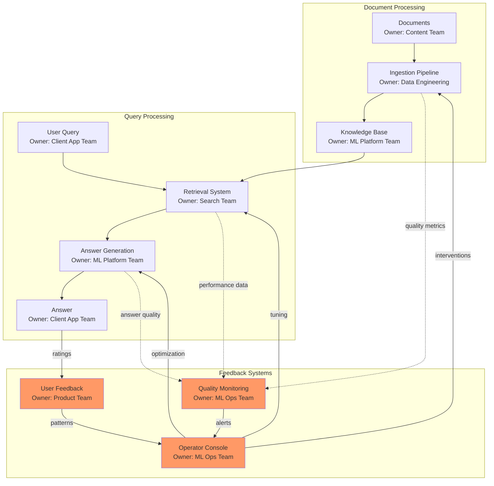
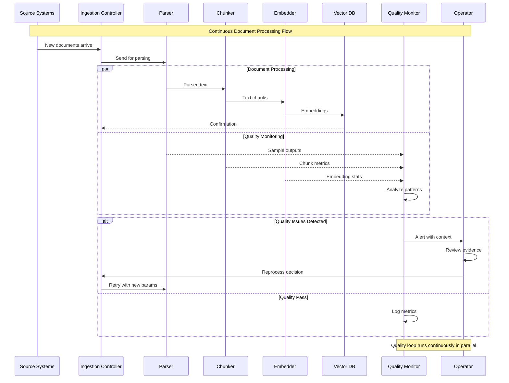
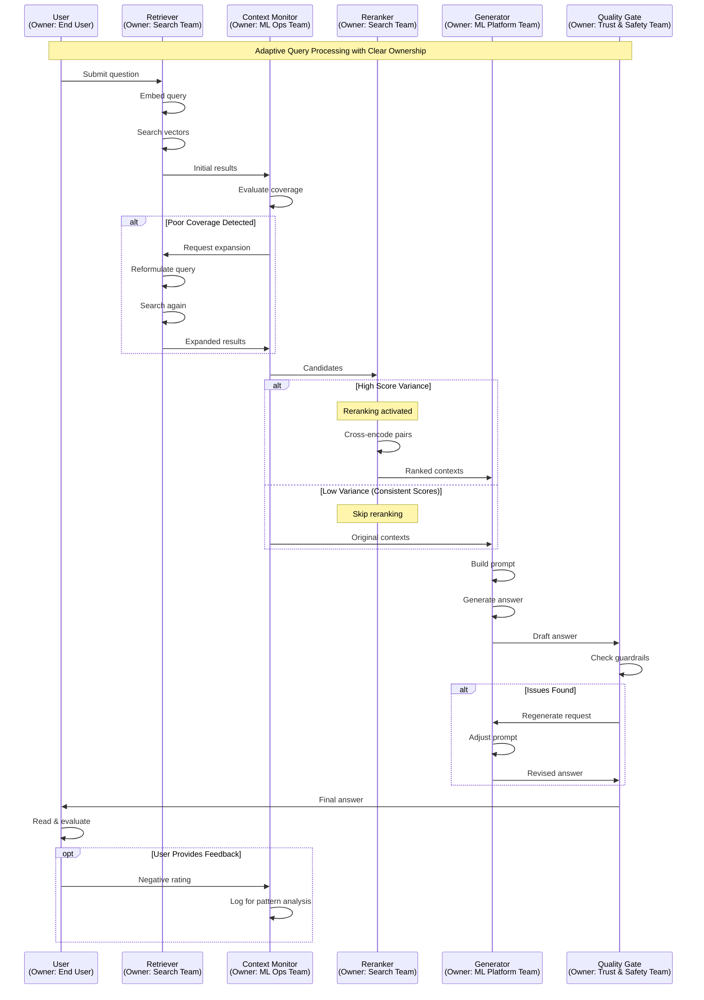
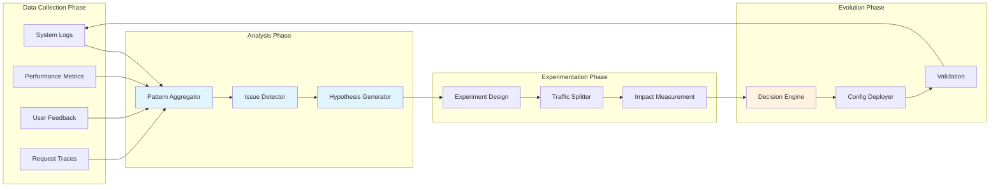
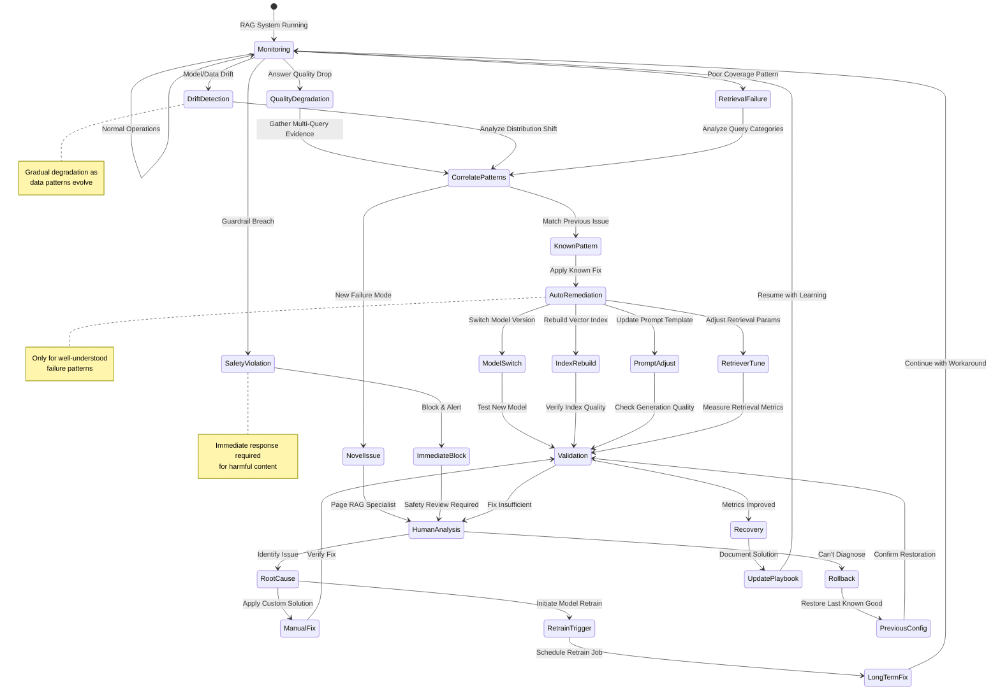
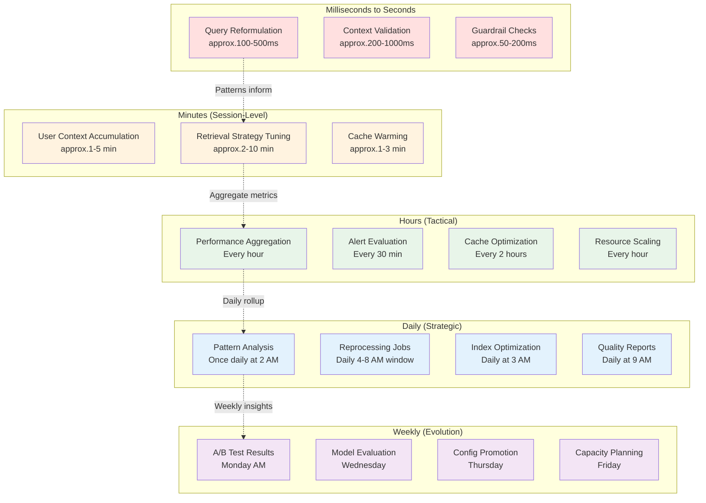
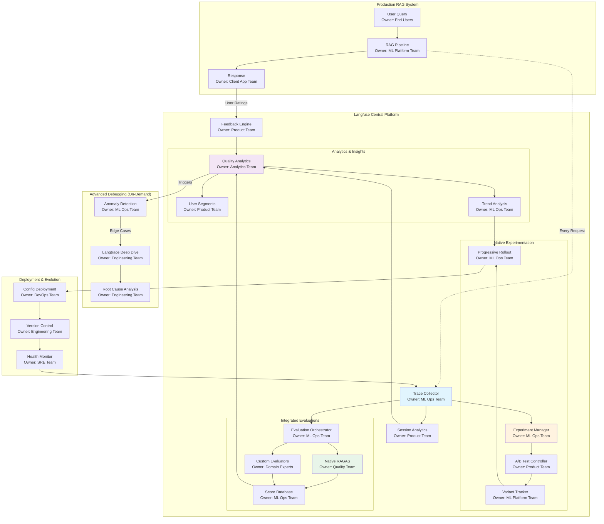

# Prescriptive RAG Implementation Guide
## Building and Operating a Production Knowledge Retrieval System with Feedback Loops

---

## Understanding RAG as a Living System

Production RAG systems aren't simple pipelines but complex, adaptive organisms with multiple feedback loops and parallel processes. To understand how these systems truly work, we'll explore them through progressively detailed views, starting with the big picture and drilling down into specific operational patterns.

Think of RAG as a city's infrastructure rather than an assembly line. Just as a city has water systems, electrical grids, and transportation networks all operating simultaneously and affecting each other, a RAG system has ingestion pipelines, query processors, and monitoring systems all running in parallel with sophisticated feedback mechanisms.

---

## System Overview: The Big Picture

Let's start with the high-level view that shows the major components and their relationships, including ownership responsibilities. This overview deliberately simplifies details to help you understand the overall system structure before diving into specifics.

This overview shows three major subsystems working together. The Document Processing system builds and maintains your knowledge base. The Query Processing system uses that knowledge to answer questions. The Feedback Systems monitor everything and trigger improvements. Notice how feedback isn't an afterthought but an integral part that influences all other components. Each component has a clear owner responsible for its operation and improvement.

---

## Layer 1: Document Ingestion with Quality Loops

Now let's examine how documents actually flow through the system, including the parallel quality monitoring and intervention points. This view focuses on just the ingestion process to keep things clear.

This sequence diagram reveals something crucial that wasn't clear in the complex flowchart - quality monitoring happens in parallel with processing, not after it. The quality monitor continuously samples outputs from each stage without blocking the main flow. When issues are detected, the operator receives not just an alert but rich context including sample failures and suggested fixes. The operator can then trigger targeted reprocessing of affected documents rather than restarting everything.

---

## Layer 2: Query Processing with Adaptive Feedback

The query processing flow is more complex than it initially appears because the system adapts its strategy based on real-time signals. Let's examine how a single query actually gets processed, including all the decision points and adaptations, with clear ownership at each stage.

This sequence shows how the system makes real-time decisions during query processing, with each team owning specific decision points. Let me explain the critical decision logic that happens at each stage.

### Understanding Context Coverage: When Is Coverage "Poor"?

The Context Monitor owned by the ML Ops Team evaluates coverage using sophisticated heuristics that go beyond simple score thresholds. Think of it like a detective gathering evidence for a case - you need not just evidence, but the right kind and amount of evidence to build a convincing argument.

When the retriever returns chunks, the Context Monitor examines three key indicators to determine if coverage is adequate. First, it looks at the absolute scores of the retrieved chunks. If the very best-matching chunk has a low similarity score, say below 0.6 on a 0-1 scale, it means the system couldn't find any highly relevant information in your knowledge base. This is like searching for a specific book in a library and finding that the closest match is only tangentially related to your topic. When this happens, the system knows it needs to either reformulate the query to find better matches or acknowledge that the information might not exist in the current knowledge base.

Second, the monitor examines the score distribution pattern. Imagine you're looking for information about your company's vacation policy and the top result has a score of 0.9, which seems great. But if the second-best score drops dramatically to 0.5, it suggests that only one document in your entire knowledge base discusses vacation policy. This single-source situation is risky because if that one chunk doesn't fully answer the question, the system has nowhere else to turn. The Context Monitor detects this "significant drop-off" pattern and may trigger query expansion to find related information that might be described differently in other documents.

Third, and most sophisticated, the monitor performs entity and concept matching. It extracts key entities from the user's query - names of products, people, technical terms, dates - and verifies that these actually appear in the retrieved chunks. For instance, if someone asks about "the Q3 2024 revenue for Product X" but none of the retrieved chunks mention "Product X" or "Q3 2024" explicitly, the system recognizes a query-concept mismatch even if the similarity scores look reasonable. This often happens when documents use different terminology than users expect, requiring the system to reformulate queries with synonyms or related terms.

### The Reranking Decision: Understanding Score Variance

The decision to activate reranking based on score variance is one of the most impactful optimizations in a RAG system. Let me explain why variance patterns matter so much and how they drive this decision.

When the Context Monitor sees high variance in retrieval scores - for example, scores of [0.9, 0.85, 0.6, 0.55, 0.4] - it indicates uncertainty about which chunks are truly most relevant. The embedding-based retrieval found some potentially good matches but isn't confident about their relative importance. This often happens with complex queries that touch multiple topics or when documents discuss similar concepts with different emphasis. High variance is the system's signal that it needs a more sophisticated analysis to determine true relevance.

In contrast, low variance or consistent scores - like [0.75, 0.74, 0.73, 0.72, 0.71] - suggest that all retrieved chunks are roughly equally relevant to the query. This pattern typically occurs when searching for well-defined, specific information that appears consistently throughout your documentation. When scores are tightly clustered, the initial retrieval ordering is usually good enough, and the expensive reranking step can be skipped without quality loss.

### Deep Dive: How Cross-Encoding Works in Rerankers

The reranking process using cross-encoding is fundamentally different from the initial embedding-based retrieval, and understanding this difference is crucial for optimizing your system. Let me walk you through exactly what happens during cross-encoding and why it's so much more accurate than embedding similarity.

When the reranker receives candidates for reranking, it doesn't compare pre-computed vectors like the initial retrieval did. Instead, for each candidate chunk, it performs a deep semantic analysis by processing the query and chunk together as a unified input. The reranker takes the user's query, say "What are the tax implications of remote work in California?" and concatenates it with a single retrieved chunk about tax policies. These are fed together into a powerful language model, often a BERT-variant trained specifically for relevance assessment.

The model performs what's essentially a reading comprehension task. It analyzes how well the chunk actually answers the specific question, considering nuances like whether the chunk discusses California specifically or just general tax law, whether it addresses remote work or traditional employment, and whether it covers implications or just states rules. The model outputs a single, highly accurate relevance score between 0.0 and 1.0 that reflects this deep understanding.

This process repeats for each of the top candidate chunks, typically 10-20 of them. The computational cost is significant because instead of simple vector comparisons, you're running a full model inference for each query-chunk pair. However, the accuracy improvement is dramatic. Where embedding similarity might confuse a chunk about "California employment tax" with one about "California sales tax" because they share similar vocabulary, the cross-encoder understands that only one actually addresses the user's question about employment-related taxes.

The reranked results often show surprising inversions where chunks ranked 7th or 8th by embedding similarity jump to 1st or 2nd place after reranking. This happens because the cross-encoder can understand subtle semantic relationships that aren't captured in the averaged meaning of embedding vectors. It's the difference between matching keywords and truly understanding whether a text answers a question.

---

## Layer 3: The Continuous Improvement Cycle

Beyond individual requests, the system runs continuous improvement cycles that analyze patterns and drive evolution. This happens on a different timescale from real-time processing.

This improvement cycle runs continuously but at a slower cadence than real-time processing. The system aggregates signals over time windows (typically hours or days) to identify patterns that aren't visible in individual requests. When issues are detected, the system doesn't just alert operators - it generates hypotheses about potential fixes and designs experiments to test them. This scientific approach ensures changes actually improve outcomes rather than just changing behavior.

---

## Layer 4: RAG-Specific Incident Response Flow

When things go wrong in a RAG system, the failures are often subtle and semantic rather than simple crashes. A specialized incident response flow handles these unique failure modes. Let me explain how RAG incidents differ from traditional system failures and how the response flow adapts to these challenges.

### Understanding RAG-Specific Incidents

Traditional system incidents involve clear failures like services crashing or databases becoming unreachable. RAG incidents are fundamentally different because they're often gradual degradations in semantic quality rather than binary failures. Let me walk you through the unique incident types that RAG systems face and how the response flow handles each one.

**Data and Model Drift Incidents** represent one of the most insidious problems in production RAG systems. Unlike a sudden failure, drift happens gradually as the nature of your documents or user queries evolves beyond what your models were trained on. Imagine your embedding model was trained when your company sold three products, but now you sell twenty. The embeddings for the new products cluster in unexpected regions of vector space, causing retrieval to fail silently. The incident response system detects this through statistical monitoring that compares current embedding distributions against historical baselines. The AutoFix for drift isn't a simple restart but might involve automatically switching to a newer model version that was trained on more recent data, or triggering a complete reindexing with updated embeddings.

**Non-Deterministic Quality Failures** are particularly challenging because the system appears to be working normally from an operational perspective. Response times are good, no errors are thrown, but users are getting increasingly unhelpful or incorrect answers. These incidents require correlation across many queries to detect patterns. Perhaps the generator has started hallucinating about specific topics after a prompt template change, or maybe the retriever consistently fails for questions asked in certain phrasings. The correlation step is critical here, as the system needs to gather enough evidence to distinguish between isolated poor answers and systematic quality degradation. The fix might involve rolling back a recent prompt change, adjusting temperature settings, or switching to a different model checkpoint.

**Guardrail and Safety Violations** represent critical incidents that demand immediate response. When the LLM generates harmful, biased, or inappropriate content, this isn't a bug in traditional sense but a failure of AI alignment and safety measures. The incident response flow treats these with special urgency, immediately blocking the problematic response before it reaches users. The system doesn't just block and continue but triggers a comprehensive safety review. A human specialist examines not just the specific failure but patterns around it, potentially uncovering prompt injection attempts or adversarial queries. The remediation might involve updating safety classifiers, adding new guardrail rules, or modifying prompt templates to be more robust against manipulation.

**Retrieval Quality Incidents** occur when the retriever consistently fails to find relevant documents for certain categories of questions, even though the information exists in the knowledge base. This isn't a simple search failure but often indicates structural issues with how information is chunked, indexed, or retrieved. The incident might manifest as consistently low relevance scores for questions about recent product updates, suggesting that new documents aren't being indexed properly. Or it might show that questions using certain terminology fail because the documents use different vocabulary. The automated response might involve triggering a reindexing job with adjusted chunking parameters, updating query expansion rules, or enabling synonym matching for specific terms.

### The Correlation and Diagnosis Process

The correlation step in RAG incident response is far more sophisticated than traditional log correlation. When quality degrades, the system must gather evidence across multiple dimensions to understand the failure pattern. It examines not just individual failed requests but patterns across query types, user segments, document sources, and time windows. This multi-dimensional analysis reveals whether the issue is isolated to specific conditions or represents a broader system problem.

For example, when answer quality drops, the correlation engine might discover that the degradation only affects queries about documents added in the last week, suggesting an ingestion pipeline issue. Or it might find that quality is fine for English queries but poor for Spanish ones, indicating a multilingual processing problem. These patterns guide the system toward the appropriate remediation strategy, whether that's reprocessing recent documents, adjusting language-specific parameters, or switching to models with better multilingual support.

### Automated Remediation Strategies

The RAG incident response system maintains a library of proven remediation strategies for known failure patterns. These aren't simple restarts or rollbacks but sophisticated interventions tailored to semantic failures. When embedding drift is detected, the system might automatically switch to a more recent model version, trigger a partial reindex of affected documents, or adjust retrieval parameters to compensate for the distribution shift. These automated fixes are carefully bounded to prevent overcorrection and include validation steps to ensure they actually improve quality metrics before being fully applied.

---

## Understanding Feedback Loop Timing

Different feedback loops operate on different timescales, and understanding these timing patterns is crucial for effective operations. Think of this like the different rhythms in your body - your heartbeat operates in seconds, breathing in minutes, digestion in hours, and cellular regeneration in days. Similarly, your RAG system has multiple rhythms operating simultaneously, each serving a different purpose.

### How These Timescales Work Together

The beauty of this multi-timescale approach is that each layer aggregates insights from faster layers while providing guidance to slower ones. Let me walk you through how this actually works in practice.

**Real-time loops (milliseconds to seconds)** operate within a single request. When a user asks a question, these loops can reformulate queries, validate context relevance, and check guardrails all before the user sees an answer. These loops must be extremely fast and deterministic - they can't afford complex analysis or external dependencies. Their decisions are based on simple rules and thresholds that have been validated by slower loops.

**Session-level loops (minutes)** build understanding across multiple interactions. As a user asks follow-up questions, these loops recognize patterns and adapt the system's behavior. For instance, if a user consistently asks for more detail, the session-level loop might increase the context window for that user's remaining queries. These adaptations are temporary and specific to the active session.

**Hourly tactical loops** aggregate patterns across all users and sessions. They look for systematic issues that individual requests might not reveal. For example, if query latency slowly creeps up over an hour, these loops can trigger cache refreshes or resource scaling before users notice problems. They balance between being responsive to issues and avoiding overreaction to temporary spikes.

**Daily strategic loops** perform deeper analysis that would be too expensive to run continuously. They can afford to look at every query from the past day, identify patterns in failed queries, and determine what new documents might be needed. The 2-4 AM execution window for heavy operations like reindexing ensures minimal impact on users while keeping the system fresh for the next business day.

**Weekly evolution loops** drive fundamental improvements to the system. They evaluate experiments that have been running all week, determining which configuration changes actually improved outcomes. These loops have enough data to make statistically significant decisions about model updates, architectural changes, or new feature rollouts.

### Coordination Between Timescales

The key to making this work is careful coordination between timescales. Faster loops must respect decisions made by slower loops, while slower loops must incorporate insights from faster ones. Here's how this coordination works:

Information flows upward through aggregation. Real-time events are sampled and summarized for session-level analysis. Session patterns are aggregated for hourly review. Hourly metrics roll up into daily reports. Daily patterns inform weekly evolution decisions. This aggregation reduces data volume while preserving important signals.

Control flows downward through configuration. Weekly evolution loops update the rules that daily loops use for pattern detection. Daily loops adjust the thresholds that hourly loops use for alerting. Hourly loops tune the parameters that session loops use for adaptation. Session loops influence the strategies that real-time loops use for immediate decisions.

This bidirectional flow creates a learning system where immediate actions are informed by long-term patterns, while long-term evolution is grounded in real operational experience.

---

## Implementing Feedback Loops: Progressive Enhancement

Building these feedback systems requires a thoughtful, staged approach. You can't implement everything at once, and trying to do so will likely result in a brittle, unmaintainable system. Instead, follow a progressive enhancement strategy that builds capabilities incrementally.

### Stage 1: Foundational Monitoring (Week 1-2)

Start by establishing visibility into your system before attempting any automation. Deploy comprehensive logging at every component, ensuring you capture not just successes and failures but also performance metrics and quality indicators. Set up dashboards that show document processing rates, query latencies, and answer generation times. Implement distributed tracing so you can follow individual requests through the entire system.

At this stage, all interventions are manual. When you notice problems, you investigate and fix them by hand. This might seem primitive, but it's essential for understanding your system's actual behavior patterns. The patterns you observe during these first weeks will inform which feedback loops to automate first.

### Stage 2: Alert-Driven Response (Week 3-4)

Once you understand normal system behavior, implement alerting for clear deviation patterns. Start with obvious problems like parsing failures exceeding 5%, query latencies above P95 thresholds, or embedding generation timeouts. Each alert should include enough context for an operator to quickly understand and address the issue.

Create runbooks for common problems you've observed. These runbooks document not just the fix but also the investigation process. They become the foundation for future automation - each runbook is essentially a manual feedback loop waiting to be automated.

### Stage 3: Automatic Remediation (Week 5-8)

Begin automating the most frequent and well-understood interventions. If you're consistently restarting stuck workers, implement automatic health checks and restarts. If you regularly adjust retrieval parameters for certain query patterns, build rules that make these adjustments automatically.

Each automated feedback loop should have three safeguards. First, limits on how often it can activate to prevent oscillation. Second, boundaries on what changes it can make to prevent extreme adjustments. Third, kill switches that allow operators to disable automation when it's misbehaving.

### Stage 4: Adaptive Optimization (Week 9-12)

With basic feedback loops operational, implement more sophisticated adaptive behaviors. Deploy A/B testing infrastructure that can automatically test configuration variations. Build drift detection that monitors embedding distributions and triggers retraining when needed. Implement query pattern analysis that identifies new document requirements.

These advanced feedback loops don't just fix problems - they improve the system proactively. They require more sophisticated monitoring and decision logic but can dramatically improve system performance and reliability when implemented correctly.

### Stage 5: Self-Improving System (Ongoing)

The final stage is never truly complete. Your feedback loops themselves need feedback loops. Monitor how often each automation activates, whether its interventions improve outcomes, and how it interacts with other automated systems. Continuously refine trigger thresholds, adjustment strategies, and coordination mechanisms.

---

## Advanced Quality Monitoring: Langfuse as Your Central Operations Platform

Once your basic feedback loops are operational, the next evolution involves deploying Langfuse as your central operational platform for RAG quality monitoring, experimentation, and continuous improvement. This transformation goes far beyond traditional monitoring because Langfuse now provides native capabilities for the entire improvement lifecycle, from detecting issues through experimenting with solutions to rolling out validated improvements. Think of this transition like upgrading from a collection of separate medical instruments to an integrated diagnostic and treatment center where all capabilities work together seamlessly.

The power of centralizing on Langfuse comes from its recent evolution into a complete RAG operations platform. Rather than stitching together multiple tools and building custom integrations, you now have native support for experimentation workflows, automated evaluations including RAGAS, and sophisticated rollout mechanisms all within a single platform. This means both technical and non-technical team members can participate in system improvement without context switching between tools or writing custom integration code.

### The Langfuse-Centric Architecture

The modern RAG monitoring architecture positions Langfuse as the central nervous system of your operation, with specialized tools like RAGAS and Langtrace seamlessly integrated as native capabilities rather than external services. This integrated approach transforms how teams operate their RAG systems.

This architecture shows how Langfuse has evolved from a monitoring tool into a complete operational platform. Every capability you need for RAG operations is either native to Langfuse or seamlessly integrated, eliminating the friction of managing multiple tools and custom integrations. The platform now owns the entire improvement lifecycle, from detecting issues through experimenting with fixes to rolling out validated improvements.

### Native Experimentation and Rollout Workflows

Langfuse's native experimentation capabilities represent a fundamental shift in how teams improve RAG systems. Instead of building custom A/B testing infrastructure or managing experiments through external tools, you now have sophisticated experimentation workflows built directly into your operational platform. This integration means that anyone on your team, regardless of technical expertise, can propose hypotheses, design experiments, and analyze results without leaving Langfuse.

The experiment management features go far beyond simple A/B testing. When you identify a quality issue through Langfuse's analytics, you can immediately create an experiment to test potential solutions. For example, suppose you notice that technical documentation queries have lower satisfaction scores. Within Langfuse, you can create variants that test different retrieval counts, alternate prompt templates, or modified reranking thresholds specifically for technical queries. The platform automatically handles traffic splitting, statistical significance testing, and result visualization.

What makes this particularly powerful is the integration with Langfuse's existing trace data. When you run an experiment, every variant is automatically tracked and correlated with quality metrics, user feedback, and operational costs. You're not just testing whether variant B is better than variant A in abstract terms - you can see exactly how each variant affects faithfulness scores from RAGAS, response latencies, token costs, and user satisfaction ratings. This rich context enables data-driven decisions about which improvements to roll out.

The progressive rollout capabilities ensure safe deployment of improvements. Instead of switching all traffic to a new configuration at once, Langfuse enables gradual rollout with automatic rollback triggers. You might start by routing 5% of traffic to a new prompt template, monitoring quality metrics closely. As confidence builds, Langfuse can automatically increase the rollout percentage, but if quality metrics degrade or costs spike unexpectedly, it can instantly roll back to the previous configuration. This safety net encourages experimentation because the risk of degrading production quality is minimized.

Remote custom evaluations represent another breakthrough capability. Previously, if you wanted to run specialized evaluations like RAGAS assessments or domain-specific quality checks, you needed to build custom pipelines and orchestration. Now, you can trigger these evaluations directly from Langfuse's UI, and the results flow back into the platform for analysis. This means a product manager can request a RAGAS evaluation of yesterday's responses without writing any code or accessing any systems outside Langfuse.

### Seamless RAGAS Integration

The integration of RAGAS into Langfuse transforms quality assessment from a separate process into an integral part of operations. Langfuse doesn't just run RAGAS evaluations - it provides a complete workflow for configuring assessments, visualizing results, and acting on insights. This native integration is actively maintained by both teams, ensuring compatibility and performance optimization as both tools evolve.

When RAGAS runs within Langfuse, it has access to the complete trace context for each evaluation. This means RAGAS can assess not just the final answer but understand exactly which chunks were retrieved, what prompt was used, and how the answer was generated. This context-aware evaluation provides much deeper insights than running RAGAS as a standalone tool. For instance, when faithfulness scores are low, Langfuse can immediately show you which specific chunks led to the unfaithful content, enabling targeted fixes rather than broad adjustments.

The visualization capabilities for RAGAS scores within Langfuse go well beyond simple metrics displays. You can segment faithfulness scores by user cohort, document source, query type, or any other dimension captured in your traces. This segmentation reveals patterns that would be invisible in aggregate metrics. You might discover that faithfulness is generally good but consistently poor for queries about documents from a specific source, indicating a problem with how those documents are processed or chunked.

The ability to trigger RAGAS evaluations on-demand or on schedules directly from Langfuse's interface democratizes quality assessment. A support team member investigating user complaints can trigger a RAGAS evaluation of the problematic conversations without involving engineering. A product manager can schedule daily RAGAS assessments of high-value query categories to track quality trends. This accessibility ensures that quality monitoring isn't bottlenecked on technical team availability.

### Advanced Debugging with Langtrace

While Langfuse serves as your primary operational platform, Langtrace provides specialized deep-dive capabilities when you need to understand complex failures at the microsecond level. The integration between Langfuse and Langtrace is seamless - when Langfuse's analytics reveal an anomaly that requires deeper investigation, you can trigger Langtrace's detailed tracing for affected query patterns with a single click.

Langtrace's OpenTelemetry-based instrumentation provides visibility that goes beyond what's practical to capture continuously. When activated, it records every function call, every database query, every network request with nanosecond precision. This level of detail would be overwhelming if captured constantly, but when surgically applied to specific problems identified through Langfuse, it provides invaluable debugging information.

The correlation between Langfuse's behavioral analytics and Langtrace's technical traces enables rapid root cause analysis. For example, Langfuse might show that certain queries have unusually high latency variance. With one click, you can enable Langtrace for similar queries, revealing that the variance comes from cache misses in a specific microservice that only affect queries with certain characteristics. This precise diagnosis would be nearly impossible without the combination of Langfuse's pattern detection and Langtrace's deep technical visibility.

### Modular, Evolving, and Scalable Platform

Langfuse's architecture is designed for continuous evolution, with new capabilities being added regularly based on community needs and industry advances. The open-source foundation means you're not locked into a vendor's vision - you can extend and customize the platform for your specific needs while still benefiting from community contributions. The flexible deployment options allow you to start with Langfuse's cloud offering for rapid setup, then migrate to self-hosted deployment as your security or compliance requirements evolve.

The platform's modularity means you can adopt capabilities progressively. You might start with basic tracing and feedback collection, add RAGAS evaluations once you have baseline data, enable experimentation workflows as your team grows comfortable with the platform, and finally integrate advanced features like custom evaluators and Langtrace debugging as your system matures. This progressive adoption path ensures that teams aren't overwhelmed by complexity while still having advanced capabilities available when needed.

The scalability of Langfuse has been proven in production environments processing millions of daily requests. The platform uses efficient sampling and aggregation strategies to maintain performance even at scale. Critical path operations like trace collection are optimized to add minimal latency to your requests, while heavier operations like RAGAS evaluations run asynchronously without affecting user experience. This architectural separation ensures that monitoring never becomes a bottleneck in your RAG system.

### Implementation Roadmap

The rollout of these advanced monitoring tools follows a careful sequence designed to minimize disruption while maximizing learning. Let me walk you through the implementation phases and the specific decisions you'll need to make at each stage.

**Phase 1: Langfuse Foundation (Week 1-2)**

Start by integrating Langfuse into your RAG pipeline. This requires modifying your application code to send traces to Langfuse's collectors. The integration is usually straightforward - Langfuse provides SDKs that wrap your existing LangChain or LlamaIndex code. The key decision here is determining what metadata to attach to each trace. Include user segment, query category, document sources, and any A/B test flags. This metadata becomes invaluable for slicing and dicing your quality metrics later.

During this phase, you're also setting up your feedback collection mechanism. This might mean adding thumbs-up/thumbs-down buttons to your UI, implementing a star rating system, or creating a feedback API that other systems can call. The important thing is to make feedback collection seamless and immediate - if users have to navigate to a different page to provide feedback, you'll get very little signal.

**Phase 2: RAGAS Integration (Week 3-4)**

With Langfuse accumulating data, you can now add RAGAS for quality assessment. The integration involves setting up a separate evaluation service that periodically pulls samples from Langfuse and runs them through RAGAS. This service needs access to your original documents to verify faithfulness, so you'll need to maintain a connection to your document store.

The critical decision in this phase is your sampling strategy. Start with a simple random sample of 5% of all requests. As you accumulate data, you can implement more sophisticated sampling that over-samples problematic categories or new deployments. Remember that RAGAS evaluation is computationally expensive, so you need to balance coverage with cost.

**Phase 3: Langtrace Preparation (Week 5-6)**

Langtrace requires the most careful integration because it touches every component in your system. Start by adding OpenTelemetry instrumentation to all your services. This is often the most time-consuming part because it requires code changes across multiple repositories. However, the investment pays off enormously when you need to debug complex issues.

The key decision here is your trace sampling strategy. You want enough traces to be statistically meaningful but not so many that you overwhelm your trace storage. A common pattern is to always trace requests that result in errors, sample 1% of successful requests randomly, and allow on-demand tracing for specific user sessions when debugging issues.

**Phase 4: Unified Operations (Week 7-8)**

With all three tools operational, the final phase involves creating unified dashboards and alert policies that leverage insights from all three systems. This is where the real power emerges. You can create alerts that fire when Langfuse detects cost spikes AND RAGAS shows quality degradation, indicating that something is causing your system to work harder while producing worse results.

The workflow automation in this phase is crucial. When patterns are detected, you want automatic responses. If RAGAS faithfulness drops below threshold, automatically increase the retrieval count and enable reranking. If Langtrace shows consistent timeout patterns, automatically scale up the affected service. If Langfuse shows negative feedback clustering around specific document sources, automatically flag those documents for human review.

### Operational Patterns

Once these tools are integrated, they enable sophisticated operational patterns that would be impossible with generic monitoring. Let me describe the daily workflows that emerge from this integrated monitoring approach.

The morning begins with reviewing the overnight quality report generated by RAGAS. This report shows quality trends across all four dimensions, broken down by query category and user segment. If any metrics show significant degradation, the operator can drill into Langfuse to see the specific queries and responses that contributed to the poor scores. From there, they can activate Langtrace for similar queries to understand exactly what's going wrong.

Throughout the day, Langfuse provides real-time visibility into system behavior. The operations team watches for cost anomalies, feedback patterns, and performance issues. When users report problems, support staff can look up the exact trace in Langfuse, see what happened, and often resolve issues without escalating to engineering. This self-service capability dramatically reduces the burden on engineering teams.

The end-of-day review uses aggregated data from all three systems to make strategic decisions. If RAGAS consistently shows low relevancy for certain query types, it might be time to add more documents or adjust the chunking strategy. If Langtrace repeatedly shows the same bottleneck, it's time to optimize that component. If Langfuse shows that certain prompt versions perform better for specific query categories, it's time to implement prompt routing logic.

### Success Metrics

The success of this integrated monitoring approach can be measured through several key improvements. First, you should see a dramatic reduction in mean time to detect (MTTD) quality issues. Problems that previously took days to notice through user complaints are now caught within hours by RAGAS. Second, mean time to resolve (MTTR) should drop significantly because Langtrace provides immediate visibility into root causes.

The most important success metric, though, is the acceleration of system improvement. With clear quality metrics from RAGAS, targeted feedback from Langfuse, and deep debugging from Langtrace, your team can iterate much faster. Changes that previously felt risky because you couldn't measure their impact now become routine experiments with clear success criteria.

### Stage 5: Self-Improving System (Ongoing)

The final stage is never truly complete. Your feedback loops themselves need feedback loops. Monitor how often each automation activates, whether its interventions improve outcomes, and how it interacts with other automated systems. Continuously refine trigger thresholds, adjustment strategies, and coordination mechanisms.

With the advanced monitoring stack in place, your system now has the sensory apparatus it needs to truly self-improve. The combination of Langfuse's operational awareness, RAGAS's quality assessment, and Langtrace's debugging capabilities creates a complete nervous system for your RAG application. Your system can now not only detect problems but understand them deeply enough to fix them automatically or guide humans to the right solutions quickly.

---

## Critical Success Factors

Successfully implementing these feedback systems requires understanding several critical factors that determine whether your system becomes self-improving or self-destructing.

### Feedback Loop Isolation

Each feedback loop must be isolated enough to be understandable and debuggable. When multiple loops interact in complex ways, it becomes impossible to predict system behavior or diagnose problems. Design loops with clear boundaries and minimal interdependencies. When loops must interact, make those interactions explicit and observable.

### Observability Over Automation

It's tempting to automate everything, but observability is more important than automation. You need to see what your feedback loops are doing, why they're activating, and what effects they're having. Every automated decision should be logged with enough context to understand it later. Build dashboards that show feedback loop activity alongside system metrics.

### Human Override Capability

No matter how sophisticated your automation, maintain human override capabilities at every level. Operators need to be able to disable feedback loops, adjust their parameters, or take manual control during complex incidents. Design your system with the assumption that automation will occasionally make wrong decisions and humans will need to intervene.

### Progressive Confidence

Start each feedback loop with low confidence and gradually increase it based on observed success. A new loop might start by only generating recommendations for human review. After proving accurate, it can make small automatic adjustments. Only after extensive validation should it be allowed to make significant changes autonomously.

---

## Conclusion: Building Systems That Learn

The journey from a simple RAG pipeline to a self-improving system is one of progressive enhancement and careful observation. By implementing feedback loops thoughtfully - starting with monitoring, adding simple automations, then building toward sophisticated adaptive behaviors - you create a system that gets better over time rather than degrading.

The diagrams we've explored show different facets of the same complex system. The overview provides orientation. The sequence diagrams reveal temporal dynamics. The state machines capture decision logic. The timing charts show how different timescales interact. Together, they document not just what your system does but how it learns and improves.

Remember that the goal isn't to automate everything but to create a harmonious blend of human insight and machine efficiency. Your feedback loops should amplify human intelligence, not replace it. They should make problems visible before they become critical, suggest improvements based on observed patterns, and handle routine adjustments while escalating novel situations to human operators.

The system you deploy today is just the beginning. Through careful implementation of these feedback mechanisms, it will evolve into something far more capable - not through major rewrites but through thousands of small improvements driven by continuous learning from its own operation.