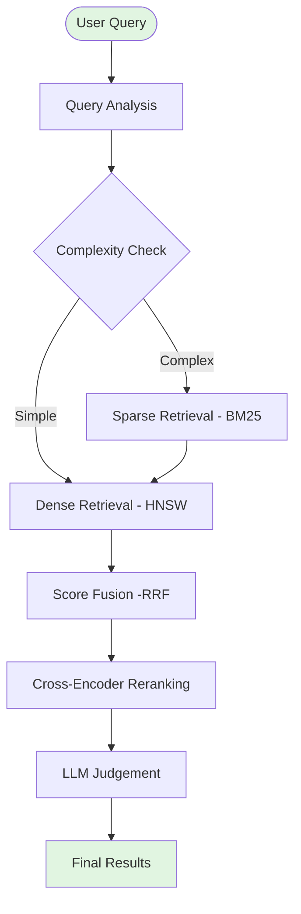
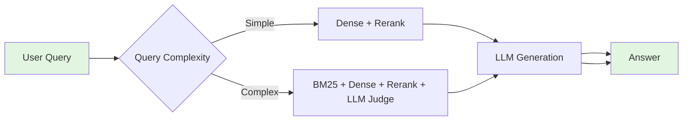

# Summary of AI System Design: Multi-Stage Retrieval-Augmented Generation (RAG)

## Overview

The system advances from traditional two-stage retrieval processes to an enhanced four-stage architecture, effectively bridging the semantic gap between query intent and document representation. It integrates sparse retrieval, dense embeddings, cross-encoder reranking, and LLM-based judgment for superior precision and relevance.

## Critical Aspects

### 1. Multi-Stage Architecture

#### Two-Stage Pipeline (Standard)

- **Stage 1 (Dense Retrieval):** Fast retrieval using vector similarity (HNSW).
- **Stage 2 (Cross-Encoder Reranking):** High-precision reranking with cross-encoders.

#### Four-Stage Pipeline (Advanced)



### 2. Technical Component Highlights

- **Sparse Retrieval (BM25):** Utilizes Elasticsearch/OpenSearch for keyword matching.
- **Dense Embedding:** Employs Qwen3 embeddings with HNSW ANN searches.
- **Score Fusion (RRF):** Merges sparse and dense retrieval results effectively.
- **Cross-Encoder Reranking:** Employs models like BGE-Reranker for precise ranking.
- **LLM-as-Judge:** Uses models like DeepSeek or Llama3 to score and extract key information.

### 3. Vector Database Schema

- Designed with PostgreSQL and pgvector.
- Supports both sparse and dense indexing.

```sql
CREATE TABLE documents (
    id SERIAL PRIMARY KEY,
    title TEXT,
    content TEXT,
    embedding VECTOR(1024),
    metadata JSONB,
    created_at TIMESTAMP DEFAULT NOW()
);

CREATE INDEX hnsw_idx ON documents USING hnsw (embedding vector_cosine_ops);
```

### 4. Performance and Accuracy Trade-Off

| Stages   | Latency    | Accuracy | Use Cases                 |
| -------- | ---------- | -------- | ------------------------- |
| 1 Stage  | 10-50ms    | 85-90%   | FAQs, high-volume         |
| 2 Stages | 60-150ms   | 92-95%   | General RAG, chatbots     |
| 3 Stages | 200-500ms  | 95-97%   | Enterprise, research      |
| 4 Stages | 500-2000ms | 97-99%   | Critical (legal, medical) |

### 5. Deployment Considerations

- **Scalability:** Kubernetes, Docker, microservices.
- **Observability:** Prometheus, Grafana, Jaeger, ELK stack.
- **Horizontal Scaling:** Auto-scaling based on latency and queue metrics.

### 6. Optimization Strategies

- **Multi-layer caching:** Redis and in-memory caches.
- **Batch Processing:** For embedding and reranking to enhance throughput.
- **Scheduled Maintenance:** Index optimization and re-indexing.

## Visual Flow of Query Handling



## Conclusion

The multi-stage retrieval-augmented generation system combines high accuracy, precision, and flexibility, adapting effectively to diverse requirements from simple FAQs to critical applications like legal and medical searches.

