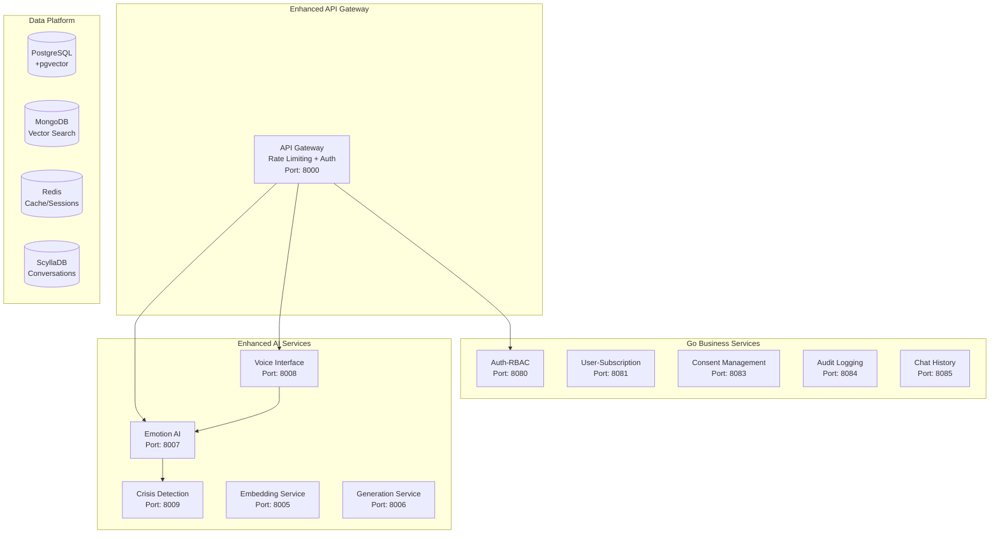
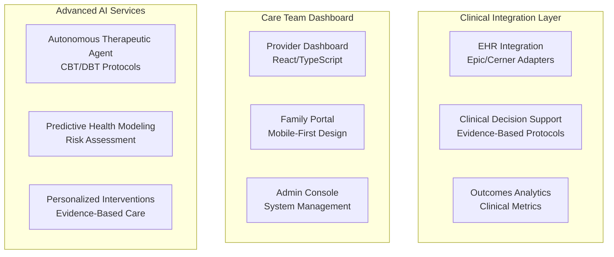
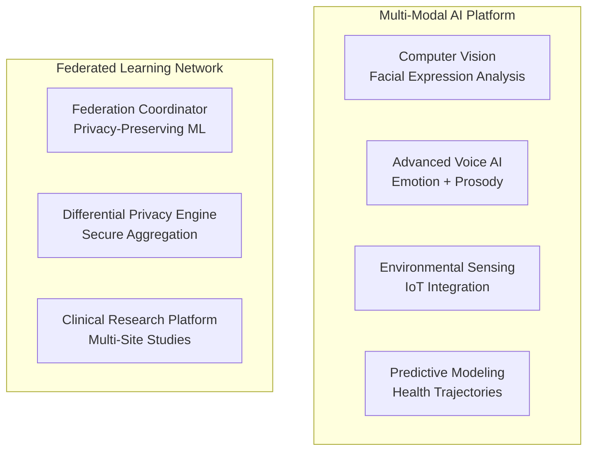

# 🚀 Strategic Technology Roadmap
> **Technology Evolution and Implementation Priorities**

**Objective**: Strategic technology roadmap with prioritized initiatives and implementation timelines  
**Audience**: Engineering Leadership, Product Management, Technology Strategy  
**Planning Horizon**: 18 months (Phase 2.0 → Phase 4.0)  
**Date**: August 2025

---

## 📋 Executive Summary

### Current State (Phase 1.0 - Complete)
The MultiDB-Chatbot platform has successfully established a **production-ready microservices foundation** with:
- ✅ **Infrastructure-as-Code**: Complete Terraform implementation 
- ✅ **Multi-Database Architecture**: PostgreSQL, MongoDB, Redis, ScyllaDB specialization
- ✅ **HIPAA Compliance**: Comprehensive security and audit framework
- ✅ **RAG Pipeline**: BGE embedding + Qwen generation with vector search
- ✅ **Microservices**: Go business logic + Python AI/ML services

### Strategic Vision (18-Month Outlook)
Evolution from **therapeutic conversation platform** to **comprehensive emotional AI healthcare ecosystem** with advanced personalization, multi-modal interfaces, and clinical-grade analytics.

---

## 🎯 Technology Priority Matrix

### High-Impact, High-Urgency (Phase 2.0 - Next 6 Months)

#### 1. **Emotional AI Foundation** 
**Priority**: CRITICAL | **Timeline**: 2-3 months | **Effort**: 12-16 weeks

**Technical Requirements**:
- Real-time emotion detection using transformer models (`j-hartmann/emotion-english-distilroberta-base`)
- Crisis intervention system with automated escalation
- Emotion-aware response generation with therapeutic fine-tuning
- Multi-modal emotion analysis (text + voice tone)

**Implementation Strategy**:
```python
# Location: ai_services/emotion-intelligence/
class EmotionalIntelligenceService:
    """Real-time emotion analysis with crisis detection"""
    
    async def analyze_emotional_state(
        self, 
        text_content: str,
        voice_features: Optional[VoiceFeatures] = None,
        conversation_context: ConversationContext = None
    ) -> EmotionAnalysisResult:
        
        # 1. Text-based emotion classification
        text_emotions = await self.text_emotion_classifier.predict(text_content)
        
        # 2. Voice tone analysis (if available)
        voice_emotions = None
        if voice_features:
            voice_emotions = await self.voice_analyzer.analyze_tone(voice_features)
        
        # 3. Context-aware emotion fusion
        fused_emotions = self.emotion_fusion.combine_modalities(
            text_emotions, 
            voice_emotions,
            conversation_context.emotional_history
        )
        
        # 4. Crisis detection with immediate escalation
        crisis_level = await self.crisis_detector.assess_risk(
            fused_emotions,
            conversation_context.user_profile,
            conversation_context.recent_patterns
        )
        
        if crisis_level >= CrisisLevel.HIGH:
            await self.trigger_immediate_intervention(
                user_id=conversation_context.user_id,
                crisis_type=crisis_level,
                emotional_state=fused_emotions
            )
        
        return EmotionAnalysisResult(
            primary_emotion=fused_emotions.dominant,
            emotion_scores=fused_emotions.all_scores,
            crisis_level=crisis_level,
            intervention_needed=crisis_level >= CrisisLevel.MEDIUM,
            confidence_score=fused_emotions.confidence
        )
```

**Database Schema Extensions**:
```sql
-- New tables for emotional intelligence
CREATE TABLE emotion_analysis_logs (
    id UUID PRIMARY KEY,
    user_id UUID NOT NULL REFERENCES users(id),
    conversation_id UUID NOT NULL,
    message_id UUID NOT NULL,
    emotion_scores JSONB NOT NULL,          -- {"joy": 0.8, "sadness": 0.1, ...}
    primary_emotion VARCHAR(20) NOT NULL,
    confidence_score FLOAT NOT NULL,
    crisis_level VARCHAR(10),               -- NONE, LOW, MEDIUM, HIGH, CRITICAL
    intervention_triggered BOOLEAN DEFAULT false,
    analysis_timestamp TIMESTAMPTZ NOT NULL DEFAULT NOW(),
    model_version VARCHAR(50) NOT NULL
);

CREATE TABLE crisis_interventions (
    id UUID PRIMARY KEY,
    user_id UUID NOT NULL REFERENCES users(id),
    trigger_emotion_log_id UUID REFERENCES emotion_analysis_logs(id),
    crisis_level VARCHAR(10) NOT NULL,
    intervention_type VARCHAR(50) NOT NULL, -- automated, staff_alert, emergency_call
    escalated_to UUID REFERENCES users(id), -- Staff member who was notified
    resolved_at TIMESTAMPTZ,
    resolution_notes TEXT,
    created_at TIMESTAMPTZ NOT NULL DEFAULT NOW()
);
```

#### 2. **Voice Interface Integration**
**Priority**: HIGH | **Timeline**: 3-4 months | **Effort**: 14-18 weeks

**Technical Requirements**:
- Speech-to-text with healthcare terminology optimization
- Text-to-speech with emotion-aware prosody
- Real-time voice activity detection
- Senior-friendly voice interface design

**Implementation Architecture**:
```python
# Location: ai_services/voice/
class VoiceInterfaceService:
    """Speech processing optimized for senior healthcare"""
    
    def __init__(self):
        self.stt_model = WhisperModel("openai/whisper-large-v3")  # Medical terminology
        self.tts_model = TTSModel("microsoft/speecht5_tts")       # Natural prosody
        self.vad_model = VoiceActivityDetector()                  # Silence detection
        self.senior_optimizer = SeniorSpeechOptimizer()          # Age-related adjustments
    
    async def process_voice_input(
        self, 
        audio_stream: AudioStream,
        user_profile: UserProfile
    ) -> VoiceProcessingResult:
        
        # 1. Voice activity detection with senior-specific parameters
        speech_segments = await self.vad_model.detect_speech(
            audio_stream,
            sensitivity=user_profile.hearing_sensitivity,
            silence_threshold=0.3  # Longer pauses for seniors
        )
        
        # 2. Speech-to-text with medical vocabulary
        transcription_tasks = [
            self.stt_model.transcribe(
                segment,
                language="en",
                vocabulary_bias=["medication", "doctor", "pain", "therapy"]
            ) 
            for segment in speech_segments
        ]
        transcriptions = await asyncio.gather(*transcription_tasks)
        
        # 3. Emotion extraction from voice features
        voice_features = await self.extract_voice_features(audio_stream)
        emotion_analysis = await self.voice_emotion_analyzer.analyze(voice_features)
        
        return VoiceProcessingResult(
            transcription=" ".join(transcriptions),
            confidence_scores=[t.confidence for t in transcriptions],
            voice_emotions=emotion_analysis,
            speech_quality_metrics=voice_features.quality_metrics
        )
```

#### 3. **Advanced Personalization Engine**
**Priority**: HIGH | **Timeline**: 4-5 months | **Effort**: 16-20 weeks

**Technical Requirements**:
- User preference learning with privacy preservation
- Conversation style adaptation based on cultural background
- Therapeutic intervention personalization
- Memory consolidation and retrieval system

---

## 🔄 Medium-Term Evolution (Phase 3.0 - 6-12 Months)

### 1. **Clinical Analytics & Outcomes Platform**

**Technical Vision**: Transform conversational data into clinical insights and outcome measurements

**Core Components**:
```python
# Location: analytics_platform/clinical_insights/
class ClinicalAnalyticsEngine:
    """Extract clinical insights from therapeutic conversations"""
    
    async def generate_wellness_insights(
        self,
        user_id: UUID,
        analysis_period: timedelta = timedelta(days=30)
    ) -> WellnessInsightReport:
        
        # 1. Conversation pattern analysis
        conversations = await self.get_user_conversations(user_id, analysis_period)
        conversation_patterns = await self.analyze_conversation_patterns(conversations)
        
        # 2. Emotional trajectory analysis
        emotion_logs = await self.get_emotion_history(user_id, analysis_period)
        emotional_trends = self.calculate_emotional_trends(emotion_logs)
        
        # 3. Engagement and activity correlation
        activity_data = await self.get_facility_activity_data(user_id, analysis_period)
        engagement_correlation = self.correlate_ai_engagement_with_wellness(
            conversation_patterns,
            emotional_trends,
            activity_data
        )
        
        # 4. Clinical risk assessment
        risk_factors = await self.assess_clinical_risk_factors(
            user_id,
            emotional_trends,
            conversation_patterns
        )
        
        # 5. Personalized intervention recommendations
        interventions = await self.generate_intervention_recommendations(
            emotional_trends,
            risk_factors,
            user_preferences=await self.get_user_preferences(user_id)
        )
        
        return WellnessInsightReport(
            user_id=user_id,
            analysis_period=analysis_period,
            emotional_wellness_score=emotional_trends.overall_score,
            engagement_metrics=engagement_correlation.metrics,
            risk_assessment=risk_factors,
            recommended_interventions=interventions,
            clinical_observations=conversation_patterns.clinical_notes
        )
```

### 2. **Care Team Integration Platform**

**Technical Vision**: Seamless integration with healthcare workflows and EHR systems

**Architecture Components**:
- EHR integration adapters (Epic, Cerner, AllScripts)
- Care plan synchronization and updates
- Clinical decision support integration
- Provider dashboard and notification system

### 3. **Family Engagement Portal**

**Technical Vision**: Transparent family communication with privacy controls

**Core Features**:
- Family member authentication and role-based access
- Wellness summary sharing with consent management
- Emergency notification and escalation system
- Cultural preference and communication style adaptation

---

## 🌟 Long-Term Vision (Phase 4.0 - 12-18 Months)

### 1. **Autonomous Therapeutic Agent**

**Vision**: AI agent capable of conducting evidence-based therapeutic interventions

**Technical Requirements**:
- Cognitive Behavioral Therapy (CBT) protocol implementation
- Mindfulness and meditation guidance system
- Behavioral activation and goal-setting frameworks
- Clinical outcome measurement and adaptation

```python
# Future implementation concept
class AutonomousTherapeuticAgent:
    """AI agent for evidence-based therapeutic interventions"""
    
    async def conduct_therapeutic_session(
        self,
        user_id: UUID,
        session_type: TherapyType,
        user_goals: List[TherapeuticGoal]
    ) -> TherapeuticSessionResult:
        
        # 1. Assess current emotional and mental state
        current_state = await self.assess_user_state(user_id)
        
        # 2. Select evidence-based intervention protocol
        intervention_protocol = await self.select_intervention_protocol(
            current_state,
            user_goals,
            session_type,
            previous_sessions=await self.get_session_history(user_id)
        )
        
        # 3. Guide structured therapeutic conversation
        session_result = await self.guide_therapeutic_conversation(
            user_id,
            intervention_protocol,
            current_state
        )
        
        # 4. Measure session outcomes and adapt
        outcomes = await self.measure_session_outcomes(
            session_result,
            user_goals,
            current_state
        )
        
        # 5. Update user therapeutic plan
        await self.update_therapeutic_plan(user_id, outcomes)
        
        return session_result
```

### 2. **Multi-Modal AI Platform**

**Vision**: Comprehensive AI platform supporting voice, video, and environmental sensing

**Technical Components**:
- Computer vision for wellness monitoring (facial expression, posture analysis)
- Environmental sensors integration (IoT devices, wearables)
- Predictive health modeling using multi-modal data fusion
- Real-time intervention triggers based on comprehensive data

### 3. **Federated Learning & Privacy Preservation**

**Vision**: Collaborative learning across healthcare organizations while preserving privacy

**Technical Framework**:
- Federated learning for therapy model improvement
- Differential privacy for aggregate insights
- Secure multi-party computation for benchmarking
- Privacy-preserving clinical research platform

---

## 🏗️ Architecture Evolution Roadmap

### Phase 2.0: Enhanced Services Architecture



### Phase 3.0: Clinical Integration Architecture



### Phase 4.0: Multi-Modal AI Ecosystem



---

## 📊 Implementation Priority Framework

### Phase 2.0 Priority Initiatives (Next 6 Months)

#### **Priority 1: Emotional AI Foundation (Weeks 1-12)**

**Technical Deliverables**:
- Emotion detection service with 90%+ accuracy on senior conversation datasets
- Crisis intervention system with <30 second emergency response time
- Emotion-aware response generation with therapeutic appropriateness scoring
- Real-time safety monitoring with automated escalation protocols

**Performance Targets**:
- Emotion analysis latency: <100ms per message
- Crisis detection accuracy: 99.5%+ (clinical safety requirement)
- False positive rate: <2% (minimize unnecessary alerts)
- Therapeutic appropriateness: 87%+ professional rating

**Technical Implementation**:
```python
# Implementation phases for emotion AI
Phase_2A_Weeks_1_4: {
    "emotion_detection_service": {
        "model_selection": "j-hartmann/emotion-english-distilroberta-base",
        "fine_tuning": "Senior conversation dataset (10K+ labeled examples)",
        "optimization": "ONNX runtime for <50ms inference",
        "integration": "Real-time pipeline with conversation service"
    }
}

Phase_2B_Weeks_5_8: {
    "crisis_intervention": {
        "detection_algorithms": "Multi-model ensemble (keywords + ML + patterns)",
        "escalation_protocols": "Automated staff alerts + emergency contacts",
        "safety_thresholds": "Configurable sensitivity for different facilities", 
        "audit_compliance": "Full HIPAA audit trail for all interventions"
    }
}

Phase_2C_Weeks_9_12: {
    "emotion_aware_generation": {
        "response_adaptation": "Emotion-conditioned prompt engineering",
        "therapeutic_fine_tuning": "LoRA adaptation on therapeutic conversation pairs",
        "safety_alignment": "Constitutional AI for healthcare appropriateness",
        "quality_metrics": "Clinical evaluation framework with licensed professionals"
    }
}
```

#### **Priority 2: Voice Interface (Weeks 8-16)**

**Technical Deliverables**:
- Speech-to-text optimized for senior speech patterns and medical terminology
- Text-to-speech with natural prosody and emotion-aware tone adaptation
- Real-time voice conversation with <500ms total latency
- Accessibility features for hearing impaired users

**Performance Targets**:
- Speech recognition accuracy: 95%+ for senior speech
- Voice synthesis naturalness: 4.5+ MOS score
- End-to-end voice latency: <500ms
- Accessibility compliance: WCAG 2.1 AA

#### **Priority 3: Advanced Personalization (Weeks 12-20)**

**Technical Deliverables**:
- Personal preference learning without PHI exposure
- Cultural adaptation and communication style matching
- Therapeutic intervention personalization based on user response patterns
- Privacy-preserving user modeling with federated learning

---

## 🔧 Technology Stack Evolution

### Current Stack Assessment

**Strengths**:
- **Go Microservices**: Excellent for high-concurrency business logic
- **Python AI/ML**: Rich ecosystem for transformer models and ML ops
- **PostgreSQL + pgvector**: Strong foundation for structured data + vector search
- **Terraform IaC**: Reproducible infrastructure with version control

**Evolution Strategy**:
```yaml
Phase_2_Additions:
  emotion_ai:
    - transformers: 4.35+ (emotion classification)
    - torch: 2.1+ (model fine-tuning)
    - onnxruntime: 1.16+ (optimized inference)
  
  voice_processing:
    - whisper: openai/whisper-large-v3
    - speechbrain: 0.5+ (voice feature extraction)  
    - espnet: 202301 (advanced speech processing)
  
  real_time_processing:
    - redis_streams: Advanced stream processing
    - asyncio: Enhanced async patterns
    - websockets: Real-time client communication

Phase_3_Additions:
  clinical_integration:
    - fhir_client: HL7 FHIR R4 integration
    - clinical_nlp: Healthcare NLP pipelines
    - outcomes_analytics: Statistical analysis libraries
  
  advanced_ml:
    - ray: Distributed ML training
    - mlflow: ML lifecycle management
    - feast: Feature store for ML

Phase_4_Additions:
  federated_learning:
    - flower: Federated learning framework
    - syft: Privacy-preserving ML
    - differential_privacy: Privacy guarantees
  
  multi_modal_ai:
    - opencv: Computer vision processing
    - mediapipe: Real-time perception
    - sensor_fusion: IoT data integration
```

### Database Evolution Strategy

**Current**: 4 specialized databases  
**Phase 2**: Enhanced with emotion and voice data  
**Phase 3**: Clinical data integration  
**Phase 4**: Federated data platform

```sql
-- Phase 2 Database Extensions
CREATE SCHEMA emotion_ai;
CREATE SCHEMA voice_processing; 
CREATE SCHEMA crisis_management;

-- Phase 3 Clinical Extensions  
CREATE SCHEMA clinical_integration;
CREATE SCHEMA outcomes_analytics;
CREATE SCHEMA care_coordination;

-- Phase 4 Advanced Analytics
CREATE SCHEMA predictive_modeling;
CREATE SCHEMA federated_insights;
CREATE SCHEMA research_platform;
```

---

## 📈 Success Metrics & Validation

### Phase 2.0 Success Criteria

**Technical KPIs**:
- Emotion detection accuracy: >90% on validation dataset
- Crisis intervention response time: <30 seconds
- Voice processing latency: <500ms end-to-end
- System uptime: 99.9% with graceful degradation

**Product KPIs**:
- User engagement improvement: 40%+ increase in conversation frequency
- Staff workload reduction: 25%+ decrease in manual emotional support interventions
- Family satisfaction: 4.5+ stars with voice interface
- Clinical outcomes: Measurable wellness improvements in 80%+ pilot users

**Business KPIs**:
- Customer acquisition: 2-3 pilot customers secured
- Revenue validation: $50K+ ARR from pilot deployments  
- Market validation: 90%+ customer satisfaction in pilot programs
- Technology moat: 3+ patent applications filed for emotional AI innovations

### Technology Risk Assessment

**High-Risk Areas**:
1. **Emotion AI Accuracy**: Risk of false positives triggering unnecessary interventions
   - **Mitigation**: Multi-model ensemble + human-in-the-loop validation
   
2. **Voice Privacy**: Risk of voice data PHI exposure
   - **Mitigation**: On-device processing + encrypted transmission + automatic deletion
   
3. **Clinical Integration**: Risk of EHR integration complexity delaying deployment
   - **Mitigation**: Phased integration starting with read-only data access

**Medium-Risk Areas**:
1. **Personalization Privacy**: Balancing personalization with PHI protection
2. **Real-Time Performance**: Maintaining <500ms response times under load
3. **Regulatory Compliance**: Evolving healthcare AI regulations

---

## 🛠️ Implementation Recommendations

### Immediate Actions (Next 30 Days)

1. **Team Expansion**: Hire ML engineer with healthcare experience
2. **Data Collection**: Begin collecting emotion-labeled conversation datasets
3. **Partnership Development**: Establish clinical advisory board
4. **Technology Validation**: Proof-of-concept emotion detection with existing conversations

### Medium-Term Investments (3-6 Months)

1. **Clinical Validation**: Partner with healthcare research institution
2. **Voice Technology**: Develop senior-optimized speech processing pipeline  
3. **Security Enhancement**: Implement advanced threat detection
4. **Platform Scalability**: Horizontal scaling architecture for 10,000+ concurrent users

### Long-Term Strategic Initiatives (6-18 Months)

1. **AI Research**: Advanced therapeutic AI with clinical evidence
2. **Platform Expansion**: Multi-modal AI ecosystem with comprehensive sensing
3. **Market Expansion**: International markets with regulatory adaptation
4. **Technology Leadership**: Open-source contributions and industry standards leadership

---

## 📚 Technology Decision Framework

### Evaluation Criteria for New Technologies

**Primary Criteria** (Must meet ALL):
1. **HIPAA Compliance**: Compatible with healthcare data protection requirements
2. **Senior Accessibility**: Appropriate for 65+ age demographic
3. **Clinical Safety**: No risk of harm in therapeutic applications
4. **Open Source**: Preference for open-source solutions to avoid vendor lock-in

**Secondary Criteria** (Optimization factors):
1. **Performance**: Real-time processing capabilities for conversational AI
2. **Scalability**: Support for enterprise deployment (10,000+ users)
3. **Maintainability**: Long-term support and community development
4. **Integration**: Compatibility with existing Python/Go microservices architecture

### Technology Research Pipeline

**Continuous Evaluation Areas**:
- **Emotion AI**: Latest transformer models for healthcare emotion detection
- **Voice Processing**: Senior-optimized speech recognition and synthesis
- **Privacy Technology**: Advances in federated learning and differential privacy
- **Clinical AI**: Evidence-based therapeutic intervention frameworks
- **Healthcare Integration**: New EHR APIs and healthcare interoperability standards

**Research Methodology**:
1. **Monthly Technology Scanning**: Systematic review of relevant research papers and open-source releases
2. **Quarterly Proof-of-Concepts**: Rapid prototyping of promising technologies
3. **Annual Technology Audits**: Comprehensive review of technology stack and evolution opportunities
4. **Continuous Benchmarking**: Performance comparison against industry standards and competitors