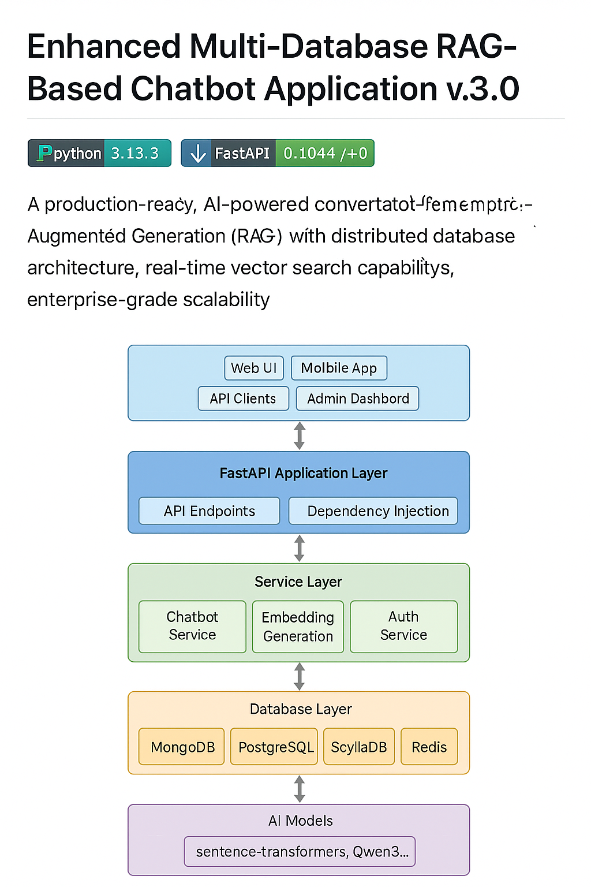

# MultiDB Chatbot — V1 Project Summary & Roadmap

> **Docs map:** Deep technical design in [Unified System Design (v3.0)](multidb_rag_chatbot_v3.0.md) and conceptual blueprint in [Composable AI Stack Whitepaper](Composable%20AI%20Stack%20Blueprint.pdf).  
> **Audience:** Hiring managers, reviewers, and new contributors.  
> **Version:** `v1.0` (proposed tag).

---

## What V1 Ships (Current State)

**Goal:** Deliver a production‑minded **RAG** chatbot that demonstrates a **two‑plane architecture** (Data vs. Serving) with a pragmatic multi‑database design.

**Core capabilities**
- **RAG pipeline**: ingest → chunk → embed → **MongoDB Atlas Vector Search** for semantic retrieval.
- **Serving Plane**: **FastAPI** entrypoint with a **LangGraph** agent (stateful reasoning loop, tool use, memory policy).
- **Data abstractions**: `KnowledgeService` (retrieval API) + `ChatbotService` (turn orchestration, rate/quotas, persistence).
- **Multi‑DB integration**
  - **MongoDB Atlas** → vector store (grounding context, metadata filters).
  - **PostgreSQL** → users/auth, subscriptions/billing, RBAC (feature‑flagged).
  - **ScyllaDB** → durable conversation timelines (append‑only with TTL).
  - **Redis** → session cache, rate limiting, ephemeral state.
- **Composability**
  - **Dagster** — *Data Plane*: asset‑centric ingestion + vector index materialization with lineage/caching.
  - **Ray Serve** — *Serving Plane*: low‑latency, horizontally scalable serving (actor model ready).
  - **Prefect** — *Control Plane (optional)*: blue/green orchestration, approvals, validation flows.
- **Operational basics**
  - Dockerized local dev (`docker-compose.yml`).
  - CI hooks (ruff + pytest) and an employer‑ready `README.md` + `docs/`.

**Non‑goals in V1 (deferred)**
- Full AWS deployment/IaC.
- Production blue/green via Prefect.
- Deeper evaluations (golden‑set dashboards) + safety guardrails.
- Emotion/affect modeling and long‑term personalization.

---

## Architecture Snapshot (Two‑Plane)

> Handoff: Data Plane materializes a versioned vector index; Serving Plane loads the latest validated asset. Control Plane coordinates blue/green rollouts when changes are non‑trivial.

- **Data Plane (Dagster)**  
  Document Loaders → Text Splitters (e.g., RecursiveCharacterTextSplitter) → Embeddings → MongoDB Atlas Vector index (versioned, observable; FreshnessPolicy/sensors available).

- **Serving Plane (Ray Serve + FastAPI + LangGraph)**  
  API receives a message → `ChatbotService` invokes the LangGraph agent → `KnowledgeService` retrieves context → response composed and returned; ScyllaDB records event; Redis caches hot paths.

- **Control Plane (Prefect, optional)**  
  Triggered post‑materialization for **blue/green**: deploy “blue” agent using the new index, run validation suite (golden Q/A), require approval, shift traffic, retire “green”.

---

## Key Trade‑offs in V1

- **MongoDB Atlas** is the vector source of truth (developer velocity, managed ops) while **PostgreSQL** is present for auth/billing but not yet the universal system‑of‑record.
- **Monorepo with modular folders** instead of fully split services—prioritizes clarity and fast iteration for portfolio review.
- **Local reliability > Cloud scale**: V1 optimizes for demonstrable architecture and code hygiene; cloud ops hardening follows.

---

## Roadmap / Future Direction — “Optimal Path” to the Emotional AI Companion

**Vision:** Evolve into an **Emotional AI Companion** that is empathetic, context‑aware, and safe—built on production‑grade foundations and cost controls.

### Phase 1.1–1.3 (Hardening & Platformization)
- **Strategic shift to PostgreSQL** as the **system‑of‑record (SOR)**  
  Consolidate users, auth, subscriptions/quotas, feature flags, and an **event store** in Postgres. Keep MongoDB Atlas (or pluggable vector DB) for embeddings; add an adapter for Milvus/pgvector/Redis‑Vector via a clean retrieval interface.
- **Terraform‑first infrastructure (AWS)**  
  VPC, private subnets, SGs; ECR; ECS/Fargate (or EKS) services for API, ingestion, Ray Serve; S3 for artifacts; CloudWatch/OTel for logs/metrics/traces; IAM least‑privilege; SSM/Secrets Manager.
- **Refined microservice architecture**  
  Split into deployable services:  
  `ingestion-svc` (Dagster), `retrieval-svc` (vector API/reranker), `chat-svc` (Ray Serve agent), `user-svc` (auth/billing on Postgres), `admin-svc` (configs/flags/datasets). Introduce an **event bus** (SNS/SQS or MSK/Kafka) for decoupled updates.
- **Release discipline**  
  Prefect‑driven blue/green; golden‑set validation; automated rollback. GitHub Releases with changelogs and versioned datasets/models.

### Phase 2.0 (Emotional AI Companion foundations)
- **Affect & memory**  
  Sentiment/affect detection on each turn; **long‑term user memory** (normalized in Postgres) + **episodic summaries** (ScyllaDB). Context composer blends task context (RAG) with relational memory (preferences, boundaries, goals).
- **Safety & quality**  
  Guardrails (PII scrubbing, jailbreak filters), response risk scoring, self‑check prompts. Evals: hallucination/consistency checks; human‑review queues.
- **Personalization & multi‑model strategy**  
  Optional tools (calendar/notes) with consent; A/B models (embedding & generation) with traffic splitting; batch/caching for cost/latency control.
- **UX channels**  
  HTTP streaming + WebSocket; mobile‑friendly API; future TTS for affective cues.

### Milestones (proposed)
- **v1.1**: Terraform + AWS baseline; Postgres SOR migration; S3 artifact store; CI/CD pipelines.  
- **v1.2**: Microservices split; event bus; Prefect blue/green; observability (OTel + Langfuse).  
- **v2.0**: Emotional AI Companion MVP—affect detection, long‑term memory, safety guardrails, A/B evals, and public demo.

---

## How to Contribute (TL;DR)

1. Branch: `feat/<slug>` or `fix/<slug>`  
2. Run: `ruff check . && pytest -q`  
3. Open PR with context/logs; CI must pass  
4. For data/model changes, include eval results or golden‑set diffs

---

## References

- [Unified System Design (v3.0)](multidb_rag_chatbot_v3.0.md)
