# Safety and Therapeutic Guards - Production Implementation

> **Comprehensive safety filters, crisis detection, and therapeutic guidelines integrated with confidence-based search optimization**

## Safety Architecture Overview

The safety system implements multiple layers of protection for therapeutic AI conversations, with particular focus on crisis intervention, PHI protection, and evidence-based therapeutic guidelines for senior care.

```mermaid
flowchart TD
    subgraph "Input Safety Layer"
        USER_INPUT[👴 User Message]
        PHI_SCAN[🔍 PHI Detection<br/>Pattern + ML Classification]
        CRISIS_SCAN[🚨 Crisis Detection<br/>Keyword + Sentiment + ML]
        BIAS_SCAN[⚖️ Bias Detection<br/>Harmful Content Filter]
    end
    
    subgraph "Processing Safety Layer"
        CONSENT_CHECK[✅ AI Processing Consent<br/>HIPAA Authorization]
        CONTEXT_FILTER[🎯 Context Filtering<br/>Age-Appropriate Content]
        THERAPEUTIC_GUIDE[🏥 Therapeutic Guidelines<br/>Evidence-Based Protocols]
        CULTURAL_ADAPT[🌍 Cultural Adaptation<br/>Culturally Sensitive AI]
    end
    
    subgraph "Output Safety Layer"
        RESPONSE_VALIDATE[🛡️ Response Validation<br/>Therapeutic Appropriateness]
        HARM_PREVENTION[⚠️ Harm Prevention<br/>Medical Advice Limits]
        EMPATHY_CHECK[💝 Empathy Validation<br/>Emotional Appropriateness]
        FINAL_PHI_SCAN[🔒 Final PHI Scan<br/>Output PHI Detection]
    end
    
    subgraph "Crisis Intervention"
        CRISIS_ESCALATE[🚨 Crisis Escalation<br/>Human Caregiver Alert]
        EMERGENCY_RESPONSE[🏥 Emergency Response<br/>911/Crisis Hotline]
        SAFETY_RESOURCES[📞 Safety Resources<br/>Immediate Support Info]
        THERAPEUTIC_CRISIS[💬 Crisis Conversation<br/>Suicide Prevention]
    end
    
    subgraph "Audit & Monitoring"
        SAFETY_AUDIT[📋 Safety Decision Audit<br/>All Safety Actions Logged]
        REAL_TIME_MONITOR[📊 Real-time Monitoring<br/>Safety Metrics Dashboard]
        ALERT_SYSTEM[🔔 Alert System<br/>Safety Team Notifications]
    end
    
    USER_INPUT --> PHI_SCAN
    USER_INPUT --> CRISIS_SCAN
    USER_INPUT --> BIAS_SCAN
    
    PHI_SCAN --> CONSENT_CHECK
    CRISIS_SCAN --> CONSENT_CHECK
    BIAS_SCAN --> CONTEXT_FILTER
    
    CONSENT_CHECK --> THERAPEUTIC_GUIDE
    CONTEXT_FILTER --> CULTURAL_ADAPT
    THERAPEUTIC_GUIDE --> RESPONSE_VALIDATE
    
    RESPONSE_VALIDATE --> HARM_PREVENTION
    HARM_PREVENTION --> EMPATHY_CHECK
    EMPATHY_CHECK --> FINAL_PHI_SCAN
    
    %% Crisis intervention flow
    CRISIS_SCAN -.->|Crisis Detected| CRISIS_ESCALATE
    CRISIS_ESCALATE --> EMERGENCY_RESPONSE
    CRISIS_ESCALATE --> SAFETY_RESOURCES
    CRISIS_ESCALATE --> THERAPEUTIC_CRISIS
    
    %% Audit all safety decisions
    PHI_SCAN --> SAFETY_AUDIT
    CRISIS_SCAN --> SAFETY_AUDIT
    RESPONSE_VALIDATE --> SAFETY_AUDIT
    SAFETY_AUDIT --> REAL_TIME_MONITOR
    REAL_TIME_MONITOR --> ALERT_SYSTEM
    
    style PHI_SCAN fill:#ffebee
    style CRISIS_SCAN fill:#ffebee
    style CRISIS_ESCALATE fill:#d32f2f,color:#fff
    style SAFETY_AUDIT fill:#fff3e0
    style THERAPEUTIC_GUIDE fill:#e8f5e8
```



## Crisis Detection and Intervention

### Current Implementation Architecture
**Primary Service**: Content Safety Microservice (Go) - Port 8007  
**Location**: `microservices/content-safety/`  
**Components**: `safety_analyzer.go`, `emotion_analyzer.go`, `phi_analyzer.go`  
**Performance**: <100ms response time, real-time pattern matching

**Supporting Services**:
- **AI Gateway**: `ai_services/main.py` - Safety integration and response filtering
- **Host Generation**: `host_services/generation_server.py` - Qwen2.5 safety-aware generation  
- **Advanced Ranking**: `ai_services/core/advanced_ranking_service.py` - Safety-weighted ranking
- **Therapeutic Cache**: `ai_services/core/therapeutic_cache_manager.py` - PHI-aware caching

### Actual Implementation (Go Microservice)

```go
// Implementation: microservices/content-safety/safety_analyzer.go
type SafetyAnalyzer struct {
    logger          *zap.Logger
    crisisPatterns  map[string][]*regexp.Regexp
    riskPatterns    map[RiskLevel][]*regexp.Regexp
    guidelines      map[string][]string
}

// Crisis detection patterns (actual implementation)
func (sa *SafetyAnalyzer) loadCrisisPatterns() {
    sa.crisisPatterns = map[string][]*regexp.Regexp{
        "suicidal_ideation": {
            regexp.MustCompile(`(?i)\b(?:want to|going to|plan to)\s+(?:kill|end|hurt)\s+myself\b`),
            regexp.MustCompile(`(?i)\b(?:suicide|suicidal|end my life|take my own life)\b`),
            regexp.MustCompile(`(?i)\b(?:no point|no reason)\s+(?:in\s+)?living\b`),
            regexp.MustCompile(`(?i)\bbetter off dead\b`),
            regexp.MustCompile(`(?i)\bwant to die\b`),
        },
        "self_harm": {
            regexp.MustCompile(`(?i)\b(?:cut|cutting|harm|hurt)\s+myself\b`),
            regexp.MustCompile(`(?i)\bself[\s-]harm`),
            regexp.MustCompile(`(?i)\b(?:razors?|blades?|knives?)\s+(?:to|for)\s+(?:cut|harm)`),
        },
        "violence": {
            regexp.MustCompile(`(?i)\b(?:want to|going to)\s+(?:kill|hurt|harm)\s+(?:someone|others?)\b`),
            regexp.MustCompile(`(?i)\b(?:violent|dangerous)\s+thoughts?\b`),
        },
    }
}
```

### Emotion Analysis (Go Implementation)

```go
// Implementation: microservices/content-safety/emotion_analyzer.go
type EmotionAnalyzer struct {
    logger           *zap.Logger
    emotionPatterns  map[EmotionLabel][]*regexp.Regexp
    valenceMappings  map[EmotionLabel]float64  // Emotional valence
    arousalMappings  map[EmotionLabel]float64  // Emotional intensity
    supportTemplates map[string][]SupportRecommendation
}

// Emotion patterns for therapeutic contexts (actual implementation)
func (ea *EmotionAnalyzer) loadEmotionPatterns() {
    ea.emotionPatterns = map[EmotionLabel][]*regexp.Regexp{
        EmotionSad: {
            regexp.MustCompile(`(?i)\b(?:sad|sadness|down|depressed|blue|melancholy)\b`),
            regexp.MustCompile(`(?i)\bfeeling\s+(?:down|low|terrible|awful|horrible)\b`),
            regexp.MustCompile(`(?i)\b(?:crying|tears|weeping)\b`),
        },
        EmotionLonely: {
            regexp.MustCompile(`(?i)\b(?:lonely|loneliness|isolated|alone)\b`),
            regexp.MustCompile(`(?i)\bfeeling\s+(?:lonely|isolated|disconnected)\b`),
            regexp.MustCompile(`(?i)\b(?:nobody|no one)\s+(?:cares|visits|calls)\b`),
        },
        EmotionAnxious: {
            regexp.MustCompile(`(?i)\b(?:anxious|anxiety|worried|nervous|stressed)\b`),
            regexp.MustCompile(`(?i)\bfeeling\s+(?:anxious|worried|nervous|on edge)\b`),
            regexp.MustCompile(`(?i)\b(?:panic|panicking|overwhelmed)\b`),
        },
    }
}
```

### Real-Time Crisis Detection

```python
class CrisisDetectionSystem:
    """Multi-modal crisis detection for elderly therapeutic conversations"""
    
    def __init__(self):
        # Crisis indicator keywords with severity weights
        self.crisis_indicators = {
            "immediate_danger": {
                "keywords": ["kill myself", "suicide", "end my life", "want to die", "can't go on"],
                "weight": 1.0,
                "intervention_level": "emergency_services"
            },
            "self_harm": {
                "keywords": ["hurt myself", "cut myself", "self-harm", "overdose", "pills"],
                "weight": 0.8,
                "intervention_level": "immediate_caregiver"
            },
            "severe_depression": {
                "keywords": ["hopeless", "worthless", "burden", "better off dead", "no point"],
                "weight": 0.6,
                "intervention_level": "clinical_assessment"
            },
            "isolation_despair": {
                "keywords": ["all alone", "nobody cares", "forgotten", "abandoned"],
                "weight": 0.4,
                "intervention_level": "therapeutic_support"
            }
        }
        
        # Senior-specific crisis indicators
        self.senior_specific_indicators = {
            "medical_despair": ["tired of doctors", "too many pills", "medical bills", "can't afford"],
            "family_abandonment": ["kids never visit", "family forgot me", "nursing home"],
            "physical_decline": ["can't do anything", "body failing", "too weak", "in pain"],
            "cognitive_concerns": ["losing my mind", "can't remember", "confused", "dementia"]
        }
        
        # Load pre-trained crisis detection models
        self.sentiment_analyzer = pipeline("sentiment-analysis", model="cardiffnlp/twitter-roberta-base-sentiment-latest")
        self.emotion_classifier = pipeline("text-classification", model="j-hartmann/emotion-english-distilroberta-base")
        self.crisis_classifier = self.load_crisis_detection_model()
    
    async def analyze_crisis_risk(
        self,
        message: str,
        user_context: dict,
        conversation_history: List[dict]
    ) -> CrisisAnalysis:
        """Comprehensive crisis risk analysis"""
        
        # 1. Keyword-based detection
        keyword_analysis = self.analyze_crisis_keywords(message)
        
        # 2. ML-based sentiment analysis
        sentiment_result = self.sentiment_analyzer(message)[0]
        
        # 3. Emotion classification
        emotion_result = self.emotion_classifier(message)[0]
        
        # 4. Contextual risk assessment
        contextual_risk = await self.assess_contextual_crisis_risk(
            message=message,
            user_profile=user_context.get("user_profile", {}),
            conversation_history=conversation_history
        )
        
        # 5. Senior-specific risk factors
        senior_risk_factors = self.assess_senior_specific_risks(message, user_context)
        
        # 6. Aggregate risk calculation
        risk_score = self.calculate_aggregate_crisis_score(
            keyword_score=keyword_analysis["max_severity"],
            sentiment_negativity=(1.0 - sentiment_result["score"]) if sentiment_result["label"] == "NEGATIVE" else 0.1,
            emotion_distress=self.map_emotion_to_distress(emotion_result),
            contextual_risk=contextual_risk,
            senior_risk_factors=senior_risk_factors
        )
        
        # 7. Determine intervention level
        intervention_level = self.determine_intervention_level(risk_score, keyword_analysis)
        
        crisis_analysis = CrisisAnalysis(
            crisis_detected=risk_score >= 0.3,  # Low threshold for elderly care
            risk_score=risk_score,
            intervention_level=intervention_level,
            
            # Detailed analysis
            keyword_analysis=keyword_analysis,
            sentiment_analysis=sentiment_result,
            emotion_analysis=emotion_result,
            contextual_factors=contextual_risk,
            senior_specific_factors=senior_risk_factors,
            
            # Immediate actions required
            immediate_escalation=risk_score >= 0.8,
            caregiver_notification=risk_score >= 0.5,
            therapeutic_intervention=risk_score >= 0.3,
            
            # Recommended responses
            recommended_response_type=self.get_recommended_response_type(risk_score),
            crisis_resources=await self.get_appropriate_crisis_resources(user_context),
            follow_up_required=risk_score >= 0.4
        )
        
        # Trigger immediate intervention if needed
        if crisis_analysis.immediate_escalation:
            await self.trigger_immediate_crisis_intervention(crisis_analysis, user_context)
        
        return crisis_analysis
    
    async def trigger_immediate_crisis_intervention(
        self,
        crisis_analysis: CrisisAnalysis,
        user_context: dict
    ):
        """Trigger multi-channel crisis intervention"""
        
        intervention_id = str(uuid4())
        
        # 1. Immediate audit logging
        await self.audit_service.log_crisis_detection(
            intervention_id=intervention_id,
            user_id=user_context["user_id"],
            crisis_analysis=crisis_analysis,
            timestamp=datetime.utcnow()
        )
        
        # 2. Alert care coordination team
        care_alert = CareTeamAlert(
            alert_type="CRISIS_DETECTED",
            patient_id=user_context["user_id"],
            crisis_severity=crisis_analysis.risk_score,
            detected_indicators=crisis_analysis.keyword_analysis["detected_keywords"],
            intervention_id=intervention_id,
            priority="IMMEDIATE"
        )
        
        await self.care_coordination_service.send_crisis_alert(care_alert)
        
        # 3. Contact emergency services for high-risk situations
        if crisis_analysis.risk_score >= 0.9:
            emergency_contact = EmergencyContact(
                patient_id=user_context["user_id"],
                crisis_type="suicide_risk",
                automated_detection=True,
                human_verification_pending=True,
                contact_priority="HIGHEST"
            )
            
            await self.emergency_service.initiate_emergency_contact(emergency_contact)
        
        # 4. Provide immediate crisis resources
        crisis_resources = await self.generate_immediate_crisis_resources(
            user_context=user_context,
            crisis_type=crisis_analysis.recommended_response_type
        )
        
        return CrisisInterventionResult(
            intervention_id=intervention_id,
            crisis_resources=crisis_resources,
            care_team_notified=True,
            emergency_services_contacted=crisis_analysis.risk_score >= 0.9,
            therapeutic_response=await self.generate_crisis_therapeutic_response(crisis_analysis)
        )
```

### Therapeutic Guidelines Implementation

```python
class TherapeuticGuidelinesEngine:
    """Evidence-based therapeutic guidelines for AI conversations"""
    
    def __init__(self):
        # Load evidence-based therapeutic approaches
        self.therapeutic_approaches = {
            "cognitive_behavioral": CBTTechniques(),
            "person_centered": PersonCenteredTherapy(),
            "motivational_interviewing": MotivationalInterviewing(),
            "acceptance_commitment": ACTTechniques(),
            "mindfulness_based": MindfulnessApproaches()
        }
        
        # Senior-specific therapeutic considerations
        self.senior_care_guidelines = {
            "communication_style": "clear, patient, respectful",
            "processing_time": "allow extra time for responses",
            "memory_support": "gentle reminders and repetition okay",
            "dignity_preservation": "maintain independence and autonomy",
            "family_involvement": "consider family dynamics sensitively"
        }
    
    async def validate_therapeutic_appropriateness(
        self,
        user_message: str,
        ai_response: str,
        user_context: dict
    ) -> TherapeuticValidation:
        """Validate AI response against therapeutic guidelines"""
        
        # 1. Check adherence to therapeutic principles
        therapeutic_principles = await self.check_therapeutic_principles(
            response=ai_response,
            principles=["empathy", "active_listening", "non_judgment", "hope_instillation"]
        )
        
        # 2. Validate appropriate boundaries
        boundary_check = await self.validate_therapeutic_boundaries(
            user_message=user_message,
            ai_response=ai_response,
            user_context=user_context
        )
        
        # 3. Assess senior-specific appropriateness
        senior_appropriateness = await self.assess_senior_care_appropriateness(
            response=ai_response,
            user_age=user_context.get("age"),
            cognitive_status=user_context.get("cognitive_status")
        )
        
        # 4. Check for contraindicated responses
        contraindication_check = await self.check_therapeutic_contraindications(
            response=ai_response,
            user_mental_health_history=user_context.get("mental_health_history", {})
        )
        
        # 5. Validate cultural sensitivity
        cultural_sensitivity = await self.validate_cultural_sensitivity(
            response=ai_response,
            user_cultural_background=user_context.get("cultural_background")
        )
        
        return TherapeuticValidation(
            therapeutically_appropriate=all([
                therapeutic_principles.compliant,
                boundary_check.appropriate,
                senior_appropriateness.appropriate,
                contraindication_check.safe,
                cultural_sensitivity.appropriate
            ]),
            
            validation_details={
                "therapeutic_principles": therapeutic_principles,
                "boundary_adherence": boundary_check,
                "senior_appropriateness": senior_appropriateness,
                "contraindication_safety": contraindication_check,
                "cultural_sensitivity": cultural_sensitivity
            },
            
            therapeutic_quality_score=self.calculate_therapeutic_quality_score([
                therapeutic_principles, boundary_check, senior_appropriateness,
                contraindication_check, cultural_sensitivity
            ]),
            
            improvement_recommendations=await self.generate_therapeutic_improvements([
                therapeutic_principles, boundary_check, senior_appropriateness
            ])
        )
    
    async def check_therapeutic_principles(
        self,
        response: str,
        principles: List[str]
    ) -> PrincipleValidation:
        """Check adherence to core therapeutic principles"""
        
        principle_scores = {}
        
        # Empathy detection
        if "empathy" in principles:
            empathy_score = await self.empathy_analyzer.analyze_empathy(response)
            principle_scores["empathy"] = empathy_score
        
        # Active listening indicators
        if "active_listening" in principles:
            listening_indicators = self.detect_active_listening(response)
            principle_scores["active_listening"] = listening_indicators
        
        # Non-judgmental language
        if "non_judgment" in principles:
            judgment_score = await self.assess_judgmental_language(response)
            principle_scores["non_judgment"] = 1.0 - judgment_score  # Invert judgment score
        
        # Hope and encouragement
        if "hope_instillation" in principles:
            hope_score = await self.assess_hope_and_encouragement(response)
            principle_scores["hope_instillation"] = hope_score
        
        return PrincipleValidation(
            compliant=all(score >= 0.6 for score in principle_scores.values()),
            principle_scores=principle_scores,
            overall_score=sum(principle_scores.values()) / len(principle_scores),
            areas_for_improvement=[
                principle for principle, score in principle_scores.items() 
                if score < 0.6
            ]
        )
```

## Crisis Intervention Protocols

### Suicide Risk Assessment

```python
class SuicideRiskAssessment:
    """Comprehensive suicide risk assessment for elderly patients"""
    
    def __init__(self):
        # Evidence-based suicide risk factors for elderly
        self.elderly_risk_factors = {
            "demographic": {
                "male_gender": 0.3,
                "age_85_plus": 0.2,
                "widowed_recently": 0.4,
                "social_isolation": 0.3
            },
            "clinical": {
                "depression_history": 0.5,
                "chronic_pain": 0.3,
                "terminal_illness": 0.6,
                "cognitive_decline": 0.4,
                "medication_burden": 0.2
            },
            "psychosocial": {
                "loss_of_independence": 0.4,
                "financial_stress": 0.3,
                "family_conflict": 0.3,
                "recent_major_loss": 0.5
            }
        }
        
        # Protective factors
        self.protective_factors = {
            "strong_family_support": -0.3,
            "religious_involvement": -0.2,
            "active_social_life": -0.3,
            "sense_of_purpose": -0.4,
            "good_physical_health": -0.2
        }
    
    async def assess_suicide_risk(
        self,
        user_message: str,
        user_context: dict,
        conversation_history: List[dict]
    ) -> SuicideRiskAssessment:
        """Comprehensive suicide risk assessment"""
        
        # 1. Direct suicide ideation detection
        direct_ideation = self.detect_direct_suicide_ideation(user_message)
        
        # 2. Indirect indicators analysis
        indirect_indicators = self.analyze_indirect_suicide_indicators(
            message=user_message,
            conversation_history=conversation_history
        )
        
        # 3. Risk factor analysis
        risk_factor_score = self.calculate_risk_factor_score(
            user_context=user_context,
            risk_factors=self.elderly_risk_factors
        )
        
        # 4. Protective factor analysis
        protective_factor_score = self.calculate_protective_factor_score(
            user_context=user_context,
            protective_factors=self.protective_factors
        )
        
        # 5. Historical pattern analysis
        historical_risk = await self.analyze_historical_risk_patterns(
            user_id=user_context["user_id"],
            conversation_history=conversation_history
        )
        
        # 6. Aggregate risk calculation
        aggregate_risk_score = (
            direct_ideation * 0.40 +
            indirect_indicators * 0.25 +
            risk_factor_score * 0.20 +
            max(0, -protective_factor_score) * 0.10 +  # Protective factors reduce risk
            historical_risk * 0.05
        )
        
        # 7. Clinical risk level determination
        risk_level = self.determine_clinical_risk_level(aggregate_risk_score)
        
        assessment = SuicideRiskAssessment(
            risk_score=aggregate_risk_score,
            risk_level=risk_level,
            immediate_danger=aggregate_risk_score >= 0.8,
            
            # Risk breakdown
            direct_ideation_detected=direct_ideation > 0.5,
            indirect_indicators=indirect_indicators,
            risk_factors_present=risk_factor_score > 0.3,
            protective_factors_present=protective_factor_score < -0.2,
            
            # Intervention recommendations
            recommended_intervention=self.get_intervention_recommendation(risk_level),
            emergency_contact_required=aggregate_risk_score >= 0.8,
            caregiver_notification=aggregate_risk_score >= 0.5,
            
            # Follow-up requirements
            follow_up_timeline=self.determine_follow_up_timeline(risk_level),
            clinical_assessment_needed=aggregate_risk_score >= 0.6
        )
        
        # Immediate crisis response if high risk
        if assessment.immediate_danger:
            await self.initiate_suicide_prevention_protocol(assessment, user_context)
        
        return assessment
    
    async def initiate_suicide_prevention_protocol(
        self,
        risk_assessment: SuicideRiskAssessment,
        user_context: dict
    ):
        """Initiate comprehensive suicide prevention response"""
        
        protocol_id = str(uuid4())
        
        # 1. Immediate safety planning
        safety_plan = await self.generate_immediate_safety_plan(
            user_context=user_context,
            risk_factors=risk_assessment.risk_factors_present
        )
        
        # 2. Crisis resource provision
        crisis_resources = CrisisResources(
            national_suicide_hotline="988",
            crisis_text_line="Text HOME to 741741",
            local_emergency="911",
            facility_crisis_team=user_context.get("facility_crisis_contact"),
            
            # Senior-specific resources
            senior_helpline="1-800-971-0016",
            eldercare_locator="1-800-677-1116",
            medicare_helpline="1-800-MEDICARE"
        )
        
        # 3. Immediate caregiver notification
        await self.notify_immediate_caregivers(
            patient_id=user_context["user_id"],
            risk_assessment=risk_assessment,
            protocol_id=protocol_id
        )
        
        # 4. Emergency services contact (if warranted)
        if risk_assessment.risk_score >= 0.9:
            await self.contact_emergency_services(
                patient_info=user_context,
                risk_assessment=risk_assessment,
                protocol_id=protocol_id
            )
        
        # 5. Enhanced audit logging
        await self.audit_service.log_suicide_prevention_protocol(
            protocol_id=protocol_id,
            patient_id=user_context["user_id"],
            risk_assessment=risk_assessment,
            interventions_triggered=["safety_plan", "crisis_resources", "caregiver_notification"],
            emergency_services_contacted=risk_assessment.risk_score >= 0.9
        )
```

### Crisis Response Templates

```python
class CrisisResponseTemplates:
    """Therapeutic response templates for crisis situations"""
    
    def __init__(self):
        self.crisis_response_templates = {
            "suicide_ideation": """
I'm very concerned about what you've shared with me, and I want you to know that your life has value and meaning. You're not alone in feeling this way, and there are people who want to help you through this difficult time.

**Immediate Safety:**
- Are you safe right now? 
- Do you have thoughts of hurting yourself today?
- Is there someone who can stay with you?

**Crisis Resources Available 24/7:**
- National Suicide Prevention Lifeline: **988**
- Crisis Text Line: Text **HOME** to **741741**
- Or call emergency services: **911**

**Your Care Team:**
I've notified your care team about our conversation. Someone will be reaching out to you very soon to provide additional support.

**Remember:**
- This pain is temporary, even though it feels overwhelming
- Professional help can make a real difference
- You have people who care about you
- Taking the step to reach out shows your strength

Would you like me to stay with you while you call one of these numbers? I'm here to support you.
""",
            
            "severe_depression": """
I can hear the deep pain in your words, and I want you to know that what you're experiencing is real and valid. Depression can make everything feel hopeless, but there are ways to find relief and meaning again.

**Immediate Support:**
- You're not alone in feeling this way
- Depression is treatable, even in later life
- Small steps can lead to meaningful change

**Gentle Actions You Can Take:**
- Reach out to one trusted person today
- Consider speaking with your doctor about how you're feeling
- Try one small activity that used to bring you comfort

**Professional Support:**
- Your care team has been notified to provide additional support
- Mental health counseling can be very helpful for seniors
- Depression is common but treatable at any age

**Crisis Resources if Feelings Worsen:**
- National Suicide Prevention Lifeline: **988**
- Crisis Text Line: Text **HOME** to **741741**

How are you feeling right now? What feels most overwhelming? I'm here to listen and support you through this.
""",
            
            "medical_emergency": """
I'm concerned about the symptoms you've described. These could indicate a medical situation that needs immediate professional attention.

**Immediate Action Recommended:**
- If you're experiencing chest pain, difficulty breathing, severe pain, or other serious symptoms: **Call 911 immediately**
- For urgent but non-emergency symptoms: Contact your doctor or nurse hotline right away
- If you're unsure: When in doubt, seek medical care

**I Cannot:**
- Diagnose medical conditions
- Recommend specific treatments
- Replace professional medical evaluation

**Your Safety:**
- Emergency services have been notified based on your symptoms
- Your care team is being contacted
- Someone will follow up with you soon

**While Waiting for Help:**
- Stay calm and in a safe location
- Have someone stay with you if possible
- Gather your medications and medical information
- Don't drive yourself to the hospital

Is someone available to stay with you or drive you to get medical care? Your health and safety are the most important things right now.
"""
        }
    
    def get_crisis_response(
        self,
        crisis_type: str,
        user_context: dict,
        personalization_data: dict
    ) -> str:
        """Get personalized crisis response"""
        
        base_template = self.crisis_response_templates.get(
            crisis_type, 
            self.crisis_response_templates["severe_depression"]
        )
        
        # Personalize template
        personalized_response = self.personalize_crisis_response(
            template=base_template,
            user_name=user_context.get("preferred_name", "Friend"),
            cultural_context=user_context.get("cultural_background"),
            family_contacts=user_context.get("emergency_contacts", [])
        )
        
        return personalized_response
```

## Content Safety Implementation

### PHI Detection Engine

```python
class PHIDetectionEngine:
    """Advanced PHI detection for healthcare conversations"""
    
    def __init__(self):
        # HIPAA-defined PHI patterns
        self.phi_patterns = {
            "names": r'\b[A-Z][a-z]+ [A-Z][a-z]+\b',  # First Last names
            "ssn": r'\b\d{3}-\d{2}-\d{4}\b',
            "phone": r'\b\d{3}-\d{3}-\d{4}\b',
            "email": r'\b[A-Za-z0-9._%+-]+@[A-Za-z0-9.-]+\.[A-Z|a-z]{2,}\b',
            "date_of_birth": r'\b\d{1,2}/\d{1,2}/\d{4}\b',
            "medical_record": r'\b(MRN|Medical Record|Chart #):?\s*\d+\b',
            "account_number": r'\b(Account|Acct)#?:?\s*\d+\b',
            "device_identifiers": r'\b[A-Z0-9]{8,}\b',  # Medical device IDs
            "ip_addresses": r'\b(?:\d{1,3}\.){3}\d{1,3}\b',
            "urls": r'https?://[^\s]+',
            "biometric": r'\b(fingerprint|retina|voice print)\b'
        }
        
        # Medical-specific PHI patterns
        self.medical_phi_patterns = {
            "prescription_numbers": r'\bRx#?\s*\d+\b',
            "insurance_ids": r'\b(Policy|Member ID):?\s*\w+\b',
            "provider_npi": r'\bNPI:?\s*\d{10}\b',
            "facility_ids": r'\bFacility ID:?\s*\w+\b'
        }
        
        # Load ML-based PHI detection model
        self.phi_classifier = pipeline(
            "token-classification",
            model="StanfordAIMI/stanford-deidentifier-base",
            aggregation_strategy="simple"
        )
    
    async def comprehensive_phi_scan(
        self,
        text: str,
        context: str = "conversation"
    ) -> PHIAnalysis:
        """Comprehensive PHI detection using multiple methods"""
        
        # 1. Pattern-based detection
        pattern_detections = {}
        for phi_type, pattern in {**self.phi_patterns, **self.medical_phi_patterns}.items():
            matches = re.findall(pattern, text, re.IGNORECASE)
            if matches:
                pattern_detections[phi_type] = matches
        
        # 2. ML-based named entity recognition
        ml_detections = self.phi_classifier(text)
        
        # 3. Context-aware medical term detection
        medical_context_phi = await self.detect_contextual_medical_phi(text, context)
        
        # 4. Aggregate PHI analysis
        phi_detected = bool(pattern_detections or ml_detections or medical_context_phi)
        
        # 5. Generate masked version
        masked_text = text
        all_detections = {**pattern_detections, **medical_context_phi}
        
        for phi_type, detections in all_detections.items():
            for detection in detections:
                masked_text = self.mask_phi_appropriately(masked_text, detection, phi_type)
        
        # 6. Risk assessment
        phi_risk_level = self.assess_phi_exposure_risk(all_detections, context)
        
        return PHIAnalysis(
            phi_detected=phi_detected,
            original_text=text,
            masked_text=masked_text,
            
            # Detection details
            pattern_detections=pattern_detections,
            ml_detections=ml_detections,
            medical_context_detections=medical_context_phi,
            
            # Risk assessment
            risk_level=phi_risk_level,
            immediate_masking_required=phi_risk_level >= 0.7,
            audit_logging_required=True,
            
            # Compliance actions
            patient_notification_required=phi_risk_level >= 0.5,
            privacy_officer_notification=phi_risk_level >= 0.8
        )
    
    def mask_phi_appropriately(self, text: str, phi_value: str, phi_type: str) -> str:
        """Mask PHI with contextually appropriate replacements"""
        
        masking_strategies = {
            "names": lambda x: "[PATIENT NAME]",
            "ssn": lambda x: "***-**-****",
            "phone": lambda x: "***-***-****", 
            "email": lambda x: "***@***.***",
            "date_of_birth": lambda x: "**/**/****",
            "medical_record": lambda x: "MRN: ******",
            "account_number": lambda x: "Account: ******",
            "prescription_numbers": lambda x: "Rx#: ******",
            "insurance_ids": lambda x: "Insurance ID: ******"
        }
        
        masking_function = masking_strategies.get(phi_type, lambda x: "***REDACTED***")
        return text.replace(phi_value, masking_function(phi_value))
```

## Therapeutic Quality Assurance

### Empathy and Emotional Intelligence

```python
class TherapeuticEmpathyEngine:
    """Ensure AI responses demonstrate appropriate empathy for seniors"""
    
    def __init__(self):
        self.empathy_indicators = {
            "emotional_validation": [
                "I hear that you're feeling",
                "It sounds like",
                "That must be",
                "I can understand why you'd feel"
            ],
            "active_listening": [
                "Tell me more about",
                "What was that like for you?",
                "How did that make you feel?",
                "I'd like to understand better"
            ],
            "support_offering": [
                "I'm here with you",
                "You don't have to go through this alone",
                "Let's work through this together",
                "I care about what happens to you"
            ],
            "hope_instillation": [
                "There are ways to help with this",
                "Things can get better",
                "You have strength",
                "There are people who care"
            ]
        }
        
        self.senior_specific_empathy = {
            "dignity_preservation": [
                "You have so much wisdom and experience",
                "Your perspective is valuable",
                "You've been through a lot in your life"
            ],
            "loss_acknowledgment": [
                "Loss is one of the hardest parts of life",
                "Grief doesn't have a timeline",
                "It's natural to feel this way after loss"
            ],
            "independence_support": [
                "You know yourself best",
                "Your choices matter",
                "Let's find ways to help you maintain your independence"
            ]
        }
    
    async def enhance_response_empathy(
        self,
        original_response: str,
        user_emotional_state: str,
        user_context: dict
    ) -> EmpathyEnhancedResponse:
        """Enhance AI response with appropriate empathy"""
        
        # 1. Analyze current empathy level
        current_empathy_score = await self.analyze_response_empathy(original_response)
        
        # 2. Identify enhancement opportunities
        enhancement_opportunities = await self.identify_empathy_gaps(
            response=original_response,
            emotional_state=user_emotional_state,
            user_age=user_context.get("age")
        )
        
        # 3. Apply empathy enhancements
        enhanced_response = original_response
        
        if current_empathy_score < 3.5:  # Below acceptable empathy threshold
            enhanced_response = await self.apply_empathy_enhancements(
                response=original_response,
                opportunities=enhancement_opportunities,
                user_context=user_context
            )
        
        # 4. Validate enhanced response
        final_empathy_score = await self.analyze_response_empathy(enhanced_response)
        
        return EmpathyEnhancedResponse(
            original_response=original_response,
            enhanced_response=enhanced_response,
            empathy_improvement=final_empathy_score - current_empathy_score,
            final_empathy_score=final_empathy_score,
            
            # Enhancement details
            enhancements_applied=enhancement_opportunities,
            senior_appropriate=await self.validate_senior_appropriateness(enhanced_response),
            cultural_sensitivity=await self.validate_cultural_appropriateness(
                enhanced_response, user_context.get("cultural_background")
            )
        )
```

## Safety Performance Monitoring

### Real-Time Safety Metrics

```python
class SafetyMetricsMonitor:
    """Monitor safety system performance in real-time"""
    
    async def calculate_safety_metrics(self, time_window_minutes: int = 60) -> SafetyMetrics:
        """Calculate comprehensive safety metrics"""
        
        start_time = datetime.utcnow() - timedelta(minutes=time_window_minutes)
        
        # Query recent safety events
        safety_events = await self.get_safety_events(start_time)
        
        # Crisis detection metrics
        crisis_metrics = self.calculate_crisis_detection_metrics(safety_events)
        
        # PHI protection metrics
        phi_protection_metrics = self.calculate_phi_protection_metrics(safety_events)
        
        # Therapeutic quality metrics
        therapeutic_metrics = self.calculate_therapeutic_quality_metrics(safety_events)
        
        # Overall safety score
        overall_safety_score = (
            crisis_metrics.effectiveness_score * 0.40 +
            phi_protection_metrics.protection_score * 0.30 +
            therapeutic_metrics.quality_score * 0.30
        )
        
        return SafetyMetrics(
            time_window_minutes=time_window_minutes,
            total_conversations=len(safety_events),
            overall_safety_score=overall_safety_score,
            
            # Detailed metrics
            crisis_detection=crisis_metrics,
            phi_protection=phi_protection_metrics,
            therapeutic_quality=therapeutic_metrics,
            
            # Performance indicators
            average_safety_check_time_ms=self.calculate_average_safety_time(safety_events),
            safety_system_availability=await self.calculate_safety_uptime(),
            
            # Compliance indicators
            hipaa_compliance_score=self.calculate_hipaa_compliance_score(safety_events),
            audit_completeness=self.calculate_audit_completeness(safety_events)
        )
    
    def calculate_crisis_detection_metrics(self, safety_events: List[dict]) -> CrisisDetectionMetrics:
        """Calculate crisis detection effectiveness metrics"""
        
        crisis_events = [e for e in safety_events if e.get("crisis_analysis")]
        
        if not crisis_events:
            return CrisisDetectionMetrics(
                crisis_conversations=0,
                detection_accuracy=1.0,  # No false positives
                false_positive_rate=0.0,
                intervention_effectiveness=1.0,
                average_response_time_seconds=0
            )
        
        # Analysis of crisis detection performance
        true_positives = len([e for e in crisis_events if e["crisis_analysis"]["verified_crisis"]])
        false_positives = len(crisis_events) - true_positives
        
        # Response time analysis
        response_times = [
            e["crisis_analysis"]["intervention_time_seconds"]
            for e in crisis_events
            if e["crisis_analysis"].get("intervention_time_seconds")
        ]
        
        return CrisisDetectionMetrics(
            crisis_conversations=len(crisis_events),
            detection_accuracy=true_positives / len(crisis_events) if crisis_events else 1.0,
            false_positive_rate=false_positives / len(crisis_events) if crisis_events else 0.0,
            intervention_effectiveness=self.calculate_intervention_effectiveness(crisis_events),
            average_response_time_seconds=sum(response_times) / len(response_times) if response_times else 0,
            
            # Crisis type breakdown
            crisis_type_distribution=self.analyze_crisis_type_distribution(crisis_events),
            intervention_success_rate=self.calculate_intervention_success_rate(crisis_events)
        )
```

## Safety Testing Framework

### Automated Safety Testing

```python
class SafetyTestSuite:
    """Comprehensive automated safety testing"""
    
    async def run_comprehensive_safety_tests(self) -> SafetyTestReport:
        """Run all safety tests and generate report"""
        
        test_results = {}
        
        # 1. Crisis detection accuracy tests
        test_results["crisis_detection"] = await self.test_crisis_detection_accuracy()
        
        # 2. PHI protection tests
        test_results["phi_protection"] = await self.test_phi_protection_effectiveness()
        
        # 3. Therapeutic appropriateness tests
        test_results["therapeutic_quality"] = await self.test_therapeutic_appropriateness()
        
        # 4. Bias and fairness tests
        test_results["bias_fairness"] = await self.test_bias_and_fairness()
        
        # 5. Senior-specific safety tests
        test_results["senior_safety"] = await self.test_senior_specific_safety()
        
        # 6. Cultural sensitivity tests
        test_results["cultural_sensitivity"] = await self.test_cultural_sensitivity()
        
        # Calculate overall safety score
        overall_score = sum(result.score for result in test_results.values()) / len(test_results)
        
        return SafetyTestReport(
            test_date=datetime.utcnow(),
            overall_safety_score=overall_score,
            production_ready=overall_score >= 4.5,
            test_results=test_results,
            
            # Critical issues
            critical_issues=[
                result.critical_issues for result in test_results.values()
                if result.critical_issues
            ],
            
            # Recommendations
            safety_recommendations=await self.generate_safety_recommendations(test_results)
        )
    
    async def test_crisis_detection_accuracy(self) -> TestResult:
        """Test crisis detection with known crisis scenarios"""
        
        # Load crisis test scenarios
        crisis_test_cases = await self.load_crisis_test_scenarios()
        
        results = []
        for test_case in crisis_test_cases:
            # Run crisis detection
            crisis_analysis = await self.crisis_detection_system.analyze_crisis_risk(
                message=test_case["input_message"],
                user_context=test_case["user_context"],
                conversation_history=test_case["conversation_history"]
            )
            
            # Evaluate against expected result
            expected_crisis = test_case["expected_crisis_detected"]
            detected_crisis = crisis_analysis.crisis_detected
            
            results.append(TestCaseResult(
                test_case_id=test_case["id"],
                input_message=test_case["input_message"],
                expected_result=expected_crisis,
                actual_result=detected_crisis,
                correct_detection=expected_crisis == detected_crisis,
                risk_score=crisis_analysis.risk_score,
                intervention_triggered=crisis_analysis.immediate_escalation
            ))
        
        # Calculate accuracy metrics
        correct_detections = sum(1 for r in results if r.correct_detection)
        accuracy = correct_detections / len(results)
        
        # Analyze false positives and false negatives
        false_positives = [r for r in results if not r.expected_result and r.actual_result]
        false_negatives = [r for r in results if r.expected_result and not r.actual_result]
        
        return TestResult(
            test_name="crisis_detection_accuracy",
            score=accuracy * 5.0,  # Convert to 5-point scale
            accuracy=accuracy,
            total_test_cases=len(results),
            correct_detections=correct_detections,
            false_positive_rate=len(false_positives) / len(results),
            false_negative_rate=len(false_negatives) / len(results),
            
            # Critical issues (false negatives are critical for safety)
            critical_issues=[
                f"False negative for test case {r.test_case_id}: {r.input_message[:50]}..."
                for r in false_negatives
            ],
            
            test_details=results
        )
```

---

## Integration with Search Optimization

### Safety-Aware Confidence Evaluation

The confidence-based cascading search includes safety considerations:

```python
# Integration in ConfidenceEvaluator
class ConfidenceEvaluator:
    def evaluate_text_results(self, query: str, results: List[Dict]) -> ConfidenceScore:
        # 1. Standard confidence evaluation
        base_confidence = self._compute_base_confidence(query, results)
        
        # 2. Safety consideration adjustments
        safety_adjustment = self._evaluate_safety_implications(query, results)
        
        # 3. Crisis detection influence on search strategy
        crisis_indicators = self._detect_potential_crisis_language(query)
        if crisis_indicators:
            # Force hybrid/vector search for crisis-adjacent language
            base_confidence = min(base_confidence, 0.7)  # Ensure semantic search
        
        return ConfidenceScore(
            overall=base_confidence * safety_adjustment,
            # ... other metrics
        )
```

### Safety-Enhanced Search Strategy


## Search Optimization Safety Integration

### Safety-Aware Confidence Evaluation

The confidence-based search optimization integrates safety considerations directly into search strategy selection:

```python
# Integration in ConfidenceEvaluator with safety context
def should_cascade_to_vector_with_safety(self, confidence: ConfidenceScore, 
                                       safety_context: SafetyContext) -> str:
    """Enhanced strategy selection with safety considerations"""
    
    # Crisis situations always use comprehensive vector search
    if safety_context.crisis_detected:
        logger.warning("🚨 Crisis detected - using comprehensive vector search")
        return "vector_only"  # Ensure best possible therapeutic resources
    
    # PHI-related queries use careful text search  
    if safety_context.phi_detected:
        logger.info("🔒 PHI detected - using text search with extra validation")
        return "text_only"    # Avoid vector embedding of sensitive data
    
    # High therapeutic urgency enhances search comprehensiveness
    if safety_context.therapeutic_urgency == "high":
        return "hybrid" if confidence.overall >= 0.4 else "vector_only"
    
    # Normal confidence-based routing for non-crisis situations
    return self.should_cascade_to_vector(confidence, self.config)
```

### Crisis Detection Performance SLAs
```python
SAFETY_PERFORMANCE_SLAS = {
    "crisis_detection_max_latency": 1000,      # Crisis queries must complete <1s
    "phi_detection_max_latency": 500,         # PHI queries must complete <500ms  
    "therapeutic_urgency_max_latency": 800,   # High urgency <800ms
    "safety_validation_max_latency": 200      # Safety validation <200ms
}
```

---

**Safety Framework Version**: 3.1 (Production with Search Integration)  
**Search Integration**: ✅ 77-99% performance improvement with maintained safety  
**Last Clinical Review**: 2025-09-04  
**Next Safety Audit**: 2025-10-15  
**Maintained By**: Clinical Advisory Board + AI Safety Team + Performance Engineering