# System Architecture Documentation

> **Authoritative reference for MultiDB Therapeutic AI Chatbot architecture**

## Table of Contents

1. [System Overview](#system-overview)
2. [Architecture Principles](#architecture-principles)
3. [System Context (C4 Level 1)](#system-context-c4-level-1)
4. [Container Architecture (C4 Level 2)](#container-architecture-c4-level-2)
5. [Component Architecture (C4 Level 3)](#component-architecture-c4-level-3)
6. [Service Communication Patterns](#service-communication-patterns)
7. [Data Architecture](#data-architecture)
8. [Security Architecture](#security-architecture)
9. [Deployment Architecture](#deployment-architecture)
10. [Architecture Decision Records](#architecture-decision-records)

## System Overview

The MultiDB Therapeutic AI Chatbot is a **HIPAA-compliant, microservices-based therapeutic AI platform** designed for senior living facilities and Medicare Advantage health plans. The system provides emotion-aware conversational support with real-time safety monitoring and crisis intervention capabilities.

### Key Characteristics
- **Hybrid Architecture**: 12 Go microservices + 6 Python AI services + 2 GPU host services
- **Multi-Database Strategy**: PostgreSQL (5 schemas) + MongoDB + Redis + ScyllaDB
- **HIPAA-Compliant**: Built-in healthcare regulatory compliance with audit trails
- **Crisis-Aware**: Real-time safety monitoring with automated escalation
- **Confidence-Based Optimization**: 77-99% performance improvement via intelligent search routing
- **GPU-Accelerated AI**: Host services for BGE embeddings and Qwen generation
- **Scalable Design**: Horizontal scaling with container orchestration

## Architecture Principles

1. **Security by Design**: HIPAA compliance built into every component
2. **Domain-Driven Design**: Clear service boundaries aligned with healthcare business domains
3. **Technology Specialization**: Go for business logic, Python for AI/ML workloads
4. **Data Sovereignty**: Each service owns its data with clear interfaces
5. **Fault Isolation**: Graceful degradation with circuit breakers
6. **Observability First**: Comprehensive logging, metrics, and distributed tracing

## System Context (C4 Level 1)

```mermaid
flowchart TB
    subgraph "External Actors"
        SENIOR[👴 Senior Residents<br/>Primary Users]
        CAREGIVER[👩‍⚕️ Healthcare Staff<br/>Care Coordinators]  
        ADMIN[👨‍💼 System Administrators<br/>IT Operations]
        FAMILY[👨‍👩‍👧‍👦 Family Members<br/>Authorized Caregivers]
        CLINICIAN[👩‍⚕️ Healthcare Providers<br/>Physicians, Nurses]
    end

    subgraph "MultiDB Therapeutic AI Platform"
        PLATFORM[🤖 Therapeutic AI Chatbot<br/>HIPAA-Compliant Conversational AI<br/>Microservices Architecture]
    end

    subgraph "External Systems"
        EHR[🏥 EHR Systems<br/>Epic, Cerner, AllScripts]
        EMERGENCY[🚨 Emergency Services<br/>911, Crisis Hotlines]
        NOTIFICATION[📱 Notification Services<br/>SMS, Email, Push]
        MONITORING[📊 Monitoring Systems<br/>DataDog, New Relic]
        AI_PROVIDERS[🧠 AI Model Providers<br/>OpenAI, HuggingFace]
    end

    %% User Interactions
    SENIOR -.->|Therapeutic Conversations| PLATFORM
    CAREGIVER -.->|Care Coordination| PLATFORM
    ADMIN -.->|System Management| PLATFORM
    FAMILY -.->|Care Updates| PLATFORM
    CLINICIAN -.->|Clinical Oversight| PLATFORM
    
    %% External System Integrations
    PLATFORM -.->|PHI Data Exchange| EHR
    PLATFORM -.->|Crisis Escalation| EMERGENCY
    PLATFORM -.->|Care Alerts| NOTIFICATION
    PLATFORM -.->|System Metrics| MONITORING
    PLATFORM -.->|AI Processing| AI_PROVIDERS

    style PLATFORM fill:#e1f5fe,stroke:#01579b,stroke-width:3px
    style SENIOR fill:#fff3e0
    style CAREGIVER fill:#f3e5f5
    style FAMILY fill:#e8f5e8
    style CLINICIAN fill:#fce4ec
    style ADMIN fill:#f1f8e9
```



## Container Architecture (C4 Level 2)

```mermaid
flowchart TB
    subgraph "Client Applications"
        WEB[🌐 Web Interface<br/>React/Next.js<br/>Port: 3000]
        MOBILE[📱 Mobile App<br/>React Native<br/>iOS/Android]
        API_DOCS[📋 API Documentation<br/>OpenAPI/Swagger<br/>Auto-generated]
    end

    subgraph "API Gateway Layer"
        GATEWAY[🚪 API Gateway<br/>Go + Gin<br/>Port: 8090]
        PROXY[🔄 Simple Proxy<br/>Development Mode<br/>Port: 8090]
    end

    subgraph "Go Microservices Layer (12 Services)"
        AUTH[🔐 Auth/RBAC Service<br/>Go + PostgreSQL auth schema<br/>Port: 8080]
        CONSENT[📝 Consent Service<br/>Go + PostgreSQL compliance schema<br/>Port: 8083]
        CHAT_HIST[💬 Chat History Service<br/>Go + ScyllaDB + PostgreSQL app schema<br/>Port: 8002]
        AUDIT[📋 Audit Logging<br/>Go + PostgreSQL compliance schema<br/>Port: 8084]
        BILLING[💳 Billing Service<br/>Go + PostgreSQL auth schema<br/>Port: 8081]
        EMERGENCY[🚨 Emergency Access<br/>Go + PostgreSQL compliance schema<br/>Port: 8085]
        TASKS[⚙️ Background Tasks<br/>Go + Redis queue management<br/>Port: 8086]
        RELATIONSHIPS[👥 Relationship Mgmt<br/>Go + PostgreSQL app schema<br/>Port: 8087]
        SUBSCRIPTIONS[📄 User Subscriptions<br/>Go + PostgreSQL auth schema<br/>Port: 8088]
        SEARCH_GO[🔍 Search Service<br/>Go + MongoDB therapeutic_content<br/>Port: 8089]
        CONTENT_SAFETY_GO[🛡️ Content Safety<br/>Go + Redis + PHI detection<br/>Port: 8007]
    end

    subgraph "Python AI Services Layer (6 Services)"
        AI_GATEWAY[🤖 AI Gateway<br/>FastAPI orchestrator<br/>Port: 8000]
        SEARCH_PY[🔍 Search Service<br/>Confidence-based RAG<br/>Port: 8001]
        EMBEDDING[🧠 Embedding Service<br/>BGE client wrapper<br/>Port: 8005]
        GENERATION[✍️ Generation Service<br/>Qwen client wrapper<br/>Port: 8006]
        CONTENT_SAFETY_PY[🛡️ Content Safety Service<br/>PHI + crisis detection<br/>Port: 8003]
        USER_SERVICE[👤 User Service<br/>Profile management<br/>Port: 8004]
    end

    subgraph "Host AI Services (GPU - 2 Services)"
        BGE_HOST[🧠 BGE Host Server<br/>BAAI/bge-large-en-v1.5<br/>Port: 8008]
        QWEN_HOST[✍️ Qwen Host Server<br/>Qwen2.5-7B-instruct<br/>Port: 8007]
    end

    subgraph "Unified Data Layer (4 Databases)"
        POSTGRES[(🐘 PostgreSQL 15 + pgvector<br/>5 schemas: auth, compliance, app, memory, knowledge<br/>Ports: 5432/5433)]
        MONGODB[(🍃 MongoDB 7.0 + Atlas Search<br/>therapeutic_content collection + vector search<br/>Ports: 27017/27018)]
        REDIS[(⚡ Redis 7 + clustering<br/>Multi-tier cache + sessions + rate limiting<br/>Ports: 6379/6380)]
        SCYLLADB[(🏛️ ScyllaDB 3-node cluster<br/>conversation_items + analytics + time-series<br/>Ports: 9042-9046)]
    end

    subgraph "Infrastructure Layer"
        TERRAFORM[🏗️ Terraform<br/>Infrastructure as Code<br/>Local Development]
        DOCKER[🐳 Docker Compose<br/>Container Orchestration<br/>Service Management]
        K8S[☸️ Kubernetes<br/>Production Orchestration<br/>Future Phase]
    end

    %% Client Connections
    WEB --> GATEWAY
    MOBILE --> GATEWAY
    API_DOCS --> GATEWAY

    %% API Gateway Routing
    GATEWAY --> AUTH
    GATEWAY --> AI_GATEWAY
    GATEWAY --> CHAT_HIST
    GATEWAY --> CONSENT
    GATEWAY --> AUDIT

    %% Go Service Dependencies
    AUTH --> POSTGRES
    CONSENT --> POSTGRES
    CHAT_HIST --> SCYLLADB
    AUDIT --> POSTGRES
    BILLING --> POSTGRES
    EMERGENCY --> POSTGRES
    TASKS --> REDIS
    RELATIONSHIPS --> POSTGRES
    SUBSCRIPTIONS --> POSTGRES
    SEARCH_GO --> MONGODB
    CONTENT_SAFETY_GO --> REDIS

    %% AI Service Dependencies
    AI_GATEWAY --> SEARCH_PY
    AI_GATEWAY --> EMBEDDING
    AI_GATEWAY --> GENERATION
    AI_GATEWAY --> CONTENT_SAFETY_PY
    AI_GATEWAY --> USER_SERVICE
    AI_GATEWAY --> POSTGRES
    AI_GATEWAY --> REDIS
    
    SEARCH_PY --> MONGODB
    SEARCH_PY --> EMBEDDING
    SEARCH_PY --> REDIS
    
    EMBEDDING --> BGE_HOST
    EMBEDDING --> REDIS
    
    GENERATION --> QWEN_HOST
    GENERATION --> REDIS
    
    CONTENT_SAFETY_PY --> REDIS
    CONTENT_SAFETY_PY --> POSTGRES
    
    USER_SERVICE --> POSTGRES
    USER_SERVICE --> REDIS

    %% Infrastructure Management
    TERRAFORM --> DOCKER
    DOCKER --> POSTGRES
    DOCKER --> MONGODB
    DOCKER --> REDIS
    DOCKER --> SCYLLADB

    %% Styling
    classDef client fill:#e3f2fd,stroke:#1976d2
    classDef gateway fill:#fff3e0,stroke:#f57c00
    classDef go fill:#00ADD8,color:#fff,stroke:#006064
    classDef python fill:#3776ab,color:#fff,stroke:#1565c0
    classDef ai fill:#4caf50,color:#fff,stroke:#2e7d32
    classDef data fill:#f8f8f8,stroke:#333
    classDef infra fill:#ffebee,stroke:#c62828

    class WEB,MOBILE,API_DOCS client
    class GATEWAY,PROXY gateway
    class AUTH,CONSENT,CHAT_HIST,AUDIT,BILLING,EMERGENCY,TASKS,RELATIONSHIPS,SUBSCRIPTIONS,SEARCH_GO,CONTENT_SAFETY_GO go
    class AI_GATEWAY,SEARCH_PY,EMBEDDING,GENERATION python
    class BGE_HOST,QWEN_HOST ai
    class POSTGRES,MONGODB,REDIS,SCYLLADB data
    class TERRAFORM,DOCKER,K8S infra
```



## Component Architecture (C4 Level 3)

### Complete Microservices Architecture (20 Services)

```mermaid
flowchart TB
    subgraph "Client Layer"
        WEB[🌐 Web Interface<br/>React/Next.js]
        MOBILE[📱 Mobile App<br/>React Native]
        CLI[💻 CLI Interface<br/>Direct API access]
    end
    
    subgraph "Gateway Layer"
        API_GW[🚪 API Gateway (8090)<br/>microservices/api-gateway/main.go<br/>Primary entry point + routing]
        SIMPLE_PROXY[🔄 Simple Proxy (8090)<br/>Development mode fallback]
    end
    
    subgraph "Go Business Services (11 Services)"
        AUTH[🔐 Auth/RBAC (8080)<br/>microservices/auth-rbac/main.go<br/>JWT + healthcare roles]
        CONSENT[📝 Consent (8083)<br/>microservices/consent/main.go<br/>HIPAA consent management]
        CHAT_HIST[💬 Chat History (8002)<br/>microservices/chat-history/main.go<br/>ScyllaDB + PostgreSQL storage]
        AUDIT[📋 Audit Logging (8084)<br/>microservices/audit-logging/main.go<br/>Compliance audit trails]
        BILLING[💳 Billing (8081)<br/>microservices/billing/main.go<br/>Usage tracking + subscriptions]
        EMERGENCY[🚨 Emergency Access (8085)<br/>microservices/emergency-access/main.go<br/>Break-glass protocols]
        TASKS[⚙️ Background Tasks (8086)<br/>microservices/background-tasks/main.go<br/>Async job processing]
        RELATIONSHIPS[👥 Relationship Mgmt (8087)<br/>microservices/relationship-management/main.go<br/>Care team management]
        SUBSCRIPTIONS[📄 Subscriptions (8088)<br/>microservices/user-subscription/main.go<br/>Plan management]
        SEARCH_GO[🔍 Search Service Go (8089)<br/>microservices/search-service/main.go<br/>MongoDB text search]
        CONTENT_SAFETY_GO[🛡️ Content Safety Go (8007)<br/>microservices/content-safety/main.go<br/>PHI detection + emotion analysis]
    end
    
    subgraph "Python AI Services (6 Services)"
        AI_GW[🤖 AI Gateway (8000)<br/>ai_services/main.py<br/>AI orchestration + RAG pipeline]
        SEARCH_PY[🔍 Search Service (8001)<br/>ai_services/search/main.py<br/>Confidence-based RAG + MongoDB]
        EMBEDDING[🧠 Embedding (8005)<br/>ai_services/embedding/main.py<br/>BGE client wrapper + Redis cache]
        GENERATION[✍️ Generation (8006)<br/>ai_services/generation/main.py<br/>Qwen client wrapper + safety]
        CONTENT_SAFETY_PY[🛡️ Content Safety (8003)<br/>ai_services/content-safety/main.py<br/>PHI + crisis detection]
        USER_SERVICE[👤 User Service (8004)<br/>ai_services/user/main.py<br/>Profile management + preferences]
    end
    
    subgraph "GPU Host Services (2 Services)"
        BGE_HOST[🧠 BGE Host (8008)<br/>host_services/embed_server.py<br/>BAAI/bge-large-en-v1.5 GPU]
        QWEN_HOST[🤖 Qwen Host (8007)<br/>host_services/generation_server.py<br/>Qwen2.5-7B llama.cpp GPU]
    end
    
    subgraph "Unified Data Layer"
        POSTGRES_DATA[(🐘 PostgreSQL + pgvector<br/>5 schemas via Alembic<br/>data_layer/connections/postgres_connection.py)]
        MONGO_DATA[(🍃 MongoDB + Atlas Search<br/>therapeutic_content collection<br/>data_layer/connections/mongo_connection.py)]
        REDIS_DATA[(⚡ Redis + clustering<br/>Multi-tier cache + sessions<br/>data_layer/connections/redis_connection.py)]
        SCYLLA_DATA[(🏛️ ScyllaDB cluster<br/>conversation_items + analytics<br/>data_layer/connections/scylla_connection.py)]
    end
    
    subgraph "Infrastructure"
        TF[🏗️ Terraform<br/>deployment/terraform/local/main.tf<br/>Infrastructure as Code]
        DOCKER[🐳 Docker Compose<br/>docker-compose.yml<br/>Service orchestration]
        CONFIG[⚙️ Config Management<br/>config/config.py<br/>Unified configuration]
    end
    
    %% Client connections
    WEB --> API_GW
    MOBILE --> API_GW
    CLI --> API_GW
    
    %% Gateway routing
    API_GW --> AUTH
    API_GW --> AI_GW
    API_GW --> CHAT_HIST
    API_GW --> CONSENT
    API_GW --> AUDIT
    
    %% Go service data connections
    AUTH --> POSTGRES_DATA
    CONSENT --> POSTGRES_DATA
    CHAT_HIST --> SCYLLA_DATA
    CHAT_HIST --> POSTGRES_DATA
    AUDIT --> POSTGRES_DATA
    BILLING --> POSTGRES_DATA
    EMERGENCY --> POSTGRES_DATA
    TASKS --> REDIS_DATA
    RELATIONSHIPS --> POSTGRES_DATA
    SUBSCRIPTIONS --> POSTGRES_DATA
    SEARCH_GO --> MONGO_DATA
    CONTENT_SAFETY_GO --> REDIS_DATA
    
    %% AI service connections
    AI_GW --> SEARCH_PY
    AI_GW --> CONTENT_SAFETY_PY
    AI_GW --> USER_SERVICE
    AI_GW --> POSTGRES_DATA
    AI_GW --> REDIS_DATA
    
    SEARCH_PY --> MONGO_DATA
    SEARCH_PY --> EMBEDDING
    SEARCH_PY --> REDIS_DATA
    
    EMBEDDING --> BGE_HOST
    EMBEDDING --> REDIS_DATA
    
    GENERATION --> QWEN_HOST
    GENERATION --> REDIS_DATA
    
    CONTENT_SAFETY_PY --> POSTGRES_DATA
    CONTENT_SAFETY_PY --> REDIS_DATA
    
    USER_SERVICE --> POSTGRES_DATA
    USER_SERVICE --> REDIS_DATA
    
    %% Infrastructure management
    TF --> DOCKER
    DOCKER --> POSTGRES_DATA
    DOCKER --> MONGO_DATA
    DOCKER --> REDIS_DATA
    DOCKER --> SCYLLA_DATA
    CONFIG --> TF
    
    style API_GW fill:#fff3e0,stroke:#f57c00,stroke-width:3px
    style AI_GW fill:#e8f5e8,stroke:#2e7d32,stroke-width:3px
    style BGE_HOST fill:#e1f5fe,stroke:#0277bd,stroke-width:2px
    style QWEN_HOST fill:#f3e5f5,stroke:#7b1fa2,stroke-width:2px
    style POSTGRES_DATA fill:#f8f8f8,stroke:#333,stroke-width:2px
    style MONGO_DATA fill:#e8f5e8,stroke:#4caf50
    style REDIS_DATA fill:#ffebee,stroke:#f44336
    style SCYLLA_DATA fill:#e3f2fd,stroke:#2196f3
```

### Therapeutic Conversation Flow (Enhanced with Confidence-Based Search)


### Enhanced RAG Pipeline with Confidence-Based Optimization

```mermaid
flowchart TD
    subgraph "Input Processing"
        USER_MSG[User Message<br/>Therapeutic Query]
        SAFETY_CHECK[Content Safety Service (8003)<br/>PHI Detection + Crisis Analysis]
        CONTEXT_PREP[Context Preparation<br/>PostgreSQL app.sessions + ScyllaDB history]
    end
    
    subgraph "Confidence-Based Routing"
        CONFIDENCE_EVAL[Confidence Evaluator<br/>Healthcare Pattern Recognition<br/>5 categories: medical, therapeutic, social, activities, daily_living]
        STRATEGY_SELECT{Search Strategy Selection<br/>96.2% accuracy}
        
        TEXT_ONLY[Text-Only Search<br/>High Confidence (35%)<br/>2-50ms, 99% improvement]
        HYBRID_SEARCH[Hybrid Search<br/>Medium Confidence (45%)<br/>400-600ms, 77% improvement]
        VECTOR_ONLY[Vector-Only Search<br/>Low Confidence (20%)<br/>200-300ms, 90% improvement]
    end
    
    subgraph "Knowledge Retrieval"
        EMBEDDING_GEN[Embedding Service (8005)<br/>BGE client wrapper]
        BGE_HOST[BGE Host (8008)<br/>BAAI/bge-large-en-v1.5<br/>1024-dim GPU acceleration]
        MONGO_SEARCH[MongoDB Search<br/>therapeutic_content collection<br/>Atlas Search + text indexes]
        CROSS_ENCODER[Cross-Encoder Re-ranking<br/>ms-marco-MiniLM-L-12-v2<br/>>50% variance reduction]
        CACHE_MANAGER[Therapeutic Cache Manager<br/>L1/L2/L3 multi-tier caching<br/>85%+ hit rate]
    end
    
    subgraph "Response Generation"
        CONTEXT_ASSEMBLY[Context Assembly<br/>Retrieved + Session + Personal embeddings]
        PROMPT_TEMPLATE[Therapeutic Prompt<br/>Senior Care + Crisis-Aware Templates]
        GENERATION_SERVICE[Generation Service (8006)<br/>Qwen client wrapper]
        QWEN_HOST_GEN[Qwen Host (8007)<br/>Qwen2.5-7B-instruct<br/>llama.cpp + GPU acceleration]
        SAFETY_FILTER[Final Safety Validation<br/>Content Safety + Therapeutic Guidelines]
    end
    
    subgraph "Output Processing"
        RESPONSE_VALIDATE[Response Validation<br/>4.2/5.0 therapeutic appropriateness]
        AUDIT_LOG[Audit Logging (8084)<br/>PostgreSQL compliance.audit_log]
        CHAT_STORAGE[Chat History (8002)<br/>ScyllaDB conversation_items + PostgreSQL app.messages]
        RESPONSE_DELIVER[Response Delivery<br/>With performance metadata]
    end
    
    USER_MSG --> SAFETY_CHECK
    SAFETY_CHECK --> CONTEXT_PREP
    CONTEXT_PREP --> CONFIDENCE_EVAL
    
    CONFIDENCE_EVAL --> STRATEGY_SELECT
    STRATEGY_SELECT -->|High Confidence| TEXT_ONLY
    STRATEGY_SELECT -->|Medium Confidence| HYBRID_SEARCH
    STRATEGY_SELECT -->|Low Confidence| VECTOR_ONLY
    
    TEXT_ONLY --> MONGO_SEARCH
    HYBRID_SEARCH --> EMBEDDING_GEN
    VECTOR_ONLY --> EMBEDDING_GEN
    
    EMBEDDING_GEN --> BGE_HOST
    BGE_HOST --> MONGO_SEARCH
    HYBRID_SEARCH --> MONGO_SEARCH
    
    MONGO_SEARCH --> CROSS_ENCODER
    CROSS_ENCODER --> CACHE_MANAGER
    CACHE_MANAGER --> CONTEXT_ASSEMBLY
    
    CONTEXT_PREP --> CONTEXT_ASSEMBLY
    CONTEXT_ASSEMBLY --> PROMPT_TEMPLATE
    PROMPT_TEMPLATE --> GENERATION_SERVICE
    GENERATION_SERVICE --> QWEN_HOST_GEN
    QWEN_HOST_GEN --> SAFETY_FILTER
    
    SAFETY_FILTER --> RESPONSE_VALIDATE
    RESPONSE_VALIDATE --> AUDIT_LOG
    RESPONSE_VALIDATE --> CHAT_STORAGE
    AUDIT_LOG --> RESPONSE_DELIVER
    
    style USER_MSG fill:#e3f2fd
    style SAFETY_CHECK fill:#ffebee
    style CONFIDENCE_EVAL fill:#fff3e0
    style TEXT_ONLY fill:#e8f5e8
    style HYBRID_SEARCH fill:#f3e5f5
    style VECTOR_ONLY fill:#fce4ec
    style QWEN_HOST_GEN fill:#e8f5e8
    style RESPONSE_DELIVER fill:#f3e5f5
```

## Service Communication Patterns

### Synchronous Communication (HTTP REST)


### Asynchronous Communication (Message Queue)


## Data Architecture

### Enhanced Database Specialization Strategy (Current Implementation)


### Enhanced Data Flow Architecture (Current Implementation)

```mermaid
flowchart TD
    subgraph "Healthcare Data Ingestion"
        DOCS[Healthcare Documents<br/>PDF, DOCX, MD, TXT, CSV, HTML, JSON]
        DOC_PROCESSOR[Document Processor<br/>ai_services/ingestion_pipeline/<br/>Semantic chunking + metadata]
        BGE_EMBED[BGE Host Embedder (8008)<br/>host_services/embed_server.py<br/>1024-dim BAAI/bge-large-en-v1.5]
        MONGO_STORE[MongoDB Storage<br/>therapeutic_content collection<br/>Vector + text indexes]
        PG_KNOWLEDGE[PostgreSQL knowledge schema<br/>document_chunks table<br/>pgvector 1024-dim storage]
    end
    
    subgraph "User Lifecycle Management"
        USER_REG[User Registration<br/>Healthcare roles + MFA]
        CONSENT_FLOW[Consent Management (8083)<br/>HIPAA compliance + scope validation]
        AUTH_FLOW[Authentication (8080)<br/>JWT + role-based access]
        PROFILE_STORE[PostgreSQL auth schema<br/>users, organizations, api_keys]
        USER_SERVICE[User Service (8004)<br/>Profile management + preferences]
    end
    
    subgraph "Therapeutic Conversation Flow"
        CHAT_INPUT[Chat Message Input<br/>User therapeutic query]
        CONTENT_SAFETY[Content Safety (8003)<br/>PHI detection + crisis analysis]
        CONFIDENCE_EVAL[Confidence Evaluator<br/>Healthcare pattern recognition]
        RAG_SEARCH[Confidence-Based Search<br/>Text/hybrid/vector strategies]
        AI_GENERATION[AI Generation (8006 + 8007)<br/>Qwen therapeutic response]
        DUAL_STORAGE[Dual Chat Storage<br/>ScyllaDB + PostgreSQL app schema]
    end
    
    subgraph "Multi-Tier Caching System"
        L1_CACHE[L1 In-Memory Cache<br/>Python dictionaries <1ms]
        L2_REDIS[L2 Redis Cache (6379/6380)<br/>Distributed cache <5ms]
        L3_MONGO[L3 MongoDB Cache<br/>Persistent therapeutic cache <15ms]
        CACHE_MGR[Therapeutic Cache Manager<br/>ai_services/core/therapeutic_cache_manager.py<br/>85%+ hit rate, HIPAA-compliant]
    end
    
    subgraph "Compliance & Audit System"
        ALL_ACTIONS[All User Actions<br/>API Gateway + service events]
        AUDIT_SERVICE[Audit Logging (8084)<br/>HIPAA compliance validation]
        AUDIT_STORAGE[PostgreSQL compliance schema<br/>audit_log table + JSONB details]
        EMERGENCY_ACCESS[Emergency Access (8085)<br/>Break-glass protocols + full audit]
    end
    
    %% Data ingestion flow
    DOCS --> DOC_PROCESSOR
    DOC_PROCESSOR --> BGE_EMBED
    BGE_EMBED --> MONGO_STORE
    BGE_EMBED --> PG_KNOWLEDGE
    
    %% User management flow
    USER_REG --> AUTH_FLOW
    AUTH_FLOW --> CONSENT_FLOW
    CONSENT_FLOW --> PROFILE_STORE
    PROFILE_STORE --> USER_SERVICE
    
    %% Conversation flow
    CHAT_INPUT --> CONTENT_SAFETY
    CONTENT_SAFETY --> CONFIDENCE_EVAL
    CONFIDENCE_EVAL --> RAG_SEARCH
    RAG_SEARCH --> AI_GENERATION
    AI_GENERATION --> DUAL_STORAGE
    
    %% Caching integration
    RAG_SEARCH --> CACHE_MGR
    CACHE_MGR --> L1_CACHE
    CACHE_MGR --> L2_REDIS
    CACHE_MGR --> L3_MONGO
    
    %% Audit and compliance
    ALL_ACTIONS --> AUDIT_SERVICE
    AUDIT_SERVICE --> AUDIT_STORAGE
    EMERGENCY_ACCESS --> AUDIT_STORAGE
    
    %% Cross-database references
    RAG_SEARCH -.-> MONGO_STORE
    RAG_SEARCH -.-> PG_KNOWLEDGE
    AI_GENERATION -.-> PROFILE_STORE
    CONTENT_SAFETY -.-> AUDIT_SERVICE
    DUAL_STORAGE -.-> CACHE_MGR
    
    style DOCS fill:#e3f2fd
    style CHAT_INPUT fill:#e8f5e8
    style CONTENT_SAFETY fill:#ffebee
    style CONFIDENCE_EVAL fill:#fff3e0
    style ALL_ACTIONS fill:#fff3e0
    style AUDIT_STORAGE fill:#ffebee
    style BGE_EMBED fill:#e1f5fe
    style CACHE_MGR fill:#f3e5f5
```

## Security Architecture

### Authentication & Authorization Flow


### Zero-Trust Network Architecture

```mermaid
flowchart TB
    subgraph "External Network"
        INTERNET[🌐 Internet<br/>External Users]
        VPN[🔒 VPN Gateway<br/>Healthcare Staff]
    end
    
    subgraph "DMZ Layer"
        WAF[🛡️ Web Application Firewall<br/>DDoS Protection]
        LB[⚖️ Load Balancer<br/>TLS Termination]
        API_GW[🚪 API Gateway<br/>Authentication Edge]
    end
    
    subgraph "Application Network"
        SERVICES[🔧 Microservices<br/>Internal Communication]
        SERVICE_MESH[🕸️ Service Mesh<br/>mTLS + Observability]
    end
    
    subgraph "Data Network"
        DB_PROXY[🗄️ Database Proxy<br/>Connection Pooling]
        DATABASES[💾 Data Layer<br/>Encrypted Storage]
    end
    
    subgraph "Management Network"
        MONITORING[📊 Monitoring<br/>Observability Stack]
        SECRETS[🔐 Secret Management<br/>Key Rotation]
        BACKUP[💾 Backup Services<br/>Encrypted Backups]
    end
    
    INTERNET --> WAF
    VPN --> WAF
    WAF --> LB
    LB --> API_GW
    API_GW --> SERVICE_MESH
    SERVICE_MESH --> SERVICES
    SERVICES --> DB_PROXY
    DB_PROXY --> DATABASES
    
    SERVICES -.-> MONITORING
    SERVICES -.-> SECRETS
    DATABASES -.-> BACKUP
    
    style WAF fill:#ffebee
    style API_GW fill:#fff3e0
    style SERVICE_MESH fill:#e8f5e8
    style SECRETS fill:#f3e5f5
```



## Deployment Architecture

### Local Development Environment

```mermaid
flowchart TB
    subgraph "Development Machine"
        DEV_ENV[💻 Developer Environment<br/>macOS/Linux + Docker]
        
        subgraph "Terraform-Managed Infrastructure"
            TF[🏗️ Terraform<br/>Local Provider]
            DOCKER_COMPOSE[🐳 Docker Compose<br/>Infrastructure Services]
        end
        
        subgraph "Python Services (Host)"
            MAIN_API[🚀 Main API<br/>uvicorn --reload]
            AI_SERVICES[🤖 AI Services<br/>GPU-accelerated]
        end
        
        subgraph "Go Services (Containerized)"
            GO_SERVICES[🐹 Go Microservices<br/>Docker Containers]
        end
        
        subgraph "Data Services (Containerized)"
            PG_DEV[🐘 PostgreSQL<br/>localhost:5433]
            MONGO_DEV[🍃 MongoDB<br/>localhost:27018]
            REDIS_DEV[⚡ Redis<br/>localhost:6380]
            SCYLLA_DEV[🏛️ ScyllaDB<br/>localhost:9045-9046]
        end
    end
    
    TF --> DOCKER_COMPOSE
    DOCKER_COMPOSE --> GO_SERVICES
    DOCKER_COMPOSE --> PG_DEV
    DOCKER_COMPOSE --> MONGO_DEV
    DOCKER_COMPOSE --> REDIS_DEV
    DOCKER_COMPOSE --> SCYLLA_DEV
    
    MAIN_API --> PG_DEV
    MAIN_API --> MONGO_DEV
    MAIN_API --> REDIS_DEV
    
    AI_SERVICES --> REDIS_DEV
    GO_SERVICES --> PG_DEV
    
    style DEV_ENV fill:#e3f2fd
    style TF fill:#fff3e0
    style MAIN_API fill:#e8f5e8
    style AI_SERVICES fill:#f3e5f5
```



### Production Deployment Architecture

```mermaid
flowchart TB
    subgraph "Production Kubernetes Cluster"
        subgraph "Edge Services"
            INGRESS[🌐 Ingress Controller<br/>NGINX/Traefik]
            CERT_MGR[🔒 Cert Manager<br/>Auto TLS Renewal]
        end
        
        subgraph "Application Tier"
            API_PODS[🚪 API Gateway Pods<br/>High Availability]
            GO_PODS[🐹 Go Service Pods<br/>Auto-scaling]
            AI_PODS[🤖 AI Service Pods<br/>GPU Nodes]
        end
        
        subgraph "Data Tier"
            PG_CLUSTER[🐘 PostgreSQL Cluster<br/>Primary + Replicas]
            MONGO_CLUSTER[🍃 MongoDB Atlas<br/>Managed Service]
            REDIS_CLUSTER[⚡ Redis Cluster<br/>High Availability]
            SCYLLA_CLUSTER[🏛️ ScyllaDB Cluster<br/>Multi-Region]
        end
        
        subgraph "Infrastructure"
            OBSERVABILITY[📊 Observability<br/>Prometheus + Grafana]
            SECRET_MGR[🔐 Secret Manager<br/>Vault/K8s Secrets]
            BACKUP_SVC[💾 Backup Service<br/>Automated Backups]
        end
    end
    
    INGRESS --> API_PODS
    API_PODS --> GO_PODS
    API_PODS --> AI_PODS
    
    GO_PODS --> PG_CLUSTER
    AI_PODS --> MONGO_CLUSTER
    GO_PODS --> REDIS_CLUSTER
    AI_PODS --> SCYLLA_CLUSTER
    
    API_PODS -.-> OBSERVABILITY
    GO_PODS -.-> OBSERVABILITY
    AI_PODS -.-> OBSERVABILITY
    
    API_PODS -.-> SECRET_MGR
    GO_PODS -.-> SECRET_MGR
    
    PG_CLUSTER -.-> BACKUP_SVC
    MONGO_CLUSTER -.-> BACKUP_SVC
    
    style INGRESS fill:#e3f2fd
    style API_PODS fill:#fff3e0
    style GO_PODS fill:#00ADD8,color:#fff
    style AI_PODS fill:#3776ab,color:#fff
    style PG_CLUSTER fill:#f8f8f8
```



## Architecture Decision Records

### ADR-001: Hybrid Language Strategy (Go + Python)

**Status**: Accepted  
**Date**: 2025-08-01  
**Participants**: Platform Architecture Team, AI Engineering Team

**Context**: Need to balance business logic performance with AI/ML ecosystem requirements.

**Decision**: Use Go for business microservices and Python for AI/ML services.

**Rationale**:
- **Go Benefits**: Type safety, performance, concurrency, small binary size
- **Python Benefits**: Rich AI/ML ecosystem, scientific computing libraries, rapid AI prototyping
- **Clear Boundaries**: Business logic vs AI processing have different requirements

**Consequences**:
- ✅ **Positive**: Optimal performance for each domain, clear separation of concerns
- ❌ **Negative**: Two language ecosystems to maintain, increased complexity
- 🔧 **Mitigation**: Standardize on HTTP APIs for service communication

### ADR-002: Multi-Database Architecture

**Status**: Accepted  
**Date**: 2025-08-01  
**Participants**: Data Architecture Team, Compliance Team

**Context**: Need to optimize for HIPAA compliance, AI performance, and operational scalability.

**Decision**: Use specialized databases for different data patterns:
- **PostgreSQL + pgvector**: User data, compliance, audit trails
- **MongoDB**: Healthcare knowledge base, flexible documents
- **Redis**: Session management, caching, pub/sub
- **ScyllaDB**: High-volume conversation history

**Rationale**:
- **PostgreSQL**: ACID compliance required for healthcare data
- **MongoDB**: Document flexibility for knowledge base
- **Redis**: Sub-millisecond caching for real-time chat
- **ScyllaDB**: High-write throughput for conversation logs

**Consequences**:
- ✅ **Positive**: Optimal performance per data pattern, specialized indexing
- ❌ **Negative**: Operational complexity, multiple backup strategies
- 🔧 **Mitigation**: Unified connection management, Infrastructure as Code

### ADR-003: HIPAA-First Design

**Status**: Accepted  
**Date**: 2025-08-01  
**Participants**: Compliance Team, Security Team, Platform Architecture

**Context**: Healthcare deployment requires HIPAA technical safeguards compliance.

**Decision**: Build HIPAA compliance into architecture foundation, not as an afterthought.

**Implementation**:
- **Audit-first**: Every action generates audit events
- **Encryption by default**: AES-256-GCM for PHI at rest
- **Access control**: Role-based with healthcare role mappings
- **Data minimization**: Minimum necessary principle in all APIs

**Consequences**:
- ✅ **Positive**: Compliance-ready architecture, reduced security debt
- ❌ **Negative**: Additional complexity, performance overhead
- 🔧 **Mitigation**: Automated compliance testing, performance optimization

### ADR-004: Microservices Communication Strategy

**Status**: Accepted  
**Date**: 2025-08-01  
**Participants**: Platform Architecture Team, DevOps Team

**Context**: Need reliable, observable, and secure service-to-service communication.

**Decision**: 
- **Primary**: HTTP REST APIs with OpenAPI specifications
- **Secondary**: Redis pub/sub for event-driven patterns
- **Future**: gRPC for high-performance internal communication

**Rationale**:
- **HTTP REST**: Universal compatibility, excellent tooling, easy debugging
- **OpenAPI**: Self-documenting APIs, client generation, contract testing
- **Redis pub/sub**: Decoupled event processing, reliable delivery

**Consequences**:
- ✅ **Positive**: Language-agnostic, excellent observability, standard tooling
- ❌ **Negative**: HTTP overhead vs binary protocols, serialization costs
- 🔧 **Mitigation**: HTTP/2, connection pooling, response compression

## Performance Characteristics

### Service Performance Targets

| Service | Port | Response Time | Throughput | Availability | Implementation |
|---------|------|---------------|------------|--------------|----------------|
| **API Gateway** | 8090 | <100ms | 1000 req/sec | 99.9% | microservices/api-gateway/main.go |
| **Auth/RBAC** | 8080 | <50ms | 500 req/sec | 99.95% | microservices/auth-rbac/main.go |
| **AI Gateway** | 8000 | <2s | 100 req/sec | 99.5% | ai_services/main.py |
| **Search Service** | 8001 | 2-600ms* | 200 req/sec | 99.5% | ai_services/search/main.py |
| **Content Safety** | 8003 | <100ms | 500 req/sec | 99.9% | ai_services/content-safety/main.py |
| **Chat History** | 8002 | <200ms | 1000 req/sec | 99.9% | microservices/chat-history/main.go |
| **BGE Host** | 8008 | 20-100ms | 50 embed/sec | 99.9% | host_services/embed_server.py |
| **Qwen Host** | 8007 | 500-2000ms | 25 tokens/sec | 99.5% | host_services/generation_server.py |
| **Consent** | 8083 | <50ms | 200 req/sec | 99.95% | microservices/consent/main.go |
| **Audit Logging** | 8084 | <25ms | 2000 req/sec | 99.99% | microservices/audit-logging/main.go |
| **Emergency Access** | 8085 | <100ms | 10 req/sec | 99.99% | microservices/emergency-access/main.go |
| **Background Tasks** | 8086 | Async | 500 jobs/min | 99.9% | microservices/background-tasks/main.go |

*Search Service: 2-50ms (text-only), 400-600ms (hybrid), 200-300ms (vector-only) via confidence-based optimization

### Database Performance Targets

| Database | Read Latency | Write Latency | Throughput | Use Case |
|----------|-------------|---------------|------------|----------|
| **PostgreSQL** | <10ms | <50ms | 10K TPS | HIPAA data, audit |
| **MongoDB** | <20ms | <100ms | 5K TPS | Knowledge search |
| **Redis** | <1ms | <5ms | 100K ops/sec | Cache, sessions |
| **ScyllaDB** | <5ms | <10ms | 50K writes/sec | Chat history |

## Scaling Strategies

### Horizontal Scaling Patterns


## Technology Stack Summary

### Language & Framework Choices

| Component | Technology | Version | Rationale |
|-----------|-----------|---------|-----------|
| **Business Services** | Go + Gin | 1.21+ | Performance, type safety, concurrency |
| **AI/ML Services** | Python + FastAPI | 3.11+ | ML ecosystem, async support |
| **Embedding Model** | BGE-large-en-v1.5 | Latest | Healthcare knowledge optimization |
| **Generation Model** | Qwen2.5-7B-Instruct | Latest | Instruction following, safety alignment |
| **Primary Database** | PostgreSQL | 15+ | HIPAA compliance, ACID properties |
| **Vector Database** | pgvector + MongoDB | Latest | Hybrid vector search strategy |
| **Cache Layer** | Redis | 7+ | In-memory performance, pub/sub |
| **Time-Series DB** | ScyllaDB | 5+ | High-write throughput, Cassandra compatibility |
| **Container Runtime** | Docker | 20+ | Standardized deployment |
| **Orchestration** | Kubernetes | 1.28+ | Production container management |
| **Infrastructure** | Terraform | 1.5+ | Infrastructure as Code |

### Security Technology Stack

| Security Domain | Technology | Purpose |
|----------------|-----------|---------|
| **Authentication** | JWT + OAuth 2.0 | Standard token-based auth |
| **Encryption (Transit)** | TLS 1.3 | Modern transport security |
| **Encryption (Rest)** | AES-256-GCM | HIPAA-compliant data protection |
| **Key Management** | HashiCorp Vault | Secure key storage and rotation |
| **Secret Management** | Kubernetes Secrets | Runtime secret injection |
| **Certificate Management** | cert-manager | Automated TLS certificate lifecycle |
| **Network Security** | Istio Service Mesh | mTLS, traffic policies, observability |

---

**Architecture Version**: 3.0  
**Last Reviewed**: 2025-09-01  
**Next Review**: 2025-10-01  
**Maintained By**: Platform Architecture Team