# Microservices Architecture Deep Dive

> **Comprehensive guide to the 12 Go microservices in the therapeutic AI platform**

## Table of Contents

1. [Microservices Overview](#microservices-overview)
2. [Service Catalog](#service-catalog)
3. [API Gateway Pattern](#api-gateway-pattern)
4. [Authentication & Authorization](#authentication--authorization)
5. [HIPAA Compliance Services](#hipaa-compliance-services)
6. [Business Logic Services](#business-logic-services)
7. [Inter-Service Communication](#inter-service-communication)
8. [Service Discovery](#service-discovery)
9. [Deployment Patterns](#deployment-patterns)
10. [Performance Optimization](#performance-optimization)
11. [Monitoring and Observability](#monitoring-and-observability)

## Microservices Overview

### Architecture Philosophy

The therapeutic AI platform uses a **hybrid microservices architecture** combining:
- **12 Go microservices** for business logic, HIPAA compliance, and system operations
- **6 Python AI services** for machine learning workloads  
- **2 GPU host services** for accelerated AI inference
- **4 database systems** for specialized data storage

```mermaid
flowchart TB
    subgraph "Client Layer"
        WEB[🌐 Web Client]
        MOBILE[📱 Mobile App]
        API_CLIENT[🔌 API Client]
    end
    
    subgraph "API Gateway Layer"
        GATEWAY[🚪 API Gateway :8090<br/>microservices/api-gateway<br/>Entry Point + Routing]
    end
    
    subgraph "Go Microservices (Business Logic)"
        AUTH[🔐 Auth/RBAC :8080<br/>microservices/auth-rbac<br/>Authentication & Authorization]
        CHAT[💬 Chat History :8002<br/>microservices/chat-history<br/>Conversation Storage]
        SEARCH_GO[🔍 Search Service :8001<br/>microservices/search-service<br/>Go Search Wrapper]
        BILLING[💰 Billing :8081<br/>microservices/billing<br/>Usage Tracking]
    end
    
    subgraph "HIPAA Compliance Services"
        AUDIT[📋 Audit Logging :8084<br/>microservices/audit-logging<br/>Compliance Trails]
        SAFETY[🛡️ Content Safety :8007<br/>microservices/content-safety<br/>PHI Detection]
        CONSENT[📝 Consent :8083<br/>microservices/consent<br/>HIPAA Consent Management]
        EMERGENCY[🚨 Emergency Access :8085<br/>microservices/emergency-access<br/>Break-glass Access]
    end
    
    subgraph "Supporting Services"
        TASKS[⚙️ Background Tasks :8086<br/>microservices/background-tasks<br/>Async Processing]
        REL[👥 Relationship Mgmt :8087<br/>microservices/relationship-management<br/>User Relationships]
        SUBSCRIPTION[📊 User Subscription :8088<br/>microservices/user-subscription<br/>Subscription Management]
    end
    
    subgraph "Python AI Services"
        AI[🤖 AI Gateway :8000<br/>ai_services/main.py<br/>AI Orchestration]
        EMBED[🧠 Embedding :8005<br/>ai_services/core<br/>Vector Embeddings]
        GEN[📝 Generation :8006<br/>ai_services/core<br/>LLM Generation]
    end
    
    subgraph "GPU Host Services"
        BGE[🎯 BGE Host :8008<br/>host_services<br/>BGE-large-en-v1.5]
        QWEN[🧠 Qwen Host :8009<br/>host_services<br/>Qwen2.5-7B]
    end
    
    subgraph "Data Layer"
        POSTGRES[(🐘 PostgreSQL<br/>5 Schemas + pgvector)]
        MONGODB[(🍃 MongoDB<br/>Vector Search)]
        REDIS[(⚡ Redis<br/>Cache + Sessions)]
        SCYLLA[(🏛️ ScyllaDB<br/>Chat Analytics)]
    end
    
    WEB --> GATEWAY
    MOBILE --> GATEWAY  
    API_CLIENT --> GATEWAY
    
    GATEWAY --> AUTH
    GATEWAY --> CHAT
    GATEWAY --> SEARCH_GO
    GATEWAY --> BILLING
    GATEWAY --> AUDIT
    GATEWAY --> SAFETY
    GATEWAY --> CONSENT
    GATEWAY --> EMERGENCY
    GATEWAY --> TASKS
    GATEWAY --> REL
    GATEWAY --> SUBSCRIPTION
    GATEWAY --> AI
    
    AI --> EMBED
    AI --> GEN
    EMBED --> BGE
    GEN --> QWEN
    
    AUTH --> POSTGRES
    AUDIT --> POSTGRES
    CONSENT --> POSTGRES
    BILLING --> POSTGRES
    SUBSCRIPTION --> POSTGRES
    CHAT --> SCYLLA
    SEARCH_GO --> MONGODB
    AI --> MONGODB
    AI --> REDIS
    
    style GATEWAY fill:#e3f2fd
    style AUTH fill:#fff3e0
    style AI fill:#e8f5e8
    style POSTGRES fill:#ffebee
```



## Service Catalog

### Core Services Matrix

| Service | Port | Language | Database | Purpose | Module Location |
|---------|------|----------|----------|---------|-----------------|
| **API Gateway** | 8090 | Go | None | Request routing, load balancing | `microservices/api-gateway/main.go` |
| **Auth/RBAC** | 8080 | Go | PostgreSQL | Authentication, authorization | `microservices/auth-rbac/main.go` |
| **Chat History** | 8002 | Go | ScyllaDB | Conversation storage, analytics | `microservices/chat-history/main.go` |
| **Search Service** | 8001 | Go | MongoDB | Go wrapper for Python search | `microservices/search-service/main.go` |
| **Billing** | 8081 | Go | PostgreSQL | Usage tracking, subscription mgmt | `microservices/billing/main.go` |
| **Audit Logging** | 8084 | Go | PostgreSQL | HIPAA compliance audit trails | `microservices/audit-logging/main.go` |
| **Content Safety** | 8007 | Go | None | PHI detection, crisis analysis | `microservices/content-safety/main.go` |
| **Consent** | 8083 | Go | PostgreSQL | HIPAA consent management | `microservices/consent/main.go` |
| **Emergency Access** | 8085 | Go | PostgreSQL | Break-glass access protocols | `microservices/emergency-access/main.go` |
| **Background Tasks** | 8086 | Go | PostgreSQL/Redis | Async processing, notifications | `microservices/background-tasks/main.go` |
| **Relationship Mgmt** | 8087 | Go | PostgreSQL | User relationship validation | `microservices/relationship-management/main.go` |
| **User Subscription** | 8088 | Go | PostgreSQL | Subscription lifecycle management | `microservices/user-subscription/main.go` |

### Service Dependencies


## API Gateway Pattern

### Request Routing Architecture

**Primary Entry Point**: `microservices/api-gateway/main.go`

The API Gateway implements intelligent request routing to all 19 downstream services:

```go
// microservices/api-gateway/handlers.go
type RouteConfig struct {
    Go_Microservices map[string]ServiceConfig `json:"go_microservices"`
    AI_Services      map[string]ServiceConfig `json:"ai_services"`
    Database_Health  map[string]string        `json:"database_health"`
}

var routes = RouteConfig{
    Go_Microservices: map[string]ServiceConfig{
        "/auth":        {URL: "http://auth-rbac:8080", Timeout: 5000},
        "/chat":        {URL: "http://chat-history:8002", Timeout: 3000},
        "/search":      {URL: "http://search-service:8001", Timeout: 10000},
        "/billing":     {URL: "http://billing:8081", Timeout: 5000},
        "/audit":       {URL: "http://audit-logging:8084", Timeout: 2000},
        "/safety":      {URL: "http://content-safety:8007", Timeout: 5000},
        "/consent":     {URL: "http://consent:8083", Timeout: 3000},
        "/emergency":   {URL: "http://emergency-access:8085", Timeout: 2000},
        "/tasks":       {URL: "http://background-tasks:8086", Timeout: 15000},
        "/relations":   {URL: "http://relationship-mgmt:8087", Timeout: 5000},
        "/subscription": {URL: "http://user-subscription:8088", Timeout: 5000},
    },
    AI_Services: map[string]ServiceConfig{
        "/ai":          {URL: "http://ai-gateway:8000", Timeout: 30000},
        "/embed":       {URL: "http://embedding-service:8005", Timeout: 10000},
        "/generate":    {URL: "http://generation-service:8006", Timeout: 30000},
        "/bge":         {URL: "http://bge-host:8008", Timeout: 15000},
        "/qwen":        {URL: "http://qwen-host:8009", Timeout: 20000},
    },
}
```

### Middleware Chain

**Request Processing Pipeline**: `microservices/api-gateway/middleware.go`

```go
// Middleware chain for all requests
func (gw *Gateway) setupMiddleware(router *mux.Router) {
    // 1. HIPAA compliance middleware
    router.Use(gw.hipaaComplianceMiddleware)
    
    // 2. Authentication middleware 
    router.Use(gw.authenticationMiddleware)
    
    // 3. Audit logging middleware
    router.Use(gw.auditLoggingMiddleware)
    
    // 4. Rate limiting middleware
    router.Use(gw.rateLimitingMiddleware)
    
    // 5. Request correlation middleware
    router.Use(gw.correlationMiddleware)
    
    // 6. Performance monitoring middleware
    router.Use(gw.metricsMiddleware)
}
```

## Authentication & Authorization

### Auth/RBAC Service Architecture

**Service Location**: `microservices/auth-rbac/main.go`
**Database Schema**: `chatbot_auth` (PostgreSQL)

#### Healthcare Role-Based Access Control

```go
// microservices/auth-rbac/rbac/roles.go
type HealthcareRole string

const (
    RoleSystem         HealthcareRole = "system"
    RoleAdmin          HealthcareRole = "admin"
    RoleHealthProvider HealthcareRole = "health_provider"
    RoleCareStaff      HealthcareRole = "care_staff"
    RoleFamilyMember   HealthcareRole = "family_member"
    RoleResident       HealthcareRole = "resident"
)

type Permission struct {
    Resource string `json:"resource"`
    Action   string `json:"action"`
    Scope    string `json:"scope"`
}

var rolePermissions = map[HealthcareRole][]Permission{
    RoleHealthProvider: {
        {Resource: "phi", Action: "read", Scope: "assigned_patients"},
        {Resource: "phi", Action: "write", Scope: "assigned_patients"}, 
        {Resource: "conversations", Action: "read", Scope: "assigned_patients"},
        {Resource: "audit_logs", Action: "read", Scope: "own_actions"},
    },
    RoleFamilyMember: {
        {Resource: "conversations", Action: "read", Scope: "family_members"},
        {Resource: "phi", Action: "read", Scope: "consented_access"},
    },
    // ... additional role definitions
}
```

#### JWT Token Structure

**Token Generation**: `microservices/auth-rbac/auth/jwt.go`

```go
type HealthcareJWTClaims struct {
    UserID           string            `json:"user_id"`
    Role             HealthcareRole    `json:"role"`
    OrganizationID   string            `json:"organization_id"`
    PatientRelations []PatientRelation `json:"patient_relations,omitempty"`
    Permissions      []Permission      `json:"permissions"`
    AuditContext     AuditContext      `json:"audit_context"`
    jwt.StandardClaims
}

type PatientRelation struct {
    PatientID    string `json:"patient_id"`
    Relationship string `json:"relationship"` // "family", "provider", "caregiver"
    ConsentLevel string `json:"consent_level"` // "full", "limited", "emergency_only"
}
```

### Multi-Factor Authentication

**MFA Implementation**: `microservices/auth-rbac/auth/mfa.go`

```go
// Healthcare provider MFA requirements
func (a *AuthService) RequiresMFA(role HealthcareRole) bool {
    switch role {
    case RoleHealthProvider, RoleAdmin, RoleSystem:
        return true  // Healthcare providers require MFA
    case RoleCareStaff:
        return true  // Care staff require MFA
    case RoleFamilyMember, RoleResident:
        return false // Family/residents use simpler auth
    }
}
```

## HIPAA Compliance Services

### Audit Logging Service

**Service Location**: `microservices/audit-logging/main.go`
**Database Schema**: `chatbot_compliance.audit_logs`

#### Comprehensive Audit Trail

```go
// microservices/audit-logging/models/audit.go
type AuditEvent struct {
    AuditID            uuid.UUID              `json:"audit_id" db:"audit_id"`
    UserID             uuid.UUID              `json:"user_id" db:"user_id"`
    EventType          string                 `json:"event_type" db:"event_type"`
    Action             string                 `json:"action" db:"action"`
    Resource           string                 `json:"resource" db:"resource"`
    ResourceID         *string                `json:"resource_id" db:"resource_id"`
    PHIAccessed        bool                   `json:"phi_accessed" db:"phi_accessed"`
    ComplianceContext  string                 `json:"compliance_context" db:"compliance_context"`
    AdditionalContext  map[string]interface{} `json:"additional_context" db:"additional_context"`
    Timestamp          time.Time              `json:"timestamp" db:"timestamp"`
    IntegrityHash      string                 `json:"integrity_hash" db:"integrity_hash"`
}

// HIPAA §164.312(a)(2)(i) - Audit controls
func (a *AuditService) LogPHIAccess(ctx context.Context, event AuditEvent) error {
    // Generate integrity hash for tamper detection
    event.IntegrityHash = a.generateHMAC(event)
    
    // Store in compliance schema with immutable timestamp
    return a.db.StoreAuditEvent(ctx, event)
}
```

### Content Safety Service  

**Service Location**: `microservices/content-safety/main.go`
**AI Integration**: Crisis detection + PHI analysis

#### Crisis Detection Pipeline

```go
// microservices/content-safety/safety_analyzer.go
type SafetyAnalysis struct {
    CrisisDetected     bool               `json:"crisis_detected"`
    CrisisLevel        string             `json:"crisis_level"` // low, medium, high, critical
    CrisisCategories   []string           `json:"crisis_categories"`
    PHIDetected        bool               `json:"phi_detected"`
    PHICategories      []string           `json:"phi_categories"`
    RecommendedAction  string             `json:"recommended_action"`
    EscalationRequired bool               `json:"escalation_required"`
    SafetyScore        float64            `json:"safety_score"`
}

func (s *SafetyService) AnalyzeContent(content string) (*SafetyAnalysis, error) {
    // 1. Crisis detection analysis
    crisisResult := s.detectCrisis(content)
    
    // 2. PHI detection analysis  
    phiResult := s.detectPHI(content)
    
    // 3. Combined safety assessment
    return &SafetyAnalysis{
        CrisisDetected:    crisisResult.Detected,
        CrisisLevel:       crisisResult.Level,
        PHIDetected:       phiResult.Detected,
        EscalationRequired: crisisResult.Level == "critical",
        SafetyScore:       s.calculateSafetyScore(crisisResult, phiResult),
    }, nil
}
```

### Emergency Access Service

**Service Location**: `microservices/emergency-access/main.go`
**Compliance**: HIPAA §164.312(a)(2)(ii) Emergency access

#### Break-Glass Access Protocol

```go
// microservices/emergency-access/models/emergency.go
type EmergencyAccess struct {
    AccessID          uuid.UUID  `json:"access_id" db:"access_id"`
    UserID            uuid.UUID  `json:"user_id" db:"user_id"`
    PatientID         uuid.UUID  `json:"patient_id" db:"patient_id"`
    EmergencyType     string     `json:"emergency_type" db:"emergency_type"`
    Justification     string     `json:"justification" db:"justification"`
    ApprovalRequired  bool       `json:"approval_required" db:"approval_required"`
    ApprovedBy        *uuid.UUID `json:"approved_by" db:"approved_by"`
    ExpiresAt         time.Time  `json:"expires_at" db:"expires_at"`
    AuditTrail        []string   `json:"audit_trail" db:"audit_trail"`
    CreatedAt         time.Time  `json:"created_at" db:"created_at"`
}

// HIPAA-compliant emergency access with full audit trail
func (e *EmergencyService) GrantEmergencyAccess(req EmergencyAccessRequest) error {
    // 1. Validate emergency justification
    if !e.validateEmergencyType(req.EmergencyType) {
        return ErrInvalidEmergencyType
    }
    
    // 2. Create audit trail entry
    auditEvent := AuditEvent{
        EventType: "emergency_access_granted",
        Action:    "break_glass_access",
        PHIAccessed: true,
        ComplianceContext: "hipaa_164_312_a_2_ii_emergency_access",
    }
    
    // 3. Log to compliance audit system
    return e.auditService.LogEvent(auditEvent)
}
```

## Business Logic Services

### Chat History Service

**Service Location**: `microservices/chat-history/main.go`
**Database**: ScyllaDB (high-performance time-series)

#### Conversation Analytics

```go
// microservices/chat-history/models/conversation.go
type Conversation struct {
    ConversationID    uuid.UUID              `json:"conversation_id"`
    UserID            uuid.UUID              `json:"user_id"`
    PatientID         *uuid.UUID             `json:"patient_id,omitempty"`
    Messages          []ConversationMessage  `json:"messages"`
    TherapeuticContext TherapeuticContext    `json:"therapeutic_context"`
    EmotionalState    EmotionalAnalysis      `json:"emotional_state"`
    ConversationType  string                 `json:"conversation_type"`
    StartedAt         time.Time              `json:"started_at"`
    LastActiveAt      time.Time              `json:"last_active_at"`
    Analytics         ConversationAnalytics  `json:"analytics"`
}

type TherapeuticContext struct {
    PrimaryGoals      []string `json:"primary_goals"`
    InterventionType  string   `json:"intervention_type"`
    ClinicalNotes     []string `json:"clinical_notes"`
    ProgressMetrics   map[string]float64 `json:"progress_metrics"`
}
```

#### ScyllaDB Schema

```cql
-- Conversation storage optimized for time-series queries
-- File: microservices/chat-history/schema/conversations.cql
CREATE KEYSPACE IF NOT EXISTS chat_history
    WITH REPLICATION = {
        'class': 'SimpleStrategy',
        'replication_factor': 3
    };

CREATE TABLE chat_history.conversations (
    conversation_id UUID,
    user_id UUID,
    patient_id UUID,
    message_timestamp TIMESTAMP,
    message_content TEXT,
    therapeutic_context TEXT,
    emotional_state TEXT,
    safety_flags TEXT,
    created_at TIMESTAMP,
    PRIMARY KEY (conversation_id, message_timestamp)
) WITH CLUSTERING ORDER BY (message_timestamp DESC);

-- Conversation analytics table
CREATE TABLE chat_history.conversation_analytics (
    user_id UUID,
    date DATE,
    conversation_count COUNTER,
    total_messages COUNTER,
    avg_session_length DOUBLE,
    therapeutic_progress DOUBLE,
    crisis_incidents COUNTER,
    PRIMARY KEY (user_id, date)
);
```

### Billing Service

**Service Location**: `microservices/billing/main.go`  
**Database Schema**: `chatbot_app.billing_events`

#### Usage Tracking and Monetization

```go
// microservices/billing/models/billing.go
type BillingEvent struct {
    EventID       uuid.UUID `json:"event_id" db:"event_id"`
    UserID        uuid.UUID `json:"user_id" db:"user_id"`
    ServiceType   string    `json:"service_type" db:"service_type"`
    EventType     string    `json:"event_type" db:"event_type"`
    Quantity      int       `json:"quantity" db:"quantity"`
    UnitCost      float64   `json:"unit_cost" db:"unit_cost"`
    TotalCost     float64   `json:"total_cost" db:"total_cost"`
    BillingPeriod string    `json:"billing_period" db:"billing_period"`
    Timestamp     time.Time `json:"timestamp" db:"timestamp"`
}

// Track AI service usage for billing
func (b *BillingService) TrackAIUsage(userID uuid.UUID, serviceType string) error {
    event := BillingEvent{
        EventID:     uuid.New(),
        UserID:      userID,
        ServiceType: serviceType, // "embedding", "generation", "search"
        EventType:   "ai_inference",
        Quantity:    1,
        UnitCost:    b.getServiceCost(serviceType),
        Timestamp:   time.Now(),
    }
    
    return b.storage.RecordBillingEvent(event)
}
```

## Inter-Service Communication

### Service-to-Service Authentication

**mTLS Configuration**: All Go microservices use mutual TLS for secure communication.

```go
// microservices/shared/middleware/common.go
type ServiceAuthMiddleware struct {
    trustedServices map[string]string
    clientCertPath  string
    clientKeyPath   string
}

func (m *ServiceAuthMiddleware) AuthenticateService(next http.Handler) http.Handler {
    return http.HandlerFunc(func(w http.ResponseWriter, r *http.Request) {
        // Verify client certificate
        if r.TLS == nil || len(r.TLS.PeerCertificates) == 0 {
            http.Error(w, "Client certificate required", http.StatusUnauthorized)
            return
        }
        
        // Validate service identity
        cert := r.TLS.PeerCertificates[0]
        serviceName := cert.Subject.CommonName
        
        if !m.isServiceTrusted(serviceName) {
            http.Error(w, "Service not authorized", http.StatusForbidden)
            return
        }
        
        next.ServeHTTP(w, r)
    })
}
```

### Event-Driven Architecture

**Background Tasks Service**: `microservices/background-tasks/main.go`

#### Async Processing Pipeline

```go
// microservices/background-tasks/queue.go
type TaskQueue struct {
    redis       *redis.Client
    processors  map[string]TaskProcessor
    monitoring  *MetricsCollector
}

type TherapeuticTask struct {
    TaskID          uuid.UUID              `json:"task_id"`
    Type            string                 `json:"type"`
    UserID          uuid.UUID              `json:"user_id"`
    Payload         map[string]interface{} `json:"payload"`
    Priority        string                 `json:"priority"` // high, medium, low
    RetryCount      int                    `json:"retry_count"`
    MaxRetries      int                    `json:"max_retries"`
    CreatedAt       time.Time              `json:"created_at"`
    ProcessedAt     *time.Time             `json:"processed_at,omitempty"`
    CompletedAt     *time.Time             `json:"completed_at,omitempty"`
}

// Healthcare-specific task types
const (
    TaskTypeMedicationReminder    = "medication_reminder"
    TaskTypeWellnessCheck        = "wellness_check"
    TaskTypeCrisisFollowup       = "crisis_followup"
    TaskTypeTherapeuticAnalysis  = "therapeutic_analysis"
    TaskTypeComplianceReport     = "compliance_report"
)
```

### Circuit Breaker Pattern

**Implementation**: `microservices/shared/middleware/circuit_breaker.go`

```go
type CircuitBreaker struct {
    name           string
    maxFailures    int
    resetTimeout   time.Duration
    state          CircuitState
    failures       int
    lastFailureTime time.Time
    mutex          sync.RWMutex
}

func (cb *CircuitBreaker) Call(fn func() (interface{}, error)) (interface{}, error) {
    state := cb.getState()
    
    switch state {
    case StateClosed:
        return cb.callService(fn)
    case StateHalfOpen:
        return cb.callServiceHalfOpen(fn)
    case StateOpen:
        return nil, ErrCircuitBreakerOpen
    }
}
```

## Service Discovery

### Health Check Framework

**Standardized Health Checks**: All 12 microservices implement consistent health endpoints.

```go
// microservices/shared/models/common.go
type HealthResponse struct {
    Status       string                 `json:"status"`        // healthy, degraded, unhealthy
    Service      string                 `json:"service"`       // service name
    Version      string                 `json:"version"`       // service version
    Timestamp    time.Time              `json:"timestamp"`     // current time
    Dependencies map[string]string      `json:"dependencies"`  // downstream health
    Compliance   ComplianceStatus       `json:"compliance"`    // HIPAA status
    Performance  PerformanceMetrics     `json:"performance"`   // response times
    Metadata     map[string]interface{} `json:"metadata"`      // service-specific
}

type ComplianceStatus struct {
    HIPAAAuditEnabled    bool `json:"hipaa_audit_enabled"`
    EncryptionActive     bool `json:"encryption_active"`
    AccessControlsActive bool `json:"access_controls_active"`
    AuditTrailIntact     bool `json:"audit_trail_intact"`
}
```

### Service Registration

**Automatic Registration**: Each microservice registers with the API Gateway on startup.

```go
// microservices/shared/services/registration.go
func (s *ServiceRegistration) RegisterWithGateway() error {
    registrationData := ServiceRegistrationRequest{
        ServiceName: s.config.ServiceName,
        Port:        s.config.Port,
        HealthPath:  "/health",
        Capabilities: s.getServiceCapabilities(),
        Compliance:  s.getComplianceFeatures(),
    }
    
    resp, err := http.Post(
        fmt.Sprintf("http://api-gateway:8090/admin/register"),
        "application/json",
        strings.NewReader(toJSON(registrationData)),
    )
    
    return err
}
```

## Deployment Patterns

### Container Orchestration

**Kubernetes Deployment Pattern**: Each microservice follows standardized deployment patterns.

```yaml
# Example: microservices/auth-rbac/k8s/deployment.yaml
apiVersion: apps/v1
kind: Deployment
metadata:
  name: auth-rbac
  namespace: therapeutic-ai
  labels:
    app: auth-rbac
    tier: microservice
    compliance: hipaa
spec:
  replicas: 3
  selector:
    matchLabels:
      app: auth-rbac
  template:
    metadata:
      labels:
        app: auth-rbac
        version: v1.0.0
      annotations:
        prometheus.io/scrape: "true"
        prometheus.io/port: "8080"
        prometheus.io/path: "/metrics"
    spec:
      containers:
      - name: auth-rbac
        image: therapeutic-ai/auth-rbac:latest
        ports:
        - containerPort: 8080
          name: http
        env:
        - name: POSTGRES_URL
          valueFrom:
            secretKeyRef:
              name: database-secrets
              key: postgres-url
        - name: JWT_SECRET
          valueFrom:
            secretKeyRef:
              name: auth-secrets
              key: jwt-secret
        resources:
          requests:
            memory: "128Mi"
            cpu: "100m"
          limits:
            memory: "256Mi"
            cpu: "200m"
        livenessProbe:
          httpGet:
            path: /health
            port: 8080
          initialDelaySeconds: 30
          periodSeconds: 10
        readinessProbe:
          httpGet:
            path: /health/ready
            port: 8080
          initialDelaySeconds: 10
          periodSeconds: 5
```

### Auto-Scaling Configuration

**Horizontal Pod Autoscaler**: Based on CPU, memory, and custom metrics.

```yaml
# HPA for AI Gateway (handles variable AI workload)
apiVersion: autoscaling/v2
kind: HorizontalPodAutoscaler
metadata:
  name: ai-gateway-hpa
spec:
  scaleTargetRef:
    apiVersion: apps/v1
    kind: Deployment
    name: ai-gateway
  minReplicas: 2
  maxReplicas: 10
  metrics:
  - type: Resource
    resource:
      name: cpu
      target:
        type: Utilization
        averageUtilization: 70
  - type: Pods
    pods:
      metric:
        name: ai_requests_per_second
      target:
        type: AverageValue
        averageValue: "50"
```

## Performance Optimization

### Confidence-Based Routing

**Implementation**: Integration with Python AI services for intelligent routing.

```go
// microservices/search-service/service.go - Go wrapper
type ConfidenceRouter struct {
    aiGatewayURL    string
    confidenceCache map[string]float64
    mutex          sync.RWMutex
}

func (r *ConfidenceRouter) RouteSearch(query string) (*SearchResponse, error) {
    // Forward to Python AI Gateway for intelligent routing
    resp, err := http.Post(
        fmt.Sprintf("%s/search/route", r.aiGatewayURL),
        "application/json",
        strings.NewReader(fmt.Sprintf(`{"query": "%s", "route": "auto"}`, query)),
    )
    
    if err != nil {
        return nil, err
    }
    
    // Parse confidence-optimized response
    var searchResp SearchResponse
    json.NewDecoder(resp.Body).Decode(&searchResp)
    
    // Cache confidence scores for future routing decisions
    r.updateConfidenceCache(query, searchResp.ConfidenceScore)
    
    return &searchResp, nil
}
```

### Multi-Tier Caching

**Cache Integration**: Go microservices integrate with Redis cache tiers.

```go
// microservices/shared/cache/therapeutic_cache.go
type TherapeuticCache struct {
    l1Cache *redis.Client  // Hot cache (TTL: 5 min)
    l2Cache *redis.Client  // Warm cache (TTL: 1 hour) 
    l3Cache *redis.Client  // Cold cache (TTL: 24 hours)
    metrics *CacheMetrics
}

func (tc *TherapeuticCache) GetCachedResponse(key string) (*CachedResponse, error) {
    // L1 Cache check (fastest)
    if resp, err := tc.l1Cache.Get(key).Result(); err == nil {
        tc.metrics.RecordHit("L1")
        return parseResponse(resp), nil
    }
    
    // L2 Cache check
    if resp, err := tc.l2Cache.Get(key).Result(); err == nil {
        tc.metrics.RecordHit("L2")
        // Promote to L1
        tc.l1Cache.Set(key, resp, 5*time.Minute)
        return parseResponse(resp), nil
    }
    
    // L3 Cache check
    if resp, err := tc.l3Cache.Get(key).Result(); err == nil {
        tc.metrics.RecordHit("L3")
        // Promote to L2 and L1
        tc.l2Cache.Set(key, resp, 1*time.Hour)
        tc.l1Cache.Set(key, resp, 5*time.Minute)
        return parseResponse(resp), nil
    }
    
    tc.metrics.RecordMiss()
    return nil, ErrCacheMiss
}
```

## Monitoring and Observability

### Prometheus Metrics

**Standardized Metrics**: All microservices expose consistent metrics.

```go
// microservices/shared/metrics/metrics.go
type ServiceMetrics struct {
    RequestsTotal     *prometheus.CounterVec
    RequestDuration   *prometheus.HistogramVec
    ActiveConnections prometheus.Gauge
    DatabaseQueries   *prometheus.CounterVec
    CacheHitRate     *prometheus.GaugeVec
    ComplianceEvents *prometheus.CounterVec
}

func NewServiceMetrics(serviceName string) *ServiceMetrics {
    return &ServiceMetrics{
        RequestsTotal: prometheus.NewCounterVec(
            prometheus.CounterOpts{
                Name: "http_requests_total",
                Help: "Total HTTP requests processed",
            },
            []string{"service", "method", "endpoint", "status"},
        ),
        RequestDuration: prometheus.NewHistogramVec(
            prometheus.HistogramOpts{
                Name:    "http_request_duration_seconds", 
                Help:    "HTTP request duration in seconds",
                Buckets: prometheus.ExponentialBuckets(0.001, 2, 15),
            },
            []string{"service", "method", "endpoint"},
        ),
        // ... additional metrics
    }
}
```

### Distributed Tracing

**OpenTelemetry Integration**: Cross-service request tracing.

```go
// microservices/shared/tracing/tracer.go
func (t *ServiceTracer) TraceRequest(ctx context.Context, operationName string) (context.Context, trace.Span) {
    tracer := otel.Tracer(t.serviceName)
    
    ctx, span := tracer.Start(ctx, operationName)
    
    // Add service-specific attributes
    span.SetAttributes(
        attribute.String("service.name", t.serviceName),
        attribute.String("service.version", t.version),
        attribute.String("compliance.hipaa", "enabled"),
    )
    
    return ctx, span
}
```

## Testing Framework Integration

### Service-Specific Testing

**Go Microservice Tests**: Each service includes comprehensive test suites.

```go
// microservices/auth-rbac/main_test.go
func TestAuthRBACIntegration(t *testing.T) {
    // Setup test database
    testDB := setupTestPostgres(t)
    defer testDB.Close()
    
    // Test healthcare role authorization
    tests := []struct {
        name     string
        role     HealthcareRole
        resource string
        expected bool
    }{
        {"health_provider_phi_access", RoleHealthProvider, "phi", true},
        {"family_member_limited_access", RoleFamilyMember, "phi", false},
        {"emergency_access_authorized", RoleAdmin, "emergency_phi", true},
    }
    
    for _, tt := range tests {
        t.Run(tt.name, func(t *testing.T) {
            authorized := testAuthService.CheckPermission(tt.role, tt.resource)
            assert.Equal(t, tt.expected, authorized)
        })
    }
}
```

### End-to-End Integration Tests

**Cross-Service Testing**: Located in `tests/integration/`

```bash
# Run microservices integration tests
cd microservices && go test ./... -v -tags=integration

# Test Go-Python service integration
python -m pytest tests/integration/test_hipaa_go_gateway.py -v

# Test full therapeutic conversation flow
python -m pytest tests/integration/test_therapeutic_ai_e2e.py -v
```

## Module Reference Guide

### Complete Module Listing

#### API Gateway (`microservices/api-gateway/`)
- **main.go**: Service entry point and HTTP server
- **handlers.go**: Request routing and proxy logic  
- **middleware.go**: Security, auth, and monitoring middleware
- **models.go**: Request/response data structures
- **services.go**: Downstream service client wrappers

#### Auth/RBAC (`microservices/auth-rbac/`)
- **main.go**: Authentication service entry point
- **auth/jwt.go**: JWT token generation and validation
- **auth/password.go**: Password hashing and validation
- **rbac/roles.go**: Healthcare role definitions
- **rbac/permissions.go**: Permission checking logic
- **models/user.go**: User data structures
- **models/auth.go**: Authentication data structures

#### Chat History (`microservices/chat-history/`)
- **main.go**: Chat storage service entry point
- **handlers.go**: Conversation CRUD operations
- **service.go**: Business logic for chat analytics
- **models.go**: Conversation data structures
- **database.go**: ScyllaDB connection and queries

#### Audit Logging (`microservices/audit-logging/`)
- **main.go**: HIPAA audit service entry point
- **models/audit.go**: Audit event data structures
- **handlers.go**: Audit event ingestion and querying
- **database.go**: PostgreSQL audit storage

#### Content Safety (`microservices/content-safety/`)
- **main.go**: Safety analysis service entry point
- **safety_analyzer.go**: Crisis detection algorithms
- **phi_analyzer.go**: PHI detection logic
- **emotion_analyzer.go**: Emotional state analysis
- **models.go**: Safety analysis data structures

#### Additional Services
- **Billing** (`microservices/billing/`): Usage tracking and monetization
- **Consent** (`microservices/consent/`): HIPAA consent management
- **Emergency Access** (`microservices/emergency-access/`): Break-glass protocols
- **Background Tasks** (`microservices/background-tasks/`): Async processing
- **Relationship Management** (`microservices/relationship-management/`): User relationships
- **User Subscription** (`microservices/user-subscription/`): Subscription lifecycle
- **Search Service** (`microservices/search-service/`): Go wrapper for Python search

Each service follows the same architectural patterns:
- **Health endpoints** (`/health`, `/health/ready`, `/health/live`)
- **Metrics endpoints** (`/metrics`)
- **Admin endpoints** (`/admin/*`)
- **Standardized error handling**
- **HIPAA audit integration**
- **Circuit breaker protection**
- **Performance monitoring**

---

**Architecture Version**: 1.0  
**Service Count**: 12 Go microservices + 8 Python/GPU services  
**Last Updated**: 2025-09-04  
**Maintained By**: Platform Team + DevOps Team