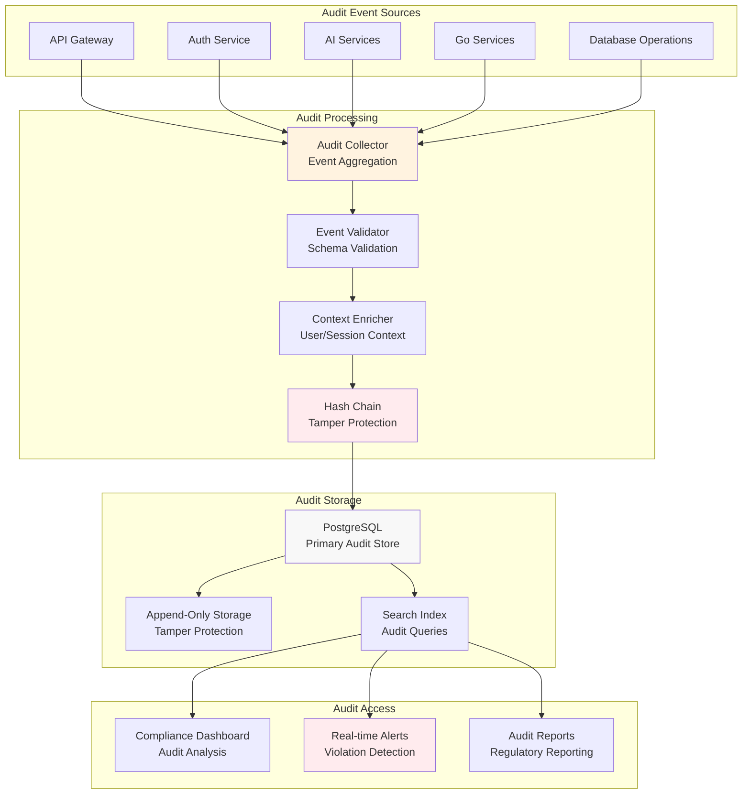

# Audit Trail Guide

> **Complete guide to audit logging implementation for HIPAA compliance**

## HIPAA Audit Requirements

### Required Audit Events (§164.312(b))

| Event Category | Specific Events | Data Captured | Retention Period |
|---|---|---|---|
| **Authentication** | Login, logout, session timeout, failed auth | User ID, IP, timestamp, success/failure, MFA status | 6 years |
| **PHI Access** | View, modify, export, delete PHI | User ID, patient ID, data accessed, purpose, scope | 6 years |
| **System Access** | Service access, API calls, database queries | Service ID, endpoint, response code, duration | 6 years |
| **Administrative** | User creation, role changes, config updates | Admin ID, changes made, before/after values | 6 years |
| **Security Events** | Auth failures, access violations, suspicious activity | Event details, IP, user agent, response taken | 6 years |
| **Emergency Access** | Break-glass access, crisis response | Emergency type, justification, data accessed | 7 years |

## Audit Log Implementation

### Audit Service Architecture



### Audit Event Schema

```sql
-- Comprehensive audit log table
CREATE TABLE audit_logs (
    -- Core identification
    id UUID PRIMARY KEY DEFAULT gen_random_uuid(),
    event_id UUID NOT NULL DEFAULT gen_random_uuid(),
    correlation_id UUID, -- Request correlation
    
    -- Event metadata
    event_type VARCHAR(100) NOT NULL,
    event_category VARCHAR(50) NOT NULL, -- auth, phi_access, admin, security, emergency
    severity VARCHAR(20) NOT NULL DEFAULT 'INFO', -- INFO, WARN, ERROR, CRITICAL
    
    -- User context
    user_id UUID,
    session_id UUID,
    user_role VARCHAR(50),
    user_email VARCHAR(255),
    
    -- Network context
    ip_address INET NOT NULL,
    user_agent TEXT,
    source_service VARCHAR(100),
    
    -- Resource context
    resource_type VARCHAR(100), -- patient, conversation, system_config
    resource_id VARCHAR(255),
    resource_owner_id UUID,
    
    -- PHI-specific fields
    patient_id UUID, -- For PHI access events
    phi_accessed TEXT[], -- Array of PHI types accessed
    access_purpose VARCHAR(100), -- treatment, payment, operations, emergency
    minimum_necessary_applied BOOLEAN DEFAULT true,
    
    -- Event details
    action_description TEXT NOT NULL,
    event_data JSONB, -- Structured event data
    before_state JSONB, -- For data modification events
    after_state JSONB, -- For data modification events
    
    -- Request context
    request_method VARCHAR(10),
    request_path TEXT,
    response_status INTEGER,
    response_time_ms INTEGER,
    
    -- Compliance tracking
    business_justification TEXT,
    approval_required BOOLEAN DEFAULT false,
    approved_by UUID,
    approved_at TIMESTAMPTZ,
    
    -- Timing
    timestamp TIMESTAMPTZ NOT NULL DEFAULT NOW(),
    event_duration_ms INTEGER,
    
    -- Tamper protection
    hash_chain VARCHAR(64) NOT NULL,
    previous_hash VARCHAR(64),
    digital_signature TEXT,
    signature_algorithm VARCHAR(50) DEFAULT 'HMAC-SHA256',
    
    -- HIPAA compliance
    hipaa_category VARCHAR(50), -- Based on 164.312 categories
    retention_required_until DATE NOT NULL DEFAULT (NOW() + INTERVAL '6 years'),
    patient_notification_required BOOLEAN DEFAULT false,
    patient_notified_at TIMESTAMPTZ,
    
    -- Index and constraints
    CONSTRAINT valid_severity CHECK (severity IN ('INFO', 'WARN', 'ERROR', 'CRITICAL')),
    CONSTRAINT valid_category CHECK (event_category IN ('authentication', 'phi_access', 'administrative', 'security', 'emergency')),
    CONSTRAINT valid_purpose CHECK (access_purpose IN ('treatment', 'payment', 'operations', 'emergency', 'patient_request'))
);

-- Prevent audit log modification (HIPAA requirement)
REVOKE UPDATE, DELETE ON audit_logs FROM ALL;
GRANT INSERT, SELECT ON audit_logs TO audit_service_user;

-- Indexes for audit queries
CREATE INDEX idx_audit_user_timestamp ON audit_logs(user_id, timestamp DESC);
CREATE INDEX idx_audit_patient_timestamp ON audit_logs(patient_id, timestamp DESC) WHERE patient_id IS NOT NULL;
CREATE INDEX idx_audit_event_type ON audit_logs(event_type, timestamp DESC);
CREATE INDEX idx_audit_severity ON audit_logs(severity, timestamp DESC) WHERE severity IN ('ERROR', 'CRITICAL');
CREATE INDEX idx_audit_phi_access ON audit_logs(event_category, timestamp DESC) WHERE event_category = 'phi_access';
```

## Audit Event Generation

### Standardized Audit Logging

```go
// Go microservices audit logging
type AuditLogger struct {
    db     *gorm.DB
    logger *slog.Logger
}

func (a *AuditLogger) LogPHIAccess(ctx context.Context, event PHIAccessEvent) error {
    // Create comprehensive audit record
    auditLog := &AuditLog{
        EventID:         uuid.New(),
        CorrelationID:   getCorrelationID(ctx),
        EventType:       "phi_access",
        EventCategory:   "phi_access",
        Severity:        "INFO",
        
        UserID:          event.UserID,
        SessionID:       event.SessionID,
        UserRole:        event.UserRole,
        UserEmail:       event.UserEmail,
        
        IPAddress:       event.IPAddress,
        UserAgent:       event.UserAgent,
        SourceService:   "auth-rbac-service",
        
        ResourceType:    "patient_phi",
        ResourceID:      event.PatientID,
        PatientID:       &event.PatientID,
        PHIAccessed:     event.PHITypes,
        AccessPurpose:   event.Purpose,
        MinimumNecessaryApplied: true,
        
        ActionDescription: fmt.Sprintf("User %s accessed PHI for patient %s", event.UserEmail, event.PatientID),
        EventData: event.AdditionalData,
        
        RequestMethod:   event.HTTPMethod,
        RequestPath:     event.RequestPath,
        ResponseStatus:  event.ResponseStatus,
        ResponseTimeMS:  event.ResponseTime,
        
        BusinessJustification: event.Justification,
        HIPAACategory:         "164.312.b",
        
        Timestamp: time.Now(),
    }
    
    // Generate hash chain for tamper protection
    auditLog.HashChain = a.generateHashChain(auditLog)
    auditLog.PreviousHash = a.getLastAuditHash()
    auditLog.DigitalSignature = a.signAuditEvent(auditLog)
    
    // Store audit log (immutable)
    if err := a.db.Create(auditLog).Error; err != nil {
        return fmt.Errorf("failed to create audit log: %w", err)
    }
    
    // Real-time compliance monitoring
    if err := a.checkComplianceViolation(auditLog); err != nil {
        a.logger.Error("Compliance violation detected", "audit_id", auditLog.ID, "error", err)
        // Send immediate alert but don't fail the operation
        go a.sendComplianceAlert(auditLog, err)
    }
    
    return nil
}
```

### Python AI Services Audit Logging

```python
# Python AI services audit logging
class AuditLogger:
    """Standardized audit logging for AI services"""
    
    def __init__(self, service_name: str, db_connection: AsyncSession):
        self.service_name = service_name
        self.db = db_connection
        self.logger = structlog.get_logger()
    
    async def log_ai_processing(
        self, 
        user_id: str,
        patient_id: Optional[str],
        operation_type: str,
        input_data: str,
        output_data: str,
        processing_time_ms: int,
        context: dict
    ):
        """Log AI processing events with PHI protection"""
        
        # Detect PHI in inputs/outputs
        phi_detector = PHIDetectionEngine()
        input_phi = phi_detector.detect_phi_in_text(input_data)
        output_phi = phi_detector.detect_phi_in_text(output_data)
        
        # Create audit event
        audit_event = AuditEvent(
            event_id=str(uuid4()),
            correlation_id=context.get("correlation_id"),
            event_type=f"ai_{operation_type}",
            event_category="ai_processing",
            severity="INFO",
            
            user_id=user_id,
            session_id=context.get("session_id"),
            user_role=context.get("user_role"),
            
            ip_address=context.get("ip_address"),
            user_agent=context.get("user_agent"),
            source_service=self.service_name,
            
            resource_type="ai_interaction",
            resource_id=context.get("conversation_id"),
            patient_id=patient_id,
            
            action_description=f"AI {operation_type} performed",
            event_data={
                "operation_type": operation_type,
                "input_length": len(input_data),
                "output_length": len(output_data),
                "processing_time_ms": processing_time_ms,
                "phi_detected_in_input": bool(input_phi),
                "phi_detected_in_output": bool(output_phi),
                "phi_types": list(set(list(input_phi.keys()) + list(output_phi.keys()))),
                "model_version": context.get("model_version"),
                "safety_checks_passed": context.get("safety_checks_passed", False)
            },
            
            response_time_ms=processing_time_ms,
            hipaa_category="164.312.b",
            minimum_necessary_applied=True,
            
            timestamp=datetime.utcnow()
        )
        
        # Store audit event
        self.db.add(audit_event)
        await self.db.commit()
        
        # Log structured event
        await self.logger.ainfo(
            "ai_processing_audited",
            user_id=user_id,
            operation_type=operation_type,
            phi_detected=bool(input_phi or output_phi),
            processing_time_ms=processing_time_ms
        )
```

## Tamper Protection

### Hash Chain Implementation

```python
class AuditHashChain:
    """Cryptographic hash chain for audit log integrity"""
    
    def __init__(self, secret_key: str):
        self.secret_key = secret_key
    
    def generate_hash_chain(self, audit_event: dict, previous_hash: Optional[str] = None) -> str:
        """Generate tamper-proof hash chain"""
        
        # Canonicalize audit event for hashing
        canonical_data = {
            "event_id": audit_event["event_id"],
            "timestamp": audit_event["timestamp"].isoformat(),
            "user_id": audit_event["user_id"],
            "event_type": audit_event["event_type"],
            "resource_id": audit_event.get("resource_id"),
            "action_description": audit_event["action_description"]
        }
        
        # Sort keys for consistent hashing
        canonical_json = json.dumps(canonical_data, sort_keys=True)
        
        # Include previous hash for chain integrity
        chain_input = f"{previous_hash or 'GENESIS'}{canonical_json}"
        
        # Generate HMAC-SHA256 hash
        hash_chain = hmac.new(
            self.secret_key.encode(),
            chain_input.encode(),
            hashlib.sha256
        ).hexdigest()
        
        return hash_chain
    
    def verify_hash_chain(self, audit_logs: List[dict]) -> bool:
        """Verify integrity of entire audit log chain"""
        
        previous_hash = None
        for log in sorted(audit_logs, key=lambda x: x["timestamp"]):
            expected_hash = self.generate_hash_chain(log, previous_hash)
            
            if log["hash_chain"] != expected_hash:
                return False
                
            previous_hash = log["hash_chain"]
        
        return True
```

### Digital Signatures

```python
class AuditSignatureService:
    """Digital signatures for audit log non-repudiation"""
    
    def __init__(self, private_key_path: str):
        with open(private_key_path, 'rb') as key_file:
            self.private_key = serialization.load_pem_private_key(
                key_file.read(),
                password=None,
                backend=default_backend()
            )
    
    def sign_audit_event(self, audit_event: dict) -> str:
        """Create digital signature for audit event"""
        
        # Create signature payload
        signature_data = {
            "event_id": audit_event["event_id"],
            "timestamp": audit_event["timestamp"].isoformat(),
            "hash_chain": audit_event["hash_chain"],
            "user_id": audit_event["user_id"],
            "event_type": audit_event["event_type"]
        }
        
        payload = json.dumps(signature_data, sort_keys=True).encode()
        
        # Sign with RSA-PSS
        signature = self.private_key.sign(
            payload,
            padding.PSS(
                mgf=padding.MGF1(hashes.SHA256()),
                salt_length=padding.PSS.MAX_LENGTH
            ),
            hashes.SHA256()
        )
        
        return base64.b64encode(signature).decode()
    
    def verify_signature(self, audit_event: dict, signature: str, public_key) -> bool:
        """Verify audit event digital signature"""
        try:
            signature_data = {
                "event_id": audit_event["event_id"],
                "timestamp": audit_event["timestamp"].isoformat(),
                "hash_chain": audit_event["hash_chain"],
                "user_id": audit_event["user_id"],
                "event_type": audit_event["event_type"]
            }
            
            payload = json.dumps(signature_data, sort_keys=True).encode()
            signature_bytes = base64.b64decode(signature)
            
            public_key.verify(
                signature_bytes,
                payload,
                padding.PSS(
                    mgf=padding.MGF1(hashes.SHA256()),
                    salt_length=padding.PSS.MAX_LENGTH
                ),
                hashes.SHA256()
            )
            return True
            
        except Exception:
            return False
```

## Real-Time Audit Monitoring

### Compliance Violation Detection

```python
class ComplianceMonitor:
    """Real-time monitoring for HIPAA compliance violations"""
    
    def __init__(self):
        self.violation_rules = [
            self.unauthorized_phi_access,
            self.excessive_data_access,
            self.off_hours_emergency_access,
            self.bulk_data_export,
            self.cross_role_boundary_access
        ]
    
    async def check_compliance_violation(self, audit_event: dict) -> Optional[ComplianceViolation]:
        """Check audit event against compliance rules"""
        
        for rule in self.violation_rules:
            violation = await rule(audit_event)
            if violation:
                # Immediate escalation for violations
                await self.escalate_compliance_violation(violation, audit_event)
                return violation
        
        return None
    
    async def unauthorized_phi_access(self, event: dict) -> Optional[ComplianceViolation]:
        """Detect unauthorized PHI access attempts"""
        
        if event["event_category"] != "phi_access":
            return None
        
        # Check if user has valid consent for patient
        has_consent = await self.consent_service.verify_phi_access_consent(
            user_id=event["user_id"],
            patient_id=event["patient_id"],
            access_purpose=event["access_purpose"]
        )
        
        if not has_consent:
            return ComplianceViolation(
                violation_type="unauthorized_phi_access",
                severity="CRITICAL",
                description=f"User {event['user_email']} attempted unauthorized PHI access",
                patient_affected=event["patient_id"],
                immediate_action_required=True
            )
        
        return None
    
    async def excessive_data_access(self, event: dict) -> Optional[ComplianceViolation]:
        """Detect patterns of excessive data access"""
        
        if event["event_category"] != "phi_access":
            return None
        
        # Check access pattern over last hour
        recent_access_count = await self.get_recent_phi_access_count(
            user_id=event["user_id"],
            time_window_minutes=60
        )
        
        # Define role-based access thresholds
        role_thresholds = {
            "health_provider": 20,  # Providers may access many patients
            "care_staff": 10,       # Care staff have limited patient load
            "family_member": 2,     # Family should access very few patients
            "case_manager": 15      # Case managers coordinate multiple patients
        }
        
        threshold = role_thresholds.get(event["user_role"], 5)
        
        if recent_access_count > threshold:
            return ComplianceViolation(
                violation_type="excessive_data_access",
                severity="WARN",
                description=f"User {event['user_email']} exceeded access threshold ({recent_access_count} > {threshold})",
                pattern_detected=True
            )
        
        return None
```

### Real-Time Alerting

```python
class AuditAlertingService:
    """Real-time alerting for audit events"""
    
    async def process_audit_event(self, audit_event: dict):
        """Process audit event for real-time alerts"""
        
        # Critical events require immediate attention
        if audit_event["severity"] == "CRITICAL":
            await self.send_critical_alert(audit_event)
        
        # Emergency access events
        if audit_event["event_category"] == "emergency":
            await self.send_emergency_access_alert(audit_event)
        
        # PHI access pattern analysis
        if audit_event["event_category"] == "phi_access":
            await self.analyze_phi_access_pattern(audit_event)
        
        # Security events
        if audit_event["event_category"] == "security":
            await self.send_security_alert(audit_event)
    
    async def send_critical_alert(self, event: dict):
        """Send immediate critical alert"""
        
        alert = {
            "alert_type": "CRITICAL_AUDIT_EVENT",
            "event_id": event["event_id"],
            "timestamp": event["timestamp"],
            "user_email": event["user_email"],
            "description": event["action_description"],
            "patient_id": event.get("patient_id"),
            "requires_immediate_action": True
        }
        
        # Multiple notification channels
        await asyncio.gather(
            self.slack_service.send_critical_alert(alert),
            self.email_service.send_compliance_alert(alert),
            self.pagerduty_service.trigger_incident(alert)
        )
```

## Audit Queries and Reports

### Common Audit Queries

```sql
-- 1. PHI access by user for last 30 days
SELECT 
    u.email,
    COUNT(DISTINCT al.patient_id) as patients_accessed,
    COUNT(*) as total_accesses,
    STRING_AGG(DISTINCT al.access_purpose, ', ') as purposes,
    MAX(al.timestamp) as last_access
FROM audit_logs al
JOIN users u ON al.user_id = u.id
WHERE al.event_category = 'phi_access'
  AND al.timestamp >= NOW() - INTERVAL '30 days'
GROUP BY u.id, u.email
ORDER BY total_accesses DESC;

-- 2. Emergency access events requiring review
SELECT 
    al.event_id,
    al.timestamp,
    u.email as emergency_accessor,
    al.patient_id,
    al.business_justification,
    al.event_data->>'emergency_type' as emergency_type,
    al.approved_by IS NOT NULL as post_facto_approved
FROM audit_logs al
JOIN users u ON al.user_id = u.id
WHERE al.event_category = 'emergency'
  AND al.timestamp >= NOW() - INTERVAL '7 days'
ORDER BY al.timestamp DESC;

-- 3. Potential compliance violations
SELECT 
    al.event_id,
    al.timestamp,
    al.severity,
    u.email,
    al.action_description,
    al.event_data
FROM audit_logs al
JOIN users u ON al.user_id = u.id
WHERE al.severity IN ('ERROR', 'CRITICAL')
  AND al.timestamp >= NOW() - INTERVAL '24 hours'
ORDER BY al.timestamp DESC;

-- 4. PHI access without proper consent
SELECT 
    al.event_id,
    al.timestamp,
    u.email,
    al.patient_id,
    al.access_purpose,
    'NO_VALID_CONSENT' as violation_type
FROM audit_logs al
JOIN users u ON al.user_id = u.id
LEFT JOIN consent_records cr ON cr.patient_id = al.patient_id 
    AND cr.grantor_id = al.user_id 
    AND cr.status = 'active'
    AND cr.scope_includes_phi = true
WHERE al.event_category = 'phi_access'
  AND cr.id IS NULL  -- No valid consent found
  AND al.timestamp >= NOW() - INTERVAL '24 hours'
ORDER BY al.timestamp DESC;
```

### Automated Audit Reports

```python
class AuditReportingService:
    """Automated audit report generation"""
    
    async def generate_hipaa_compliance_report(self, start_date: date, end_date: date) -> dict:
        """Generate comprehensive HIPAA compliance report"""
        
        report = {
            "report_period": f"{start_date} to {end_date}",
            "generated_at": datetime.utcnow(),
            "report_type": "hipaa_compliance_audit",
            
            # Authentication metrics
            "authentication_events": await self.get_authentication_metrics(start_date, end_date),
            
            # PHI access analysis
            "phi_access_summary": await self.get_phi_access_summary(start_date, end_date),
            
            # Emergency access review
            "emergency_access_events": await self.get_emergency_access_events(start_date, end_date),
            
            # Compliance violations
            "violations_detected": await self.get_compliance_violations(start_date, end_date),
            
            # Security incidents
            "security_incidents": await self.get_security_incidents(start_date, end_date),
            
            # System availability
            "system_availability": await self.calculate_system_availability(start_date, end_date),
            
            # Recommendations
            "compliance_recommendations": await self.generate_compliance_recommendations(start_date, end_date)
        }
        
        return report
```

## Audit Data Protection

### Backup and Recovery

```bash
#!/bin/bash
# Audit log backup script

# Create encrypted backup of audit logs
pg_dump \
  --host=$POSTGRES_HOST \
  --port=$POSTGRES_PORT \
  --username=$AUDIT_USER \
  --table=audit_logs \
  --format=custom \
  --compress=9 \
  chatbot_app | \
  openssl enc -aes-256-cbc -salt -pbkdf2 -in - -out audit_backup_$(date +%Y%m%d_%H%M%S).sql.enc -k "$BACKUP_ENCRYPTION_KEY"

# Verify backup integrity
openssl enc -aes-256-cbc -d -pbkdf2 -in audit_backup_*.sql.enc -k "$BACKUP_ENCRYPTION_KEY" | \
  pg_restore --list > backup_verification.txt

# Upload to secure storage with retention policy
aws s3 cp audit_backup_*.sql.enc s3://hipaa-audit-backups/$(date +%Y/%m/) \
  --storage-class STANDARD_IA \
  --metadata retention="6years"
```

### Audit Log Access Controls

```sql
-- Audit log access permissions (read-only)
CREATE ROLE audit_reader;
GRANT SELECT ON audit_logs TO audit_reader;
GRANT USAGE ON SCHEMA public TO audit_reader;

-- Compliance team access
CREATE ROLE compliance_analyst;
GRANT audit_reader TO compliance_analyst;
GRANT SELECT ON users, consent_records TO compliance_analyst;

-- Security team access  
CREATE ROLE security_analyst;
GRANT audit_reader TO security_analyst;
GRANT SELECT ON security_events TO security_analyst;

-- Legal team access (for investigations)
CREATE ROLE legal_investigator;
GRANT audit_reader TO legal_investigator;

-- Prevent any modification of audit logs
REVOKE ALL ON audit_logs FROM PUBLIC;
```

## Compliance Reporting

### Regulatory Report Generation

```python
class RegulatoryReporting:
    """Generate reports for regulatory compliance"""
    
    async def generate_breach_notification_report(self, incident_id: str) -> dict:
        """Generate breach notification report (§164.404)"""
        
        incident = await self.get_security_incident(incident_id)
        
        return {
            "report_type": "hipaa_breach_notification",
            "incident_id": incident_id,
            "incident_date": incident["discovered_at"],
            "affected_individuals": await self.get_affected_individuals(incident_id),
            "phi_involved": await self.analyze_phi_exposure(incident_id),
            "risk_assessment": await self.conduct_risk_assessment(incident_id),
            "mitigation_actions": await self.get_mitigation_actions(incident_id),
            "notification_timeline": {
                "discovery_date": incident["discovered_at"],
                "assessment_complete": incident["assessment_completed_at"],
                "notifications_sent": incident["notifications_sent_at"],
                "regulatory_notification": incident["regulatory_notification_at"]
            }
        }
    
    async def generate_access_report(self, user_id: str, period_days: int = 30) -> dict:
        """Generate individual access report for patients"""
        
        # Query audit logs for user's data access
        access_events = await self.db.execute(
            select(AuditLog)
            .where(AuditLog.patient_id == user_id)
            .where(AuditLog.timestamp >= datetime.utcnow() - timedelta(days=period_days))
            .order_by(AuditLog.timestamp.desc())
        )
        
        return {
            "report_type": "individual_access_report",
            "patient_id": user_id,
            "report_period": f"Last {period_days} days",
            "total_access_events": len(access_events),
            "accessing_users": await self.get_accessing_users(access_events),
            "data_accessed": await self.categorize_data_accessed(access_events),
            "access_purposes": await self.summarize_access_purposes(access_events),
            "emergency_access_events": await self.get_emergency_accesses(access_events)
        }
```

## Audit Log Retention

### Automated Retention Management

```python
class AuditRetentionService:
    """Manage audit log retention per HIPAA requirements"""
    
    async def enforce_retention_policy(self):
        """Enforce 6-year minimum retention with secure disposal"""
        
        # Identify audit logs eligible for disposal
        disposal_cutoff = datetime.utcnow() - timedelta(days=6*365 + 30)  # 6 years + 30 day buffer
        
        eligible_logs = await self.db.execute(
            select(AuditLog.id)
            .where(AuditLog.retention_required_until < disposal_cutoff)
            .where(AuditLog.legal_hold != True)  # Respect legal holds
        )
        
        # Create disposal record
        disposal_record = {
            "disposal_date": datetime.utcnow(),
            "records_count": len(eligible_logs),
            "disposal_method": "cryptographic_erasure",
            "verification_hash": self.calculate_disposal_hash(eligible_logs),
            "compliance_verified": True
        }
        
        # Cryptographic erasure (key destruction)
        await self.cryptographic_erasure(eligible_logs)
        
        # Log disposal action
        await self.audit_service.log_data_disposal(disposal_record)
        
        return disposal_record
    
    async def cryptographic_erasure(self, audit_log_ids: List[str]):
        """Secure disposal through key destruction"""
        
        # Rotate encryption keys
        old_key_id = await self.key_management.get_current_key_id()
        new_key_id = await self.key_management.rotate_encryption_key()
        
        # Update active records to use new key
        await self.re_encrypt_active_logs(old_key_id, new_key_id)
        
        # Destroy old encryption key
        await self.key_management.destroy_key(old_key_id)
        
        # Mark disposed records
        await self.db.execute(
            update(AuditLog)
            .where(AuditLog.id.in_(audit_log_ids))
            .values(
                status="cryptographically_erased",
                disposal_date=datetime.utcnow(),
                encryption_key_destroyed=True
            )
        )
```

## Audit Access Management

### Role-Based Audit Access

| Role | Audit Access Scope | Query Limitations | Approval Required |
|---|---|---|---|
| **Compliance Officer** | All audit logs | None | No |
| **Security Analyst** | Security + auth events | Security events only | No |
| **Clinical Supervisor** | Patient care events | Assigned patients only | No |
| **Legal Counsel** | Investigation-specific | Case-specific records | Legal approval |
| **External Auditor** | Full access during audit | Audit period only | CISO approval |

### Audit Query API

```python
@router.get("/audit/search")
async def search_audit_logs(
    user_id: Optional[str] = None,
    patient_id: Optional[str] = None,
    event_type: Optional[str] = None,
    start_date: Optional[datetime] = None,
    end_date: Optional[datetime] = None,
    severity: Optional[str] = None,
    limit: int = 100,
    current_user: dict = Depends(get_current_user)
):
    """Search audit logs with proper access controls"""
    
    # Validate search permissions
    if not await rbac.has_permission(current_user["role"], "audit_log_search"):
        raise HTTPException(status_code=403, detail="Insufficient permissions")
    
    # Apply role-based filtering
    query_filters = await apply_role_based_audit_filters(
        user_role=current_user["role"],
        user_id=user_id,
        patient_id=patient_id,
        event_type=event_type
    )
    
    # Execute audit search
    audit_results = await audit_service.search_audit_logs(
        filters=query_filters,
        start_date=start_date,
        end_date=end_date,
        severity=severity,
        limit=min(limit, 1000)  # Cap search results
    )
    
    # Log audit access
    await audit_service.log_audit_access(
        accessor_id=current_user["user_id"],
        search_criteria=query_filters,
        results_count=len(audit_results)
    )
    
    return audit_results
```

---

**Audit Framework Version**: 2.0  
**Last External Audit**: 2025-08-01  
**Next Compliance Review**: 2025-10-01  
**Maintained By**: Compliance Team + Security Team