# Consent Management

> **HIPAA-compliant patient consent framework for therapeutic AI services**

## Consent Framework Overview

The consent management system implements granular, purpose-specific consent collection and enforcement for all PHI access and AI therapeutic interactions. Built on HIPAA authorization requirements (§164.508) with additional safeguards for AI-powered healthcare services.

```mermaid
flowchart TD
    subgraph "Consent Collection"
        PATIENT[👴 Patient/Guardian]
        CONSENT_UI[📋 Consent Interface<br/>Plain Language Forms]
        LEGAL_REVIEW[⚖️ Legal Review<br/>Consent Validation]
        CONSENT_STORE[🏛️ Consent Storage<br/>Immutable Records]
    end
    
    subgraph "Consent Enforcement"
        ACCESS_REQUEST[🔍 Access Request]
        CONSENT_CHECK[✅ Consent Validation<br/>Real-time Verification]
        PURPOSE_MATCH[🎯 Purpose Matching<br/>Scope Validation]
        ACCESS_DECISION[🚪 Access Decision<br/>Allow/Deny]
    end
    
    subgraph "Consent Management"
        CONSENT_TRACKING[📊 Consent Tracking<br/>Status Monitoring]
        WITHDRAWAL[🚫 Consent Withdrawal<br/>Immediate Effect]
        EXPIRATION[⏰ Automatic Expiration<br/>Time-bound Consent]
        AUDIT_TRAIL[📋 Audit Trail<br/>All Consent Actions]
    end
    
    PATIENT --> CONSENT_UI
    CONSENT_UI --> LEGAL_REVIEW
    LEGAL_REVIEW --> CONSENT_STORE
    
    ACCESS_REQUEST --> CONSENT_CHECK
    CONSENT_CHECK --> PURPOSE_MATCH
    PURPOSE_MATCH --> ACCESS_DECISION
    
    CONSENT_STORE --> CONSENT_TRACKING
    CONSENT_TRACKING --> WITHDRAWAL
    CONSENT_TRACKING --> EXPIRATION
    ACCESS_DECISION --> AUDIT_TRAIL
    
    style CONSENT_STORE fill:#e8f5e8
    style ACCESS_DECISION fill:#fff3e0
    style AUDIT_TRAIL fill:#ffebee
```



## Consent Types and Scopes

### Treatment Consent
| Consent Type | Scope | Duration | Revocable | Use Cases |
|---|---|---|---|---|
| **General Treatment** | Basic therapeutic conversations | 1 year | Yes | Standard AI interactions |
| **Mental Health Support** | Emotional analysis and crisis detection | 6 months | Yes | Mental health conversations |
| **Emergency Crisis Response** | Crisis intervention and emergency contacts | 2 years | Limited | Suicide prevention, emergency care |
| **Care Coordination** | Family/caregiver information sharing | 1 year | Yes | Family involvement in care |
| **Research Participation** | De-identified data for research | 5 years | Yes | Clinical research studies |

### AI-Specific Consent
| AI Function | Consent Required | Data Processed | Patient Control |
|---|---|---|---|
| **Conversation Analysis** | Explicit consent | Chat content, emotional state | Full control + withdrawal |
| **Therapeutic Recommendations** | Treatment consent | Medical history, current state | Opt-out available |
| **Crisis Detection** | Emergency consent | All conversations, behavioral patterns | Limited withdrawal |
| **Family Notifications** | Care coordination consent | General status, care updates | Granular control |
| **Research Data Use** | Research consent | De-identified conversation data | Full control |

## Consent Schema

### Database Schema

```sql
-- Comprehensive consent management tables
CREATE TABLE consent_records (
    id UUID PRIMARY KEY DEFAULT gen_random_uuid(),
    
    -- Consent identification
    consent_id VARCHAR(100) UNIQUE NOT NULL,
    version INTEGER NOT NULL DEFAULT 1,
    
    -- Parties involved
    patient_id UUID NOT NULL REFERENCES users(id),
    grantor_id UUID NOT NULL, -- Patient or legal guardian
    grantee_id UUID, -- Specific healthcare provider (optional)
    grantee_role VARCHAR(50), -- Role-based consent
    
    -- Consent scope
    consent_type VARCHAR(100) NOT NULL,
    purpose VARCHAR(100) NOT NULL, -- treatment, payment, operations, research
    scope_description TEXT NOT NULL,
    scope_includes_phi BOOLEAN NOT NULL DEFAULT false,
    scope_includes_ai_analysis BOOLEAN NOT NULL DEFAULT false,
    scope_includes_family_sharing BOOLEAN NOT NULL DEFAULT false,
    scope_includes_emergency_contact BOOLEAN NOT NULL DEFAULT false,
    
    -- Temporal controls
    granted_at TIMESTAMPTZ NOT NULL DEFAULT NOW(),
    effective_from TIMESTAMPTZ NOT NULL DEFAULT NOW(),
    expires_at TIMESTAMPTZ, -- NULL for indefinite consent
    withdrawn_at TIMESTAMPTZ,
    
    -- Legal requirements
    informed_consent_provided BOOLEAN NOT NULL DEFAULT true,
    patient_capacity_verified BOOLEAN NOT NULL DEFAULT true,
    witness_id UUID, -- For guardianship consent
    legal_basis VARCHAR(100) NOT NULL, -- HIPAA section reference
    
    -- Consent form details
    consent_form_version VARCHAR(50) NOT NULL,
    consent_language VARCHAR(10) NOT NULL DEFAULT 'en',
    delivery_method VARCHAR(50) NOT NULL, -- digital, paper, verbal
    signature_type VARCHAR(50) NOT NULL, -- electronic, digital, wet
    
    -- Status tracking
    status VARCHAR(50) NOT NULL DEFAULT 'active',
    withdrawal_reason TEXT,
    last_verified_at TIMESTAMPTZ,
    
    -- Audit and compliance
    created_by UUID NOT NULL,
    created_at TIMESTAMPTZ NOT NULL DEFAULT NOW(),
    updated_at TIMESTAMPTZ NOT NULL DEFAULT NOW(),
    
    CONSTRAINT valid_status CHECK (status IN ('active', 'withdrawn', 'expired', 'superseded')),
    CONSTRAINT valid_purpose CHECK (purpose IN ('treatment', 'payment', 'operations', 'research', 'emergency')),
    CONSTRAINT valid_consent_type CHECK (consent_type IN (
        'general_treatment', 'mental_health', 'emergency_crisis', 
        'care_coordination', 'research_participation', 'ai_analysis'
    ))
);

-- Consent withdrawal tracking
CREATE TABLE consent_withdrawals (
    id UUID PRIMARY KEY DEFAULT gen_random_uuid(),
    consent_record_id UUID NOT NULL REFERENCES consent_records(id),
    
    withdrawn_by UUID NOT NULL,
    withdrawal_date TIMESTAMPTZ NOT NULL DEFAULT NOW(),
    withdrawal_method VARCHAR(50) NOT NULL, -- portal, phone, email, in_person
    withdrawal_reason TEXT,
    
    -- Immediate effect validation
    data_access_revoked_at TIMESTAMPTZ,
    systems_updated_at TIMESTAMPTZ,
    verification_completed BOOLEAN DEFAULT false,
    
    -- Audit trail
    created_at TIMESTAMPTZ NOT NULL DEFAULT NOW()
);

-- Consent verification log
CREATE TABLE consent_verifications (
    id UUID PRIMARY KEY DEFAULT gen_random_uuid(),
    consent_record_id UUID NOT NULL REFERENCES consent_records(id),
    
    verified_by UUID NOT NULL,
    verification_date TIMESTAMPTZ NOT NULL DEFAULT NOW(),
    verification_method VARCHAR(50) NOT NULL, -- system, manual, patient_confirmed
    verification_result BOOLEAN NOT NULL,
    
    -- Context
    access_context JSONB, -- Why verification was needed
    patient_notification_sent BOOLEAN DEFAULT false,
    
    created_at TIMESTAMPTZ NOT NULL DEFAULT NOW()
);
```

## Consent Collection Process

### Digital Consent Flow


### Consent Form Implementation

```python
class ConsentFormService:
    """Digital consent form management"""
    
    def __init__(self):
        self.consent_templates = {
            "general_treatment": {
                "title": "Therapeutic AI Conversation Consent",
                "sections": [
                    "purpose_and_scope",
                    "data_collection_and_use", 
                    "ai_analysis_disclosure",
                    "data_sharing_limitations",
                    "withdrawal_rights",
                    "contact_information"
                ],
                "required_acknowledgments": [
                    "understand_ai_limitations",
                    "understand_crisis_protocols",
                    "understand_data_use",
                    "understand_withdrawal_rights"
                ]
            }
        }
    
    async def generate_consent_form(
        self, 
        consent_type: str, 
        patient_id: str,
        language: str = "en"
    ) -> dict:
        """Generate personalized consent form"""
        
        template = self.consent_templates[consent_type]
        patient = await self.user_service.get_user(patient_id)
        
        consent_form = {
            "form_id": str(uuid4()),
            "consent_type": consent_type,
            "patient_id": patient_id,
            "patient_name": patient["full_name"],
            "language": language,
            "version": template["version"],
            
            "sections": await self.render_consent_sections(template["sections"], patient, language),
            "acknowledgments": template["required_acknowledgments"],
            
            "legal_notices": {
                "hipaa_rights": await self.get_hipaa_rights_notice(language),
                "privacy_practices": await self.get_privacy_practices_notice(language),
                "ai_limitations": await self.get_ai_limitations_notice(language)
            },
            
            "withdrawal_instructions": await self.get_withdrawal_instructions(language),
            "contact_information": await self.get_healthcare_contacts()
        }
        
        return consent_form
    
    async def validate_consent_completion(self, consent_submission: dict) -> tuple[bool, List[str]]:
        """Validate consent form completion"""
        
        errors = []
        
        # Check required acknowledgments
        required_acks = self.consent_templates[consent_submission["consent_type"]]["required_acknowledgments"]
        provided_acks = consent_submission.get("acknowledgments", [])
        
        missing_acks = set(required_acks) - set(provided_acks)
        if missing_acks:
            errors.append(f"Missing required acknowledgments: {list(missing_acks)}")
        
        # Validate electronic signature
        if not consent_submission.get("electronic_signature"):
            errors.append("Electronic signature required")
        
        # Verify patient capacity (for AI consent)
        if consent_submission["consent_type"] == "ai_analysis":
            capacity_verified = await self.verify_patient_capacity(consent_submission["patient_id"])
            if not capacity_verified:
                errors.append("Patient capacity verification required")
        
        return len(errors) == 0, errors
```

## Consent Enforcement

### Real-Time Consent Checking

```go
// Go service consent enforcement
type ConsentEnforcementService struct {
    db     *gorm.DB
    cache  *redis.Client
    logger *slog.Logger
}

func (c *ConsentEnforcementService) CheckPHIAccessConsent(
    ctx context.Context,
    userID, patientID, accessPurpose string,
) (*ConsentDecision, error) {
    
    // Check cache first for performance
    cacheKey := fmt.Sprintf("consent:%s:%s:%s", userID, patientID, accessPurpose)
    if decision, err := c.getCachedConsentDecision(cacheKey); err == nil {
        return decision, nil
    }
    
    // Query active consent records
    var consentRecord ConsentRecord
    err := c.db.WithContext(ctx).
        Where("patient_id = ? AND (grantee_id = ? OR grantee_role = ?)", 
              patientID, userID, getUserRole(userID)).
        Where("purpose = ? OR purpose = 'general'", accessPurpose).
        Where("status = 'active'").
        Where("effective_from <= NOW()").
        Where("expires_at IS NULL OR expires_at > NOW()").
        First(&consentRecord).Error
    
    if err != nil {
        if errors.Is(err, gorm.ErrRecordNotFound) {
            return &ConsentDecision{
                Allowed: false,
                Reason: "no_valid_consent",
                RequiredActions: []string{"obtain_patient_consent"},
            }, nil
        }
        return nil, fmt.Errorf("consent check failed: %w", err)
    }
    
    // Validate consent scope
    decision := &ConsentDecision{
        Allowed: true,
        ConsentID: consentRecord.ConsentID,
        Scope: consentRecord.ScopeDescription,
        ExpiresAt: consentRecord.ExpiresAt,
        Limitations: c.getAccessLimitations(consentRecord),
    }
    
    // Cache decision for performance (short TTL)
    c.cacheConsentDecision(cacheKey, decision, 5*time.Minute)
    
    // Log consent check
    c.logConsentCheck(ctx, userID, patientID, accessPurpose, decision)
    
    return decision, nil
}

func (c *ConsentEnforcementService) CheckAIProcessingConsent(
    ctx context.Context,
    patientID string,
    aiFunction string, // conversation_analysis, therapeutic_recommendations, crisis_detection
) (*AIConsentDecision, error) {
    
    // AI-specific consent validation
    var aiConsent ConsentRecord
    err := c.db.WithContext(ctx).
        Where("patient_id = ?", patientID).
        Where("consent_type = 'ai_analysis' OR consent_type = 'general_treatment'").
        Where("scope_includes_ai_analysis = true").
        Where("status = 'active'").
        Where("effective_from <= NOW()").
        Where("expires_at IS NULL OR expires_at > NOW()").
        First(&aiConsent).Error
    
    if err != nil {
        return &AIConsentDecision{
            Allowed: false,
            Reason: "no_ai_consent",
            RequiredConsent: "ai_analysis_consent",
        }, nil
    }
    
    // Check specific AI function permissions
    allowedFunctions := c.parseAIFunctionScope(aiConsent.ScopeDescription)
    if !contains(allowedFunctions, aiFunction) {
        return &AIConsentDecision{
            Allowed: false,
            Reason: "ai_function_not_consented",
            RequiredConsent: fmt.Sprintf("consent_for_%s", aiFunction),
        }, nil
    }
    
    return &AIConsentDecision{
        Allowed: true,
        ConsentID: aiConsent.ConsentID,
        AIFunctionsAllowed: allowedFunctions,
        ConsentExpiresAt: aiConsent.ExpiresAt,
    }, nil
}
```

## Consent Withdrawal Implementation

### Immediate Withdrawal Effects

```python
class ConsentWithdrawalService:
    """Handle immediate consent withdrawal with system-wide effects"""
    
    async def process_consent_withdrawal(
        self,
        patient_id: str,
        consent_id: str,
        withdrawal_reason: str,
        withdrawn_by: str
    ) -> WithdrawalResult:
        """Process consent withdrawal with immediate effect"""
        
        # Create withdrawal record
        withdrawal = ConsentWithdrawal(
            id=str(uuid4()),
            consent_record_id=consent_id,
            withdrawn_by=withdrawn_by,
            withdrawal_date=datetime.utcnow(),
            withdrawal_reason=withdrawal_reason,
            withdrawal_method="patient_portal"
        )
        
        # Begin transaction for immediate effect
        async with self.db.begin() as transaction:
            
            # 1. Mark consent as withdrawn
            await transaction.execute(
                update(ConsentRecord)
                .where(ConsentRecord.id == consent_id)
                .values(
                    status="withdrawn",
                    withdrawn_at=datetime.utcnow(),
                    withdrawal_reason=withdrawal_reason
                )
            )
            
            # 2. Store withdrawal record
            transaction.add(withdrawal)
            
            # 3. Immediate cache invalidation
            await self.invalidate_consent_cache(patient_id, consent_id)
            
            # 4. Active session termination (if applicable)
            await self.terminate_active_sessions(patient_id, consent_id)
            
            # 5. Stop ongoing AI processing
            await self.halt_ai_processing(patient_id, consent_id)
            
            await transaction.commit()
        
        # Immediate notifications
        await asyncio.gather(
            self.notify_care_team_of_withdrawal(patient_id, consent_id),
            self.notify_patient_of_withdrawal_confirmation(patient_id),
            self.audit_service.log_consent_withdrawal(withdrawal)
        )
        
        # Verify withdrawal took effect
        verification_result = await self.verify_withdrawal_effectiveness(patient_id, consent_id)
        
        return WithdrawalResult(
            withdrawal_id=withdrawal.id,
            effective_immediately=True,
            verification_passed=verification_result,
            affected_services=await self.get_affected_services(consent_id)
        )
    
    async def verify_withdrawal_effectiveness(self, patient_id: str, consent_id: str) -> bool:
        """Verify that consent withdrawal took immediate effect"""
        
        # Check all systems for consent revocation
        checks = await asyncio.gather(
            self.verify_cache_invalidation(patient_id, consent_id),
            self.verify_session_termination(patient_id, consent_id),
            self.verify_ai_processing_stopped(patient_id, consent_id),
            self.verify_access_blocked(patient_id, consent_id)
        )
        
        return all(checks)
```

### Consent Withdrawal API

```python
@router.post("/consent/{consent_id}/withdraw")
async def withdraw_consent(
    consent_id: str,
    withdrawal_request: ConsentWithdrawalRequest,
    current_user: dict = Depends(get_current_user)
):
    """Withdraw consent with immediate effect"""
    
    # Validate withdrawal authority
    consent_record = await consent_service.get_consent_record(consent_id)
    if not await consent_service.can_withdraw_consent(current_user["user_id"], consent_record):
        raise HTTPException(status_code=403, detail="Not authorized to withdraw this consent")
    
    # Process withdrawal
    withdrawal_result = await consent_service.process_consent_withdrawal(
        patient_id=consent_record.patient_id,
        consent_id=consent_id,
        withdrawal_reason=withdrawal_request.reason,
        withdrawn_by=current_user["user_id"]
    )
    
    # Return confirmation
    return {
        "withdrawal_id": withdrawal_result.withdrawal_id,
        "effective_immediately": True,
        "confirmation_sent": True,
        "affected_services": withdrawal_result.affected_services,
        "next_steps": [
            "Consent withdrawal is immediate and irreversible",
            "Care team has been notified",
            "Re-consent required for future therapeutic AI services"
        ]
    }
```

## Guardian and Proxy Consent

### Legal Guardian Consent

```python
class GuardianConsentService:
    """Handle legal guardian consent for incapacitated patients"""
    
    async def validate_guardian_authority(
        self,
        guardian_id: str,
        patient_id: str
    ) -> GuardianValidation:
        """Validate legal guardian authority"""
        
        # Check legal guardianship records
        guardianship = await self.legal_service.get_guardianship_record(
            guardian_id=guardian_id,
            patient_id=patient_id
        )
        
        if not guardianship:
            return GuardianValidation(
                valid=False,
                reason="no_guardianship_record",
                required_documentation=["legal_guardianship_order"]
            )
        
        # Validate guardianship scope includes healthcare decisions
        if not guardianship.healthcare_decisions_authorized:
            return GuardianValidation(
                valid=False,
                reason="healthcare_decisions_not_authorized",
                required_documentation=["expanded_guardianship_order"]
            )
        
        # Check guardianship is current and active
        if guardianship.status != "active" or guardianship.expires_at < datetime.utcnow():
            return GuardianValidation(
                valid=False,
                reason="guardianship_expired_or_inactive",
                required_documentation=["current_guardianship_status"]
            )
        
        return GuardianValidation(
            valid=True,
            guardianship_id=guardianship.id,
            scope=guardianship.healthcare_scope,
            limitations=guardianship.limitations
        )
    
    async def grant_guardian_consent(
        self,
        guardian_id: str,
        patient_id: str,
        consent_request: ConsentRequest
    ) -> ConsentRecord:
        """Grant consent on behalf of patient by legal guardian"""
        
        # Validate guardian authority
        guardian_validation = await self.validate_guardian_authority(guardian_id, patient_id)
        if not guardian_validation.valid:
            raise PermissionError(f"Invalid guardian authority: {guardian_validation.reason}")
        
        # Create guardian consent record
        consent_record = ConsentRecord(
            consent_id=f"guardian_{str(uuid4())[:8]}",
            patient_id=patient_id,
            grantor_id=guardian_id,  # Guardian is grantor
            grantor_type="legal_guardian",
            
            consent_type=consent_request.consent_type,
            purpose=consent_request.purpose,
            scope_description=consent_request.scope_description,
            
            # Guardian-specific fields
            guardian_authority_verified=True,
            guardianship_id=guardian_validation.guardianship_id,
            patient_capacity_assessment="incapacitated",
            
            # Legal requirements
            informed_consent_provided=True,
            witness_required=True,
            witness_id=consent_request.witness_id,
            
            granted_at=datetime.utcnow(),
            effective_from=datetime.utcnow(),
            expires_at=datetime.utcnow() + timedelta(days=180),  # Shorter duration for guardian consent
            
            status="active"
        )
        
        # Store consent with audit trail
        await self.store_consent_record(consent_record)
        
        # Enhanced audit for guardian consent
        await self.audit_service.log_guardian_consent(
            guardian_id=guardian_id,
            patient_id=patient_id,
            consent_record=consent_record,
            guardian_validation=guardian_validation
        )
        
        return consent_record
```

### Power of Attorney Consent

```python
async def handle_poa_consent(
    self,
    poa_holder_id: str,
    patient_id: str,
    consent_request: ConsentRequest
) -> ConsentRecord:
    """Handle healthcare power of attorney consent"""
    
    # Validate POA authority
    poa_validation = await self.legal_service.validate_power_of_attorney(
        poa_holder_id=poa_holder_id,
        patient_id=patient_id,
        decision_type="healthcare_consent"
    )
    
    if not poa_validation.valid:
        raise PermissionError(f"Invalid POA authority: {poa_validation.reason}")
    
    # Special considerations for POA consent
    consent_record = ConsentRecord(
        consent_id=f"poa_{str(uuid4())[:8]}",
        patient_id=patient_id,
        grantor_id=poa_holder_id,
        grantor_type="power_of_attorney",
        
        # POA-specific validation
        poa_authority_verified=True,
        poa_document_id=poa_validation.document_id,
        patient_incapacity_documented=poa_validation.incapacity_documented,
        
        # Shorter duration for POA consent
        expires_at=datetime.utcnow() + timedelta(days=90),
        
        # Requires periodic revalidation
        requires_periodic_review=True,
        review_frequency_days=30
    )
    
    return consent_record
```

## Consent Monitoring and Analytics

### Consent Compliance Dashboard

```sql
-- Consent compliance metrics
WITH consent_metrics AS (
    SELECT 
        DATE_TRUNC('month', granted_at) as month,
        consent_type,
        COUNT(*) as consents_granted,
        COUNT(CASE WHEN withdrawn_at IS NOT NULL THEN 1 END) as consents_withdrawn,
        AVG(EXTRACT(EPOCH FROM (COALESCE(withdrawn_at, expires_at) - granted_at))/86400) as avg_duration_days,
        COUNT(CASE WHEN expires_at < NOW() THEN 1 END) as expired_consents
    FROM consent_records
    WHERE granted_at >= NOW() - INTERVAL '12 months'
    GROUP BY DATE_TRUNC('month', granted_at), consent_type
)
SELECT 
    month,
    consent_type,
    consents_granted,
    consents_withdrawn,
    ROUND((consents_withdrawn::float / consents_granted * 100), 2) as withdrawal_rate_percent,
    ROUND(avg_duration_days::numeric, 1) as avg_duration_days,
    expired_consents
FROM consent_metrics
ORDER BY month DESC, consent_type;

-- Consent coverage analysis
SELECT 
    p.id as patient_id,
    p.email,
    CASE 
        WHEN EXISTS (
            SELECT 1 FROM consent_records cr 
            WHERE cr.patient_id = p.id 
              AND cr.status = 'active' 
              AND cr.consent_type = 'general_treatment'
        ) THEN 'HAS_TREATMENT_CONSENT'
        ELSE 'MISSING_TREATMENT_CONSENT'
    END as treatment_consent_status,
    CASE 
        WHEN EXISTS (
            SELECT 1 FROM consent_records cr 
            WHERE cr.patient_id = p.id 
              AND cr.status = 'active' 
              AND cr.scope_includes_ai_analysis = true
        ) THEN 'HAS_AI_CONSENT'
        ELSE 'MISSING_AI_CONSENT'
    END as ai_consent_status
FROM users p
WHERE p.role = 'resident'
ORDER BY p.email;
```

### Consent Renewal Management

```python
class ConsentRenewalService:
    """Manage consent renewal and expiration"""
    
    async def check_expiring_consents(self, days_ahead: int = 30):
        """Check for consents expiring soon"""
        
        expiration_cutoff = datetime.utcnow() + timedelta(days=days_ahead)
        
        expiring_consents = await self.db.execute(
            select(ConsentRecord)
            .where(ConsentRecord.status == "active")
            .where(ConsentRecord.expires_at <= expiration_cutoff)
            .where(ConsentRecord.expires_at > datetime.utcnow())
        )
        
        for consent in expiring_consents:
            await self.initiate_consent_renewal(consent)
    
    async def initiate_consent_renewal(self, consent: ConsentRecord):
        """Initiate consent renewal process"""
        
        renewal_request = ConsentRenewalRequest(
            original_consent_id=consent.consent_id,
            patient_id=consent.patient_id,
            renewal_due_date=consent.expires_at,
            renewal_type="expiration_renewal",
            
            # Preserve original scope unless patient requests changes
            proposed_scope=consent.scope_description,
            proposed_duration=self.get_standard_duration(consent.consent_type)
        )
        
        # Notify patient of renewal requirement
        await self.notification_service.send_consent_renewal_notice(
            patient_id=consent.patient_id,
            consent_type=consent.consent_type,
            expiration_date=consent.expires_at,
            renewal_link=f"/consent/renew/{consent.consent_id}"
        )
        
        # Schedule automatic expiration if not renewed
        await self.schedule_automatic_expiration(consent.consent_id, consent.expires_at)
        
        # Audit renewal initiation
        await self.audit_service.log_consent_renewal_initiated(renewal_request)
```

## Emergency Consent Protocols

### Crisis Situation Consent Override

```python
class EmergencyConsentService:
    """Handle consent in emergency situations"""
    
    async def evaluate_emergency_consent_exception(
        self,
        patient_id: str,
        emergency_type: str,
        crisis_severity: float,
        responding_provider_id: str
    ) -> EmergencyConsentDecision:
        """Evaluate if emergency consent exception applies"""
        
        # HIPAA emergency exception criteria (§164.510(j))
        emergency_criteria = {
            "life_threatening": crisis_severity >= 0.9,
            "imminent_harm": crisis_severity >= 0.8,
            "urgent_medical": emergency_type in ["cardiac", "stroke", "overdose"],
            "mental_health_crisis": emergency_type == "suicide_risk" and crisis_severity >= 0.7
        }
        
        # Check if any emergency criteria are met
        emergency_justified = any(emergency_criteria.values())
        
        if emergency_justified:
            # Create emergency consent override
            emergency_consent = EmergencyConsentOverride(
                patient_id=patient_id,
                emergency_type=emergency_type,
                crisis_severity=crisis_severity,
                responding_provider_id=responding_provider_id,
                
                legal_basis="hipaa_164_510_j_emergency_exception",
                justification=self.generate_emergency_justification(emergency_criteria),
                
                # Time-limited emergency access
                granted_at=datetime.utcnow(),
                expires_at=datetime.utcnow() + timedelta(hours=24),  # 24-hour emergency window
                
                # Requires post-emergency review
                requires_post_emergency_review=True,
                review_due_date=datetime.utcnow() + timedelta(hours=72)
            )
            
            # Enhanced audit for emergency override
            await self.audit_service.log_emergency_consent_override(
                emergency_consent=emergency_consent,
                justifying_criteria=emergency_criteria
            )
            
            return EmergencyConsentDecision(
                emergency_access_granted=True,
                access_duration_hours=24,
                legal_basis="hipaa_emergency_exception",
                review_required=True,
                review_due_date=emergency_consent.review_due_date
            )
        
        return EmergencyConsentDecision(
            emergency_access_granted=False,
            reason="emergency_criteria_not_met",
            required_action="obtain_standard_consent"
        )
```

## Multi-Language Consent Support

### Localized Consent Forms

```python
class LocalizedConsentService:
    """Multi-language consent form support"""
    
    def __init__(self):
        self.supported_languages = ["en", "es", "zh", "vi", "ko", "ru"]
        self.consent_translations = self.load_consent_translations()
    
    async def get_localized_consent_form(
        self,
        consent_type: str,
        language: str,
        patient_id: str
    ) -> LocalizedConsentForm:
        """Generate consent form in patient's preferred language"""
        
        if language not in self.supported_languages:
            language = "en"  # Default to English
        
        # Load translated consent template
        template = self.consent_translations[consent_type][language]
        
        # Get patient context for personalization
        patient = await self.user_service.get_user(patient_id)
        
        # Generate personalized consent form
        consent_form = LocalizedConsentForm(
            form_id=str(uuid4()),
            language=language,
            consent_type=consent_type,
            
            # Localized content
            title=template["title"],
            sections=await self.personalize_sections(template["sections"], patient),
            legal_notices=template["legal_notices"],
            patient_rights=template["patient_rights"],
            
            # Cultural considerations
            cultural_context=await self.get_cultural_considerations(language),
            family_involvement_notice=template.get("family_involvement", ""),
            
            # Translation certification
            translation_certified=True,
            translator_certification=template["translator_certification"],
            legal_review_completed=template["legal_review_date"]
        )
        
        return consent_form
    
    async def validate_informed_consent(
        self,
        consent_submission: dict,
        language: str
    ) -> InformedConsentValidation:
        """Validate that patient truly understood consent"""
        
        # Language-appropriate comprehension check
        comprehension_questions = self.get_comprehension_questions(
            consent_type=consent_submission["consent_type"],
            language=language
        )
        
        # Validate responses
        responses = consent_submission.get("comprehension_responses", {})
        correct_responses = sum(1 for q_id, answer in responses.items() 
                             if self.is_correct_answer(q_id, answer, language))
        
        comprehension_score = correct_responses / len(comprehension_questions)
        
        # Require 80% comprehension for informed consent
        if comprehension_score < 0.8:
            return InformedConsentValidation(
                valid=False,
                comprehension_score=comprehension_score,
                required_score=0.8,
                recommendation="additional_explanation_required"
            )
        
        return InformedConsentValidation(
            valid=True,
            comprehension_score=comprehension_score,
            language_appropriate=True,
            cultural_considerations_addressed=True
        )
```

## Consent Analytics and Reporting

### Consent Effectiveness Metrics

```python
class ConsentAnalyticsService:
    """Analytics for consent program effectiveness"""
    
    async def generate_consent_effectiveness_report(self, period_days: int = 90) -> dict:
        """Analyze consent program effectiveness"""
        
        start_date = datetime.utcnow() - timedelta(days=period_days)
        
        # Core consent metrics
        consent_metrics = await self.calculate_consent_metrics(start_date)
        
        # Withdrawal analysis
        withdrawal_analysis = await self.analyze_withdrawal_patterns(start_date)
        
        # Compliance metrics
        compliance_metrics = await self.calculate_compliance_metrics(start_date)
        
        return {
            "report_period": f"{period_days} days",
            "generated_at": datetime.utcnow(),
            
            "consent_metrics": consent_metrics,
            "withdrawal_analysis": withdrawal_analysis,
            "compliance_metrics": compliance_metrics,
            
            "recommendations": await self.generate_consent_recommendations(
                consent_metrics, withdrawal_analysis, compliance_metrics
            )
        }
    
    async def analyze_withdrawal_patterns(self, start_date: datetime) -> dict:
        """Analyze consent withdrawal patterns"""
        
        withdrawals = await self.db.execute(
            select(ConsentWithdrawal, ConsentRecord)
            .join(ConsentRecord)
            .where(ConsentWithdrawal.withdrawal_date >= start_date)
        )
        
        # Analyze withdrawal reasons
        reason_analysis = {}
        duration_analysis = {}
        
        for withdrawal, consent in withdrawals:
            # Withdrawal reason categorization
            reason = withdrawal.withdrawal_reason or "unspecified"
            reason_analysis[reason] = reason_analysis.get(reason, 0) + 1
            
            # Duration until withdrawal
            duration_days = (withdrawal.withdrawal_date - consent.granted_at).days
            duration_category = self.categorize_duration(duration_days)
            duration_analysis[duration_category] = duration_analysis.get(duration_category, 0) + 1
        
        return {
            "total_withdrawals": len(withdrawals),
            "withdrawal_reasons": reason_analysis,
            "withdrawal_timing": duration_analysis,
            "average_consent_duration_days": await self.calculate_average_consent_duration(start_date)
        }
```

---

**Consent Framework Version**: 2.0  
**Legal Review Date**: 2025-08-15  
**Next Legal Review**: 2026-02-15  
**Maintained By**: Compliance Team + Legal Counsel