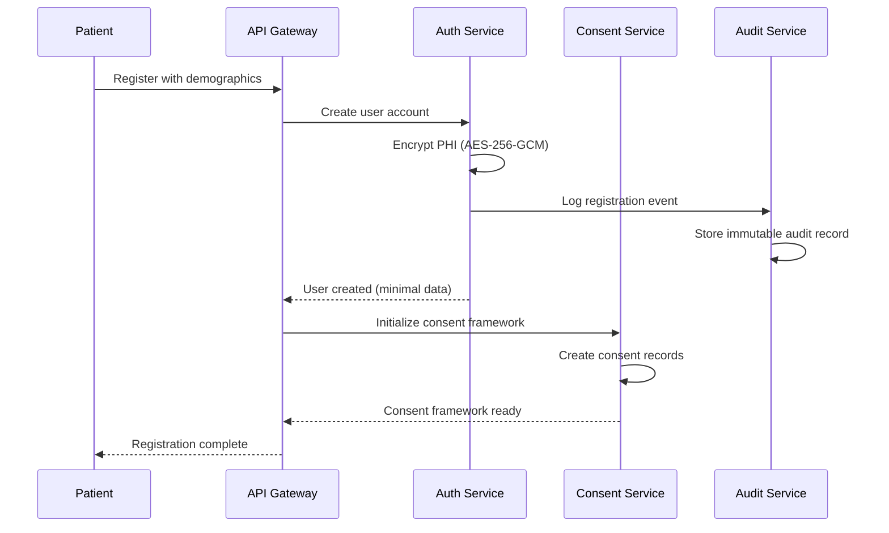
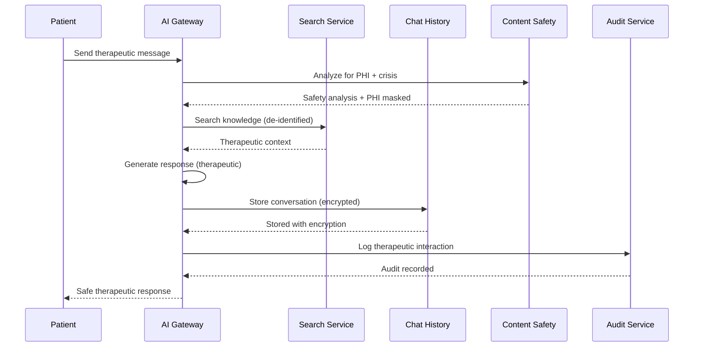

# PHI Data Inventory

> **Complete inventory of Protected Health Information (PHI) within the therapeutic AI system**

## PHI Classification Framework

### Direct Identifiers (High Risk)
| Data Element | Storage Location | Encryption | Lawful Basis | Access Controls |
|---|---|---|---|---|
| **Patient Name** | PostgreSQL `users.full_name` | AES-256-GCM | Treatment/Operations | Healthcare providers only |
| **Patient ID** | PostgreSQL `users.id` (UUID) | AES-256-GCM | Treatment/Operations | All authorized users |
| **Date of Birth** | PostgreSQL `users.date_of_birth` | AES-256-GCM | Treatment | Healthcare providers only |
| **Social Security Number** | PostgreSQL `users.ssn` | AES-256-GCM | Treatment/Payment | Care managers only |
| **Address** | PostgreSQL `users.address` | AES-256-GCM | Treatment/Operations | Care staff + providers |
| **Phone Number** | PostgreSQL `users.phone` | AES-256-GCM | Treatment/Operations | Care staff + providers |
| **Email Address** | PostgreSQL `users.email` | AES-256-GCM | Treatment/Operations | Care staff + providers |
| **Medical Record Number** | PostgreSQL `users.mrn` | AES-256-GCM | Treatment | Healthcare providers only |

### Medical Information (High Risk)
| Data Element | Storage Location | Encryption | Lawful Basis | Access Controls |
|---|---|---|---|---|
| **Medical History** | MongoDB `therapeutic_content.medical_history` | AES-256-GCM | Treatment | Healthcare providers only |
| **Medication Lists** | PostgreSQL `medications` table | AES-256-GCM | Treatment | Healthcare providers only |
| **Allergies** | PostgreSQL `allergies` table | AES-256-GCM | Treatment | Healthcare providers only |
| **Diagnosis Codes** | PostgreSQL `diagnoses` table | AES-256-GCM | Treatment | Healthcare providers only |
| **Treatment Plans** | MongoDB `care_plans` collection | AES-256-GCM | Treatment | Care team + providers |
| **Mental Health Notes** | MongoDB `therapeutic_notes` collection | AES-256-GCM | Treatment | Licensed clinicians only |
| **Crisis Indicators** | Redis `crisis_indicators:{user_id}` | AES-256-GCM | Treatment/Safety | Emergency access only |

### Conversation Data (Medium Risk)
| Data Element | Storage Location | Encryption | Lawful Basis | Access Controls |
|---|---|---|---|---|
| **Chat Messages** | ScyllaDB `conversation_history` | AES-256-GCM | Treatment | Patient + care team |
| **Emotional State** | ScyllaDB `emotion_analysis` | AES-256-GCM | Treatment | Healthcare providers only |
| **Conversation Metadata** | ScyllaDB `conversation_metadata` | AES-256-GCM | Operations | Patient + care team |
| **AI Response Context** | Redis `response_cache:{session_id}` | AES-256-GCM | Treatment | Temporary (TTL: 1 hour) |

### Operational Data (Low Risk)
| Data Element | Storage Location | Encryption | Lawful Basis | Access Controls |
|---|---|---|---|---|
| **Session Tokens** | Redis `sessions:{session_id}` | AES-256-GCM | Operations | Token holder only |
| **Audit Logs** | PostgreSQL `audit_logs` | AES-256-GCM | Compliance | Compliance team only |
| **Usage Metrics** | PostgreSQL `usage_tracking` | AES-256-GCM | Operations | Analytics team |
| **System Logs** | File system `/var/log/` | No PHI | Operations | System administrators |

## Data Flow Mapping

### Patient Registration Flow


### Therapeutic Conversation Flow


## PHI Data Retention

### Retention Schedule
| Data Category | Retention Period | Rationale | Disposal Method |
|---|---|---|---|
| **Patient Demographics** | 7 years post-treatment | HIPAA minimum | Cryptographic erasure |
| **Medical Information** | 7 years post-treatment | HIPAA minimum | Cryptographic erasure |
| **Conversation History** | 7 years post-treatment | Clinical documentation | Cryptographic erasure |
| **Audit Logs** | 6 years minimum | HIPAA requirement | Cryptographic erasure |
| **Session Data** | 2 hours active session | Security requirement | Automatic expiration |
| **Cached Data** | 1-24 hours depending on type | Performance optimization | Automatic expiration |

### Data Minimization Implementation
```python
# Example: Minimum necessary principle
class PHIAccessControl:
    """Implement minimum necessary access to PHI"""
    
    def filter_phi_by_role(self, phi_data: dict, user_role: str, access_purpose: str) -> dict:
        """Filter PHI based on user role and access purpose"""
        
        # Care Staff: Limited access for daily care
        if user_role == "care_staff":
            return {
                "patient_id": phi_data.get("patient_id"),
                "name": phi_data.get("name"),
                "room_number": phi_data.get("room_number"),
                "care_plan_summary": phi_data.get("care_plan_summary"),
                # NO access to detailed medical history
            }
        
        # Healthcare Provider: Clinical access
        elif user_role == "health_provider":
            if access_purpose == "treatment":
                return phi_data  # Full access for treatment
            elif access_purpose == "coordination":
                return {k: v for k, v in phi_data.items() 
                       if k not in ["ssn", "detailed_diagnoses"]}
        
        # Family Member: Delegated access only
        elif user_role == "family_member":
            return {
                "patient_id": phi_data.get("patient_id"),
                "name": phi_data.get("name"),
                "general_status": phi_data.get("general_status"),
                # Very limited access per consent
            }
        
        # Default: No PHI access
        return {"error": "insufficient_permissions"}
```

## Cross-Border Data Transfer

### Data Residency Requirements
| Data Type | Geographic Restriction | Implementation | Compliance |
|---|---|---|---|
| **US Patient Data** | US-only storage | MongoDB Atlas US regions | HIPAA compliance |
| **EU Patient Data** | EU-only storage | MongoDB Atlas EU regions | GDPR compliance |
| **Research Data** | De-identified, any region | Anonymization pipeline | IRB approval |
| **System Logs** | Same region as source | Regional log storage | Local privacy laws |

## Third-Party Data Sharing

### Authorized Data Sharing
| Recipient | Data Shared | Legal Basis | Security Controls | Review Frequency |
|---|---|---|---|---|
| **EHR Systems** | Treatment data only | BAA + Treatment | mTLS + encryption | Quarterly |
| **Emergency Services** | Crisis alerts only | Emergency exception | Secure API | Annual |
| **Family Members** | Consented data only | Patient authorization | Role-based access | Per-consent |
| **Research Partners** | De-identified data | IRB approval | Data use agreement | Annual |

### Prohibited Data Sharing
- ❌ **Marketing purposes**: No PHI for marketing
- ❌ **Non-consented research**: No research without consent
- ❌ **AI model training**: No PHI for model training
- ❌ **Analytics vendors**: No PHI to third-party analytics

## Data Subject Rights Implementation

### Right to Access (§164.524)
```python
class DataSubjectRights:
    """Implementation of patient data subject rights"""
    
    async def export_patient_data(self, patient_id: str, requesting_user_id: str) -> dict:
        """Export all patient data for access request"""
        
        # Validate access authorization
        if not await self.validate_access_request(patient_id, requesting_user_id):
            raise PermissionError("Unauthorized access request")
        
        # Collect data from all sources
        patient_data = {
            "demographics": await self.get_demographics(patient_id),
            "medical_history": await self.get_medical_history(patient_id),
            "conversations": await self.get_conversation_history(patient_id),
            "consent_records": await self.get_consent_history(patient_id),
            "audit_trail": await self.get_patient_audit_trail(patient_id)
        }
        
        # Log access request
        await self.audit_service.log_data_access_request(
            patient_id=patient_id,
            requesting_user=requesting_user_id,
            data_categories=list(patient_data.keys()),
            purpose="patient_data_access_request"
        )
        
        return patient_data
```

### Right to Rectification (§164.526)
```python
async def correct_patient_data(self, patient_id: str, corrections: dict, requesting_user_id: str):
    """Handle patient data correction requests"""
    
    # Validate correction authority
    if not await self.validate_correction_authority(requesting_user_id, patient_id):
        raise PermissionError("Unauthorized correction request")
    
    # Create correction record
    correction_record = {
        "patient_id": patient_id,
        "corrections": corrections,
        "requested_by": requesting_user_id,
        "timestamp": datetime.utcnow(),
        "status": "pending_review"
    }
    
    # Store correction request
    await self.store_correction_request(correction_record)
    
    # Trigger review workflow
    await self.trigger_correction_review(correction_record)
    
    # Log correction request
    await self.audit_service.log_data_correction_request(correction_record)
```

### Right to Erasure (§164.528)
```python
async def delete_patient_data(self, patient_id: str, deletion_scope: str):
    """Secure deletion of patient data"""
    
    # Create deletion audit trail
    deletion_record = {
        "patient_id": patient_id,
        "deletion_scope": deletion_scope,
        "initiated_by": "patient_request",
        "timestamp": datetime.utcnow()
    }
    
    # Cryptographic erasure implementation
    await self.cryptographic_erasure(patient_id, deletion_scope)
    
    # Verify deletion completeness
    verification_result = await self.verify_deletion_completeness(patient_id)
    
    # Log irreversible deletion
    await self.audit_service.log_data_deletion(deletion_record, verification_result)
    
    return verification_result
```

## PHI Discovery and Classification

### Automated PHI Detection
```python
class PHIDetectionEngine:
    """Real-time PHI detection and classification"""
    
    def __init__(self):
        self.phi_patterns = {
            "ssn": r"\b\d{3}-\d{2}-\d{4}\b",
            "phone": r"\b\d{3}-\d{3}-\d{4}\b", 
            "email": r"\b[A-Za-z0-9._%+-]+@[A-Za-z0-9.-]+\.[A-Z|a-z]{2,}\b",
            "date_of_birth": r"\b\d{1,2}/\d{1,2}/\d{4}\b",
            "medical_record": r"\bMRN:\s*\d+\b",
            "account_number": r"\bACCT:\s*\d+\b"
        }
    
    def detect_phi_in_text(self, text: str) -> Dict[str, List[str]]:
        """Detect PHI in conversational text"""
        detected_phi = {}
        
        for phi_type, pattern in self.phi_patterns.items():
            matches = re.findall(pattern, text, re.IGNORECASE)
            if matches:
                detected_phi[phi_type] = matches
        
        return detected_phi
    
    def mask_detected_phi(self, text: str, phi_detections: dict) -> str:
        """Mask detected PHI with appropriate replacements"""
        masked_text = text
        
        for phi_type, matches in phi_detections.items():
            for match in matches:
                if phi_type == "ssn":
                    masked_text = masked_text.replace(match, "***-**-****")
                elif phi_type == "phone":
                    masked_text = masked_text.replace(match, "***-***-****")
                elif phi_type == "email":
                    masked_text = masked_text.replace(match, "***@***.***")
                # ... additional masking rules
        
        return masked_text
```

## Data Loss Prevention (DLP)

### Real-Time PHI Monitoring
| Monitor Type | Scope | Sensitivity | Alert Threshold | Response |
|---|---|---|---|---|
| **PHI in Chat** | All conversations | HIGH | Any detection | Immediate masking + audit |
| **PHI in Logs** | System logs | HIGH | Any detection | Log redaction + investigation |
| **PHI in Exports** | Data exports | HIGH | Unauthorized access | Export blocking + alert |
| **PHI in APIs** | API responses | HIGH | Unexpected exposure | Response filtering + audit |

### Data Leak Detection
```python
class DataLeakPrevention:
    """Prevent PHI from leaking through various channels"""
    
    async def scan_outbound_data(self, data: str, context: str) -> tuple[str, bool]:
        """Scan outbound data for PHI leaks"""
        
        # Detect PHI patterns
        phi_detected = self.phi_detector.detect_phi_in_text(data)
        
        if phi_detected:
            # Log potential leak
            await self.audit_service.log_potential_phi_leak(
                data_sample=data[:100],  # Limited sample for audit
                phi_types=list(phi_detected.keys()),
                context=context,
                severity="HIGH"
            )
            
            # Mask PHI
            masked_data = self.phi_detector.mask_detected_phi(data, phi_detected)
            
            # Alert security team for investigation
            await self.security_alert_service.send_phi_leak_alert(
                phi_types=list(phi_detected.keys()),
                context=context
            )
            
            return masked_data, True  # PHI detected and masked
        
        return data, False  # No PHI detected
```

## International Compliance

### GDPR Compliance (EU Patients)
| GDPR Article | Implementation | Evidence/Link | Status |
|---|---|---|---|
| **Art. 7: Consent** | Granular consent with withdrawal | [Consent Service](../microservices/consent/README.md) | ✅ |
| **Art. 15: Right to Access** | Patient data export functionality | [Data Export API](../ai_services/core/data_export.py) | ✅ |
| **Art. 16: Right to Rectification** | Data correction workflows | [Correction Service](../microservices/consent/corrections.go) | ✅ |
| **Art. 17: Right to Erasure** | Cryptographic deletion | [Secure Deletion](../ai_services/core/secure_deletion.py) | ✅ |
| **Art. 20: Data Portability** | Structured data export | [Portability API](../ai_services/core/data_portability.py) | ✅ |
| **Art. 25: Data Protection by Design** | Privacy-first architecture | [Privacy Architecture](../docs/security/Privacy_by_Design.md) | ✅ |

### CCPA Compliance (California Patients)
| CCPA Section | Implementation | Evidence/Link | Status |
|---|---|---|---|
| **§1798.100: Right to Know** | Data collection transparency | [Privacy Notice](../docs/compliance/Privacy_Notice.md) | ✅ |
| **§1798.105: Right to Delete** | Secure deletion capabilities | [Deletion Service](../ai_services/core/secure_deletion.py) | ✅ |
| **§1798.110: Right to Access** | Personal information access | [Data Access API](../ai_services/core/data_export.py) | ✅ |
| **§1798.115: Right to Portability** | Machine-readable exports | [Data Portability](../ai_services/core/data_portability.py) | ✅ |

## Emergency Access Controls

### Break-Glass PHI Access
| Emergency Type | Access Scope | Approval Required | Audit Requirements | Notification |
|---|---|---|---|---|
| **Life-Threatening Crisis** | Full patient record | Post-facto review | Enhanced audit + justification | Immediate |
| **Urgent Medical Care** | Treatment-relevant data | Supervisor approval | Standard audit + purpose | 1 hour |
| **System Emergency** | Technical metadata only | Manager approval | Technical audit only | 4 hours |
| **Legal/Compliance** | Specific data request | Legal approval | Legal hold audit | 24 hours |

### Emergency Access Implementation
```go
// Emergency access with enhanced audit trails
func (e *EmergencyAccessService) GrantEmergencyAccess(
    requesterID string,
    patientID string, 
    emergencyType EmergencyType,
    justification string,
) (*EmergencyAccessGrant, error) {
    
    // Create emergency access record
    accessGrant := &EmergencyAccessGrant{
        ID: uuid.New(),
        RequesterID: requesterID,
        PatientID: patientID,
        EmergencyType: emergencyType,
        Justification: justification,
        GrantedAt: time.Now(),
        ExpiresAt: time.Now().Add(e.getAccessDuration(emergencyType)),
        Status: "active",
    }
    
    // Store emergency access grant
    if err := e.db.Create(accessGrant).Error; err != nil {
        return nil, fmt.Errorf("failed to grant emergency access: %w", err)
    }
    
    // Enhanced audit logging for emergency access
    auditEvent := &AuditEvent{
        UserID: requesterID,
        EventType: "emergency_access_granted",
        ResourceType: "patient_phi",
        ResourceID: patientID,
        AdditionalContext: map[string]interface{}{
            "emergency_type": emergencyType,
            "justification": justification,
            "access_expires_at": accessGrant.ExpiresAt,
            "minimum_necessary_applied": true,
        },
        Severity: "HIGH",
        RequiresReview: true,
    }
    
    // Immediate notification to compliance team
    if err := e.notificationService.SendEmergencyAccessAlert(auditEvent); err != nil {
        e.logger.Error("Failed to send emergency access alert", "error", err)
    }
    
    return accessGrant, nil
}
```

## Compliance Monitoring

### Real-Time PHI Monitoring
| Monitor | Frequency | Automated Response | Manual Review |
|---|---|---|---|
| **Unauthorized PHI Access** | Real-time | Block access + alert | Daily review |
| **PHI in System Logs** | Real-time | Log redaction | Daily review |
| **Bulk PHI Exports** | Real-time | Require approval | Immediate review |
| **Cross-Border Transfers** | Real-time | Block + alert | Immediate review |
| **Consent Violations** | Real-time | Block access + audit | Daily review |

### Monthly PHI Audit
```sql
-- Monthly PHI access audit query
SELECT 
    u.email as healthcare_provider,
    COUNT(DISTINCT al.resource_id) as patients_accessed,
    COUNT(al.id) as total_phi_accesses,
    STRING_AGG(DISTINCT al.access_purpose, ', ') as access_purposes,
    MAX(al.timestamp) as last_access
FROM audit_logs al
JOIN users u ON al.user_id = u.id
WHERE al.event_type = 'phi_access'
  AND al.timestamp >= NOW() - INTERVAL '1 month'
  AND u.role IN ('health_provider', 'care_staff', 'case_manager')
GROUP BY u.id, u.email
ORDER BY total_phi_accesses DESC;
```

---

**Privacy Impact Assessment**: Completed 2025-08-01  
**Next Privacy Review**: 2025-10-01  
**Maintained By**: Compliance Team + Privacy Officer