# Backup and Recovery Guide

> **Comprehensive data protection and disaster recovery procedures for healthcare AI platform**

## Table of Contents

1. [Backup Strategy](#backup-strategy)
2. [Recovery Objectives](#recovery-objectives)
3. [Database Backup Procedures](#database-backup-procedures)
4. [Disaster Recovery](#disaster-recovery)
5. [Testing and Validation](#testing-and-validation)
6. [Compliance Requirements](#compliance-requirements)

## Backup Strategy

### Data Classification

| Data Category | Example | Backup Frequency | Retention | Recovery Priority |
|---------------|---------|------------------|-----------|-------------------|
| **Critical PHI** | Patient medical records | Continuous + Daily | 7 years | RTO: 15 minutes |
| **Audit Logs** | HIPAA compliance trails | Real-time replication | Permanent | RTO: 5 minutes |
| **User Data** | Profiles, preferences | Daily | 7 years | RTO: 1 hour |
| **Application Data** | Conversations, sessions | Daily + Transaction logs | 7 years | RTO: 30 minutes |
| **System Config** | Service configurations | On change | 1 year | RTO: 30 minutes |
| **AI Models** | Trained models, weights | Weekly | 1 year | RTO: 4 hours |

### Backup Architecture

```mermaid
flowchart TB
    subgraph "Production Databases"
        PG_PRIMARY[🐘 PostgreSQL Primary<br/>PHI + Audit Data]
        MONGO_PRIMARY[🍃 MongoDB Primary<br/>Knowledge Base]
        REDIS_PRIMARY[⚡ Redis Primary<br/>Sessions + Cache]
        SCYLLA_PRIMARY[🏛️ ScyllaDB Primary<br/>Chat History]
    end
    
    subgraph "Backup Infrastructure"
        BACKUP_SCHEDULER[⏰ Backup Scheduler<br/>Kubernetes CronJobs]
        BACKUP_STORAGE[💾 Backup Storage<br/>Encrypted S3 Buckets]
        BACKUP_MONITOR[📊 Backup Monitor<br/>Validation + Alerts]
    end
    
    subgraph "Off-Site Storage"
        GEO_BACKUP[🌍 Geographic Backup<br/>Cross-Region Replication]
        TAPE_ARCHIVE[📼 Tape Archive<br/>Long-term Retention]
        COMPLIANCE_VAULT[🔒 Compliance Vault<br/>Legal Hold Storage]
    end
    
    PG_PRIMARY --> BACKUP_SCHEDULER
    MONGO_PRIMARY --> BACKUP_SCHEDULER
    REDIS_PRIMARY --> BACKUP_SCHEDULER
    SCYLLA_PRIMARY --> BACKUP_SCHEDULER
    
    BACKUP_SCHEDULER --> BACKUP_STORAGE
    BACKUP_STORAGE --> BACKUP_MONITOR
    
    BACKUP_STORAGE --> GEO_BACKUP
    GEO_BACKUP --> TAPE_ARCHIVE
    TAPE_ARCHIVE --> COMPLIANCE_VAULT
    
    style PG_PRIMARY fill:#e3f2fd
    style BACKUP_STORAGE fill:#e8f5e8
    style COMPLIANCE_VAULT fill:#ffebee
```



## Recovery Objectives

### RTO/RPO Targets

| Service Tier | RTO (Recovery Time) | RPO (Data Loss) | Business Impact |
|-------------|--------------------|--------------------|-----------------|
| **Tier 1 - Critical** | 15 minutes | 5 minutes | Patient safety risk |
| **Tier 2 - Essential** | 1 hour | 15 minutes | Service degradation |
| **Tier 3 - Important** | 4 hours | 1 hour | Feature unavailable |
| **Tier 4 - Standard** | 24 hours | 4 hours | Minor impact |

### Service Tier Classification

**Tier 1 - Critical (Patient Safety)**:
- Audit Logging Service (microservices/audit-logging:8084)
- Content Safety Service (microservices/content-safety:8007) 
- Emergency Access Service (microservices/emergency-access:8085)
- PostgreSQL (PHI data in chatbot_compliance schema)

**Tier 2 - Essential (Core Platform)**:
- API Gateway (microservices/api-gateway:8090)
- Auth/RBAC Service (microservices/auth-rbac:8080)
- AI Gateway (ai_services/main.py:8000)
- Consent Management (microservices/consent:8083)

**Tier 3 - Important (User Experience)**:
- Chat History Service (microservices/chat-history:8002)
- Search Services (ai_services/core/intelligent_data_router.py)
- MongoDB (therapeutic_content collection)
- Redis (therapeutic cache L1/L2/L3)
- ScyllaDB (conversation analytics)

**Tier 4 - Supporting Services**:
- Embedding Service (ai_services/core:8005)
- Generation Service (ai_services/core:8006) 
- BGE Host (host_services:8008)
- Qwen Host (host_services:8009)
- Billing Service (microservices/billing:8081)
- Background Tasks (microservices/background-tasks:8086)
- Relationship Management (microservices/relationship-management:8087)
- User Subscription (microservices/user-subscription:8088)

## Database Backup Procedures

### PostgreSQL Backup

**Continuous Backup (WAL-E/WAL-G)**:
```bash
# Configure continuous archiving
# postgresql.conf
archive_mode = on
archive_command = 'wal-g wal-push %p'
archive_timeout = 60s

# Daily full backup
wal-g backup-push /var/lib/postgresql/data

# Point-in-time recovery capability
wal-g backup-list
```

**Daily Backup Script**:
```bash
#!/bin/bash
# Production PostgreSQL backup

export PGPASSWORD="${POSTGRES_PASSWORD}"
export BACKUP_DATE=$(date +%Y%m%d_%H%M%S)
export BACKUP_PATH="/backups/postgresql"

# Create encrypted backup of all 5 schemas
pg_dump -h postgresql-primary -U postgres \
  --format=custom \
  --compress=9 \
  --verbose \
  --schema=chatbot_auth \
  --schema=chatbot_compliance \
  --schema=chatbot_app \
  --schema=chatbot_memory \
  --schema=chatbot_knowledge \
  therapeutic_ai \
  | gpg --cipher-algo AES256 --compress-algo 1 --symmetric \
  > "${BACKUP_PATH}/therapeutic_ai_5schemas_${BACKUP_DATE}.dump.gpg"

# Verify backup integrity
if [ $? -eq 0 ]; then
    echo "Backup completed successfully: ${BACKUP_DATE}"
    
    # Upload to S3 with encryption
    aws s3 cp "${BACKUP_PATH}/therapeutic_ai_${BACKUP_DATE}.dump.gpg" \
      "s3://therapeutic-ai-backups/postgresql/${BACKUP_DATE}/" \
      --server-side-encryption AES256
    
    # Update backup metadata
    echo "${BACKUP_DATE}" > "${BACKUP_PATH}/latest_backup.txt"
else
    echo "Backup failed: ${BACKUP_DATE}"
    # Alert on-call engineer
    curl -X POST "${PAGERDUTY_API}/incidents" \
      -d '{"type": "backup_failure", "service": "postgresql"}'
fi
```

### MongoDB Backup

**Replica Set Backup**:
```bash
#!/bin/bash
# MongoDB backup with --oplog for consistency

export BACKUP_DATE=$(date +%Y%m%d_%H%M%S)
export BACKUP_PATH="/backups/mongodb"

# Create consistent backup with oplog
mongodump --host mongodb-primary:27017 \
  --username admin \
  --password "${MONGODB_PASSWORD}" \
  --authenticationDatabase admin \
  --db therapeutic_ai \
  --oplog \
  --gzip \
  --out "${BACKUP_PATH}/${BACKUP_DATE}"

# Encrypt and upload
tar -czf - "${BACKUP_PATH}/${BACKUP_DATE}" \
  | gpg --cipher-algo AES256 --symmetric \
  | aws s3 cp - "s3://therapeutic-ai-backups/mongodb/${BACKUP_DATE}/backup.tar.gz.gpg"
```

### Redis Backup

**RDB + AOF Backup**:
```bash
#!/bin/bash
# Redis backup with both RDB and AOF

export BACKUP_DATE=$(date +%Y%m%d_%H%M%S)

# Trigger RDB snapshot
redis-cli -h redis-primary BGSAVE

# Copy RDB and AOF files
kubectl cp redis-primary:/data/dump.rdb "/backups/redis/${BACKUP_DATE}/dump.rdb"
kubectl cp redis-primary:/data/appendonly.aof "/backups/redis/${BACKUP_DATE}/appendonly.aof"

# Encrypt and upload
tar -czf - "/backups/redis/${BACKUP_DATE}" \
  | gpg --cipher-algo AES256 --symmetric \
  | aws s3 cp - "s3://therapeutic-ai-backups/redis/${BACKUP_DATE}/backup.tar.gz.gpg"
```

### ScyllaDB Backup

**Snapshot Backup**:
```bash
#!/bin/bash
# ScyllaDB cluster backup

export BACKUP_DATE=$(date +%Y%m%d_%H%M%S)
export KEYSPACE="therapeutic_ai"

# Create snapshot on all nodes
for node in scylla-0 scylla-1 scylla-2; do
    kubectl exec -it $node -- nodetool snapshot $KEYSPACE
done

# Copy snapshot data
kubectl exec -it scylla-0 -- tar -czf /tmp/snapshot.tar.gz /var/lib/scylla/data/snapshots/

# Upload encrypted backup
kubectl cp scylla-0:/tmp/snapshot.tar.gz "/backups/scylladb/${BACKUP_DATE}/snapshot.tar.gz"
gpg --cipher-algo AES256 --symmetric "/backups/scylladb/${BACKUP_DATE}/snapshot.tar.gz"
```

## Disaster Recovery

### DR Site Architecture

**Multi-Region Setup**:

```mermaid
flowchart TB
    subgraph "Primary Region (US-East)"
        PRIMARY_CLUSTER[🏥 Primary Kubernetes Cluster<br/>Full Production Stack]
        PRIMARY_DB[💾 Primary Databases<br/>Live PHI Data]
    end
    
    subgraph "DR Region (US-West)"  
        DR_CLUSTER[🔄 DR Kubernetes Cluster<br/>Standby Infrastructure]
        DR_DB[💾 DR Databases<br/>Replicated Data]
    end
    
    subgraph "Backup Storage"
        S3_PRIMARY[☁️ S3 Primary<br/>Encrypted Backups]
        S3_DR[☁️ S3 DR Region<br/>Cross-Region Sync]
    end
    
    PRIMARY_CLUSTER -.->|Real-time Replication| DR_CLUSTER
    PRIMARY_DB -.->|Streaming Replication| DR_DB
    PRIMARY_CLUSTER -->|Encrypted Backups| S3_PRIMARY
    S3_PRIMARY -.->|Cross-Region Sync| S3_DR
    
    style PRIMARY_CLUSTER fill:#e3f2fd
    style DR_CLUSTER fill:#fff3e0
    style S3_PRIMARY fill:#e8f5e8
```


### Failover Procedures

**Automatic Failover Triggers**:
- Primary region availability <90% for >10 minutes
- Database primary node failure
- Network partition affecting >50% of services
- Security incident requiring regional isolation

**Manual Failover Process**:
```bash
# 1. Declare disaster (management approval required)
echo "DISASTER DECLARED: $(date)" > /tmp/disaster-declaration.txt

# 2. Promote DR region to primary
kubectl config use-context dr-region-cluster
kubectl patch service api-gateway -p '{"spec":{"type":"LoadBalancer"}}'

# 3. Promote DR databases to primary
kubectl exec -it postgres-dr-0 -- pg_promote
kubectl exec -it mongodb-dr-0 -- rs.stepDown()

# 4. Update DNS to point to DR region
aws route53 change-resource-record-sets \
  --hosted-zone-id Z123456789 \
  --change-batch file://dr-dns-failover.json

# 5. Validate DR system health
make health-check-dr-region
make test-hipaa-dr-region

# 6. Notify stakeholders
# Send DR activation notification to all stakeholders
```

### Recovery Testing

**Monthly DR Drills**:
```bash
# Automated DR test (non-disruptive)
make test-dr-failover-simulation

# Quarterly full DR exercise  
make test-dr-full-failover

# Annual business continuity test
make test-business-continuity-full
```

## Testing and Validation

### Backup Validation

**Daily Backup Tests**:
```bash
#!/bin/bash
# Automated backup validation

# Test PostgreSQL backup integrity
export TEST_DB="test_restore_$(date +%s)"
pg_restore --create --dbname="${TEST_DB}" latest_backup.dump

# Verify data consistency
psql -d "${TEST_DB}" -c "SELECT COUNT(*) FROM users;"
psql -d "${TEST_DB}" -c "SELECT COUNT(*) FROM audit_logs;"

# Cleanup test database
dropdb "${TEST_DB}"
```

**Recovery Time Testing**:
```bash
# Measure actual recovery times
time make restore-postgresql-from-backup
time make restore-mongodb-from-backup
time make restore-full-system

# Validate against RTO targets
if [ $RECOVERY_TIME -gt $RTO_TARGET ]; then
    echo "RTO target missed: ${RECOVERY_TIME}s > ${RTO_TARGET}s"
    # Alert operations team
fi
```

### Data Integrity Validation

**Post-Recovery Validation**:
```bash
# 1. Database consistency checks
make validate-database-integrity

# 2. Application functionality tests
make test-critical-workflows

# 3. HIPAA compliance verification
make test-hipaa-post-recovery

# 4. Performance baseline validation
make test-performance-post-recovery
```

## Compliance Requirements

### HIPAA Backup Requirements

**Technical Safeguards §164.308(a)(7)**:
- **Data Backup Plan**: Documented procedures for PHI backup
- **Disaster Recovery Plan**: Tested procedures for PHI recovery
- **Emergency Mode Operation**: Critical services during disasters
- **Testing Procedures**: Regular validation of backup/recovery

### Audit Trail Protection

**Backup Audit Requirements**:
```sql
-- Audit backup operations
INSERT INTO audit_logs (
    event_type,
    user_id,
    action,
    resource,
    description,
    phi_accessed,
    compliance_context
) VALUES (
    'backup_operation',
    'system',
    'database_backup_completed',
    'postgresql_primary',
    'Daily encrypted backup to S3',
    false,
    'hipaa_164_308_a_7'
);
```

### Encryption Requirements

**Backup Encryption Standards**:
- **Algorithm**: AES-256-GCM for data at rest
- **Key Management**: Hardware Security Module (HSM)
- **Key Rotation**: 90-day rotation cycle
- **Access Control**: Role-based access to backup decryption keys

```bash
# Backup encryption example
gpg --cipher-algo AES256 \
    --compress-algo 2 \
    --cert-digest-algo SHA512 \
    --symmetric \
    --output backup.sql.gpg \
    backup.sql
```

## Backup Automation

### Kubernetes CronJobs

**PostgreSQL Backup CronJob**:
```yaml
apiVersion: batch/v1
kind: CronJob
metadata:
  name: postgresql-backup
spec:
  schedule: "0 2 * * *"  # Daily at 2 AM
  jobTemplate:
    spec:
      template:
        spec:
          containers:
          - name: pg-backup
            image: postgres:15
            command:
            - /bin/bash
            - -c
            - |
              pg_dump $POSTGRES_URL \
                --format=custom \
                --compress=9 \
                | gpg --symmetric \
                | aws s3 cp - s3://backups/postgresql/$(date +%Y%m%d)/backup.dump.gpg
            env:
            - name: POSTGRES_URL
              valueFrom:
                secretKeyRef:
                  name: database-secrets
                  key: postgres-url
          restartPolicy: OnFailure
```

### Backup Monitoring

**Backup Success Tracking**:
```prometheus
# Backup completion metrics
backup_completion_time{database="postgresql"} - Last successful backup timestamp
backup_size_bytes{database="postgresql"} - Backup file size
backup_duration_seconds{database="postgresql"} - Backup operation duration
backup_failures_total{database="postgresql"} - Failed backup count
```

**Backup Alerts**:
```yaml
# Missing backup alert
- alert: BackupNotCompleted
  expr: time() - backup_completion_time > 86400  # 24 hours
  labels:
    severity: high
    team: devops
  annotations:
    summary: "Database backup overdue"
    description: "{{ $labels.database }} backup not completed in 24 hours"

# Backup failure alert  
- alert: BackupFailure
  expr: increase(backup_failures_total[1h]) > 0
  labels:
    severity: critical
    team: devops
  annotations:
    summary: "Database backup failed"
    description: "{{ $labels.database }} backup failure - immediate attention required"
```

## Recovery Procedures

### PostgreSQL Recovery

**Point-in-Time Recovery**:
```bash
# 1. Stop PostgreSQL service
kubectl scale statefulset postgresql --replicas=0

# 2. Restore base backup
pg_restore --create --dbname=therapeutic_ai /backups/postgresql/latest.dump

# 3. Apply WAL files for point-in-time recovery
export RECOVERY_TARGET_TIME="2025-09-01 12:00:00"
pg_ctl start -D /var/lib/postgresql/data -o "-c recovery_target_time='${RECOVERY_TARGET_TIME}'"

# 4. Verify recovery success
psql -d therapeutic_ai -c "SELECT pg_is_in_recovery();"

# 5. Resume normal operations
kubectl scale statefulset postgresql --replicas=3
```

**Emergency Recovery (Under 15 minutes)**:
```bash
# Quick recovery procedure for critical outages
# 1. Use latest validated backup (pre-tested)
aws s3 cp s3://backups/postgresql/validated/latest.dump.gpg /tmp/
gpg --decrypt /tmp/latest.dump.gpg > /tmp/latest.dump

# 2. Fast restore (parallel)
pg_restore --jobs=4 --create /tmp/latest.dump

# 3. Immediate health validation
psql -c "SELECT COUNT(*) FROM users; SELECT COUNT(*) FROM audit_logs;"
```

### MongoDB Recovery

**Replica Set Recovery**:
```bash
# 1. Stop MongoDB service
kubectl scale statefulset mongodb --replicas=0

# 2. Restore from backup
mongorestore --host mongodb-primary:27017 \
  --username admin \
  --password "${MONGODB_PASSWORD}" \
  --authenticationDatabase admin \
  --gzip \
  --drop \
  /backups/mongodb/latest/

# 3. Rebuild vector search indexes
mongo therapeutic_ai --eval "
  db.therapeutic_content.createIndex({'embedding': 'vector'}, {'vectorOptions': {'dimensions': 1024}});
  db.therapeutic_content.createIndex({'created_at': 1});
  db.therapeutic_content.createIndex({'organization_id': 1});
  db.therapeutic_content.createIndex({'content_type': 1});
  db.therapeutic_content.createIndex({'therapeutic_category': 1});
"

# 4. Verify data integrity and vector embeddings
mongo therapeutic_ai --eval "
  print('Total documents:', db.therapeutic_content.countDocuments());
  print('Documents with embeddings:', db.therapeutic_content.countDocuments({'embedding': {'$ne': null}}));
  print('Therapeutic categories:', db.therapeutic_content.distinct('therapeutic_category').length);
"
```

## Compliance and Audit

### Recovery Audit Trail

**Recovery Event Logging**:
```sql
-- Log all recovery operations
INSERT INTO audit_logs (
    event_type,
    user_id,
    action,
    resource,
    description,
    metadata,
    compliance_context
) VALUES (
    'disaster_recovery',
    'system_admin',
    'database_recovery_initiated',
    'postgresql_primary',
    'Point-in-time recovery to 2025-09-01 12:00:00',
    '{"recovery_type": "PITR", "backup_date": "2025-09-01", "rto_target": "15min"}',
    'hipaa_164_308_a_7_disaster_recovery'
);
```

### Compliance Reporting

**Monthly Backup Reports**:
- Backup success rate (target: 100%)
- Recovery time test results (vs RTO targets)
- Data integrity validation results
- Encryption compliance status

**Annual DR Testing Report**:
- Full disaster recovery exercise results
- RTO/RPO achievement vs targets
- Business continuity validation
- Compliance audit findings

## Troubleshooting

### Common Backup Issues

**Issue**: Backup failures due to storage space
```bash
# Diagnosis
df -h /backups
aws s3 ls s3://therapeutic-ai-backups --summarize

# Resolution
# 1. Clean up old backups (beyond retention)
find /backups -name "*.dump" -mtime +2555 -delete  # 7 years

# 2. Compress existing backups
gzip /backups/postgresql/*.dump

# 3. Expand storage if needed
kubectl patch pvc backup-storage -p '{"spec":{"resources":{"requests":{"storage":"2Ti"}}}}'
```

**Issue**: Slow backup performance
```bash
# Diagnosis
iostat -x 1 5  # Check I/O performance during backup
pg_stat_progress_basebackup  # PostgreSQL backup progress

# Resolution
# 1. Use parallel backup
pg_dump --jobs=4 --format=directory

# 2. Optimize backup timing
# Schedule during low-usage hours (2-4 AM)

# 3. Use incremental backups
# Implement WAL-based incremental backup strategy
```

**Issue**: Recovery validation failures
```bash
# Diagnosis
make validate-backup-integrity
tail -f /var/log/backup-validation.log

# Resolution
# 1. Re-run backup with verification
pg_dump --verbose --format=custom | tee backup.dump | pg_restore --list

# 2. Test restore in isolated environment
# 3. Update backup procedures if systematic issues found
```

---

**Backup Strategy Version**: 2.0  
**Last DR Test**: 2025-08-01  
**Next DR Exercise**: 2025-11-01  
**Maintained By**: DevOps Team + Compliance Team