# Monitoring and Alerting Guide

> **Comprehensive observability setup for healthcare AI platform with HIPAA-compliant monitoring**

## Table of Contents

1. [Monitoring Strategy](#monitoring-strategy)
2. [Service Level Objectives](#service-level-objectives)
3. [Metrics Collection](#metrics-collection)
4. [Logging Architecture](#logging-architecture)
5. [Alerting Framework](#alerting-framework)
6. [Dashboards](#dashboards)
7. [Compliance Monitoring](#compliance-monitoring)

## Monitoring Strategy

### Three Pillars of Observability

```mermaid
flowchart TB
    subgraph "Observability Stack"
        METRICS[📊 Metrics<br/>Prometheus + Grafana<br/>Performance KPIs]
        LOGS[📝 Logs<br/>Structured Logging<br/>ELK Stack]
        TRACES[🔍 Traces<br/>OpenTelemetry<br/>Distributed Tracing]
    end
    
    subgraph "Healthcare-Specific Monitoring"
        HIPAA[🏥 HIPAA Compliance<br/>Audit Trail Monitoring]
        SAFETY[🛡️ Patient Safety<br/>Crisis Detection Monitoring]
        CLINICAL[👩‍⚕️ Clinical Metrics<br/>Therapeutic Outcome Tracking]
    end
    
    METRICS --> HIPAA
    LOGS --> SAFETY
    TRACES --> CLINICAL
    
    style METRICS fill:#e3f2fd
    style LOGS fill:#e8f5e8
    style TRACES fill:#fff3e0
    style HIPAA fill:#ffebee
```



### Monitoring Principles

1. **Patient Safety First**: Critical alerts for any safety-impacting issues
2. **HIPAA Compliance**: Continuous compliance monitoring and automated reporting
3. **Proactive Detection**: Identify issues before they impact patients
4. **Privacy-Preserving**: Monitor without exposing PHI in metrics/logs
5. **Actionable Alerts**: Every alert must have clear resolution procedures

## Service Level Objectives

### Application SLOs

| Service | Availability | Response Time | Error Rate | Compliance |
|---------|-------------|---------------|------------|------------|
| **API Gateway** | 99.9% | <100ms (p95) | <1% | 100% audit coverage |
| **Auth/RBAC** | 99.95% | <50ms (p95) | <0.1% | 100% audit coverage |
| **AI Gateway** | 99.5% | <2000ms (p95) | <2% | 100% safety checks |
| **Search Service** | 99.5% | <500ms (p95) | <1% | 100% access control |
| **Content Safety** | 99.9% | <100ms (p95) | <0.1% | 100% crisis detection |
| **Audit Logging** | 99.99% | <50ms (p95) | <0.01% | 100% immutability |
| **Chat History** | 99.9% | <100ms (p95) | <1% | 100% audit coverage |
| **Embedding Service** | 99.5% | <1000ms (p95) | <2% | N/A |
| **Generation Service** | 99.5% | <2000ms (p95) | <2% | 100% safety checks |
| **BGE Host** | 99.0% | <800ms (p95) | <3% | N/A |
| **Qwen Host** | 99.0% | <1500ms (p95) | <3% | 100% safety checks |
| **Billing Service** | 99.9% | <100ms (p95) | <0.5% | 100% audit coverage |

### Infrastructure SLOs

| Component | Availability | Performance | Backup |
|-----------|-------------|-------------|---------|
| **PostgreSQL** | 99.95% | <10ms read, <50ms write | Daily + PITR |
| **MongoDB** | 99.9% | <20ms read, <100ms write | Daily + incremental |
| **Redis** | 99.9% | <1ms read, <5ms write | Snapshot + AOF |
| **ScyllaDB** | 99.9% | <5ms read, <10ms write | Continuous backup |

## Metrics Collection

### Application Metrics

**Request Metrics**:
```prometheus
# HTTP request duration
http_request_duration_seconds{service="api-gateway", endpoint="/api/v1/chat", method="POST"}

# Request rate
http_requests_total{service="api-gateway", status="200"}

# Error rate
http_requests_total{service="api-gateway", status="500"}
```

**Business Metrics**:
```prometheus
# Healthcare-specific metrics
therapeutic_conversations_total{user_type="senior", outcome="successful"}
crisis_detections_total{severity="high", escalated="true"}
phi_access_events_total{role="healthcare_provider", authorized="true"}
consent_validations_total{outcome="approved"}
```

**AI/ML Metrics**:
```prometheus
# AI performance metrics
ai_model_inference_duration_seconds{model="qwen2.5-7b", operation="generation", host="qwen-host:8009"}
rag_retrieval_accuracy{search_type="semantic", k="5", confidence_threshold="0.7"}
embedding_generation_duration_seconds{model="bge-large-en-v1.5", host="bge-host:8008"}
safety_analysis_duration_seconds{analyzer="crisis_detection", service="content-safety:8007"}
confidence_optimization_improvement{cache_tier="L1", hit_rate="85+"}
search_routing_efficiency{strategy="confidence_based", improvement_percentage="77-99"}
```

### Infrastructure Metrics

**Resource Utilization**:
```prometheus
# Container resource usage
container_cpu_usage_seconds_total{container="api-gateway"}
container_memory_usage_bytes{container="ai-gateway"}

# Database performance
postgres_connections_active{database="therapeutic_ai"}
mongodb_operations_total{type="query", collection="therapeutic_content"}
redis_commands_total{command="get"}
scylladb_writes_total{keyspace="chat_history"}
```

## Logging Architecture

### Structured Logging Format

**Standard Log Format** (JSON):
```json
{
  "timestamp": "2025-09-01T12:00:00.000Z",
  "level": "info",
  "service": "api-gateway",
  "correlation_id": "123e4567-e89b-12d3-a456-426614174000",
  "user_id": "456e7890-e89b-12d3-a456-426614174000",
  "event": "therapeutic_conversation_started",
  "context": {
    "session_id": "789e0123-e89b-12d3-a456-426614174000",
    "user_role": "senior",
    "conversation_type": "wellness_check"
  },
  "duration_ms": 1250,
  "success": true
}
```

**HIPAA-Compliant Logging**:
```json
{
  "timestamp": "2025-09-01T12:00:00.000Z",
  "level": "audit",
  "service": "audit-logging",
  "event_type": "phi_access",
  "user_id": "456e7890-e89b-12d3-a456-426614174000",
  "patient_id": "hash:a1b2c3d4e5f6...",  # Hashed for privacy
  "access_purpose": "treatment_coordination",
  "data_accessed": ["medical_history", "medication_list"],
  "relationship_verified": true,
  "audit_id": "abc12345-e89b-12d3-a456-426614174000"
}
```

### Log Aggregation

**ELK Stack Configuration**:
```yaml
# Elasticsearch index template for healthcare logs
PUT _index_template/healthcare-logs
{
  "index_patterns": ["healthcare-logs-*"],
  "template": {
    "settings": {
      "number_of_shards": 3,
      "number_of_replicas": 1,
      "index.lifecycle.name": "healthcare-logs-policy"
    },
    "mappings": {
      "properties": {
        "@timestamp": {"type": "date"},
        "service": {"type": "keyword"},
        "level": {"type": "keyword"},
        "user_id": {"type": "keyword"},
        "event": {"type": "keyword"},
        "phi_accessed": {"type": "boolean"},
        "audit_id": {"type": "keyword"}
      }
    }
  }
}
```

## Alerting Framework

### Critical Alerts (P0 - Immediate Response)

**Patient Safety Alerts**:
```yaml
# Crisis detection system down
- alert: CrisisDetectionSystemDown
  expr: up{service="content-safety"} == 0
  for: 30s
  labels:
    severity: critical
    team: clinical
  annotations:
    summary: "Crisis detection system unavailable"
    description: "Content safety service down - patient crisis detection disabled"
    runbook: "docs/operations/Runbooks.md#content-safety-issues"
    escalation: "immediate"

# High crisis detection volume
- alert: HighCrisisDetectionVolume
  expr: increase(crisis_detections_total[5m]) > 10
  labels:
    severity: critical
    team: clinical
  annotations:
    summary: "Unusual crisis detection volume"
    description: "Multiple crisis situations detected - check for system issues"
```

**HIPAA Compliance Alerts**:
```yaml
# Audit logging failure
- alert: AuditLoggingFailure
  expr: increase(audit_events_failed_total[1m]) > 0
  labels:
    severity: critical
    team: compliance
  annotations:
    summary: "Audit logging failures detected"
    description: "HIPAA audit trail compromised - immediate investigation required"
    
# Unauthorized PHI access
- alert: UnauthorizedPHIAccess
  expr: increase(phi_access_denied_total[1m]) > 5
  labels:
    severity: critical
    team: security
  annotations:
    summary: "Multiple unauthorized PHI access attempts"
    description: "Potential security incident - investigate access patterns"
```

### High Priority Alerts (P1 - 15 minute response)

**Performance Degradation**:
```yaml
# High response times
- alert: HighResponseTimes
  expr: histogram_quantile(0.95, rate(http_request_duration_seconds_bucket[5m])) > 2.0
  for: 5m
  labels:
    severity: high
    team: platform
  annotations:
    summary: "High API response times detected"
    description: "95th percentile response time > 2s for {{ $labels.service }}"

# Database connection issues
- alert: DatabaseConnectionExhaustion
  expr: postgres_connections_active / postgres_connections_max > 0.9
  for: 2m
  labels:
    severity: high
    team: platform
  annotations:
    summary: "Database connection pool near exhaustion"
    description: "PostgreSQL connections at {{ $value }}% of maximum"
```

### Alert Routing

**PagerDuty Integration**:
```yaml
# Alert routing configuration
route:
  group_by: ['severity', 'team']
  group_wait: 30s
  group_interval: 5m
  repeat_interval: 12h
  receiver: 'default'
  routes:
  - match:
      severity: critical
    receiver: 'critical-alerts'
    continue: true
  - match:
      team: clinical
    receiver: 'clinical-team'
  - match:
      team: security
    receiver: 'security-team'

receivers:
- name: 'critical-alerts'
  pagerduty_configs:
  - service_key: '${PAGERDUTY_SERVICE_KEY}'
    severity: 'critical'
    description: '{{ .GroupLabels.alertname }}: {{ .CommonAnnotations.summary }}'
```

## Dashboards

### Executive Dashboard

**Healthcare KPIs**:
- **Patient Safety**: Crisis detection rate, response times, escalation success
- **Platform Health**: Service availability, response times, error rates  
- **Compliance Status**: HIPAA audit coverage, access control effectiveness
- **Business Metrics**: Active users, conversation volume, satisfaction scores

**Grafana Dashboard**: [Executive Healthcare Dashboard](http://grafana:3000/d/executive-healthcare)

### Operations Dashboard

**Service Health Overview**:
```yaml
# Grafana dashboard configuration
{
  "dashboard": {
    "title": "Healthcare AI Platform - Operations",
    "panels": [
      {
        "title": "20-Service Health Matrix",
        "type": "stat", 
        "targets": [
          {
            "expr": "up{job=~\"api-gateway|go-microservices|ai-services\"}"
          }
        ]
      },
      {
        "title": "Response Times",
        "type": "graph", 
        "targets": [
          {
            "expr": "histogram_quantile(0.95, rate(http_request_duration_seconds_bucket[5m]))"
          }
        ]
      },
      {
        "title": "HIPAA Compliance",
        "type": "stat",
        "targets": [
          {
            "expr": "audit_events_total / (audit_events_total + audit_events_failed_total) * 100"
          }
        ]
      }
    ]
  }
}
```

### AI/ML Dashboard

**Model Performance Tracking**:
- **Inference Latency**: Response generation times by model
- **Model Accuracy**: Therapeutic response quality metrics
- **Resource Usage**: GPU utilization, memory consumption
- **Safety Metrics**: Crisis detection accuracy, false positive rates

## Compliance Monitoring

### HIPAA Audit Monitoring

**Automated Compliance Checks**:
```prometheus
# Audit coverage verification
audit_coverage_percentage = 
  (audit_events_logged_total / total_phi_access_events_total) * 100

# Access control effectiveness  
access_control_effectiveness =
  (authorized_access_total / total_access_attempts_total) * 100

# Emergency access monitoring
emergency_access_usage_rate =
  increase(emergency_access_granted_total[24h])
```

**Compliance Dashboard Alerts**:
```yaml
# HIPAA compliance monitoring
- alert: HIPAAComplianceBelow100Percent
  expr: audit_coverage_percentage < 100
  labels:
    severity: critical
    team: compliance
  annotations:
    summary: "HIPAA audit coverage below 100%"
    description: "Audit trail gaps detected - compliance violation risk"
    
- alert: UnusualEmergencyAccess
  expr: increase(emergency_access_granted_total[1h]) > 5
  labels:
    severity: high
    team: security
  annotations:
    summary: "High emergency access usage"
    description: "{{ $value }} emergency access grants in the last hour"
```

### Privacy Monitoring

**PHI Protection Metrics**:
```prometheus
# PHI detection effectiveness
phi_detection_accuracy = 
  (phi_detected_and_masked_total / total_phi_instances_total) * 100

# Data minimization compliance
data_minimization_compliance =
  (minimum_necessary_access_total / total_data_access_total) * 100
```

## On-Call Procedures

### On-Call Schedule

**Rotation Schedule**:
- **Primary**: DevOps Engineer (24/7 rotation)
- **Secondary**: Platform Engineer (business hours backup)
- **Escalation**: Engineering Manager → VP Engineering → CTO

**On-Call Responsibilities**:
1. **Alert Response**: <5 minutes for P0, <15 minutes for P1
2. **Incident Management**: Lead technical response and communication
3. **Escalation**: Involve appropriate teams and management
4. **Documentation**: Update incident logs and post-mortems

### Alert Response Procedures

**P0 Critical Alert Response**:
```bash
# 1. Acknowledge alert immediately
curl -X POST "${PAGERDUTY_API}/incidents/${INCIDENT_ID}/acknowledge"

# 2. Join incident response channel
# Slack: #incident-response-<timestamp>

# 3. Initial assessment (within 5 minutes)
make health-check-all
kubectl get pods --all-namespaces | grep -v Running

# 4. Communication (within 10 minutes)
# Post initial status update to incident channel
# Notify management if patient safety risk

# 5. Technical response
# Follow service-specific runbooks
# Engage additional engineers if needed
```

### Escalation Matrix

| Alert Type | L1 Response | L2 Escalation | L3 Escalation |
|------------|-------------|---------------|---------------|
| **Service Down** | DevOps Engineer | Platform Team Lead | Engineering Manager |
| **Security Incident** | Security Engineer | CISO | Legal Team |
| **PHI Breach** | Compliance Officer | CISO + Legal | CEO + External Counsel |
| **Patient Safety** | Clinical Director | Medical Director | Chief Medical Officer |

## Monitoring Tools Configuration

### Prometheus Configuration

```yaml
# prometheus.yml
global:
  scrape_interval: 15s
  evaluation_interval: 15s

scrape_configs:
  # API Gateway (primary entry point)
  - job_name: 'api-gateway'
    static_configs:
      - targets: ['api-gateway:8090']
    metrics_path: '/metrics'
    scrape_interval: 10s
    
  # Go microservices (12 services)
  - job_name: 'go-microservices'
    static_configs:
      - targets: [
          'auth-rbac:8080',
          'chat-history:8002', 
          'search-service:8001',
          'billing:8081',
          'audit-logging:8084',
          'content-safety:8007',
          'consent:8083',
          'emergency-access:8085',
          'background-tasks:8086',
          'relationship-mgmt:8087',
          'user-subscription:8088'
        ]
    metrics_path: '/metrics'
    scrape_interval: 15s
    
  # Python AI services (6 services)
  - job_name: 'ai-services'
    static_configs:
      - targets: [
          'ai-gateway:8000',
          'embedding-service:8005',
          'generation-service:8006',
          'bge-host:8008',
          'qwen-host:8009'
        ]
    metrics_path: '/metrics'
    scrape_interval: 10s
    
  # Healthcare services (Kubernetes auto-discovery)
  - job_name: 'healthcare-services'
    kubernetes_sd_configs:
      - role: pod
        namespaces:
          names: ['therapeutic-ai']
    relabel_configs:
      - source_labels: [__meta_kubernetes_pod_label_app]
        target_label: service
      - source_labels: [__meta_kubernetes_pod_label_version]
        target_label: version

rule_files:
  - "healthcare-alerts.yml"
  - "performance-alerts.yml"
  - "compliance-alerts.yml"
```

### Grafana Dashboard Examples

**20-Service Health Panel**:
```json
{
  "title": "20-Service Health Matrix",
  "type": "stat",
  "targets": [
    {
      "expr": "up{job=~\"api-gateway|go-microservices|ai-services\"}",
      "legendFormat": "{{ service }}"
    }
  ],
  "fieldConfig": {
    "defaults": {
      "thresholds": {
        "steps": [
          {"color": "red", "value": 0},
          {"color": "green", "value": 1}
        ]
      }
    }
  }
}
```

## Healthcare-Specific Monitoring

### Patient Safety Monitoring

**Crisis Detection Dashboard**:
```prometheus
# Crisis detection metrics
crisis_detection_response_time = 
  histogram_quantile(0.95, rate(crisis_analysis_duration_seconds_bucket[5m]))

crisis_escalation_success_rate =
  (crisis_escalations_successful_total / crisis_escalations_total) * 100

therapeutic_conversation_safety_score =
  avg(therapeutic_response_safety_rating)
```

**Safety Alert Examples**:
```yaml
# Crisis system responsiveness
- alert: CrisisDetectionSlowResponse
  expr: histogram_quantile(0.95, rate(crisis_analysis_duration_seconds_bucket[5m])) > 5.0
  labels:
    severity: high
    team: clinical
  annotations:
    summary: "Crisis detection system responding slowly"
    description: "95th percentile crisis analysis time: {{ $value }}s"

# Therapeutic quality degradation
- alert: TherapeuticQualityDegradation
  expr: avg(therapeutic_response_safety_rating) < 0.8
  for: 10m
  labels:
    severity: high
    team: clinical
  annotations:
    summary: "Therapeutic response quality below threshold"
    description: "Average safety rating: {{ $value }}"
```

### Compliance Monitoring

**HIPAA Metrics Dashboard**:
- **Audit Trail Completeness**: 100% target
- **Access Control Effectiveness**: >99% authorization success
- **Emergency Access Usage**: Trending and anomaly detection
- **PHI Access Patterns**: Volume, timing, and relationship verification

**Privacy Metrics**:
```prometheus
# Data minimization compliance
data_minimization_compliance_percentage =
  (minimum_necessary_access_events / total_access_events) * 100

# Consent compliance
consent_compliance_percentage =
  (consented_access_events / total_phi_access_events) * 100
```

## Troubleshooting Monitoring Issues

### Common Monitoring Problems

**Issue**: Missing metrics from services
```bash
# Diagnosis
kubectl exec -it prometheus-0 -- wget -qO- http://api-gateway:8090/metrics

# Check service discovery
kubectl get endpoints -n therapeutic-ai

# Resolution
# Verify service annotations for Prometheus scraping
kubectl annotate service api-gateway prometheus.io/scrape=true
kubectl annotate service api-gateway prometheus.io/port=8090
```

**Issue**: High cardinality metrics causing performance issues
```bash
# Diagnosis
kubectl exec -it prometheus-0 -- promtool query instant 'prometheus_tsdb_symbol_table_size_bytes'

# Resolution
# Remove high cardinality labels
# Update recording rules for pre-aggregation
```

**Issue**: Alert fatigue from false positives
```bash
# Analysis
grep "false_positive" /var/log/alerts/*.log | wc -l

# Resolution
# Adjust alert thresholds
# Implement alert suppression during maintenance
# Add context-aware alerting logic
```

---

**Monitoring Version**: 2.0  
**Last Health Check**: 2025-09-01  
**Next Review**: 2025-10-01  
**Maintained By**: DevOps Team + Clinical Operations