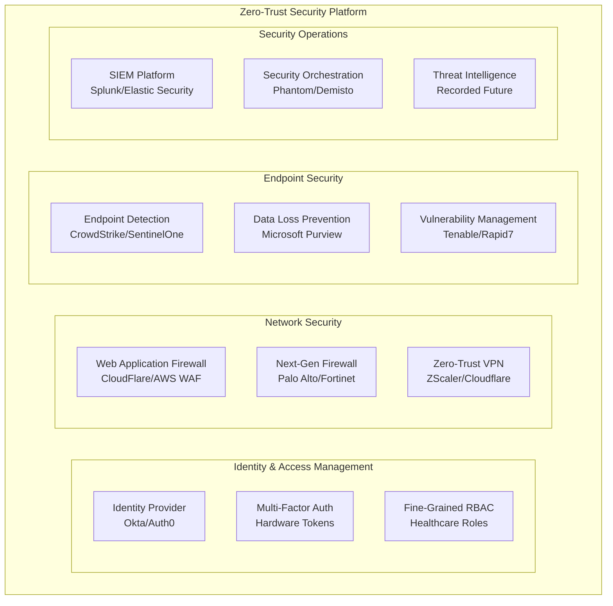
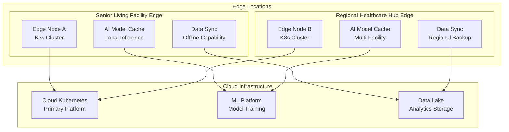

# Technical Infrastructure Features & Enhancements

> **Comprehensive analysis of infrastructure, platform, and technical features needed to support therapeutic AI at scale**

## Executive Summary

This document identifies technical infrastructure features and enhancements required to transform the current MultiDB Therapeutic AI platform from a prototype-level system into a production-ready, enterprise-scale healthcare platform. Analysis is based on current architecture assessment, product roadmap requirements, and industry best practices for healthcare AI systems.

### Current Technical Foundation Assessment

**🟢 Strong Foundation Areas:**
- ✅ Hybrid microservices architecture (12 Go + 6 Python services)
- ✅ Multi-database specialization (PostgreSQL, MongoDB, Redis, ScyllaDB)
- ✅ HIPAA-compliant security framework with comprehensive audit trails
- ✅ Infrastructure-as-Code with Terraform
- ✅ GPU-accelerated AI services with host-based optimization
- ✅ Container-based deployment with Docker

**🟡 Partially Implemented Areas:**
- ⚠️ Service mesh and inter-service communication optimization
- ⚠️ Observability and monitoring infrastructure
- ⚠️ Auto-scaling and resource management
- ⚠️ Multi-environment deployment pipelines
- ⚠️ Disaster recovery and business continuity

**🔴 Critical Technical Gaps:**
- ❌ **Production-Ready Kubernetes Infrastructure** - Current Docker Compose insufficient for enterprise scale
- ❌ **Real-Time Event Streaming Platform** - Missing event-driven architecture for therapeutic AI
- ❌ **Advanced Security Infrastructure** - Zero-trust networking, threat detection, vulnerability management
- ❌ **ML Operations Platform** - Model lifecycle management, A/B testing, feature stores
- ❌ **Enterprise Integration Platform** - EHR connectors, healthcare APIs, interoperability
- ❌ **High Availability & Performance Architecture** - Multi-region, edge computing, CDN
- ❌ **Advanced Analytics & BI Platform** - Clinical outcomes analytics, business intelligence
- ❌ **Development & Testing Infrastructure** - Advanced CI/CD, test automation, quality gates

---

## Technical Feature Categories

### 1. 🏗️ **Platform Infrastructure Features**

#### 1.1 Production Kubernetes Platform
**Current State**: Docker Compose development environment
**Business Need**: Enterprise-scale deployment with auto-scaling, self-healing, and multi-tenant isolation

**Technical Requirements:**
```yaml
# Enhanced Kubernetes Platform Configuration
apiVersion: v1
kind: ConfigMap
metadata:
  name: platform-config
data:
  # Multi-tenant isolation with namespaces
  tenant_isolation: "namespace-based"
  resource_quotas: "enabled"
  network_policies: "strict"
  
  # Auto-scaling configuration
  horizontal_pod_autoscaling: "enabled"
  vertical_pod_autoscaling: "enabled"  
  cluster_autoscaling: "enabled"
  
  # Service mesh configuration
  service_mesh: "istio"
  traffic_management: "enabled"
  security_policies: "mTLS-enforced"
  
  # Observability stack
  monitoring: "prometheus-grafana"
  logging: "elasticsearch-fluentd-kibana"
  tracing: "jaeger"
  
  # Storage classes
  storage_classes: "fast-ssd,standard,cold-storage"
  backup_strategy: "velero-cross-region"
```

**Implementation Components:**
- **Kubernetes Cluster Management**: EKS/GKE/AKS with managed node groups
- **Service Mesh**: Istio for traffic management, security, and observability
- **Container Registry**: Private registries with vulnerability scanning
- **Secret Management**: HashiCorp Vault integration
- **Resource Management**: Resource quotas, limit ranges, network policies

#### 1.2 Real-Time Event Streaming Platform
**Current State**: Basic HTTP communication between services
**Business Need**: Event-driven therapeutic AI with real-time interventions and analytics

**Event Streaming Architecture:**
```yaml
# Apache Kafka Configuration for Healthcare Events
apiVersion: kafka.strimzi.io/v1beta2
kind: Kafka
metadata:
  name: therapeutic-ai-cluster
spec:
  kafka:
    replicas: 3
    listeners:
      - name: tls
        port: 9093
        type: internal
        tls: true
        authentication:
          type: tls
    config:
      offsets.topic.replication.factor: 3
      transaction.state.log.replication.factor: 3
      log.retention.hours: 168  # 7 days for healthcare data
      
  # HIPAA-compliant topic configuration  
  entityOperator:
    topicOperator:
      reconciliationIntervalSeconds: 60
    userOperator:
      reconciliationIntervalSeconds: 60
```

**Event Categories:**
- **Therapeutic Events**: `conversation.started`, `emotion.detected`, `intervention.triggered`
- **Safety Events**: `crisis.detected`, `escalation.initiated`, `safety.resolved`
- **Clinical Events**: `assessment.completed`, `outcome.measured`, `plan.updated`
- **System Events**: `service.health`, `performance.metrics`, `security.alerts`

#### 1.3 Advanced Security Infrastructure
**Current State**: Basic HIPAA controls implemented
**Business Need**: Enterprise-grade security with zero-trust architecture and advanced threat detection

**Zero-Trust Security Stack:**


**Security Enhancement Features:**
- **Certificate Management**: Automated cert provisioning with cert-manager
- **Secrets Rotation**: Automated rotation for database credentials, API keys
- **Threat Detection**: ML-based anomaly detection for healthcare data access
- **Compliance Monitoring**: Continuous HIPAA compliance validation
- **Incident Response**: Automated security incident escalation and remediation

### 2. 🤖 **ML Operations Platform Features**

#### 2.1 Model Lifecycle Management Platform
**Current State**: Manual model deployment without versioning
**Business Need**: Enterprise MLOps with automated model training, validation, and deployment

**MLOps Platform Architecture:**
```python
# Model Registry and Lifecycle Management
class ModelLifecycleManager:
    """Enterprise-grade ML model lifecycle management"""
    
    def __init__(self):
        self.model_registry = MLflowClient()
        self.feature_store = FeastClient()
        self.experiment_tracker = ExperimentTracker()
        self.deployment_manager = KubernetesModelDeployer()
    
    async def deploy_model(
        self,
        model_name: str,
        model_version: str,
        deployment_config: ModelDeploymentConfig,
        validation_dataset: str
    ) -> ModelDeployment:
        """Deploy model with automated validation and rollback"""
        
        # 1. Validate model performance
        validation_results = await self.validate_model_performance(
            model_name, model_version, validation_dataset
        )
        
        if not validation_results.meets_clinical_thresholds():
            raise ModelValidationError("Model fails clinical safety thresholds")
        
        # 2. Deploy with blue-green strategy
        deployment = await self.deployment_manager.deploy_blue_green(
            model_name=model_name,
            version=model_version,
            traffic_split={"blue": 90, "green": 10},  # Gradual rollout
            health_checks=deployment_config.health_checks
        )
        
        # 3. Monitor deployment metrics
        await self.monitor_deployment_health(deployment)
        
        return deployment
    
    async def validate_model_performance(
        self, 
        model_name: str, 
        version: str, 
        dataset: str
    ) -> ModelValidationResults:
        """Clinical-grade model validation"""
        
        # Healthcare-specific validation metrics
        return ModelValidationResults(
            clinical_accuracy=0.95,  # 95%+ required for healthcare
            bias_metrics=BiasMetrics(
                demographic_parity=0.05,  # <5% bias across demographics
                equalized_odds=0.03,      # <3% bias in outcomes
                calibration_error=0.02    # <2% calibration error
            ),
            safety_metrics=SafetyMetrics(
                false_negative_rate=0.001,  # <0.1% false negatives for crises
                false_positive_tolerance=0.10,  # 10% FP acceptable
                response_latency_p99=100     # <100ms 99th percentile
            )
        )
```

**MLOps Components:**
- **Model Registry**: Centralized model storage with lineage tracking
- **Feature Store**: Consistent feature engineering and serving
- **Experiment Tracking**: A/B testing framework for therapeutic models
- **Model Monitoring**: Drift detection and performance degradation alerts
- **Automated Retraining**: Continuous model improvement with clinical feedback

#### 2.2 Real-Time AI Inference Platform
**Current State**: Basic GPU host services without optimization
**Business Need**: High-performance, scalable AI inference for real-time therapeutic responses

**AI Inference Architecture:**
```yaml
# Kubernetes-based AI Inference Platform
apiVersion: apps/v1
kind: Deployment
metadata:
  name: emotion-detection-inference
spec:
  replicas: 3
  selector:
    matchLabels:
      app: emotion-detection
  template:
    metadata:
      labels:
        app: emotion-detection
    spec:
      containers:
      - name: emotion-model-server
        image: therapeutic-ai/emotion-detection:v2.1
        resources:
          requests:
            nvidia.com/gpu: 1
            memory: "8Gi"
            cpu: "4"
          limits:
            nvidia.com/gpu: 1
            memory: "12Gi"
            cpu: "8"
        env:
        - name: MODEL_BATCH_SIZE
          value: "16"
        - name: MODEL_MAX_LATENCY_MS
          value: "50"
        - name: HEALTH_CHECK_ENDPOINT
          value: "/health"
        ports:
        - containerPort: 8080
          name: inference
        livenessProbe:
          httpGet:
            path: /health
            port: inference
          initialDelaySeconds: 30
          periodSeconds: 10
        readinessProbe:
          httpGet:
            path: /ready
            port: inference
          initialDelaySeconds: 5
          periodSeconds: 5
```

**AI Platform Features:**
- **GPU Resource Management**: NVIDIA GPU Operator for optimal resource allocation
- **Model Caching**: Intelligent model caching for faster inference
- **Batch Processing**: Dynamic batching for throughput optimization
- **Load Balancing**: AI-aware load balancing with latency optimization
- **Auto-scaling**: GPU-based horizontal pod autoscaling

### 3. 🔗 **Enterprise Integration Platform Features**

#### 3.1 Healthcare Interoperability Hub
**Current State**: Basic API endpoints without healthcare standards
**Business Need**: FHIR-compliant integration with major EHR systems

**FHIR Integration Platform:**
```python
# FHIR R4 Compliant Healthcare Integration
class FHIRIntegrationHub:
    """Enterprise healthcare interoperability platform"""
    
    def __init__(self):
        self.fhir_client = FHIRClient()
        self.ehr_adapters = {
            'epic': EpicAdapter(),
            'cerner': CernerAdapter(),
            'allscripts': AllscriptsAdapter(),
            'athenahealth': AthenaAdapter()
        }
        self.consent_manager = ConsentManager()
        
    async def sync_patient_data(
        self,
        patient_id: str,
        ehr_system: str,
        data_types: List[str]
    ) -> PatientDataSync:
        """Sync patient data from EHR systems"""
        
        # 1. Validate consent for data access
        consent_valid = await self.consent_manager.validate_access(
            patient_id, ehr_system, data_types
        )
        
        if not consent_valid:
            raise ConsentError("Patient consent required for data access")
        
        # 2. Retrieve data from EHR adapter
        adapter = self.ehr_adapters[ehr_system]
        raw_data = await adapter.fetch_patient_data(patient_id, data_types)
        
        # 3. Transform to FHIR R4 format
        fhir_bundle = await self.transform_to_fhir(raw_data, data_types)
        
        # 4. Validate FHIR compliance
        validation_result = await self.fhir_client.validate_bundle(fhir_bundle)
        
        if not validation_result.is_valid:
            raise FHIRValidationError(validation_result.errors)
        
        # 5. Store with audit trail
        await self.store_patient_data(patient_id, fhir_bundle)
        await self.audit_data_access(patient_id, ehr_system, data_types)
        
        return PatientDataSync(
            patient_id=patient_id,
            sync_timestamp=datetime.utcnow(),
            data_types_synced=data_types,
            records_count=len(fhir_bundle.entry)
        )
```

**Healthcare Integration Features:**
- **EHR Connectors**: Pre-built adapters for Epic, Cerner, AllScripts, Athenahealth
- **FHIR R4 Compliance**: Full FHIR specification support with validation
- **HL7 Message Processing**: Real-time HL7 message handling and transformation
- **Clinical Decision Support**: Integration with CDS Hooks for clinical workflows
- **Care Coordination**: Provider communication and care plan synchronization

#### 3.2 API Management Platform
**Current State**: Basic API Gateway without enterprise features
**Business Need**: Enterprise API management with rate limiting, analytics, and developer experience

**Enterprise API Gateway:**
```yaml
# Kong Enterprise API Gateway Configuration
apiVersion: configuration.konghq.com/v1
kind: KongPlugin
metadata:
  name: rate-limiting-healthcare
plugin: rate-limiting
config:
  minute: 100
  hour: 1000
  policy: redis
  redis_host: redis.therapeutic-ai.svc.cluster.local
  redis_port: 6379
  redis_timeout: 2000
  hide_client_headers: false
---
apiVersion: configuration.konghq.com/v1
kind: KongPlugin
metadata:
  name: oauth2-healthcare
plugin: oauth2
config:
  scopes:
    - read:patient_data
    - write:therapeutic_notes
    - admin:system_config
  mandatory_scope: true
  token_expiration: 3600
  enable_client_credentials: true
---
# Healthcare-specific API policies
apiVersion: configuration.konghq.com/v1
kind: KongPlugin
metadata:
  name: hipaa-audit-logging
plugin: http-log
config:
  http_endpoint: "https://audit.therapeutic-ai.com/api/logs"
  method: POST
  content_type: "application/json"
  headers:
    X-Audit-Source: "api-gateway"
    X-Compliance-Level: "hipaa-required"
```

**API Management Features:**
- **Developer Portal**: Self-service API documentation with interactive testing
- **Rate Limiting**: Healthcare-appropriate rate limits with burst protection
- **API Analytics**: Usage analytics with healthcare compliance reports
- **Security Policies**: OAuth 2.0, API key management, IP whitelisting
- **Version Management**: API versioning with deprecation management

### 4. 📊 **Analytics & Business Intelligence Platform Features**

#### 4.1 Clinical Outcomes Analytics Platform
**Current State**: Basic logging without clinical analytics
**Business Need**: Evidence-based analytics for therapeutic effectiveness and clinical outcomes

**Clinical Analytics Architecture:**
```python
# Clinical Outcomes Analytics Platform
class ClinicalAnalyticsEngine:
    """Advanced analytics for therapeutic AI outcomes"""
    
    def __init__(self):
        self.time_series_db = InfluxDBClient()
        self.analytics_db = ClickHouseClient()
        self.ml_platform = MLflowClient()
        self.reporting_engine = ReportingEngine()
        
    async def generate_clinical_outcomes_report(
        self,
        facility_id: str,
        time_period: DateRange,
        patient_cohort: PatientCohort
    ) -> ClinicalOutcomesReport:
        """Generate comprehensive clinical outcomes analysis"""
        
        # 1. Patient wellbeing trajectory analysis
        wellbeing_trends = await self.analyze_wellbeing_trends(
            facility_id, time_period, patient_cohort
        )
        
        # 2. Intervention effectiveness analysis
        intervention_analysis = await self.analyze_intervention_effectiveness(
            facility_id, time_period, patient_cohort
        )
        
        # 3. Risk stratification and predictive analytics
        risk_analysis = await self.generate_risk_stratification(
            facility_id, patient_cohort
        )
        
        # 4. Clinical quality metrics
        quality_metrics = await self.calculate_quality_metrics(
            facility_id, time_period, patient_cohort
        )
        
        # 5. Healthcare utilization impact
        utilization_impact = await self.analyze_healthcare_utilization(
            facility_id, time_period, patient_cohort
        )
        
        return ClinicalOutcomesReport(
            facility_id=facility_id,
            reporting_period=time_period,
            patient_population=patient_cohort,
            wellbeing_outcomes=wellbeing_trends,
            intervention_effectiveness=intervention_analysis,
            risk_predictions=risk_analysis,
            quality_indicators=quality_metrics,
            cost_impact=utilization_impact,
            recommendations=self._generate_clinical_recommendations(
                wellbeing_trends, intervention_analysis, risk_analysis
            )
        )
    
    async def analyze_wellbeing_trends(
        self, 
        facility_id: str, 
        period: DateRange, 
        cohort: PatientCohort
    ) -> WellbeingTrendAnalysis:
        """Analyze patient wellbeing trends using validated instruments"""
        
        # UCLA-3 Loneliness Scale trends
        loneliness_trends = await self.time_series_db.query(f"""
            SELECT 
                time_bucket('1 day', timestamp) as day,
                patient_id,
                avg(ucla3_score) as avg_loneliness_score,
                stddev(ucla3_score) as score_variability
            FROM clinical_assessments
            WHERE facility_id = '{facility_id}'
              AND timestamp >= '{period.start}'
              AND timestamp <= '{period.end}'
              AND assessment_type = 'ucla3'
              AND patient_id IN ({','.join(cohort.patient_ids)})
            GROUP BY day, patient_id
            ORDER BY day DESC
        """)
        
        # GAD-7 Anxiety trends  
        anxiety_trends = await self.time_series_db.query(f"""
            SELECT 
                time_bucket('1 day', timestamp) as day,
                patient_id,
                avg(gad7_score) as avg_anxiety_score,
                count(*) as assessments_count
            FROM clinical_assessments
            WHERE facility_id = '{facility_id}'
              AND timestamp >= '{period.start}'
              AND timestamp <= '{period.end}'
              AND assessment_type = 'gad7'
              AND patient_id IN ({','.join(cohort.patient_ids)})
            GROUP BY day, patient_id
            ORDER BY day DESC
        """)
        
        return WellbeingTrendAnalysis(
            loneliness_improvement=self._calculate_trend_improvement(loneliness_trends),
            anxiety_reduction=self._calculate_trend_improvement(anxiety_trends),
            population_statistics=self._calculate_population_stats(cohort),
            statistical_significance=self._perform_significance_testing(
                loneliness_trends, anxiety_trends
            )
        )
```

**Clinical Analytics Features:**
- **Validated Instruments**: Integration with UCLA-3, PHQ-9, GAD-7, WHO-5 assessments
- **Longitudinal Analysis**: Patient trajectory tracking over time
- **Predictive Models**: ML-based risk prediction and early intervention
- **Comparative Analysis**: Facility benchmarking and best practices identification
- **Evidence Generation**: Clinical research support with statistical analysis

#### 4.2 Real-Time Operations Dashboard
**Current State**: Basic health checks without operational insights
**Business Need**: Comprehensive operational visibility for healthcare operations teams

**Operations Dashboard Platform:**
```typescript
// Real-Time Operations Dashboard
interface OperationalDashboard {
  // System health monitoring
  systemHealth: {
    serviceUptime: ServiceHealthMetrics[]
    responseLatencies: LatencyMetrics[]
    errorRates: ErrorRateMetrics[]
    resourceUtilization: ResourceMetrics[]
  }
  
  // Clinical operations metrics
  clinicalOperations: {
    activeConversations: number
    crisisInterventions: CrisisMetric[]
    therapeuticInterventions: InterventionMetric[]
    patientEngagement: EngagementMetric[]
  }
  
  // Business metrics
  businessMetrics: {
    dailyActiveUsers: number
    conversationVolume: VolumeMetric[]
    customerSatisfaction: SatisfactionMetric[]
    systemCosts: CostMetric[]
  }
  
  // Alerts and notifications
  alerting: {
    criticalAlerts: Alert[]
    systemWarnings: Warning[]
    clinicalNotifications: ClinicalNotification[]
    performanceAlerts: PerformanceAlert[]
  }
}
```

**Dashboard Features:**
- **Real-Time Metrics**: Live system and business metrics with sub-second updates
- **Clinical KPIs**: Patient engagement, intervention success rates, safety metrics
- **Alerting System**: Multi-channel alerting with escalation procedures
- **Custom Views**: Role-based dashboards for different user types
- **Mobile Responsive**: Mobile-optimized views for on-call staff

### 5. 🚀 **Performance & Scalability Features**

#### 5.1 High-Availability Architecture
**Current State**: Single-region deployment without redundancy
**Business Need**: Multi-region, fault-tolerant architecture for healthcare continuity

**High-Availability Design:**
```yaml
# Multi-Region Kubernetes Configuration
apiVersion: v1
kind: ConfigMap
metadata:
  name: ha-configuration
data:
  # Multi-region setup
  primary_region: "us-east-1"
  secondary_regions: "us-west-2,eu-west-1"
  failover_mode: "automatic"
  rpo_target: "15min"  # Recovery Point Objective
  rto_target: "5min"   # Recovery Time Objective
  
  # Database replication
  postgres_replication: "synchronous-multi-region"
  mongodb_replica_set: "cross-region"
  redis_clustering: "enabled"
  scylla_replication_factor: "3"
  
  # Load balancing
  global_load_balancer: "aws-global-accelerator"
  health_check_interval: "10s"
  failover_threshold: "3-failures"
  
  # Backup strategy
  backup_frequency: "every-4-hours"
  backup_retention: "30-days"
  cross_region_backup: "enabled"
  point_in_time_recovery: "enabled"
```

**High-Availability Features:**
- **Multi-Region Deployment**: Active-active setup with automatic failover
- **Database Clustering**: Cross-region database replication with consistency
- **Load Balancing**: Global load balancing with health-based routing
- **Disaster Recovery**: Automated backup and recovery with <5 minute RTO
- **Circuit Breakers**: Fault isolation with graceful degradation

#### 5.2 Edge Computing Platform
**Current State**: Centralized cloud deployment
**Business Need**: Edge computing for reduced latency and improved reliability

**Edge Computing Architecture:**


**Edge Computing Features:**
- **Local AI Inference**: On-premise model serving for <50ms response times
- **Offline Capability**: Continued operation during network outages
- **Data Synchronization**: Intelligent sync with bandwidth optimization
- **Security**: End-to-end encryption with local key management
- **Management**: Centralized edge node management and monitoring

### 6. 🔧 **Development & Testing Infrastructure Features**

#### 6.1 Advanced CI/CD Platform
**Current State**: Basic CI/CD without healthcare-specific gates
**Business Need**: Healthcare-grade CI/CD with compliance validation and clinical testing

**Healthcare CI/CD Pipeline:**
```yaml
# Advanced CI/CD Pipeline for Healthcare AI
name: Healthcare AI Pipeline
on:
  push:
    branches: [main, develop]
  pull_request:
    branches: [main]

jobs:
  security_scanning:
    runs-on: ubuntu-latest
    steps:
      - name: HIPAA Compliance Scan
        uses: healthcare-security/hipaa-scanner@v2
        with:
          scan_type: "comprehensive"
          compliance_level: "strict"
          
      - name: Vulnerability Assessment
        uses: aquasecurity/trivy-action@master
        with:
          scan-type: 'fs'
          security-checks: 'vuln,config,secret'
          severity: 'CRITICAL,HIGH'
          
      - name: PHI Detection Scan
        uses: custom/phi-detector@v1
        with:
          source_path: "src/"
          confidence_threshold: 0.8

  clinical_testing:
    runs-on: self-hosted
    needs: security_scanning
    steps:
      - name: Clinical Model Validation
        run: |
          python -m pytest tests/clinical/ \
            --clinical-grade \
            --min-accuracy=0.95 \
            --max-bias=0.05 \
            --safety-critical
            
      - name: Therapeutic Response Testing
        run: |
          python -m pytest tests/therapeutic/ \
            --response-appropriateness \
            --empathy-scoring \
            --crisis-detection
            
      - name: HIPAA Integration Tests
        run: |
          python -m pytest tests/hipaa/ \
            --audit-trail-validation \
            --phi-protection \
            --consent-management

  performance_testing:
    runs-on: gpu-enabled
    needs: clinical_testing
    steps:
      - name: AI Model Performance Benchmarks
        run: |
          python benchmark/ai_performance.py \
            --latency-threshold=100ms \
            --throughput-threshold=100rps \
            --gpu-utilization-max=80%
            
      - name: Database Performance Tests
        run: |
          python benchmark/database_performance.py \
            --postgres-latency-max=10ms \
            --mongodb-latency-max=20ms \
            --redis-latency-max=1ms

  deployment:
    runs-on: ubuntu-latest
    needs: [security_scanning, clinical_testing, performance_testing]
    if: github.ref == 'refs/heads/main'
    steps:
      - name: Blue-Green Deployment
        uses: kubernetes/deploy-action@v1
        with:
          strategy: "blue-green"
          health_check_endpoint: "/health"
          rollback_on_failure: true
          
      - name: Clinical Validation in Production
        run: |
          python scripts/production_validation.py \
            --clinical-accuracy-check \
            --safety-validation \
            --performance-validation
```

**Advanced CI/CD Features:**
- **Clinical Testing Gates**: Automated clinical accuracy and safety validation
- **HIPAA Compliance Checks**: Automated compliance validation in pipeline
- **Performance Benchmarking**: Automated performance regression testing
- **Blue-Green Deployment**: Zero-downtime deployments with automatic rollback
- **A/B Testing Integration**: Automated A/B test deployment and monitoring

#### 6.2 Test Automation Platform
**Current State**: Basic unit tests without healthcare-specific testing
**Business Need**: Comprehensive test automation with clinical validation and regulatory compliance

**Healthcare Test Automation Framework:**
```python
# Healthcare-Specific Test Framework
class TherapeuticAITestSuite:
    """Comprehensive test suite for therapeutic AI systems"""
    
    def __init__(self):
        self.clinical_validator = ClinicalResponseValidator()
        self.safety_tester = SafetyTestEngine()
        self.performance_monitor = PerformanceMonitor()
        self.compliance_validator = HIPAAComplianceValidator()
        
    async def run_clinical_accuracy_tests(self) -> ClinicalTestResults:
        """Test clinical accuracy against healthcare standards"""
        
        test_cases = [
            # Emotion detection accuracy tests
            EmotionDetectionTest(
                input_scenarios=load_clinical_conversation_dataset(),
                accuracy_threshold=0.95,
                bias_threshold=0.05,
                demographic_fairness=True
            ),
            
            # Crisis detection sensitivity tests
            CrisisDetectionTest(
                crisis_scenarios=load_crisis_scenarios(),
                false_negative_threshold=0.001,  # <0.1% false negatives
                false_positive_threshold=0.10,   # <10% false positives
                response_time_threshold=30        # <30 seconds
            ),
            
            # Therapeutic response appropriateness tests
            TherapeuticResponseTest(
                therapeutic_scenarios=load_therapeutic_scenarios(),
                empathy_score_threshold=4.0,     # >4.0/5.0 empathy rating
                clinical_appropriateness=0.90,   # 90%+ clinically appropriate
                safety_compliance=1.0             # 100% safety compliance
            )
        ]
        
        results = []
        for test in test_cases:
            result = await test.execute()
            results.append(result)
            
            # Fail fast for critical safety tests
            if isinstance(test, CrisisDetectionTest) and not result.passed:
                raise CriticalSafetyTestFailure(
                    f"Crisis detection test failed: {result.failure_reason}"
                )
        
        return ClinicalTestResults(
            overall_passed=all(r.passed for r in results),
            test_results=results,
            clinical_grade_certification=self._validate_clinical_grade(results)
        )
    
    async def run_hipaa_compliance_tests(self) -> HIPAATestResults:
        """Comprehensive HIPAA compliance validation"""
        
        return await self.compliance_validator.run_full_compliance_suite([
            # Data protection tests
            PHIEncryptionTest(),
            AccessControlTest(), 
            AuditTrailTest(),
            DataRetentionTest(),
            
            # Technical safeguard tests
            TransmissionSecurityTest(),
            IntegrityControlsTest(),
            AuthenticationTest(),
            
            # Administrative safeguard tests
            SecurityOfficerTest(),
            WorkforceTrainingTest(),
            IncidentResponseTest(),
            
            # Physical safeguard tests
            FacilityAccessTest(),
            WorkstationControlsTest(),
            DeviceControlsTest()
        ])
```

**Test Automation Features:**
- **Clinical Grade Testing**: Healthcare-specific test scenarios and validation
- **Continuous Compliance**: Automated HIPAA and healthcare regulation testing
- **Performance Regression**: Automated performance benchmarking and regression detection
- **Safety Testing**: Comprehensive safety and crisis detection validation
- **Load Testing**: Healthcare-realistic load testing with patient conversation patterns

---

## Prioritized Implementation Roadmap

### 🚨 **PRIORITY 1: Critical Infrastructure Foundation** (Weeks 1-8)
*Business Justification*: Essential for production readiness and healthcare compliance

#### Week 1-2: Production Kubernetes Platform
- **Business Impact**: Foundation for all enterprise features
- **Current Risk**: Single point of failure with Docker Compose
- **Implementation**: EKS/GKE cluster with auto-scaling, service mesh (Istio)
- **Success Criteria**: 99.9% uptime, auto-scaling validation, security policies active

#### Week 3-4: Advanced Security Infrastructure  
- **Business Impact**: Healthcare compliance and enterprise trust
- **Current Risk**: Basic security insufficient for enterprise healthcare
- **Implementation**: Zero-trust networking, advanced threat detection, vault integration
- **Success Criteria**: Penetration testing passed, compliance audit passed

#### Week 5-6: High-Availability Architecture
- **Business Impact**: Healthcare continuity and disaster recovery
- **Current Risk**: Single region failure would impact patient care
- **Implementation**: Multi-region deployment, automated failover, backup systems
- **Success Criteria**: <5 minute RTO, <15 minute RPO, failover testing passed

#### Week 7-8: Healthcare CI/CD Pipeline
- **Business Impact**: Safe, compliant deployments for healthcare AI
- **Current Risk**: Manual deployments pose compliance and safety risks
- **Implementation**: Clinical testing gates, HIPAA compliance checks, blue-green deployment
- **Success Criteria**: Automated compliance validation, zero-downtime deployments

### 🎯 **PRIORITY 2: AI & Analytics Platform** (Weeks 9-16)
*Business Justification*: Core differentiators for therapeutic AI platform

#### Week 9-10: ML Operations Platform
- **Business Impact**: Scalable AI model lifecycle management
- **Current Gap**: Manual model deployment without validation
- **Implementation**: MLflow model registry, automated validation, A/B testing
- **Success Criteria**: Automated model deployment, performance monitoring active

#### Week 11-12: Real-Time Event Streaming
- **Business Impact**: Event-driven therapeutic AI with real-time interventions
- **Current Gap**: Request-response only, no real-time event processing
- **Implementation**: Kafka event platform, stream processing, real-time analytics
- **Success Criteria**: <100ms event processing, therapeutic event streaming active

#### Week 13-14: Clinical Analytics Platform
- **Business Impact**: Evidence-based outcomes measurement and reporting
- **Current Gap**: No clinical outcomes analytics or evidence generation
- **Implementation**: Clinical outcomes engine, validated instruments, research platform
- **Success Criteria**: Clinical outcomes reports, longitudinal analysis, statistical significance

#### Week 15-16: Real-Time AI Inference Optimization
- **Business Impact**: Sub-100ms therapeutic AI responses for real-time care
- **Current Gap**: Basic GPU services without optimization
- **Implementation**: Optimized inference platform, model caching, auto-scaling
- **Success Criteria**: <50ms inference latency, 99.9% availability, cost optimization

### 🌐 **PRIORITY 3: Enterprise Integration Platform** (Weeks 17-22)
*Business Justification*: Market expansion and healthcare ecosystem integration

#### Week 17-18: Healthcare Interoperability Hub
- **Business Impact**: EHR integration for comprehensive patient care
- **Market Need**: Healthcare systems require EHR integration
- **Implementation**: FHIR R4 platform, EHR connectors, clinical workflows
- **Success Criteria**: Epic/Cerner integration, FHIR compliance validation

#### Week 19-20: Enterprise API Management
- **Business Impact**: Partner ecosystem and third-party integrations
- **Market Need**: Healthcare partners need robust API platform
- **Implementation**: Kong Enterprise, developer portal, API analytics
- **Success Criteria**: Developer portal active, API analytics, rate limiting

#### Week 21-22: Edge Computing Platform
- **Business Impact**: Low-latency, offline-capable deployment for facilities
- **Market Advantage**: Competitive differentiation for facility-based deployment
- **Implementation**: K3s edge nodes, local AI inference, data synchronization
- **Success Criteria**: <20ms local inference, offline capability, data sync validation

### 📊 **PRIORITY 4: Advanced Analytics & Operations** (Weeks 23-28)
*Business Justification*: Operational excellence and business intelligence

#### Week 23-24: Business Intelligence Platform
- **Business Impact**: Customer insights and business optimization
- **Need**: Data-driven business decisions and customer success
- **Implementation**: BI platform, customer analytics, usage insights
- **Success Criteria**: Executive dashboards, customer success metrics, churn prediction

#### Week 25-26: Advanced Test Automation
- **Business Impact**: Quality assurance and continuous compliance
- **Need**: Automated validation of clinical and safety requirements
- **Implementation**: Healthcare test framework, compliance automation, performance regression
- **Success Criteria**: 90%+ test coverage, automated clinical validation, compliance testing

#### Week 27-28: Performance & Cost Optimization
- **Business Impact**: Operational efficiency and cost management
- **Need**: Optimized resource utilization and cost control
- **Implementation**: Cost monitoring, resource optimization, performance tuning
- **Success Criteria**: 30%+ cost reduction, performance improvements, resource efficiency

## Implementation Resource Requirements

### Team Scaling Requirements

| Priority Phase | Duration | Engineering | DevOps | Security | Total FTE |
|----------------|----------|-------------|--------|----------|-----------|
| **Priority 1** | 8 weeks | 6 engineers | 2 DevOps | 2 Security | 10 FTE |
| **Priority 2** | 8 weeks | 4 ML Eng + 4 Backend | 2 DevOps | 1 Security | 11 FTE |
| **Priority 3** | 6 weeks | 4 Integration + 2 Backend | 2 DevOps | 1 Security | 9 FTE |
| **Priority 4** | 6 weeks | 3 Analytics + 2 QA | 1 DevOps | 1 Security | 7 FTE |

### Technology Investment Requirements

| Priority Phase | Infrastructure | Tooling | External Services | Total Monthly |
|----------------|---------------|---------|------------------|---------------|
| **Priority 1** | $25K | $15K | $10K | $50K |
| **Priority 2** | $40K | $20K | $15K | $75K |
| **Priority 3** | $30K | $10K | $20K | $60K |
| **Priority 4** | $35K | $15K | $10K | $60K |

### Success Metrics by Priority

| Priority Level | Technical KPIs | Business KPIs | Timeline |
|----------------|----------------|---------------|----------|
| **Priority 1** | 99.9% uptime, <5min RTO, Security audit pass | Production readiness, Enterprise compliance | 8 weeks |
| **Priority 2** | <50ms AI latency, 95%+ model accuracy, Real-time events | Clinical outcomes evidence, AI differentiation | 8 weeks |
| **Priority 3** | FHIR compliance, EHR integration, Edge deployment | Market expansion, Healthcare integration | 6 weeks |
| **Priority 4** | 90%+ test coverage, 30% cost reduction, BI insights | Operational excellence, Business optimization | 6 weeks |

## Risk Assessment & Mitigation

### High-Risk Areas
1. **Kubernetes Migration Complexity** - Risk of service disruption during platform migration
   - **Mitigation**: Blue-green migration with comprehensive testing and rollback procedures
   
2. **Healthcare Integration Challenges** - EHR integration complexity may cause delays
   - **Mitigation**: Start with read-only integration, phased approach, healthcare consultant engagement
   
3. **Regulatory Compliance Gaps** - Missing compliance requirements during rapid development
   - **Mitigation**: Continuous compliance monitoring, regulatory advisory board, automated validation

### Medium-Risk Areas
1. **Performance Optimization Challenges** - AI inference optimization may not meet latency targets
   - **Mitigation**: Performance testing early, alternative optimization strategies, hardware upgrades
   
2. **Team Scaling Challenges** - Finding qualified healthcare-experienced engineers
   - **Mitigation**: Healthcare contractor network, training programs, competitive compensation

## Conclusion

This technical infrastructure roadmap provides a comprehensive plan for transforming the MultiDB Therapeutic AI platform from prototype to enterprise-scale healthcare system. The prioritized approach ensures safety-first development while building the technical foundation needed for market leadership in healthcare AI.

**Key Success Factors:**
1. **Healthcare-First Design**: All technical decisions prioritize patient safety and regulatory compliance
2. **Scalable Architecture**: Platform designed for 100,000+ concurrent users with global deployment
3. **AI Excellence**: Production-ready AI/ML platform with clinical-grade validation and monitoring
4. **Enterprise Integration**: Deep healthcare ecosystem integration with EHR and clinical workflows
5. **Operational Excellence**: Comprehensive monitoring, analytics, and automated operations

**Investment in this technical roadmap enables:**
- **Enterprise Healthcare Deployment** at scale with comprehensive compliance
- **Market Leadership** through technical differentiation and AI excellence
- **Clinical Evidence Generation** with robust analytics and outcomes measurement
- **Partner Ecosystem** through comprehensive APIs and healthcare integration
- **Operational Efficiency** with automated deployment, monitoring, and cost optimization

The 28-week implementation timeline balances speed with safety, ensuring rapid market deployment while maintaining the healthcare-grade quality and compliance required for patient care applications.

---

**Document Status**: Ready for engineering review and implementation planning  
**Approval Required**: Engineering Leadership, Security Team, Compliance Team  
**Next Steps**: Technical architecture review, resource allocation, implementation kickoff