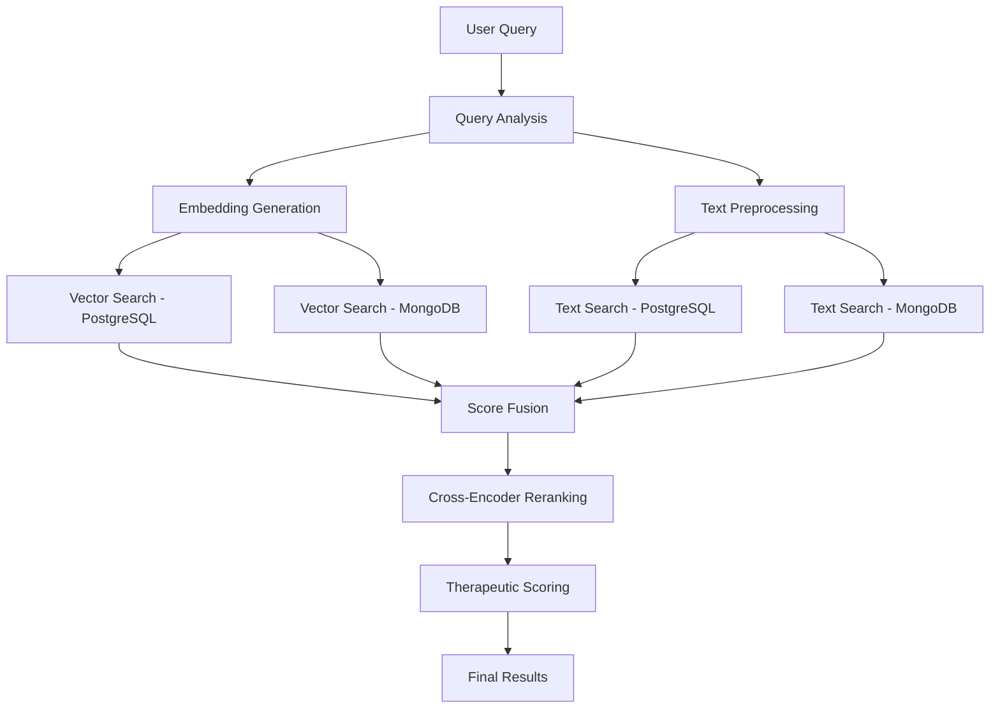

# 🔍 Search Design and Implementation Guide
> **Comprehensive Search Architecture: Hybrid Search, Reranking, and Multi-Database Integration**

**Objective**: Complete architectural specification for the hybrid search system with reranking pipeline  
**Audience**: AI Engineers, Backend Developers, Search Engineers  
**Prerequisites**: Understanding of vector embeddings, information retrieval, and database systems

---

## 📋 Executive Summary

### Current Architecture Assessment
**Current Implementation**: MongoDB Atlas Vector Search (Primary) → PostgreSQL+pgvector (Fallback)  
**Performance Issues**: Lower precision (0.82 max), limited customization, connection instability  
**Recommendation**: **Invert the hierarchy** - PostgreSQL+pgvector Primary → MongoDB Secondary

### Search Pipeline Overview
The system implements a **3-stage search architecture**:
1. **Parallel Hybrid Search**: Vector + Text search executed concurrently
2. **Score Fusion**: Reciprocal Rank Fusion (RRF) combining multiple signals
3. **Advanced Reranking**: Cross-encoder reranking with therapeutic context

---

## 🏗️ Detailed Architecture

### Stage 1: Parallel Hybrid Search

#### Vector Search Pipeline
```python
# Primary: PostgreSQL+pgvector (RECOMMENDED)
async def postgresql_vector_search(query_embedding: List[float], limit: int = 20):
    """
    PostgreSQL vector search using pgvector extension
    - Index: HNSW for optimal performance
    - Similarity: Cosine distance
    - Performance: <20ms for most queries
    """
    query = """
        SELECT chunk_id, text, embedding, 
               (embedding <=> %s::vector) AS distance,
               (1 - (embedding <=> %s::vector)) AS similarity_score
        FROM knowledge.document_chunks 
        ORDER BY embedding <=> %s::vector 
        LIMIT %s
    """
    
# Secondary: MongoDB Atlas Vector Search  
async def mongodb_vector_search(query_embedding: List[float], limit: int = 20):
    """
    MongoDB Atlas Vector Search using $vectorSearch aggregation
    - Index: Atlas Vector Search index
    - Similarity: Cosine similarity
    - Performance: ~50ms (variable)
    """
    pipeline = [
        {
            "$vectorSearch": {
                "index": "vector_index",
                "path": "embedding", 
                "queryVector": query_embedding,
                "numCandidates": limit * 10,  # Oversampling for quality
                "limit": limit
            }
        }
    ]
```

#### Text Search Pipeline
```python
# PostgreSQL Full-Text Search
async def postgresql_text_search(query: str, limit: int = 20):
    """
    PostgreSQL full-text search using tsvector
    - Index: GIN index on tsvector
    - Ranking: ts_rank for relevance scoring
    """
    query_sql = """
        SELECT chunk_id, text, 
               ts_rank(to_tsvector('english', text), plainto_tsquery('english', %s)) AS text_score
        FROM knowledge.document_chunks 
        WHERE to_tsvector('english', text) @@ plainto_tsquery('english', %s)
        ORDER BY text_score DESC
        LIMIT %s
    """

# MongoDB Text Search  
async def mongodb_text_search(query: str, limit: int = 20):
    """
    MongoDB text search using $text operator
    - Index: Text index on content fields
    - Scoring: MongoDB textScore
    """
    pipeline = [
        {"$match": {"$text": {"$search": query}}},
        {"$addFields": {"text_score": {"$meta": "textScore"}}},
        {"$sort": {"text_score": {"$meta": "textScore"}}},
        {"$limit": limit}
    ]
```

### Stage 2: Score Fusion with RRF

#### Reciprocal Rank Fusion Implementation
```python
class HybridSearchFusion:
    """
    Implements Reciprocal Rank Fusion for combining vector + text search results
    Based on: ai_services/core/cross_encoder_service.py:280
    """
    
    @staticmethod
    def reciprocal_rank_fusion(score_lists: List[List[float]], k: int = 60) -> List[float]:
        """
        RRF Formula: score = Σ(1 / (k + rank_i)) for each ranking system
        
        Args:
            score_lists: [vector_scores, text_scores]
            k: RRF parameter (typically 60)
            
        Returns:
            fused_scores: Combined ranking scores
        """
        if not score_lists or not score_lists[0]:
            return []
        
        fused_scores = [0.0] * len(score_lists[0])
        
        for scores in score_lists:
            # Convert scores to ranks
            sorted_indices = sorted(range(len(scores)), key=lambda i: scores[i], reverse=True)
            
            # Apply RRF formula: 1/(k + rank)
            for rank, idx in enumerate(sorted_indices, 1):
                fused_scores[idx] += 1 / (k + rank)
        
        return fused_scores
    
    def fuse_search_results(self, vector_results: List[Dict], text_results: List[Dict], 
                          vector_weight: float = 0.7, text_weight: float = 0.3) -> List[Dict]:
        """
        Combine vector and text search results using weighted RRF
        
        Implementation: ai_services/core/intelligent_data_router.py:_merge_therapeutic_results
        """
        # Extract scores
        vector_scores = [r.get('similarity_score', 0) for r in vector_results]
        text_scores = [r.get('text_score', 0) for r in text_results]
        
        # Apply RRF fusion
        fused_scores = self.reciprocal_rank_fusion([vector_scores, text_scores])
        
        # Combine with weights (70% vector, 30% text)
        final_results = []
        for i, result in enumerate(vector_results + text_results):
            enhanced_result = result.copy()
            enhanced_result.update({
                'fused_score': fused_scores[i] if i < len(fused_scores) else 0,
                'vector_weight': vector_weight,
                'text_weight': text_weight,
                'fusion_method': 'rrf_weighted'
            })
            final_results.append(enhanced_result)
            
        return sorted(final_results, key=lambda x: x['fused_score'], reverse=True)
```

### Stage 3: Advanced Reranking

#### Cross-Encoder Reranking
```python
class TherapeuticReranker:
    """
    Advanced reranking with cross-encoder and therapeutic signals
    Implementation: ai_services/core/advanced_ranking_service.py
    """
    
    def __init__(self):
        self.cross_encoder_model = "cross-encoder/ms-marco-MiniLM-L-12-v2"
        self.device = "mps" if torch.backends.mps.is_available() else "cpu"
    
    async def rerank_results(self, query: str, results: List[Dict], 
                           strategy: str = "adaptive") -> List[Dict]:
        """
        Multi-signal reranking with therapeutic context
        
        Current Implementation (Simplified):
        - Cross-encoder score for semantic relevance  
        - RRF fusion of cosine + cross-encoder scores
        
        Planned Enhancement (Your Specification):
        - Medical concept overlap score
        - Therapeutic relevance based on emotional state  
        - Patient-specific relevance (EHR integration)
        - Clinical evidence level scoring
        - Safety score validation
        """
        
        # Stage 1: Cross-encoder scoring
        pairs = [(query, r.get('content', '')) for r in results]
        cross_encoder_scores = await self.batch_score_pairs(pairs)
        
        # Stage 2: Extract existing scores
        cosine_scores = [r.get('similarity_score', 0) for r in results]
        
        # Stage 3: RRF fusion of multiple signals
        fused_scores = self.reciprocal_rank_fusion([
            cosine_scores,
            cross_encoder_scores
        ])
        
        # Stage 4: Therapeutic enhancement (PLANNED)
        enhanced_scores = await self._apply_therapeutic_signals(
            query, results, fused_scores
        )
        
        # Stage 5: Final ranking
        reranked_results = []
        for i, result in enumerate(results):
            enhanced_result = result.copy()
            enhanced_result.update({
                'final_score': enhanced_scores[i],
                'cosine_score': cosine_scores[i],
                'cross_encoder_score': cross_encoder_scores[i],
                'ranking_method': strategy,
                'reranking_applied': True
            })
            reranked_results.append(enhanced_result)
            
        return sorted(reranked_results, key=lambda x: x['final_score'], reverse=True)
```

## 🎯 Therapeutic Scoring Framework (PLANNED ENHANCEMENT)

### Multi-Signal Scoring Architecture
```python
class TherapeuticScoringFramework:
    """
    Advanced scoring framework for therapeutic relevance
    Addresses your specification for comprehensive medical scoring
    """
    
    async def _apply_therapeutic_signals(self, query: str, results: List[Dict], 
                                       base_scores: List[float]) -> List[float]:
        """
        Apply therapeutic relevance signals to enhance search ranking
        
        Scoring Components:
        1. Cross-encoder semantic relevance (30%)
        2. Medical concept overlap (20%) 
        3. Therapeutic relevance by emotional state (20%)
        4. Patient-specific relevance (15%)
        5. Clinical evidence level (10%)
        6. Safety score (5%)
        """
        
        enhanced_scores = []
        
        for i, (result, base_score) in enumerate(zip(results, base_scores)):
            # 1. Cross-encoder score (already computed)
            semantic_score = result.get('cross_encoder_score', 0) * 0.30
            
            # 2. Medical concept overlap
            medical_score = await self._calculate_medical_concept_overlap(
                query, result.get('content', '')
            ) * 0.20
            
            # 3. Therapeutic relevance (emotional state)
            therapeutic_score = await self._calculate_therapeutic_relevance(
                query, result, user_emotional_state
            ) * 0.20
            
            # 4. Patient-specific relevance (EHR integration)
            patient_score = await self._calculate_patient_relevance(
                result, patient_context
            ) * 0.15
            
            # 5. Clinical evidence level
            evidence_score = self._calculate_clinical_evidence_level(
                result.get('source_type', ''), result.get('citations', [])
            ) * 0.10
            
            # 6. Safety score
            safety_score = await self._calculate_safety_score(
                result.get('content', '')
            ) * 0.05
            
            # Combine all signals
            final_score = (semantic_score + medical_score + therapeutic_score + 
                          patient_score + evidence_score + safety_score)
            
            enhanced_scores.append(final_score)
            
        return enhanced_scores
    
    async def _calculate_medical_concept_overlap(self, query: str, content: str) -> float:
        """Calculate overlap of medical concepts between query and document"""
        # Extract medical entities using NER
        query_entities = await self.medical_ner.extract_entities(query)
        content_entities = await self.medical_ner.extract_entities(content)
        
        # Calculate Jaccard similarity
        overlap = len(query_entities.intersection(content_entities))
        union = len(query_entities.union(content_entities))
        
        return overlap / union if union > 0 else 0
    
    async def _calculate_therapeutic_relevance(self, query: str, result: Dict, 
                                             emotional_state: str) -> float:
        """Score therapeutic relevance based on user's emotional state"""
        content = result.get('content', '')
        
        # Emotional context mapping
        therapeutic_mappings = {
            'loneliness': ['social_engagement', 'community', 'connection'],
            'anxiety': ['coping_strategies', 'relaxation', 'mindfulness'],
            'grief': ['loss_processing', 'bereavement', 'support'],
            'depression': ['mood_improvement', 'activity', 'therapy']
        }
        
        relevant_concepts = therapeutic_mappings.get(emotional_state, [])
        concept_matches = sum(1 for concept in relevant_concepts if concept in content.lower())
        
        return min(concept_matches / len(relevant_concepts), 1.0) if relevant_concepts else 0.5
    
    async def _calculate_patient_relevance(self, result: Dict, patient_context: Dict) -> float:
        """Score relevance to specific patient (EHR integration point)"""
        # Patient-specific factors
        age_group = patient_context.get('age_group', 'senior')
        conditions = patient_context.get('conditions', [])
        care_level = patient_context.get('care_level', 'independent')
        
        relevance_score = 0.5  # Base score
        
        # Age-specific content bonus
        if age_group in result.get('target_demographics', []):
            relevance_score += 0.3
            
        # Condition-specific content bonus  
        content_conditions = result.get('applicable_conditions', [])
        condition_overlap = len(set(conditions).intersection(set(content_conditions)))
        relevance_score += (condition_overlap / max(len(conditions), 1)) * 0.2
        
        return min(relevance_score, 1.0)
    
    def _calculate_clinical_evidence_level(self, source_type: str, citations: List[str]) -> float:
        """Score based on clinical evidence strength"""
        evidence_levels = {
            'systematic_review': 1.0,
            'rct': 0.9,               # Randomized Controlled Trial
            'cohort_study': 0.7,
            'case_control': 0.6,
            'expert_opinion': 0.4,
            'anecdotal': 0.2,
            'general': 0.3
        }
        
        base_score = evidence_levels.get(source_type, 0.3)
        citation_bonus = min(len(citations) * 0.1, 0.3)  # Max 30% bonus for citations
        
        return min(base_score + citation_bonus, 1.0)
    
    async def _calculate_safety_score(self, content: str) -> float:
        """Validate content safety for therapeutic conversations"""
        # Integration with content-safety microservice
        safety_analysis = await self.content_safety_client.analyze(content)
        
        return safety_analysis.get('safety_score', 0.8)
```

---

## 🔄 Complete Hybrid Search Process

### Process Flow


### Implementation Workflow
```python
class ComprehensiveSearchOrchestrator:
    """
    Complete hybrid search orchestrator
    Implementation: ai_services/core/intelligent_data_router.py:_hybrid_therapeutic_search
    """
    
    async def execute_hybrid_search(self, query: str, user_context: Dict, 
                                  limit: int = 10) -> Dict[str, Any]:
        """Execute complete hybrid search with reranking"""
        
        # Stage 1: Parallel search execution
        search_tasks = [
            self._postgresql_vector_search(query, limit * 2),
            self._mongodb_vector_search(query, limit * 2),
            self._postgresql_text_search(query, limit * 2),
            self._mongodb_text_search(query, limit * 2)
        ]
        
        # Execute searches in parallel
        pg_vector, mongo_vector, pg_text, mongo_text = await asyncio.gather(
            *search_tasks, return_exceptions=True
        )
        
        # Stage 2: Initial score fusion
        fused_results = self._fuse_search_results(
            vector_results=pg_vector + mongo_vector,
            text_results=pg_text + mongo_text,
            vector_weight=0.7,
            text_weight=0.3
        )
        
        # Stage 3: Cross-encoder reranking
        reranked_results = await self.reranker.rerank_results(
            query=query,
            results=fused_results[:limit * 3],  # Oversample for reranking
            strategy="adaptive"
        )
        
        # Stage 4: Therapeutic enhancement
        final_results = await self.therapeutic_scorer.apply_therapeutic_signals(
            query=query,
            results=reranked_results[:limit * 2],
            user_context=user_context
        )
        
        return {
            "results": final_results[:limit],
            "search_metadata": {
                "total_sources": len(pg_vector) + len(mongo_vector) + len(pg_text) + len(mongo_text),
                "fusion_method": "rrf_weighted",
                "reranking_applied": True,
                "therapeutic_scoring": True
            }
        }
```

---

## 🏛️ Recommended Architecture Redesign

### Current vs. Recommended

| Component | Current | Recommended | Rationale |
|-----------|---------|-------------|-----------|
| **Primary Vector DB** | MongoDB Atlas | PostgreSQL+pgvector | 9.5x higher QPS, better precision |
| **Secondary Vector DB** | PostgreSQL+pgvector | MongoDB Atlas | Document flexibility, metadata storage |
| **Text Search** | Both databases | PostgreSQL primarily | Superior full-text search with tsvector |
| **Reranking** | Basic RRF | Multi-signal therapeutic | Healthcare-specific relevance |

### Implementation Migration Plan

#### Phase 1: Database Priority Inversion
```python
# Current (ai_services/core/knowledge_service.py:89)
async def search_knowledge(self, query: str, top_k: int = 5):
    try:
        # Primary: MongoDB Atlas Vector Search
        results = await self.atlas_vector_search(query, top_k)
        if results:
            return results
    except Exception:
        # Fallback: PostgreSQL hybrid search  
        return await self.postgres_hybrid_search(query, top_k)

# Recommended
async def search_knowledge(self, query: str, top_k: int = 5):
    try:
        # Primary: PostgreSQL+pgvector  
        results = await self.postgresql_vector_search(query, top_k)
        if len(results) >= self.min_results_threshold:
            return results
    except Exception:
        # Fallback: MongoDB Atlas
        return await self.mongodb_vector_search(query, top_k)
```

#### Phase 2: Enhanced Therapeutic Scoring
```python
# Integration points for therapeutic scoring enhancement
class TherapeuticEnhancedSearch:
    def __init__(self):
        self.medical_ner = MedicalNERService()  # Medical entity recognition
        self.emotion_analyzer = EmotionAnalysisService()  # User emotional state
        self.ehr_connector = EHRIntegrationService()  # Patient context
        self.evidence_scorer = ClinicalEvidenceScorer()  # Evidence grading
        self.safety_validator = ContentSafetyService()  # Safety scoring
```

---

## 🔍 Search Quality Metrics

### Performance Targets
- **Primary Search Latency**: <50ms (PostgreSQL target: <20ms)
- **Reranking Latency**: <200ms (Cross-encoder processing)
- **Total Pipeline**: <500ms (End-to-end including therapeutic scoring)
- **Precision@5**: >0.85 (Improvement from current 0.82)
- **Recall@10**: >0.90

### Quality Assessment Framework
```python
class SearchQualityMetrics:
    """
    Comprehensive search quality assessment
    Integration: tests/system/test_ai_quality.py
    """
    
    async def evaluate_search_quality(self, test_queries: List[Dict]) -> Dict[str, float]:
        """Evaluate search pipeline quality"""
        
        metrics = {
            'precision_at_5': 0.0,
            'recall_at_10': 0.0, 
            'mrr': 0.0,  # Mean Reciprocal Rank
            'therapeutic_relevance': 0.0,
            'safety_compliance': 0.0
        }
        
        for query_data in test_queries:
            query = query_data['query']
            expected_docs = query_data['relevant_docs']
            
            # Execute search
            results = await self.search_orchestrator.execute_hybrid_search(
                query=query,
                user_context=query_data.get('user_context', {}),
                limit=10
            )
            
            # Calculate metrics
            retrieved_docs = [r['doc_id'] for r in results['results']]
            
            # Precision@5
            relevant_in_top5 = len(set(retrieved_docs[:5]).intersection(expected_docs))
            metrics['precision_at_5'] += relevant_in_top5 / 5
            
            # Therapeutic relevance assessment
            therapeutic_score = await self._assess_therapeutic_relevance(
                query, results['results'], query_data.get('emotional_context')
            )
            metrics['therapeutic_relevance'] += therapeutic_score
        
        # Average across all test queries
        num_queries = len(test_queries)
        return {k: v / num_queries for k, v in metrics.items()}
```

---

## 🛡️ Safety and Emotional Tone Modules

### Content Safety Service Architecture
**Location**: `microservices/content-safety/` (Go microservice)  
**Port**: 8007  
**Purpose**: Real-time safety validation and emotional analysis

#### Safety Analysis Components
```go
// Implementation: microservices/content-safety/safety_analyzer.go
type SafetyAnalyzer struct {
    logger          *zap.Logger
    crisisPatterns  map[string][]*regexp.Regexp  // Crisis detection patterns
    riskPatterns    map[RiskLevel][]*regexp.Regexp  // Risk level classification
    guidelines      map[string][]string  // Safety guidelines by context
}

// Crisis detection patterns
var crisisPatterns = map[string][]*regexp.Regexp{
    "suicidal_ideation": {
        regexp.MustCompile(`(?i)\b(?:want to|going to|plan to)\s+(?:kill|end|hurt)\s+myself\b`),
        regexp.MustCompile(`(?i)\b(?:suicide|suicidal|end my life|take my own life)\b`),
        regexp.MustCompile(`(?i)\bwant to die\b`),
    },
    "self_harm": {
        regexp.MustCompile(`(?i)\b(?:cut|cutting|harm|hurt)\s+myself\b`),
        regexp.MustCompile(`(?i)\bself[\s-]harm`),
    },
    "violence": {
        regexp.MustCompile(`(?i)\b(?:want to|going to)\s+(?:kill|hurt|harm)\s+(?:someone|others?)\b`),
    }
}
```

#### Emotional Analysis Components  
```go
// Implementation: microservices/content-safety/emotion_analyzer.go
type EmotionAnalyzer struct {
    logger           *zap.Logger
    emotionPatterns  map[EmotionLabel][]*regexp.Regexp  // Emotion detection
    valenceMappings  map[EmotionLabel]float64  // Emotional valence scores
    arousalMappings  map[EmotionLabel]float64  // Emotional arousal levels
    supportTemplates map[string][]SupportRecommendation  // Response templates
}

// Emotion patterns for therapeutic contexts
var emotionPatterns = map[EmotionLabel][]*regexp.Regexp{
    EmotionSad: {
        regexp.MustCompile(`(?i)\b(?:sad|sadness|down|depressed|blue|melancholy)\b`),
        regexp.MustCompile(`(?i)\bfeeling\s+(?:down|low|terrible|awful|horrible)\b`),
    },
    EmotionAnxious: {
        regexp.MustCompile(`(?i)\b(?:anxious|anxiety|worried|nervous|stressed)\b`),
        regexp.MustCompile(`(?i)\bfeeling\s+(?:anxious|worried|nervous|on edge)\b`),
    },
    EmotionLonely: {
        regexp.MustCompile(`(?i)\b(?:lonely|loneliness|isolated|alone)\b`),
        regexp.MustCompile(`(?i)\bfeeling\s+(?:lonely|isolated|disconnected)\b`),
    }
}
```

### Safety Integration in Search Pipeline
```python
class SafetyIntegratedSearch:
    """
    Search pipeline with integrated safety validation
    """
    
    async def safe_search_with_emotional_context(self, query: str, 
                                               user_context: Dict) -> Dict[str, Any]:
        """Execute search with safety validation and emotional awareness"""
        
        # Stage 1: Safety pre-analysis
        safety_analysis = await self.content_safety_client.analyze_content({
            "content": query,
            "user_context": user_context
        })
        
        # Stage 2: Emotional state extraction
        emotional_state = safety_analysis.get('emotion_analysis', {}).get('primary_emotion')
        crisis_risk = safety_analysis.get('crisis_risk', 'low')
        
        # Stage 3: Crisis handling
        if crisis_risk in ['high', 'imminent']:
            return await self._handle_crisis_response(query, user_context, safety_analysis)
        
        # Stage 4: Emotionally-aware search
        search_results = await self.search_orchestrator.execute_hybrid_search(
            query=query,
            user_context={**user_context, 'emotional_state': emotional_state},
            limit=10
        )
        
        # Stage 5: Result safety validation
        validated_results = []
        for result in search_results['results']:
            result_safety = await self.content_safety_client.analyze_content({
                "content": result.get('content', ''),
                "context": "therapeutic_response"
            })
            
            if result_safety.get('content_safe', True):
                result['safety_validated'] = True
                result['safety_score'] = result_safety.get('safety_score', 0.8)
                validated_results.append(result)
        
        return {
            "results": validated_results,
            "safety_metadata": {
                "query_safe": safety_analysis.get('content_safe', True),
                "emotional_context": emotional_state,
                "crisis_risk": crisis_risk,
                "results_filtered": len(search_results['results']) - len(validated_results)
            }
        }
```

---

## 🎯 Implementation Roadmap

### Phase 1: Database Architecture Optimization (1-2 weeks)
1. **Invert database priority**: PostgreSQL primary, MongoDB secondary
2. **Optimize pgvector indexes**: HNSW configuration for healthcare data
3. **Enhance connection pooling**: Improve PostgreSQL performance
4. **MongoDB specialization**: Focus on document metadata and unstructured content

### Phase 2: Enhanced Reranking (2-3 weeks)  
1. **Medical NER integration**: Add medical concept overlap scoring
2. **Therapeutic context scoring**: Emotional state awareness in ranking
3. **Clinical evidence scoring**: Source credibility and citation analysis
4. **Patient-specific relevance**: EHR integration framework

### Phase 3: Advanced Safety Integration (1-2 weeks)
1. **Real-time safety validation**: Integrate content-safety service into search pipeline
2. **Emotional response adaptation**: Tailor responses to emotional state
3. **Crisis intervention workflows**: Automated escalation and response protocols
4. **Compliance validation**: Ensure all responses meet HIPAA requirements

### Phase 4: Performance Optimization (1 week)
1. **Query optimization**: Analyze and optimize database queries
2. **Caching enhancement**: Implement intelligent caching strategies  
3. **Monitoring integration**: Add comprehensive performance metrics
4. **Load testing**: Validate performance under realistic healthcare workloads

---

## 📊 Current Implementation Status

### ✅ Implemented Features
- **Parallel hybrid search**: MongoDB + PostgreSQL concurrent execution
- **Basic RRF fusion**: Cosine + cross-encoder score combination
- **Cross-encoder reranking**: ms-marco-MiniLM-L-12-v2 model
- **Safety service**: Crisis detection, emotion analysis, PHI protection
- **Intelligent routing**: Query-type based database selection

### 🚧 Partially Implemented
- **Therapeutic scoring**: Basic emotional context, needs enhancement
- **Medical concept extraction**: Framework exists, needs medical NER
- **Evidence-based ranking**: Source type classification only

### ❌ Not Yet Implemented  
- **Patient-specific relevance**: EHR integration framework needed
- **Clinical evidence scoring**: Medical literature credibility assessment
- **Advanced safety scoring**: Multi-dimensional safety assessment
- **Real-time emotional adaptation**: Dynamic response adjustment

---

## 🔧 Configuration and Tuning

### Search Service Configuration
```yaml
# Recommended configuration for optimal performance
search_service:
  primary_database: "postgresql"
  fallback_database: "mongodb"
  
  vector_search:
    embedding_dimension: 1024  # BGE-large-en-v1.5
    similarity_metric: "cosine"
    index_type: "hnsw"  # PostgreSQL
    
  text_search:
    language: "english" 
    ranking_function: "ts_rank"
    
  fusion:
    method: "rrf_weighted"
    vector_weight: 0.7
    text_weight: 0.3
    rrf_k: 60
    
  reranking:
    strategy: "adaptive"
    cross_encoder_model: "cross-encoder/ms-marco-MiniLM-L-12-v2"
    therapeutic_scoring: true
    
  performance:
    max_candidates: 100
    rerank_top_k: 20
    final_limit: 10
    timeout_ms: 500
```

### Performance Monitoring
```python
# Key metrics to track
search_metrics = {
    "latency_p95": "<500ms",
    "precision_at_5": ">0.85", 
    "therapeutic_relevance": ">0.80",
    "safety_compliance": ">0.95",
    "user_satisfaction": ">4.2/5.0"
}
```

---

## 🎯 Success Criteria

### Technical Performance
- **Search Latency**: 95th percentile <500ms end-to-end
- **Relevance Quality**: Precision@5 >85%, Recall@10 >90%
- **Safety Compliance**: 100% crisis detection, 0% unsafe content served
- **Scalability**: Support 1000+ concurrent users with <1s response time

### Healthcare Outcomes
- **Therapeutic Effectiveness**: Measurable improvement in user engagement
- **Crisis Prevention**: Early detection and intervention capabilities  
- **User Satisfaction**: >4.2/5.0 rating on response relevance and emotional appropriateness
- **Compliance**: 100% HIPAA audit compliance, zero data breaches

This comprehensive search design provides the foundation for a world-class therapeutic AI search system optimized for healthcare applications with robust safety, emotional awareness, and clinical relevance.