# Security Architecture

> **Comprehensive security design for HIPAA-compliant therapeutic AI platform**

## Security Overview

The MultiDB Therapeutic AI Chatbot implements a **zero-trust security architecture** designed specifically for healthcare environments. All security controls are built around protecting Protected Health Information (PHI) while enabling therapeutic AI conversations with real-time safety monitoring.

### Security Principles

1. **Zero Trust Architecture**: Never trust, always verify
2. **Defense in Depth**: Multiple security layers with fail-safe defaults
3. **Least Privilege Access**: Minimum necessary permissions for healthcare roles
4. **Continuous Monitoring**: Real-time threat detection and response
5. **HIPAA Compliance**: Built-in healthcare regulatory requirements
6. **Incident Response**: Automated detection with human escalation

## Authentication Architecture

### Healthcare Provider Authentication Flow


### JWT Token Architecture

```go
// JWT Claims Structure for Healthcare (microservices/auth-rbac/models/auth.go)
type HealthcareJWTClaims struct {
    UserID           string              `json:"user_id"`
    Email            string              `json:"email"`
    HealthcareRole   string              `json:"healthcare_role"`  // Maps to PostgreSQL auth.users table
    NPI              string              `json:"npi,omitempty"`
    FacilityID       string              `json:"facility_id,omitempty"`
    OrganizationID   string              `json:"organization_id"` // Links to auth.organizations
    Permissions      []string            `json:"permissions"`
    PHIAccessLevel   string              `json:"phi_access_level"`
    
    // Standard JWT claims
    jwt.RegisteredClaims
    
    // Security claims (Enhanced)
    DeviceFingerprint string            `json:"device_fingerprint"`
    TrustLevel       string             `json:"trust_level"`
    RiskScore        float64            `json:"risk_score"`
    SessionContext   map[string]string  `json:"session_context"` // Links to PostgreSQL app.sessions
    
    // HIPAA compliance (Enhanced)
    AccessPurpose    string             `json:"access_purpose"`
    ConsentVerified  bool               `json:"consent_verified"` // Validated by microservices/consent/
    ConsentScope     []string           `json:"consent_scope"`   // Specific PHI access permissions
    EmergencyAccess  bool               `json:"emergency_access,omitempty"` // microservices/emergency-access/
    AuditRequired    bool               `json:"audit_required"`  // All actions logged via microservices/audit-logging/
}

// Implementation: microservices/auth-rbac/auth/jwt.go
// Usage: All 12 Go microservices + 6 Python AI services for authentication
// Storage: PostgreSQL auth schema (auth.users, auth.organizations, auth.subscriptions)
```

## Authorization Architecture

### Role-Based Access Control (RBAC)

```mermaid
flowchart TD
    subgraph "Healthcare Roles"
        RESIDENT[👤 Resident<br/>Self-access only]
        FAMILY[👨‍👩‍👧‍👦 Family Member<br/>Delegated access]
        CARE_STAFF[👩‍⚕️ Care Staff<br/>Assigned patients]
        PROVIDER[👨‍⚕️ Health Provider<br/>Clinical access]
        ADMIN[👨‍💼 System Admin<br/>No PHI access]
    end
    
    subgraph "PHI Access Levels"
        NO_PHI[No PHI Access<br/>System metadata only]
        LIMITED_PHI[Limited PHI<br/>Care coordination]
        FULL_PHI[Full PHI Access<br/>Clinical treatment]
        EMERGENCY_PHI[Emergency PHI<br/>Life-threatening situations]
    end
    
    subgraph "Resource Access"
        OWN_DATA[Own Profile Data]
        CARE_DATA[Care Coordination Data]
        CLINICAL_DATA[Clinical Records]
        SYSTEM_DATA[System Configuration]
        AUDIT_DATA[Audit Logs - Read Only]
    end
    
    RESIDENT --> LIMITED_PHI
    FAMILY --> LIMITED_PHI
    CARE_STAFF --> LIMITED_PHI
    PROVIDER --> FULL_PHI
    ADMIN --> NO_PHI
    
    LIMITED_PHI --> OWN_DATA
    LIMITED_PHI --> CARE_DATA
    FULL_PHI --> CLINICAL_DATA
    NO_PHI --> SYSTEM_DATA
    FULL_PHI --> AUDIT_DATA
    
    style PROVIDER fill:#e8f5e8
    style FULL_PHI fill:#ffebee
    style CLINICAL_DATA fill:#ffebee
```



### Permission Matrix

| Role | Own Data | Assigned Patients | All Patients | System Config | Audit Logs |
|------|----------|------------------|--------------|---------------|------------|
| **Resident** | Read/Write | - | - | - | - |
| **Family Member** | Read/Write | Read (delegated) | - | - | - |
| **Care Staff** | Read/Write | Read/Write | - | - | - |
| **Health Provider** | Read/Write | Read/Write | Read/Write (consented) | - | Read |
| **System Admin** | Read | - | - | Read/Write | Read |

## Data Protection Architecture

### Encryption Standards

**Encryption at Rest**:
```yaml
Database_Encryption:
  PostgreSQL:
    algorithm: "AES-256-GCM"
    key_management: "HashiCorp Vault"
    key_rotation: "90 days"
    backup_encryption: "AES-256-CBC"
  
  MongoDB:
    algorithm: "AES-256-GCM"  
    key_management: "MongoDB Key Management"
    field_level: "PHI fields only"
    
  Redis:
    algorithm: "AES-256-GCM"
    key_management: "Redis AUTH + TLS"
    persistence_encryption: "RDB/AOF encrypted"
    
  ScyllaDB:
    algorithm: "AES-256-GCM"
    key_management: "ScyllaDB Enterprise"
    transparent_encryption: "All SSTables"
```

**Encryption in Transit**:
```yaml
Transport_Security:
  External_Clients:
    protocol: "TLS 1.3"
    cipher_suites: ["TLS_AES_256_GCM_SHA384", "TLS_CHACHA20_POLY1305_SHA256"]
    certificate_validation: "Full chain validation"
    
  Service_to_Service:
    protocol: "mTLS 1.3"
    client_certificates: "Required"
    certificate_rotation: "30 days"
    
  Database_Connections:
    postgresql: "TLS 1.3 required"
    mongodb: "TLS 1.3 + SCRAM-SHA-256"
    redis: "TLS 1.3 + AUTH"
    scylladb: "TLS 1.3 + client certificates"
```

### PHI Protection Pipeline


## Network Security Architecture

### Zero-Trust Network Design

```mermaid
flowchart TB
    subgraph "External Zone"
        INTERNET[🌐 Internet<br/>External Users]
        VPN[🔒 Healthcare VPN<br/>Staff Access]
    end
    
    subgraph "DMZ Zone"
        WAF[🛡️ Web Application Firewall<br/>Rate Limiting + DDoS]
        LB[⚖️ Load Balancer<br/>TLS Termination]
        BASTION[🏰 Bastion Host<br/>Admin Access]
    end
    
    subgraph "Application Zone"
        API_GW[🚪 API Gateway<br/>Authentication Proxy]
        SERVICES[🔧 Microservices<br/>mTLS Communication]
        AI_SERVICES[🤖 AI Services<br/>GPU-accelerated]
    end
    
    subgraph "Data Zone"
        DB_PROXY[🗄️ Database Proxy<br/>Connection Pooling]
        DATABASES[💾 Encrypted Databases<br/>PHI Storage]
    end
    
    subgraph "Management Zone"
        VAULT[🔐 HashiCorp Vault<br/>Secret Management]
        MONITORING[📊 Monitoring Stack<br/>SIEM + Observability]
        BACKUP[💾 Backup Services<br/>Encrypted Backups]
    end
    
    %% Network Flow
    INTERNET --> WAF
    VPN --> WAF
    WAF --> LB
    LB --> API_GW
    API_GW --> SERVICES
    SERVICES --> AI_SERVICES
    SERVICES --> DB_PROXY
    DB_PROXY --> DATABASES
    
    %% Management Access
    BASTION -.-> SERVICES
    BASTION -.-> DATABASES
    SERVICES -.-> VAULT
    SERVICES -.-> MONITORING
    DATABASES -.-> BACKUP
    
    style WAF fill:#ffebee
    style API_GW fill:#fff3e0
    style VAULT fill:#f3e5f5
    style DATABASES fill:#f8f8f8
```



### Network Segmentation

| Zone | Purpose | Access Rules | Monitoring |
|------|---------|-------------|------------|
| **DMZ** | External-facing services | Internet → WAF only | Full packet inspection |
| **Application** | Business logic services | Authenticated requests only | Service mesh observability |
| **Data** | Database and storage | Application zone only | Database activity monitoring |
| **Management** | Infrastructure services | Admin access only | Privileged access monitoring |

## Threat Model

### Healthcare-Specific Threats

| Threat | Impact | Likelihood | Mitigation | Status |
|--------|---------|------------|------------|---------|
| **PHI Data Breach** | Critical | Medium | Encryption + access controls + audit | ✅ Mitigated |
| **Insider Threat** | High | Medium | RBAC + continuous monitoring + audit | ✅ Mitigated |
| **Crisis Mishandling** | Critical | Low | Automated detection + human escalation | ✅ Mitigated |
| **Service Impersonation** | High | Low | mTLS + certificate pinning | ✅ Mitigated |
| **Database Compromise** | Critical | Low | Encryption + network segmentation | ✅ Mitigated |
| **AI Model Poisoning** | Medium | Low | Model versioning + validation | 📋 Planned |
| **Consent Bypass** | High | Low | Immutable consent logs + validation | ✅ Mitigated |

### Attack Surface Analysis


## Key Management Architecture

### Secret Management Strategy


### Key Rotation Schedule

| Key Type | Rotation Frequency | Automated | Grace Period | Owner |
|----------|-------------------|-----------|--------------|--------|
| **JWT Signing Keys** | 90 days | ✅ Yes | 24 hours | Security Team |
| **Database Passwords** | 60 days | ✅ Yes | 1 hour | Platform Team |
| **API Keys** | 180 days | ✅ Yes | 7 days | AI Team |
| **TLS Certificates** | 90 days | ✅ Yes | 30 days | Platform Team |
| **Encryption Keys** | 365 days | ❌ Manual | 7 days | Security Team |

## Security Controls Implementation

### Access Control Matrix

```go
// Healthcare Role Permissions
type HealthcareRolePermissions struct {
    Role        HealthcareRole
    Permissions []Permission
    PHIAccess   PHIAccessLevel
    Conditions  []AccessCondition
}

var SecurityPermissionsMatrix = map[HealthcareRole]HealthcareRolePermissions{
    RoleResident: {
        Role: RoleResident,
        Permissions: []Permission{
            {Resource: "own_profile", Actions: []string{"read", "update"}},
            {Resource: "own_conversations", Actions: []string{"read"}},
            {Resource: "own_consent", Actions: []string{"read", "update"}},
        },
        PHIAccess: PHIAccessSelf,
        Conditions: []AccessCondition{
            {Type: "data_owner", Value: "self"},
        },
    },
    
    RoleHealthProvider: {
        Role: RoleHealthProvider,
        Permissions: []Permission{
            {Resource: "patient_profiles", Actions: []string{"read", "update"}},
            {Resource: "patient_conversations", Actions: []string{"read"}},
            {Resource: "clinical_notes", Actions: []string{"read", "create", "update"}},
            {Resource: "emergency_access", Actions: []string{"read", "update"}},
        },
        PHIAccess: PHIAccessClinical,
        Conditions: []AccessCondition{
            {Type: "treatment_relationship", Value: "active"},
            {Type: "patient_consent", Value: "granted"},
            {Type: "facility_authorization", Value: "valid"},
        },
    },
    
    RoleSystemAdmin: {
        Role: RoleSystemAdmin,
        Permissions: []Permission{
            {Resource: "system_config", Actions: []string{"read", "update"}},
            {Resource: "audit_logs", Actions: []string{"read"}},
            {Resource: "service_health", Actions: []string{"read"}},
        },
        PHIAccess: PHIAccessNone,
        Conditions: []AccessCondition{
            {Type: "no_phi_access", Value: "enforced"},
            {Type: "audit_required", Value: "all_actions"},
        },
    },
}
```

### Security Middleware Stack

```go
// Security middleware chain for all requests (microservices/api-gateway/middleware.go)
func SecurityMiddlewareChain() []gin.HandlerFunc {
    return []gin.HandlerFunc{
        // 1. Rate limiting via Redis (data_layer/connections/redis_connection.py integration)
        RateLimitMiddleware(100, time.Minute), // 100 req/min per IP, stored in Redis
        
        // 2. CORS handling
        CORSMiddleware([]string{"https://app.healthcare.com"}),
        
        // 3. Security headers (HIPAA-compliant)
        SecurityHeadersMiddleware(), // HSTS, CSP, X-Frame-Options
        
        // 4. Input sanitization and validation
        InputSanitizationMiddleware(),
        
        // 5. JWT Authentication (microservices/auth-rbac/ integration)
        JWTAuthenticationMiddleware(), // Validates against PostgreSQL auth.users
        
        // 6. RBAC Authorization (healthcare roles)
        RBACAuthorizationMiddleware(), // Uses microservices/auth-rbac/rbac/
        
        // 7. PHI protection (ai_services/content-safety/ integration)
        PHIProtectionMiddleware(), // Calls Content Safety Service (8003)
        
        // 8. HIPAA audit logging (microservices/audit-logging/ integration)
        AuditLoggingMiddleware(), // Stores in PostgreSQL compliance.audit_log
        
        // 9. Distributed tracing
        DistributedTracingMiddleware(), // OpenTelemetry integration
        
        // 10. Emergency access detection (microservices/emergency-access/ integration)
        EmergencyAccessMiddleware(), // Break-glass protocol validation
        
        // 11. Consent validation (microservices/consent/ integration)
        ConsentValidationMiddleware(), // PHI access scope checking
    }
}

// Used by: All 12 Go microservices via shared middleware
// Integration: microservices/shared/middleware/common.go
// Configuration: Via config/config.py unified configuration
```

## Incident Response Architecture

### Security Event Detection


### Incident Classification

| Severity | Definition | Response Time | Escalation | Examples |
|----------|------------|---------------|------------|----------|
| **Critical** | PHI breach or system compromise | 15 minutes | CISO + Legal | Data exfiltration, unauthorized PHI access |
| **High** | Security control failure | 1 hour | Security Team | Authentication bypass, encryption failure |
| **Medium** | Compliance violation | 4 hours | Compliance Team | Audit log tampering, consent violation |
| **Low** | Security policy deviation | 24 hours | Service Owner | Weak password, expired certificate |
| **Crisis** | Patient safety emergency | Immediate | Clinical Team | Suicide ideation, medical emergency |

## Compliance Security Controls

### HIPAA Security Control Implementation

```yaml
Access_Control_164_312_a:
  unique_user_identification:
    implementation: "UUID + email uniqueness"
    validation: "Database constraints + API validation"
    testing: "Automated daily checks"
    
  automatic_logoff:
    implementation: "Session timeout middleware"
    idle_timeout: "2 hours (HIPAA maximum)"
    absolute_timeout: "8 hours maximum"
    cleanup: "Automated every 15 minutes"
    
  encryption_decryption:
    algorithm: "AES-256-GCM"
    key_management: "HashiCorp Vault"
    key_rotation: "90 days automated"
    validation: "Daily encryption tests"

Audit_Controls_164_312_b:
  comprehensive_logging:
    events: "All PHI access, authentication, admin actions"
    format: "Structured JSON with correlation IDs"
    storage: "PostgreSQL + immutable audit schema"
    retention: "6 years (HIPAA minimum)"
    
  tamper_protection:
    implementation: "Hash chains + digital signatures"
    verification: "Daily integrity checks"
    alerting: "Immediate notification on tampering"
    
  access_monitoring:
    real_time: "Stream processing for suspicious patterns"
    reporting: "Weekly compliance reports"
    dashboard: "Real-time compliance dashboard"

Transmission_Security_164_312_e:
  tls_enforcement:
    version: "TLS 1.3 minimum"
    ciphers: "AEAD ciphers only"
    certificates: "Valid CA + certificate pinning"
    
  service_encryption:
    internal: "mTLS for all service communication"
    phi_transit: "Additional payload encryption"
    key_exchange: "Perfect forward secrecy"
```

## Security Monitoring & Alerting

### Security Metrics Dashboard

**Key Security KPIs**:
```prometheus
# Authentication Security Metrics
auth_attempts_total{result="success|failure", role="healthcare_role"}
auth_session_duration_seconds{role="healthcare_role", logout_reason="timeout|manual|forced"}
auth_mfa_validation_total{result="success|failure", method="totp|sms"}

# Access Control Metrics  
rbac_permission_checks_total{result="granted|denied", resource="phi|system", role="healthcare_role"}
phi_access_events_total{access_type="read|write|export", patient_relationship="self|assigned|consented"}
emergency_access_events_total{justification="life_threatening|urgent_care|system_emergency"}

# Security Event Metrics
security_events_total{severity="critical|high|medium|low", category="auth|access|system|crisis"}
incident_response_time_seconds{severity="critical|high|medium|low"}
compliance_violations_total{regulation="hipaa|gdpr|ccpa", control="access|audit|integrity"}
```

### Automated Security Responses

```go
// Automated security response system
type SecurityResponseSystem struct {
    alertManager    *AlertManager
    accessController *AccessController
    auditLogger     *AuditLogger
    complianceMonitor *ComplianceMonitor
}

func (srs *SecurityResponseSystem) ProcessSecurityEvent(event SecurityEvent) error {
    switch event.Severity {
    case SeverityCritical:
        // Immediate response for critical events
        return srs.handleCriticalSecurityEvent(event)
        
    case SeverityHigh:
        // Rapid response for high-severity events
        return srs.handleHighSecurityEvent(event)
        
    case SeverityMedium:
        // Standard response for medium-severity events
        return srs.handleMediumSecurityEvent(event)
        
    case SeverityLow:
        // Log and monitor for low-severity events
        return srs.handleLowSecurityEvent(event)
        
    case SeverityCrisis:
        // Immediate clinical escalation
        return srs.handleCrisisEvent(event)
    }
    
    return nil
}

func (srs *SecurityResponseSystem) handleCriticalSecurityEvent(event SecurityEvent) error {
    // 1. Immediate audit logging
    srs.auditLogger.LogCriticalSecurityEvent(event)
    
    // 2. Automated containment
    if event.RequiresContainment() {
        srs.accessController.SuspendUserAccess(event.UserID, "security_incident")
        srs.accessController.IsolateAffectedSystems(event.AffectedSystems)
    }
    
    // 3. Immediate escalation
    srs.alertManager.TriggerImmediateAlert(
        AlertTypeCriticalSecurity,
        event.Details,
        []string{"security-team", "ciso", "on-call-engineer"},
    )
    
    // 4. Compliance notification
    srs.complianceMonitor.NotifyComplianceTeam(event)
    
    return nil
}
```

## Security Testing Framework

### Penetration Testing Schedule

| Test Type | Frequency | Scope | External Auditor | Deliverables |
|-----------|-----------|-------|------------------|--------------|
| **External Penetration Test** | Quarterly | All external-facing services | Required | Executive summary + remediation plan |
| **Internal Network Assessment** | Semi-annually | Internal service communication | Recommended | Network security report |
| **Social Engineering Test** | Annually | Staff security awareness | Required | Security training recommendations |
| **Red Team Exercise** | Annually | End-to-end attack simulation | Required | Comprehensive security assessment |

### Security Test Automation

```bash
# Automated security testing (daily)
make test-security

# HIPAA compliance validation (pre-deployment)
make test-hipaa

# Vulnerability scanning (weekly)
make scan-vulnerabilities

# Penetration testing (quarterly)
make pentest-external
```

---

**Security Architecture Version**: 2.0  
**Last Security Review**: 2025-09-01  
**Next Review**: 2025-10-01  
**Maintained By**: Security Team + Compliance Team