# Threat Model

> **Comprehensive threat analysis and risk mitigation strategy for therapeutic AI healthcare platform**

## Threat Modeling Framework

This threat model follows the STRIDE methodology (Spoofing, Tampering, Repudiation, Information Disclosure, Denial of Service, Elevation of Privilege) with healthcare-specific threat considerations for AI-powered therapeutic systems.

## System Assets

### High-Value Assets

| Asset | Classification | Impact if Compromised | Protection Level |
|-------|---------------|----------------------|------------------|
| **Patient PHI** | HIPAA Protected | CRITICAL - Legal/regulatory penalties | AES-256-GCM + Access Controls |
| **Therapeutic Conversations** | PHI + Clinical Data | HIGH - Trust/reputation damage | End-to-end encryption |
| **AI Model Weights** | Intellectual Property | MEDIUM - Competitive advantage | Access controls + audit |
| **Authentication Credentials** | Security Control | HIGH - System access | Argon2 + MFA + HSM |
| **Audit Logs** | Compliance Evidence | HIGH - Regulatory compliance | Immutable storage + signatures |
| **Crisis Detection Logic** | Safety System | CRITICAL - Patient safety | Code review + testing |
| **Healthcare Knowledge Base** | Clinical Intelligence | MEDIUM - Service degradation | Backup + integrity checks |

### Trust Boundaries

```mermaid
flowchart TB
    subgraph "External Zone (Untrusted)"
        INTERNET[🌐 Internet<br/>Public Network]
        EXTERNAL_USERS[👥 External Users<br/>Patients, Families]
        THIRD_PARTY[🏢 Third-party Services<br/>EHR, Notifications]
    end
    
    subgraph "DMZ Zone (Semi-Trusted)"
        WAF[🛡️ Web Application Firewall]
        LOAD_BALANCER[⚖️ Load Balancer]
        API_GATEWAY[🚪 API Gateway]
    end
    
    subgraph "Application Zone (Trusted)"
        MICROSERVICES[🐹 Go Microservices]
        AI_SERVICES[🤖 Python AI Services]
        SERVICE_MESH[🕸️ Service Mesh]
    end
    
    subgraph "Data Zone (Highly Trusted)"
        POSTGRES[🐘 PostgreSQL<br/>PHI Storage]
        MONGODB[🍃 MongoDB<br/>Knowledge Base]
        REDIS[⚡ Redis<br/>Cache Layer]
        SCYLLADB[🏛️ ScyllaDB<br/>Conversation History]
    end
    
    subgraph "Management Zone (Admin)"
        VAULT[🔐 Vault<br/>Secret Management]
        MONITORING[📊 Monitoring<br/>System Observability]
        BACKUP[💾 Backup Systems<br/>Data Protection]
    end
    
    %% Trust boundary crossings (attack surfaces)
    INTERNET -.->|TLS 1.3| DMZ
    EXTERNAL_USERS -.->|HTTPS + Auth| DMZ
    THIRD_PARTY -.->|mTLS + API Keys| DMZ
    
    DMZ -.->|Internal Network| Application
    Application -.->|Encrypted Connections| Data
    Application -.->|Service Accounts| Management
    
    style DMZ fill:#fff3e0
    style Application fill:#e8f5e8
    style Data fill:#ffebee
    style Management fill:#f3e5f5
```



## STRIDE Threat Analysis

### Spoofing Threats

| Threat | Attack Vector | Impact | Likelihood | Risk Level | Mitigation |
|--------|---------------|--------|------------|------------|------------|
| **Healthcare Provider Impersonation** | Stolen credentials, social engineering | PHI access, unauthorized treatment advice | MEDIUM | HIGH | MFA + Device fingerprinting + Behavioral analysis |
| **Service Identity Spoofing** | Certificate theft, DNS poisoning | Service impersonation, data interception | LOW | MEDIUM | mTLS + Certificate pinning + Service mesh |
| **Patient Identity Theft** | Account takeover, credential stuffing | Unauthorized PHI access, privacy violation | MEDIUM | HIGH | Strong password policy + Account lockout + MFA |
| **AI Model Spoofing** | Model substitution, poisoning | Malicious responses, safety bypasses | LOW | CRITICAL | Model signing + Integrity checks + Isolated execution |

### Tampering Threats

| Threat | Attack Vector | Impact | Likelihood | Risk Level | Mitigation |
|--------|---------------|--------|------------|------------|------------|
| **PHI Data Modification** | Database injection, privilege escalation | Data integrity loss, compliance violation | LOW | CRITICAL | Database WAF + Parameterized queries + Audit trails |
| **Audit Log Tampering** | Database access, log injection | Compliance violation, evidence destruction | VERY LOW | CRITICAL | Immutable storage + Hash chains + Digital signatures |
| **AI Model Poisoning** | Training data corruption, backdoor injection | Biased/harmful responses, safety failures | LOW | HIGH | Model validation + Training data integrity + Anomaly detection |
| **Configuration Tampering** | Config file modification, environment manipulation | Service disruption, security bypass | MEDIUM | HIGH | Configuration signing + Version control + Access controls |

### Repudiation Threats

| Threat | Attack Vector | Impact | Likelihood | Risk Level | Mitigation |
|--------|---------------|--------|------------|------------|------------|
| **Action Denial** | Missing audit logs, log deletion | Legal liability, compliance failure | LOW | HIGH | Comprehensive audit logging + Immutable storage |
| **Consent Denial** | Consent record manipulation | HIPAA violation, legal exposure | VERY LOW | CRITICAL | Digital signatures + Blockchain-style consent |
| **Crisis Response Denial** | Emergency access claims | Liability in patient safety incidents | LOW | CRITICAL | Enhanced emergency audit + Video recording |
| **Data Access Denial** | PHI access claims | Investigation hindrance | MEDIUM | MEDIUM | Detailed access logs + User activity tracking |

### Information Disclosure Threats

| Threat | Attack Vector | Impact | Likelihood | Risk Level | Mitigation |
|--------|---------------|--------|------------|------------|------------|
| **PHI Data Breach** | SQL injection, unauthorized access | HIPAA violation, $100K+ fines | MEDIUM | CRITICAL | Encryption + Access controls + DLP + Monitoring |
| **Conversation History Leak** | Database compromise, backup theft | Privacy violation, trust loss | LOW | HIGH | Encryption at rest + Secure backups + Access logging |
| **AI Model Extraction** | Model stealing, inference attacks | IP theft, competitive disadvantage | MEDIUM | MEDIUM | Model serving isolation + Rate limiting + Monitoring |
| **System Configuration Leak** | Config exposure, environment dump | Infrastructure compromise | MEDIUM | HIGH | Secret management + Config encryption + Access controls |

### Denial of Service Threats

| Threat | Attack Vector | Impact | Likelihood | Risk Level | Mitigation |
|--------|---------------|--------|------------|------------|------------|
| **API Gateway DDoS** | Volumetric attacks, application layer floods | Service unavailability | HIGH | HIGH | Rate limiting + WAF + CDN + Auto-scaling |
| **AI Service Overload** | Model inference flooding | AI service degradation | MEDIUM | HIGH | Request queuing + Circuit breakers + Resource limits |
| **Database Exhaustion** | Connection flooding, query bombs | Data service failure | MEDIUM | CRITICAL | Connection pooling + Query timeouts + Resource monitoring |
| **Storage Exhaustion** | Log flooding, data injection | System failure | LOW | HIGH | Disk monitoring + Log rotation + Storage limits |

### Elevation of Privilege Threats

| Threat | Attack Vector | Impact | Likelihood | Risk Level | Mitigation |
|--------|---------------|--------|------------|------------|------------|
| **Healthcare Role Escalation** | RBAC bypass, token manipulation | Unauthorized PHI access | LOW | CRITICAL | Strong RBAC + Token validation + Activity monitoring |
| **Database Privilege Escalation** | SQL injection, credential compromise | Full database access | LOW | CRITICAL | Least privilege + Database firewall + Connection monitoring |
| **Container Escape** | Kernel exploit, misconfiguration | Host system compromise | VERY LOW | HIGH | Container security + Runtime protection + Host monitoring |
| **Service Account Compromise** | Token theft, credential abuse | Service impersonation | MEDIUM | HIGH | Service account rotation + Scope limitation + Usage monitoring |

## Healthcare-Specific Threats

### Clinical Safety Threats

```mermaid
flowchart TD
    subgraph "AI Safety Threats"
        MODEL_POISON[🦠 Model Poisoning<br/>Malicious Training Data]
        BIAS_INJECT[⚖️ Bias Injection<br/>Discriminatory Responses]
        SAFETY_BYPASS[🚫 Safety Bypass<br/>Crisis Detection Evasion]
        HALLUCINATION[🌀 AI Hallucination<br/>False Medical Information]
    end
    
    subgraph "Clinical Process Threats"
        CRISIS_MISS[🚨 Missed Crisis<br/>Failed Suicide Detection]
        FALSE_ALARM[📢 False Crisis Alerts<br/>Alert Fatigue]
        INAPPROPRIATE_ADVICE[⚠️ Inappropriate Advice<br/>Harmful Recommendations]
        THERAPEUTIC_BOUNDARY[🚧 Boundary Violations<br/>Inappropriate Relationships]
    end
    
    subgraph "Impact Assessment"
        PATIENT_HARM[🏥 Patient Harm<br/>Physical/Psychological]
        LEGAL_LIABILITY[⚖️ Legal Liability<br/>Malpractice Claims]
        REGULATORY_ACTION[📋 Regulatory Action<br/>License Revocation]
        REPUTATION_DAMAGE[📉 Reputation Damage<br/>Trust Loss]
    end
    
    subgraph "Mitigation Controls"
        MULTI_LAYER_SAFETY[🛡️ Multi-layer Safety<br/>Redundant Safety Checks]
        HUMAN_OVERSIGHT[👩‍⚕️ Human Oversight<br/>Clinical Supervision]
        CONTINUOUS_MONITOR[👁️ Continuous Monitoring<br/>Real-time Safety Metrics]
        INCIDENT_RESPONSE[🚨 Incident Response<br/>Clinical Emergency Protocols]
    end
    
    MODEL_POISON --> PATIENT_HARM
    BIAS_INJECT --> LEGAL_LIABILITY
    SAFETY_BYPASS --> PATIENT_HARM
    HALLUCINATION --> PATIENT_HARM
    
    CRISIS_MISS --> PATIENT_HARM
    FALSE_ALARM --> REPUTATION_DAMAGE
    INAPPROPRIATE_ADVICE --> LEGAL_LIABILITY
    THERAPEUTIC_BOUNDARY --> REGULATORY_ACTION
    
    PATIENT_HARM -.-> MULTI_LAYER_SAFETY
    LEGAL_LIABILITY -.-> HUMAN_OVERSIGHT
    REGULATORY_ACTION -.-> CONTINUOUS_MONITOR
    REPUTATION_DAMAGE -.-> INCIDENT_RESPONSE
    
    style MODEL_POISON fill:#ffebee
    style CRISIS_MISS fill:#ffebee
    style PATIENT_HARM fill:#d32f2f,color:#fff
    style MULTI_LAYER_SAFETY fill:#4caf50,color:#fff
```



### Healthcare Data Threats

| Threat | Healthcare Context | Specific Risk | HIPAA Impact | Mitigation Strategy |
|--------|-------------------|---------------|--------------|-------------------|
| **PHI Exfiltration** | Large-scale patient data theft | Class-action lawsuits, regulatory fines | §164.306 violation | DLP + Encryption + Access monitoring |
| **Medical Identity Theft** | Stolen medical records for fraud | Insurance fraud, treatment interference | §164.308 violation | Identity verification + Anomaly detection |
| **Conversation Manipulation** | Altered therapeutic conversations | False medical history, incorrect treatment | §164.312(c) violation | Cryptographic signatures + Immutable storage |
| **Consent Record Tampering** | Modified consent permissions | Unauthorized treatment, privacy violations | §164.508 violation | Blockchain-style consent + Legal signatures |
| **Emergency Access Abuse** | Misuse of break-glass access | Unauthorized PHI access during non-emergencies | §164.308(a) violation | Enhanced audit + Post-facto review |

## Attack Scenarios

### Scenario 1: Targeted Healthcare Data Breach


### Scenario 2: AI Model Manipulation Attack


### Scenario 3: Crisis Detection Evasion


## Attack Surface Analysis

### External Attack Surface

```mermaid
flowchart LR
    subgraph "Web Interfaces"
        WEB_APP[🌐 Web Application<br/>React Frontend]
        API_DOCS[📋 API Documentation<br/>Swagger UI]
        ADMIN_PORTAL[👨‍💼 Admin Portal<br/>Management Interface]
    end
    
    subgraph "API Endpoints"
        AUTH_API[🔐 Authentication API<br/>/api/v1/auth/*]
        CHAT_API[💬 Chat API<br/>/api/v1/chat/*]
        HEALTH_API[❤️ Health Check API<br/>/health, /ready]
        ADMIN_API[⚙️ Admin API<br/>/api/v1/admin/*]
    end
    
    subgraph "Network Services"
        HTTPS_443[🔒 HTTPS:443<br/>TLS Termination]
        SSH_22[🖥️ SSH:22<br/>Admin Access]
        MONITORING_PORTS[📊 Monitoring Ports<br/>9090, 3000, 16686]
    end
    
    subgraph "Attack Vectors"
        XSS[🚨 Cross-Site Scripting]
        SQLI[💉 SQL Injection]
        CSRF[🔄 CSRF Attacks]
        BRUTE_FORCE[🔨 Brute Force]
        DOS[💥 DoS/DDoS]
        MAN_IN_MIDDLE[🕵️ Man-in-the-Middle]
    end
    
    WEB_APP -.->|Vulnerable to| XSS
    WEB_APP -.->|Vulnerable to| CSRF
    
    AUTH_API -.->|Vulnerable to| BRUTE_FORCE
    CHAT_API -.->|Vulnerable to| SQLI
    HEALTH_API -.->|Vulnerable to| DOS
    
    HTTPS_443 -.->|Vulnerable to| MAN_IN_MIDDLE
    SSH_22 -.->|Vulnerable to| BRUTE_FORCE
    MONITORING_PORTS -.->|Vulnerable to| DOS
    
    style XSS fill:#ffebee
    style SQLI fill:#ffebee
    style BRUTE_FORCE fill:#ffebee
    style DOS fill:#fff3e0
```



### Internal Attack Surface

| Internal Component | Potential Vulnerabilities | Attack Scenarios | Risk Assessment |
|-------------------|---------------------------|-----------------|-----------------|
| **Service-to-Service Communication** | Unencrypted internal traffic, weak authentication | Lateral movement, data interception | MEDIUM risk - Mitigated by service mesh |
| **Database Connections** | Weak credentials, connection hijacking | Data access, injection attacks | HIGH risk - Strong connection security required |
| **Container Runtime** | Container escape, privilege escalation | Host compromise, data access | LOW risk - Container hardening implemented |
| **Message Queues** | Message tampering, queue poisoning | Data corruption, service disruption | MEDIUM risk - Message signing implemented |
| **Configuration Management** | Secret exposure, config tampering | Service compromise, data exposure | HIGH risk - Secret management critical |

## Risk Assessment Matrix

### Risk Calculation Framework

| Risk Level | Likelihood | Impact | Risk Score | Response Required |
|------------|------------|--------|------------|-------------------|
| **CRITICAL** | Any | CRITICAL | 9-12 | Immediate action, 24/7 response |
| **HIGH** | HIGH | HIGH/MEDIUM | 6-8 | Urgent action, business hours response |
| **MEDIUM** | MEDIUM | MEDIUM | 4-5 | Planned remediation, next sprint |
| **LOW** | LOW | LOW/MEDIUM | 1-3 | Risk acceptance or future consideration |

### Top 10 Risks (Prioritized)

| Rank | Threat | Likelihood | Impact | Risk Score | Mitigation Status |
|------|--------|------------|--------|------------|-------------------|
| 1 | **PHI Data Breach via API** | MEDIUM | CRITICAL | 12 | ✅ Encrypted + WAF + DLP |
| 2 | **Crisis Detection Failure** | MEDIUM | CRITICAL | 12 | ✅ Multi-layer detection + Human oversight |
| 3 | **Audit Log Tampering** | LOW | CRITICAL | 9 | ✅ Immutable storage + Hash chains |
| 4 | **Healthcare Provider Account Takeover** | MEDIUM | HIGH | 8 | ✅ MFA + Behavioral analysis |
| 5 | **AI Model Poisoning** | LOW | HIGH | 6 | ✅ Model validation + Training data integrity |
| 6 | **Service Identity Spoofing** | LOW | HIGH | 6 | ✅ mTLS + Certificate pinning |
| 7 | **Database Connection Hijacking** | MEDIUM | MEDIUM | 6 | ✅ Connection encryption + Monitoring |
| 8 | **DDoS Against AI Services** | HIGH | MEDIUM | 6 | ✅ Rate limiting + Auto-scaling |
| 9 | **Configuration Tampering** | MEDIUM | MEDIUM | 4 | ✅ Secret management + Version control |
| 10 | **Container Privilege Escalation** | LOW | MEDIUM | 3 | ✅ Container hardening + Runtime security |

## Mitigation Strategies

### Defense in Depth Implementation

```python
class DefenseInDepthStrategy:
    """Implement layered security controls"""
    
    def __init__(self):
        self.security_layers = {
            "perimeter": PerimeterDefense(),
            "network": NetworkSecurity(),
            "application": ApplicationSecurity(),
            "data": DataProtection(),
            "identity": IdentityManagement(),
            "monitoring": SecurityMonitoring()
        }
    
    async def validate_security_posture(self) -> SecurityPostureReport:
        """Validate all security layers are functioning"""
        
        layer_validations = {}
        
        for layer_name, layer_service in self.security_layers.items():
            validation = await layer_service.validate_security_controls()
            layer_validations[layer_name] = validation
        
        # Calculate overall security score
        overall_score = sum(v.security_score for v in layer_validations.values()) / len(layer_validations)
        
        # Identify critical gaps
        critical_gaps = [
            f"{layer}: {validation.critical_issues}"
            for layer, validation in layer_validations.items()
            if validation.critical_issues
        ]
        
        return SecurityPostureReport(
            assessment_date=datetime.utcnow(),
            overall_security_score=overall_score,
            layer_validations=layer_validations,
            critical_security_gaps=critical_gaps,
            
            # Risk assessment
            current_risk_level=self.calculate_current_risk_level(layer_validations),
            recommended_actions=await self.generate_security_recommendations(layer_validations),
            
            # Compliance status
            hipaa_compliance_status=self.assess_hipaa_compliance(layer_validations),
            regulatory_readiness=overall_score >= 4.5
        )
```

### Incident Response Threat Mapping

```mermaid
flowchart LR
    subgraph "Threat Detection"
        AUTOMATED[🤖 Automated Detection<br/>SIEM + AI Analysis]
        MANUAL[👤 Manual Detection<br/>Human Observation]
        EXTERNAL[📞 External Notification<br/>Third-party Alert]
    end
    
    subgraph "Incident Classification"
        SECURITY_INCIDENT[🛡️ Security Incident<br/>Unauthorized Access]
        PRIVACY_BREACH[🔓 Privacy Breach<br/>PHI Exposure]
        SAFETY_INCIDENT[🚨 Safety Incident<br/>Patient Harm Risk]
        COMPLIANCE_VIOLATION[📋 Compliance Violation<br/>Regulatory Non-compliance]
    end
    
    subgraph "Response Teams"
        SECURITY_TEAM[🔒 Security Team<br/>Technical Response]
        CLINICAL_TEAM[🏥 Clinical Team<br/>Patient Safety]
        COMPLIANCE_TEAM[📋 Compliance Team<br/>Regulatory Response]
        LEGAL_TEAM[⚖️ Legal Team<br/>Legal Assessment]
        EXEC_TEAM[👔 Executive Team<br/>Business Decisions]
    end
    
    subgraph "Response Actions"
        CONTAIN[🔒 Containment<br/>Stop the Threat]
        INVESTIGATE[🔍 Investigation<br/>Root Cause Analysis]
        REMEDIATE[🔧 Remediation<br/>Fix Vulnerabilities]
        COMMUNICATE[📢 Communication<br/>Stakeholder Updates]
        LEARN[📚 Lessons Learned<br/>Process Improvement]
    end
    
    AUTOMATED --> SECURITY_INCIDENT
    MANUAL --> PRIVACY_BREACH
    EXTERNAL --> SAFETY_INCIDENT
    AUTOMATED --> COMPLIANCE_VIOLATION
    
    SECURITY_INCIDENT --> SECURITY_TEAM
    PRIVACY_BREACH --> COMPLIANCE_TEAM
    SAFETY_INCIDENT --> CLINICAL_TEAM
    COMPLIANCE_VIOLATION --> LEGAL_TEAM
    
    SECURITY_TEAM --> CONTAIN
    CLINICAL_TEAM --> INVESTIGATE
    COMPLIANCE_TEAM --> REMEDIATE
    LEGAL_TEAM --> COMMUNICATE
    EXEC_TEAM --> LEARN
    
    style AUTOMATED fill:#4caf50,color:#fff
    style PRIVACY_BREACH fill:#ffebee
    style SAFETY_INCIDENT fill:#d32f2f,color:#fff
    style CLINICAL_TEAM fill:#e8f5e8
    style CONTAIN fill:#fff3e0
```



## Security Monitoring and Detection

### Threat Detection Rules

```python
class HealthcareThreatDetection:
    """Healthcare-specific threat detection rules"""
    
    def __init__(self):
        self.detection_rules = {
            "phi_exfiltration": {
                "pattern": "Large volume PHI access by single user",
                "threshold": "50+ patient records in 1 hour",
                "severity": "CRITICAL",
                "response": "immediate_account_suspension"
            },
            "crisis_evasion": {
                "pattern": "Subtle crisis language with evasion techniques",
                "threshold": "ML confidence < 0.4 but keywords present",
                "severity": "HIGH",
                "response": "human_review_required"
            },
            "unauthorized_emergency_access": {
                "pattern": "Emergency access without valid justification",
                "threshold": "Break-glass access outside crisis periods",
                "severity": "CRITICAL",
                "response": "immediate_investigation"
            },
            "ai_model_abuse": {
                "pattern": "Repeated adversarial prompts",
                "threshold": "5+ blocked prompts in 10 minutes",
                "severity": "HIGH",
                "response": "enhanced_monitoring"
            }
        }
    
    async def analyze_security_events(self, events: List[dict]) -> ThreatAnalysis:
        """Analyze events for potential threats"""
        
        threat_indicators = []
        
        for rule_name, rule_config in self.detection_rules.items():
            matching_events = await self.apply_detection_rule(events, rule_config)
            
            if matching_events:
                threat_indicator = ThreatIndicator(
                    rule_name=rule_name,
                    severity=rule_config["severity"],
                    matching_events=matching_events,
                    confidence_score=self.calculate_confidence(matching_events, rule_config),
                    recommended_response=rule_config["response"]
                )
                threat_indicators.append(threat_indicator)
        
        # Correlate threat indicators
        correlated_threats = await self.correlate_threat_indicators(threat_indicators)
        
        return ThreatAnalysis(
            analysis_time=datetime.utcnow(),
            events_analyzed=len(events),
            threat_indicators=threat_indicators,
            correlated_threats=correlated_threats,
            overall_threat_level=self.calculate_overall_threat_level(threat_indicators),
            immediate_action_required=any(
                indicator.severity == "CRITICAL" for indicator in threat_indicators
            )
        )
```

### Security Metrics and KPIs

```python
class SecurityMetricsCalculator:
    """Calculate security posture metrics"""
    
    async def calculate_security_kpis(self, period_days: int = 30) -> SecurityKPIs:
        """Calculate key security performance indicators"""
        
        start_date = datetime.utcnow() - timedelta(days=period_days)
        
        return SecurityKPIs(
            period_days=period_days,
            
            # Authentication metrics
            authentication_success_rate=await self.calculate_auth_success_rate(start_date),
            mfa_adoption_rate=await self.calculate_mfa_adoption(start_date),
            account_lockout_rate=await self.calculate_lockout_rate(start_date),
            
            # Access control metrics
            unauthorized_access_attempts=await self.count_unauthorized_attempts(start_date),
            privilege_escalation_attempts=await self.count_privilege_escalation(start_date),
            emergency_access_usage=await self.count_emergency_access(start_date),
            
            # Data protection metrics
            phi_access_violations=await self.count_phi_violations(start_date),
            encryption_coverage=await self.calculate_encryption_coverage(),
            data_loss_incidents=await self.count_data_loss_incidents(start_date),
            
            # AI security metrics
            adversarial_prompt_blocks=await self.count_adversarial_blocks(start_date),
            crisis_detection_accuracy=await self.calculate_crisis_accuracy(start_date),
            ai_safety_violations=await self.count_ai_safety_violations(start_date),
            
            # Incident response metrics
            mean_time_to_detection=await self.calculate_mttd(start_date),
            mean_time_to_response=await self.calculate_mttr(start_date),
            incident_resolution_rate=await self.calculate_resolution_rate(start_date),
            
            # Compliance metrics
            hipaa_audit_completeness=await self.calculate_audit_completeness(start_date),
            regulatory_compliance_score=await self.calculate_compliance_score(start_date)
        )
```

## Vulnerability Management

### Healthcare-Specific Vulnerability Categories

| Vulnerability Category | Healthcare Impact | Detection Method | Remediation SLA |
|----------------------|-------------------|------------------|-----------------|
| **PHI Data Exposure** | HIPAA violation, regulatory fines | Data flow analysis, access pattern monitoring | 24 hours |
| **Authentication Bypass** | Unauthorized clinical access | Penetration testing, code review | 48 hours |
| **Crisis Detection Failure** | Patient safety risk | Safety testing, clinical validation | 12 hours |
| **AI Model Vulnerabilities** | Biased/harmful responses | Model testing, adversarial evaluation | 72 hours |
| **Audit Log Manipulation** | Compliance evidence loss | Integrity monitoring, forensic analysis | 24 hours |
| **Emergency Access Abuse** | Inappropriate PHI access | Access pattern analysis, post-facto review | 48 hours |

### Penetration Testing Framework

```python
class HealthcarePenetrationTesting:
    """Healthcare-focused penetration testing"""
    
    async def conduct_healthcare_pentest(self) -> PentestReport:
        """Comprehensive penetration test for healthcare system"""
        
        test_categories = [
            "authentication_security",
            "phi_data_protection", 
            "ai_safety_bypass",
            "emergency_access_controls",
            "audit_system_integrity",
            "crisis_detection_evasion"
        ]
        
        test_results = {}
        
        for category in test_categories:
            test_result = await self.execute_pentest_category(category)
            test_results[category] = test_result
        
        # Generate comprehensive report
        return PentestReport(
            test_date=datetime.utcnow(),
            test_categories=test_results,
            overall_security_score=self.calculate_overall_security_score(test_results),
            
            # Critical findings
            critical_vulnerabilities=[
                vuln for result in test_results.values()
                for vuln in result.vulnerabilities
                if vuln.severity == "CRITICAL"
            ],
            
            # Healthcare-specific assessment
            hipaa_compliance_validated=all(
                result.hipaa_compliant for result in test_results.values()
            ),
            patient_safety_validated=test_results["crisis_detection_evasion"].safety_validated,
            
            # Remediation roadmap
            remediation_priorities=await self.generate_remediation_priorities(test_results)
        )
```

## Threat Intelligence Integration

### Healthcare Threat Intelligence

```python
class HealthcareThreatIntelligence:
    """Healthcare-specific threat intelligence integration"""
    
    def __init__(self):
        self.threat_feeds = {
            "healthcare_certs": "https://api.hc3.gov/api/v1/threats",  # HHS threat feed
            "fbi_ic3": "healthcare_targeted_campaigns",
            "cisa_alerts": "healthcare_infrastructure_threats",
            "hipaa_breach_reports": "hhs_breach_notifications"
        }
    
    async def update_threat_intelligence(self) -> ThreatIntelligenceUpdate:
        """Update threat intelligence from healthcare-specific sources"""
        
        # Collect threat intelligence from healthcare-focused sources
        threat_updates = await asyncio.gather(*[
            self.collect_threat_feed(feed_name, feed_url)
            for feed_name, feed_url in self.threat_feeds.items()
        ])
        
        # Process healthcare-specific threats
        processed_threats = []
        for update in threat_updates:
            for threat in update.threats:
                if self.is_relevant_to_healthcare_ai(threat):
                    processed_threat = await self.process_healthcare_threat(threat)
                    processed_threats.append(processed_threat)
        
        # Update security controls based on new threats
        control_updates = await self.update_security_controls(processed_threats)
        
        return ThreatIntelligenceUpdate(
            update_time=datetime.utcnow(),
            threats_processed=len(processed_threats),
            healthcare_specific_threats=len([
                t for t in processed_threats 
                if t.targets_healthcare_systems
            ]),
            control_updates_applied=len(control_updates),
            
            # New threat patterns
            emerging_attack_patterns=await self.identify_emerging_patterns(processed_threats),
            healthcare_campaign_tracking=await self.track_healthcare_campaigns(processed_threats)
        )
```

---

**Threat Model Version**: 2.0  
**Last Security Assessment**: 2025-08-15  
**Next Threat Review**: 2025-11-01  
**Maintained By**: Security Team + Clinical Safety Committee