# Complete System Sequence Diagrams
*Auto-generated comprehensive analysis of all service interactions*

## 1. User Conversation Flow - Complete End-to-End Sequence

```mermaid
sequenceDiagram
    participant User as 👤 User/Client
    participant Gateway as 🌐 API Gateway<br/>(Port 8090)
    participant Auth as 🔐 Auth-RBAC<br/>(Port 8081)
    participant Consent as 📝 Consent Service<br/>(Port 8083)
    participant History as 💬 Chat-History<br/>(Port 8002)
    participant Search as 🔍 Search Service<br/>(Port 8001)
    participant Safety as 🛡️ Content Safety<br/>(Port 8007)
    participant Embedding as 🧠 Embedding Service<br/>(Port 8005)
    participant Generation as 🤖 Generation Service<br/>(Port 8006)
    participant LlamaServer as 🦙 Llama Server<br/>(Port 8004)
    participant Audit as 📋 Audit Logging<br/>(Port 8084)
    participant MainAPI as 🐍 Main API<br/>(Port 8000)
    
    participant PG as 🐘 PostgreSQL<br/>(Port 5433)
    participant Mongo as 🍃 MongoDB<br/>(Port 27018)
    participant Redis as 🔴 Redis<br/>(Port 6380)
    participant Scylla as ⚡ ScyllaDB<br/>(Port 9045)

    Note over User,Scylla: Complete Therapeutic AI Conversation Flow

    %% 1. Authentication & Authorization
    User->>Gateway: POST /api/v1/chat/message<br/>{"message": "I'm feeling lonely today"}
    Gateway->>Auth: Validate JWT token
    Auth->>PG: Query user permissions<br/>(demo_v1_auth.users)
    PG-->>Auth: User role: healthcare_user
    Auth-->>Gateway: ✅ Authorized + User Context
    
    %% 2. HIPAA Consent Validation
    Gateway->>Consent: Check data access consent
    Consent->>PG: Query active consents<br/>(demo_v1_compliance.patient_consent)
    Consent->>Redis: Check consent cache<br/>(consent:{user_id})
    Redis-->>Consent: Cache hit: consent valid
    Consent-->>Gateway: ✅ Consent approved
    
    %% 3. Content Safety Analysis (Pre-processing)
    Gateway->>Safety: POST /safety/analyze<br/>{"content": "I'm feeling lonely today"}
    Safety->>Safety: 🔍 PHI Detection Analysis
    Safety->>Safety: 🚨 Crisis Pattern Detection
    Safety->>Safety: 😊 Emotion Analysis (LONELY: -0.6 valence)
    Safety-->>Gateway: ✅ Safe content<br/>Risk: MEDIUM, Emotion: LONELY
    
    %% 4. Audit Logging (HIPAA Requirement)
    Gateway->>Audit: Log conversation start
    Audit->>PG: Store audit log<br/>(demo_v1_compliance.audit_logs)
    Note over Audit: Event: conversation_start<br/>User: healthcare_user<br/>Resource: therapeutic_session
    
    %% 5. Chat History & Session Management
    Gateway->>History: POST /api/v1/chat/message
    History->>PG: Create/update session<br/>(demo_v1_app.chat_sessions)
    History->>Scylla: Store conversation message<br/>(conversation_history table)
    History->>Redis: Cache session data<br/>(session:{session_id})
    History->>Mongo: Store emotion metadata<br/>(message_emotions collection)
    
    %% 6. Intelligent Query Routing
    History->>MainAPI: Route query for RAG processing
    MainAPI->>MainAPI: 🧠 Intelligent Data Router<br/>Classify: THERAPEUTIC_CONTEXT<br/>Context: LONELINESS
    
    %% 7. Search & RAG Pipeline
    MainAPI->>Search: Execute RAG search<br/>therapeutic context: loneliness
    Search->>Embedding: POST /embeddings<br/>{"text": "I'm feeling lonely today"}
    Embedding->>Embedding: 🧮 BGE Large EN v1.5<br/>Generate 1024-dim vector
    Embedding-->>Search: Vector embedding [1024]
    
    %% 8. Multi-Database Search Strategy
    Search->>Redis: Check cached embeddings<br/>(embedding:{hash})
    Redis-->>Search: Cache miss
    Search->>Mongo: Vector similarity search<br/>(therapeutic_knowledge collection)
    Mongo-->>Search: 📚 Top 5 therapeutic documents<br/>similarity > 0.7
    Search->>PG: Hybrid search<br/>(demo_v1_knowledge.documents + pgvector)
    PG-->>Search: 📄 Additional knowledge docs
    
    %% 9. Therapeutic Cache System
    Search->>MainAPI: Therapeutic cache lookup
    MainAPI->>MainAPI: 🏥 Multi-tier Cache Check<br/>L1→L2→L3 hierarchy<br/>PHI-aware caching
    MainAPI->>Redis: Cache semantic clusters<br/>(therapeutic:{context_hash})
    MainAPI->>Mongo: Store cache metadata<br/>(therapeutic_response_cache)
    
    %% 10. AI Generation with Context
    Search-->>History: 📝 RAG Results + Context
    History->>Generation: POST /generate/response<br/>{"message": "...", "search_results": {...}}
    Generation->>LlamaServer: POST /v1/chat/completions<br/>Qwen2-1.5B + therapeutic context
    LlamaServer->>LlamaServer: 🦙 Metal GPU Processing<br/>8192 token context<br/>Temperature: 0.7
    LlamaServer-->>Generation: 🎯 Therapeutic response<br/>256 tokens, 311ms
    Generation-->>History: ✨ Generated response + metadata
    
    %% 11. Post-Generation Safety Validation
    History->>Safety: POST /safety/analyze<br/>{"content": "generated_response"}
    Safety->>Safety: 🔍 PHI Detection (outbound)
    Safety->>Safety: 🛡️ Content safety validation
    Safety->>Safety: 🏥 HIPAA compliance check
    Safety-->>History: ✅ Response approved<br/>No PHI detected
    
    %% 12. Response Storage & Caching
    History->>Scylla: Store complete conversation<br/>(with emotion + safety metadata)
    History->>Mongo: Update conversation context<br/>(conversation_analytics)
    History->>Redis: Cache conversation state<br/>(session:{id}:latest)
    History->>MainAPI: Update therapeutic cache<br/>(L1→L2→L3 propagation)
    
    %% 13. Final Audit & Response
    History->>Audit: Log conversation completion
    Audit->>PG: Store final audit entry<br/>(demo_v1_compliance.audit_logs)
    History-->>Gateway: 📤 Final therapeutic response
    Gateway-->>User: 💬 "I understand you're feeling lonely.<br/>Would you like to talk about what's<br/>making you feel this way?"

    Note over User,Scylla: Response Time: ~500ms<br/>Databases: 4 accessed<br/>Services: 8 involved<br/>HIPAA: Fully compliant
```



## 2. Document Ingestion Workflow - Knowledge Base Population

```mermaid
sequenceDiagram
    participant Admin as 👨‍💼 Admin/System
    participant Ingestion as 📥 Ingestion Pipeline
    participant DocProcessor as 📄 Document Processor
    participant Embedding as 🧠 Embedding Service<br/>(Port 8005)
    participant Safety as 🛡️ Content Safety<br/>(Port 8007)
    participant Seeder as 🌱 Therapeutic Seeder
    participant IndexCreator as 🔍 Vector Index Creator
    
    participant PG as 🐘 PostgreSQL<br/>(Port 5433)
    participant Mongo as 🍃 MongoDB<br/>(Port 27018)
    participant Redis as 🔴 Redis<br/>(Port 6380)

    Note over Admin,Redis: Knowledge Base Ingestion & Vector Index Creation

    %% 1. Document Upload & Processing
    Admin->>Ingestion: Upload therapeutic documents<br/>(PDF, DOCX, TXT, CSV)
    Ingestion->>DocProcessor: Process document batch
    DocProcessor->>DocProcessor: 🔍 Format Detection<br/>PDF: PyPDF2/PyMuPDF<br/>DOCX: docx2txt/mammoth<br/>CSV: pandas
    DocProcessor->>DocProcessor: 📝 Text Extraction & Chunking<br/>Chunk size: 1500 chars<br/>Overlap: 180 chars
    DocProcessor-->>Ingestion: 📑 Processed chunks + metadata

    %% 2. Content Safety & PHI Detection
    Ingestion->>Safety: POST /phi/detect (batch)
    Safety->>Safety: 🏥 HIPAA 18 Identifier Check<br/>SSN, Names, Addresses, etc.
    Safety->>Safety: 🔒 Healthcare Encryption<br/>AES-256-GCM for detected PHI
    Safety-->>Ingestion: 📊 PHI Analysis + Encrypted content

    %% 3. Embedding Generation
    Ingestion->>Embedding: POST /embeddings (batch)<br/>{"texts": [chunks...]}
    Embedding->>Embedding: 🧮 BGE Large EN v1.5<br/>1024-dimensional vectors<br/>Batch size: 16-32 (M1 optimized)
    Embedding-->>Ingestion: 🎯 Vector embeddings [1024] x N

    %% 4. MongoDB Therapeutic Seeding
    Ingestion->>Seeder: Seed therapeutic content
    Seeder->>Mongo: Create therapeutic_knowledge collection
    Seeder->>Mongo: Insert documents + embeddings<br/>with therapeutic metadata
    Seeder->>Mongo: Create conversation_analytics collection
    Seeder->>Mongo: Insert 273 wellness metrics
    Mongo-->>Seeder: ✅ 1,805 documents inserted

    %% 5. PostgreSQL Hybrid Seeding  
    Seeder->>PG: Create knowledge schema<br/>(demo_v1_knowledge.documents)
    Seeder->>PG: Insert documents with pgvector<br/>embeddings + full-text search
    Seeder->>PG: Create user wellness data<br/>(demo_v1_app.user_wellness)
    PG-->>Seeder: ✅ Hybrid search ready

    %% 6. Vector Index Optimization
    Seeder->>IndexCreator: Optimize vector indexes
    IndexCreator->>Mongo: Create vector search indexes<br/>HNSW algorithm, 1024 dimensions
    IndexCreator->>PG: Create pgvector indexes<br/>IVFFlat + HNSW optimization
    IndexCreator-->>Seeder: ✅ Search optimization complete

    %% 7. Cache Warming & Validation
    Seeder->>Redis: Warm therapeutic caches<br/>(embedding:{hash}, semantic:{context})
    Seeder->>Mongo: Initialize therapeutic_response_cache
    Seeder->>MainAPI: Validate search pipeline
    MainAPI->>Search: Test RAG pipeline health
    Search-->>MainAPI: ✅ Pipeline operational

    Note over Admin,Redis: Result: Knowledge base populated<br/>MongoDB: 1,805 documents<br/>PostgreSQL: Hybrid search ready<br/>Redis: Caches warmed<br/>Vector indexes: Optimized
```



## 3. HIPAA Compliance Workflow - Regulatory Controls

```mermaid
sequenceDiagram
    participant User as 👤 Healthcare User
    participant Gateway as 🌐 API Gateway<br/>(Port 8090)
    participant Auth as 🔐 Auth-RBAC<br/>(Port 8081)
    participant Consent as 📝 Consent Service<br/>(Port 8083)
    participant Safety as 🛡️ Content Safety<br/>(Port 8007)
    participant History as 💬 Chat-History<br/>(Port 8002)
    participant Audit as 📋 Audit Logging<br/>(Port 8084)
    participant Emergency as 🚨 Emergency Access<br/>(Port 8082)
    
    participant PG as 🐘 PostgreSQL<br/>(demo_v1_compliance)
    participant Redis as 🔴 Redis<br/>(HIPAA cache)

    Note over User,Redis: HIPAA-Compliant Therapeutic AI Session

    %% 1. Initial Authentication & RBAC
    User->>Gateway: Login request with credentials
    Gateway->>Auth: Authenticate user
    Auth->>PG: Verify healthcare credentials<br/>(demo_v1_auth.users)
    Auth->>PG: Check role permissions<br/>(healthcare_user, therapist, admin)
    Auth->>Auth: 🔑 Generate HIPAA-compliant JWT<br/>(15min access, 7d refresh)
    Auth->>Audit: Log authentication event
    Audit->>PG: Store login audit<br/>(demo_v1_compliance.audit_logs)
    Auth-->>Gateway: ✅ JWT + User role + Permissions

    %% 2. Consent Validation (HIPAA Requirement)
    User->>Gateway: Start therapeutic session
    Gateway->>Consent: Validate data access consent
    Consent->>PG: Query patient consent status<br/>(demo_v1_compliance.patient_consent)
    Consent->>Redis: Check consent cache<br/>(consent:{user_id}:status)
    
    alt Consent Valid
        Consent-->>Gateway: ✅ Access approved
    else Consent Missing/Expired
        Consent->>User: Redirect to consent flow
        Consent->>Audit: Log consent requirement
        Audit->>PG: Store consent audit event
        Consent-->>Gateway: ❌ Access denied
    end

    %% 3. PHI Detection & Content Safety (Inbound)
    User->>Gateway: Send message with potential PHI<br/>"My name is John Smith, DOB 01/15/1950"
    Gateway->>Safety: POST /phi/detect
    Safety->>Safety: 🔍 HIPAA 18 Identifier Detection<br/>✓ Name detected<br/>✓ DOB detected  
    Safety->>Safety: 🔒 AES-256-GCM Encryption<br/>PHI → encrypted tokens
    Safety->>Safety: 🚨 Risk Assessment<br/>Crisis patterns, safety violations
    Safety->>Audit: Log PHI detection event
    Audit->>PG: Store PHI access audit
    Safety-->>Gateway: 🛡️ Processed content<br/>PHI encrypted, risk assessed

    %% 4. Emergency Access Monitoring
    alt Crisis Detected
        Gateway->>Emergency: Activate emergency access
        Emergency->>Audit: Log emergency activation
        Emergency->>Safety: Enable crisis intervention mode
        Emergency->>History: Flag session as emergency
        Emergency-->>Gateway: 🚨 Emergency protocols active
    end

    %% 5. Conversation Processing with HIPAA Controls
    Gateway->>History: Store message with HIPAA metadata
    History->>PG: Store in encrypted session<br/>(demo_v1_app.chat_sessions)
    History->>Scylla: Store with access controls<br/>(conversation_history + audit_trail)
    History->>Redis: Cache with TTL<br/>(session:{id}:encrypted)
    
    %% 6. RAG Search with Data Governance
    History->>Search: Execute therapeutic search
    Search->>Consent: Verify knowledge base access
    Consent-->>Search: ✅ Knowledge access approved
    Search->>PG: Query knowledge base<br/>(demo_v1_knowledge.documents)
    Search->>Mongo: Vector similarity search<br/>(therapeutic_knowledge)
    
    %% 7. AI Generation with HIPAA Safeguards
    Search-->>History: Knowledge context (filtered)
    History->>Generation: Generate therapeutic response
    Generation->>LlamaServer: Process with safeguards
    LlamaServer-->>Generation: Generated response
    
    %% 8. Outbound Content Safety
    Generation-->>History: Raw AI response
    History->>Safety: POST /safety/analyze (outbound)
    Safety->>Safety: 🔍 PHI Detection (prevent leakage)
    Safety->>Safety: 🛡️ Content safety validation
    Safety->>Safety: 🏥 HIPAA compliance verification
    Safety-->>History: ✅ Approved response
    
    %% 9. Final Storage & Audit Trail
    History->>Scylla: Store complete interaction<br/>(with full audit metadata)
    History->>Audit: Log conversation completion
    Audit->>PG: Store completion audit<br/>(demo_v1_compliance.audit_logs)
    History->>Redis: Update session cache<br/>(encrypted response)
    
    %% 10. Response Delivery
    History-->>Gateway: 📤 HIPAA-compliant response
    Gateway-->>User: 💬 "I understand you're feeling lonely.<br/>That's a common experience, especially<br/>during life transitions. Would you like<br/>to explore some ways to connect?"

    Note over User,Redis: HIPAA Compliance: 100%<br/>PHI: Encrypted & Protected<br/>Audit Trail: Complete<br/>Response Time: ~750ms
```



## 4. System Startup Sequence - Service Initialization Order

```mermaid
sequenceDiagram
    participant Admin as 👨‍💼 System Admin
    participant Docker as 🐳 Docker Compose
    participant Databases as 🗄️ Database Stack
    participant HostAI as 🚀 Host AI Services
    participant PythonAPI as 🐍 Python API (8000)
    participant Microservices as ⚙️ Go Microservices
    participant Gateway as 🌐 API Gateway (8090)
    
    participant PG as 🐘 PostgreSQL (5433)
    participant Mongo as 🍃 MongoDB (27018)
    participant Redis as 🔴 Redis (6380)
    participant Scylla as ⚡ ScyllaDB (9045)

    Note over Admin,Scylla: Complete System Startup Sequence

    %% 1. Infrastructure Layer Startup
    Admin->>Docker: docker-compose up -d<br/>(demo_v1 infrastructure)
    Docker->>PG: Start PostgreSQL with pgvector<br/>Create demo_v1_* schemas
    Docker->>Mongo: Start MongoDB Atlas local<br/>Create demo_v1_chatbot_app DB
    Docker->>Redis: Start Redis with demo config<br/>DB 10, port 6380
    Docker->>Scylla: Start ScyllaDB cluster<br/>Create demo_v1_chatbot_ks keyspace
    
    %% 2. Database Schema Initialization
    Databases->>PG: Run Alembic migrations<br/>5 schemas: auth, compliance, app, memory, knowledge
    Databases->>PG: Create pgvector extensions<br/>Enable vector similarity search
    Databases->>Mongo: Create vector search indexes<br/>HNSW algorithm, 1024 dimensions
    Databases->>Scylla: Create conversation tables<br/>Time-series optimized schema
    Databases-->>Docker: ✅ All databases ready

    %% 3. Host AI Services (GPU Acceleration)
    Admin->>HostAI: ./demo/scripts/start_host_ai_services.sh
    HostAI->>HostAI: 🦙 Start Llama Server (8004)<br/>Qwen2-1.5B-Instruct-Q4_K_M.gguf<br/>Metal GPU acceleration
    HostAI->>HostAI: 🧠 Start Embedding Service (8005)<br/>BGE Large EN v1.5, MPS device
    HostAI->>HostAI: 🤖 Start Generation Service (8006)<br/>Connect to Llama Server + fallback
    HostAI-->>Admin: ✅ GPU AI services ready

    %% 4. Python Application Services
    Admin->>PythonAPI: Start main FastAPI application
    PythonAPI->>PG: Initialize PostgreSQL connections<br/>Enhanced connection manager
    PythonAPI->>Mongo: Initialize MongoDB connections<br/>Enhanced motor client
    PythonAPI->>Redis: Initialize Redis connections<br/>Session management setup
    PythonAPI->>PythonAPI: 🧠 Initialize AI Core Services<br/>Intelligent router, cache manager
    PythonAPI-->>Admin: ✅ FastAPI ready on port 8000

    %% 5. HIPAA Compliance Services
    Admin->>Microservices: Start compliance stack
    Microservices->>Microservices: 🔐 Auth-RBAC (8081)<br/>JWT + healthcare roles
    Microservices->>Microservices: 📝 Consent Service (8083)<br/>HIPAA patient consent
    Microservices->>Microservices: 📋 Audit Logging (8084)<br/>Comprehensive audit trails
    Microservices->>Microservices: 🛡️ Content Safety (8007)<br/>Go-based PHI detection + crisis analysis
    Microservices-->>Admin: ✅ HIPAA compliance ready

    %% 6. Core Application Services
    Admin->>Microservices: Start core microservices
    Microservices->>Microservices: 🔍 Search Service (8001)<br/>RAG pipeline + all DB connections
    Microservices->>Microservices: 💬 Chat-History (8002)<br/>Central hub, all DB + AI connections
    Microservices->>Microservices: 💰 Billing Service (8085)<br/>Usage tracking
    Microservices->>Microservices: 🚨 Emergency Access (8082)<br/>Crisis access logging
    Microservices-->>Admin: ✅ Core services ready

    %% 7. API Gateway (Final Entry Point)
    Admin->>Gateway: Start API Gateway
    Gateway->>Gateway: 🌐 Initialize simple proxy<br/>Route to all 12+ microservices
    Gateway->>Auth: Health check auth
    Gateway->>Consent: Health check consent  
    Gateway->>History: Health check chat
    Gateway->>Safety: Health check safety
    Gateway-->>Admin: ✅ Gateway ready - system operational

    Note over Admin,Scylla: Startup Complete<br/>14 services running<br/>4 databases operational<br/>HIPAA compliance: Active<br/>Total startup time: ~120s
```



## 5. Complete Service Interaction Matrix

### **Physical Component Overview**
```
🏗️ **INFRASTRUCTURE LAYER**
├── 🐘 PostgreSQL (5433) - Primary RDBMS + pgvector
├── 🍃 MongoDB (27018) - Document store + vector search  
├── 🔴 Redis (6380) - Cache + session management
└── ⚡ ScyllaDB (9045) - Time-series conversation data

🤖 **AI/ML LAYER** 
├── 🦙 Llama Server (8004) - Qwen2-1.5B + Metal GPU
├── 🧠 Embedding Service (8005) - BGE Large EN v1.5
└── 🤖 Generation Service (8006) - LLM interface + fallback

🐍 **PYTHON APPLICATION LAYER**
└── 🚀 Main API (8000) - FastAPI orchestrator + AI core

⚙️ **GO MICROSERVICES LAYER** 
├── 🌐 API Gateway (8090) - Single entry point
├── 🔐 Auth-RBAC (8081) - Authentication + authorization
├── 📝 Consent (8083) - HIPAA consent management
├── 💬 Chat-History (8002) - Central conversation hub
├── 🔍 Search Service (8001) - RAG pipeline
├── 🛡️ Content Safety (8007) - Go-based PHI detection + crisis analysis
├── 📋 Audit Logging (8084) - HIPAA audit trails
├── 💰 Billing (8085) - Usage tracking
├── 🚨 Emergency Access (8082) - Crisis access logging
├── 🤝 Relationship Mgmt (8087) - User relationships
├── 👥 User Subscription (8010) - User management
└── 📋 Background Tasks (8086) - Async processing
```

### **Service Dependency Matrix**

| Service | PostgreSQL | MongoDB | Redis | ScyllaDB | Embedding | Generation | Content Safety | Other Dependencies |
|---------|------------|---------|-------|----------|-----------|------------|----------------|-------------------|
| **API Gateway (8090)** | ❌ | ❌ | ❌ | ❌ | Routes to | Routes to | Routes to | **ALL SERVICES** |
| **Auth-RBAC (8081)** | ✅ auth schema | ❌ | ✅ sessions | ❌ | ❌ | ❌ | ❌ | JWT, bcrypt |
| **Consent (8083)** | ✅ compliance | ❌ | ✅ cache | ❌ | ❌ | ❌ | ❌ | Audit logging |
| **Chat-History (8002)** | ✅ app schema | ✅ conversations | ✅ cache | ✅ history | ✅ vectors | ✅ responses | ✅ safety | **ALL DATABASES + AI** |
| **Search Service (8001)** | ✅ knowledge | ✅ vectors | ✅ cache | ❌ | ✅ embeddings | ✅ ranking | ✅ safety | Knowledge service (8000) |
| **Content Safety (8007)** | ❌ | ❌ | ❌ | ❌ | ❌ | ❌ | ❌ | **STANDALONE** (rule-based) |
| **Audit Logging (8084)** | ✅ compliance | ❌ | ❌ | ❌ | ❌ | ❌ | ❌ | **WRITE-ONLY** |
| **Main API (8000)** | ✅ app data | ✅ documents | ✅ cache | ❌ | ✅ embeddings | ✅ generation | ✅ safety | AI core services |
| **Embedding (8005)** | ❌ | ❌ | ✅ cache | ❌ | ❌ | ❌ | ❌ | **GPU/MPS** |
| **Generation (8006)** | ❌ | ❌ | ❌ | ❌ | ❌ | ❌ | ❌ | Llama Server (8004) |
| **Llama Server (8004)** | ❌ | ❌ | ❌ | ❌ | ❌ | ❌ | ❌ | **STANDALONE GPU** |

### **Critical Service Roles**

🔄 **Central Hub Services** (connect to multiple systems):
- **Chat-History (8002)**: Connects to ALL 4 databases + ALL 3 AI services
- **Search Service (8001)**: Connects to 3 databases + 3 AI services + Main API
- **Main API (8000)**: AI orchestrator, connects to PostgreSQL + MongoDB + AI services

🛡️ **HIPAA Compliance Stack** (essential for healthcare):
- **Auth-RBAC (8081)**: Healthcare user authentication + role management
- **Consent (8083)**: Patient data access consent tracking
- **Audit Logging (8084)**: Complete audit trail for regulatory compliance
- **Content Safety (8007)**: Go-based PHI detection + crisis intervention
- **Emergency Access (8082)**: Crisis access logging + emergency protocols

🤖 **AI Processing Pipeline** (intelligence layer):
- **Llama Server (8004)**: Core LLM processing with Metal GPU
- **Embedding Service (8005)**: Vector generation for semantic search
- **Generation Service (8006)**: LLM interface with HIPAA safeguards

🌐 **Entry Points**:
- **API Gateway (8090)**: Single entry point, routes to ALL services
- **Main API (8000)**: AI orchestration entry point

## 6. Updated Service Architecture Matrix - Post Content Safety Migration

### **Complete Service Inventory (14 Active Services)**

#### **🏗️ Infrastructure Services (4 Database Services)**
1. **PostgreSQL (5433)** - Primary relational database
   - **Schemas**: `demo_v1_auth`, `demo_v1_compliance`, `demo_v1_app`, `demo_v1_memory`, `demo_v1_knowledge`
   - **Extensions**: pgvector for vector similarity search
   - **Role**: Primary application data, user auth, HIPAA compliance records

2. **MongoDB (27018)** - Document storage + vector search
   - **Collections**: `therapeutic_knowledge`, `conversation_analytics`, `therapeutic_response_cache`
   - **Indexes**: HNSW vector search indexes (1024 dimensions)
   - **Role**: Knowledge base documents, conversation metadata, therapeutic caching

3. **Redis (6380)** - High-performance caching
   - **Databases**: DB 10 for demo isolation
   - **Keys**: `session:{id}`, `embedding:{hash}`, `therapeutic:{context}`, `consent:{user_id}`
   - **Role**: Session management, embedding cache, therapeutic response cache

4. **ScyllaDB (9045)** - Time-series conversation storage
   - **Keyspace**: `demo_v1_chatbot_ks`
   - **Tables**: `conversation_history`, `user_analytics`, `performance_metrics`
   - **Role**: High-volume conversation history, analytics, performance data

#### **🤖 AI/ML Processing Services (3 GPU-Accelerated Services)**
5. **Llama Server (8004)** - Core LLM processing
   - **Model**: Qwen2-1.5B-Instruct-Q4_K_M.gguf
   - **Hardware**: Metal GPU acceleration (M1/M2 optimized)
   - **Context**: 8192 tokens, temperature 0.7
   - **Role**: Primary text generation for therapeutic responses

6. **Embedding Service (8005)** - Vector embeddings
   - **Model**: BGE Large EN v1.5 (1024 dimensions)
   - **Hardware**: MPS device acceleration
   - **Batch**: 16-32 texts (M1 optimized)
   - **Role**: Convert text to vectors for semantic search

7. **Generation Service (8006)** - LLM interface + fallback
   - **Primary**: Connects to Llama Server (8004)
   - **Fallback**: Direct Qwen model loading
   - **Features**: HIPAA safeguards, response filtering
   - **Role**: Managed LLM interface with therapeutic guidelines

#### **🐍 Python Application Layer (1 Core Service)**
8. **Main API (8000)** - FastAPI orchestrator
   - **Core Services**: Intelligent data router, therapeutic cache manager, advanced ranking
   - **Databases**: PostgreSQL + MongoDB + Redis connections
   - **AI Integration**: Embedding + Generation service clients
   - **Role**: AI service orchestration, core business logic, RAG coordination

#### **⚙️ Go Microservices Layer (10 Microservices)**
9. **API Gateway (8090)** - Single entry point
   - **Architecture**: Simple proxy, routes to all 13 backend services
   - **Security**: Request validation, CORS, rate limiting
   - **Role**: External API facade, load balancing, request routing

10. **Auth-RBAC (8081)** - Authentication + authorization
    - **Features**: JWT tokens, healthcare roles, RBAC permissions
    - **Database**: PostgreSQL auth schema
    - **Role**: User authentication, role-based access control

11. **Consent Service (8083)** - HIPAA consent management
    - **Features**: Patient data consent, consent tracking, HIPAA compliance
    - **Database**: PostgreSQL compliance schema
    - **Role**: Healthcare data access consent validation

12. **Chat-History (8002)** - Central conversation hub
    - **Connections**: ALL 4 databases + ALL 3 AI services + Content Safety
    - **Features**: Session management, conversation flow, message routing
    - **Role**: Central orchestrator for all conversation processing

13. **Search Service (8001)** - RAG pipeline
    - **Features**: Multi-database search, vector similarity, hybrid search
    - **Databases**: PostgreSQL knowledge + MongoDB vectors + Redis cache
    - **AI Services**: Embedding (8005) + Generation (8006) + Content Safety (8007)
    - **Role**: Knowledge retrieval, RAG pipeline execution

14. **Content Safety (8007)** - **NEW GO MICROSERVICE** 🆕
    - **Architecture**: Standalone Go service (rule-based, no AI dependencies)
    - **Features**: PHI detection, crisis analysis, emotion analysis, HIPAA compliance
    - **Endpoints**: `/safety/analyze`, `/emotion/analyze`, `/phi/detect`, `/analyze/combined`
    - **Performance**: <100ms response time, high throughput
    - **Role**: HIPAA-compliant safety analysis, crisis detection, PHI protection

15. **Audit Logging (8084)** - HIPAA audit trails
    - **Features**: Complete audit logging, regulatory compliance, security monitoring
    - **Database**: PostgreSQL compliance schema (write-only)
    - **Role**: Comprehensive audit trail for HIPAA compliance

16. **Billing Service (8085)** - Usage tracking
    - **Features**: API usage metering, cost tracking, billing integration
    - **Database**: PostgreSQL app schema
    - **Role**: Track service usage, billing analytics

17. **Emergency Access (8082)** - Crisis access logging
    - **Features**: Emergency access protocols, crisis intervention logging
    - **Database**: PostgreSQL compliance schema
    - **Role**: Emergency access management, crisis escalation

18. **Background Tasks (8086)** - Async processing
    - **Features**: Async jobs, scheduled tasks, maintenance operations
    - **Role**: Background processing, system maintenance

### **Updated Service Flow Analysis - Post Migration**

#### **High-Frequency Interaction Patterns**
1. **Every User Message** (50-100+ requests/day per user):
   ```
   User → Gateway → Auth → Content Safety (Go) → Chat-History → Search → Main API
   ```

2. **Every AI Response** (50-100+ responses/day per user):  
   ```
   Main API → Search → Embedding → Generation → Content Safety (Go) → Chat-History
   ```

3. **HIPAA Compliance Check** (every interaction):
   ```
   Content Safety (Go) → Audit Logging → PostgreSQL compliance schema
   ```

#### **Performance Impact of Go Migration**
- **Before (Python)**: Content safety calls took ~150-300ms
- **After (Go)**: Content safety calls now <50ms (3-6x improvement)
- **Throughput**: Go service handles 100+ req/sec vs Python 20-30 req/sec
- **Memory**: Go service uses ~10MB vs Python ~50-80MB
- **Dependencies**: Zero external dependencies vs Python ML stack

#### **Architecture Benefits**
1. **Consistency**: All HIPAA services now in Go (uniform architecture)
2. **Performance**: Critical path optimization for safety analysis
3. **Reliability**: Rule-based processing more predictable than AI-based
4. **Scalability**: Go microservice scales better under load
5. **Maintenance**: Simpler deployment, no Python/ML dependencies

### **Service Call Volume Estimates**
```
📊 **Daily Request Patterns** (100 active users)
├── Content Safety: ~15,000 calls/day (highest volume)
├── Chat-History: ~10,000 calls/day (central hub)
├── Search Service: ~5,000 calls/day (RAG queries)  
├── Embedding Service: ~3,000 calls/day (vector generation)
├── Generation Service: ~5,000 calls/day (AI responses)
├── Auth-RBAC: ~2,000 calls/day (session validation)
├── Audit Logging: ~20,000 calls/day (comprehensive logging)
└── Other services: ~5,000 calls/day (combined)

Total: ~65,000 service calls/day
Peak: ~150 requests/second during business hours
```

### **🌱 Data Ingestion & Seeding Services**

#### **Document Processing Pipeline**
19. **Document Processor** (`ai_services/ingestion_pipeline/document_processor.py`)
    - **Formats**: PDF (PyPDF2/PyMuPDF), DOCX (docx2txt/mammoth), TXT, CSV (pandas)
    - **Processing**: Text extraction, chunking (1500 chars, 180 overlap)
    - **Output**: Processed document chunks with metadata
    - **Role**: Convert various document formats to processable text chunks

20. **Therapeutic MongoDB Seeder** (`ai_services/ingestion_pipeline/therapeutic_mongodb_seeder.py`)
    - **Target**: MongoDB therapeutic_knowledge collection
    - **Data**: 1,805 therapeutic documents with embeddings
    - **Features**: Vector index creation, therapeutic metadata tagging
    - **Role**: Populate MongoDB knowledge base with therapeutic content

21. **PostgreSQL Hybrid Seeder** (`ai_services/ingestion_pipeline/seed_postgres_hybrid.py`)
    - **Target**: PostgreSQL demo_v1_knowledge schema
    - **Features**: pgvector integration, full-text search, hybrid search setup
    - **Data**: Documents with both vector and text search capabilities
    - **Role**: Create hybrid search-capable knowledge base in PostgreSQL

22. **Vector Index Creator** (`ai_services/ingestion_pipeline/create_mongodb_vector_indexes.py`)
    - **Algorithm**: HNSW (Hierarchical Navigable Small World)
    - **Dimensions**: 1024 (BGE Large EN v1.5 compatible)
    - **Optimization**: MongoDB Atlas vector search indexes
    - **Role**: Optimize vector similarity search performance

#### **Seeding Orchestration**
23. **Main Seeder** (`run_seeding.py`)
    - **Databases**: Coordinates PostgreSQL + MongoDB + Redis seeding
    - **Services**: Initializes all database schemas and sample data
    - **Validation**: Runs health checks after seeding
    - **Role**: Master orchestrator for database initialization

24. **PostgreSQL Init** (`init_database.py`)
    - **Schemas**: Creates all 5 demo_v1_* schemas
    - **Extensions**: Installs pgvector, sets up vector indexes
    - **Sample Data**: Creates initial users, roles, permissions
    - **Role**: PostgreSQL database initialization and setup

### **🔄 Critical Service Dependencies (Updated)**


**🔥 Critical Path Analysis**:
- **Content Safety (Go)** is called by 3 core services on every request
- **Chat-History** connects to ALL systems (highest complexity)
- **Main API** orchestrates AI processing pipeline
- **Performance bottlenecks**: Content Safety must be <50ms for system SLA