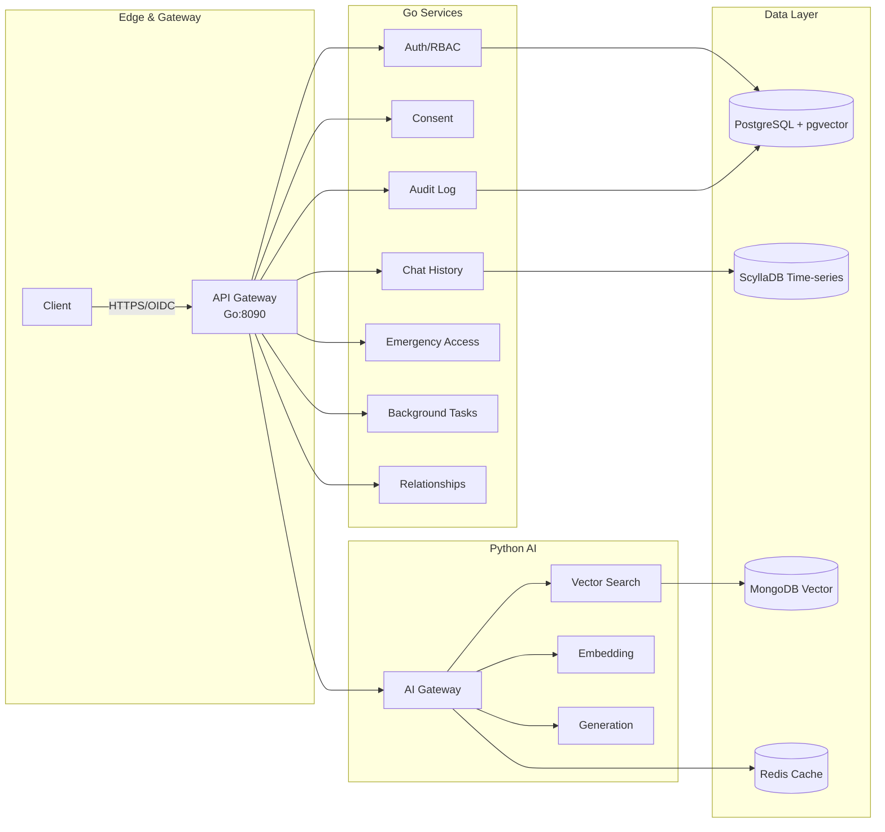
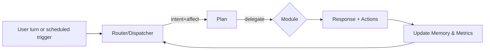

# Lilo Senior Companion — **Technology View (Optum VP Brief)**
*Date: 2025-09-04*

> This brief explains how Lilo works under the hood: the **agentic conversation brain**, **safety guardrails**, **data/privacy**, **performance & observability**, and **deployment/integration** options for Optum.

---

## 1) Architecture at a glance
**Hybrid, HIPAA-first platform**: Go microservices for healthcare-grade operations + Python AI services for models, backed by specialized data stores (PostgreSQL+pgvector, MongoDB, Redis, ScyllaDB).


*Why this design?* **Separation of concerns** (policy, audit, consent in Go; AI in Python), **fault isolation**, and **observability-first** instrumentation.

---

## 2) The agentic conversation brain
**Stateful Agentic RAG** with a **Router/Dispatcher** that detects *intent + affect*, plans the next step, and delegates to specialized modules. RAG is embedded inside modules so each reply is grounded and personal.

- **Router/Dispatcher**: intent/affect detection → alliance behaviors → plan → delegate.
- **Modules** (plug-ins): *Reminiscence*, *Behavioral Activation (BA)*, *Grounding*, *Social Bridge*, *Calm Info*, *Safety*.
- **Stateful memory**: *Life Story Graph* (people/places/events) + *Preference Book* (rituals, favorites, windows) feed every plan.
- **Deterministic rituals**: morning/afternoon/evening windows with jitter and resume-on-reconnect.
- **Continuity**: the “renderer” injects familiar names, songs, places; replies feel consistent and personal.


*Outcome:* conversations become **emotion → action** (e.g., breath timer, message to daughter, reminiscence with music), not just chat.

---

## 3) Safety guardrails (non‑clinical, clinically informed)
- **Three colors**: *Yellow* (drift), *Orange* (hopelessness/agitation), *Red* (self-harm/chest pain/confusion).
- **Scripted crisis copy** + **SBAR handoffs** → caregiver portal or emergency per consent.
- **Human-in-the-loop (HITL)**: webhook posts SBAR JSON; audit trail is immutable.
- **Alliance gate**: in distress, first two turns are reflection/validation before problem-solving.
- **Bounded optimism & scope**: calm language, no diagnosis; always offer a human bridge.

```json
{
  "S":"Escalating anxiety; user alone now",
  "B":"Recent bereavement; afternoon dips",
  "A":"Affect anxious (v=-0.5,a=0.7). No chest pain.",
  "R":"Call daughter now; nurse check-in <24h"
}
```

---

## 4) Data & privacy architecture (HIPAA by design)
**MultiDB**: 
- **PostgreSQL** (auth/consent/audit + pgvector), 
- **MongoDB** (knowledge & persistent cache), 
- **Redis** (sessions, rate limiting), 
- **ScyllaDB** (chat/time-series).

**Data governance**: *minimum necessary*, DSAR/erasure workflows, PHI tagging, encryption (AES‑256‑GCM at rest; TLS 1.3 in transit), six‑year audit retention.

**Consent surfaces**: outreach & escalation contacts; explicit gating before sending messages to family/caregivers.

**Right to erasure**: cascade deletes across stores; logs remain hashed with non‑reversible tokens.

---

## 5) Performance & caching (targets and patterns)
**3‑tier cache**: L1 (in‑proc) → L2 (Redis) → L3 (Mongo persistent). PHI‑aware: critical PHI never cached; everything encrypted at rest.

**Targets** (pilot/prod):
- L1 lookup **<1 ms**, Redis **<5 ms**, persistent cache **<15 ms**.
- LLM generation **<2 s** typical (cached sub‑100 ms).
- End‑to‑end RAG **<3 s** p95 with cache; deterministic ordering of events.

**Techniques**: zlib compression, connection pooling, token‑bucket rate limiting, circuit breakers, semantic cluster warming for common “therapeutic” topics.

---

## 6) Observability & determinism
- **Event schema v1.1**: `ce.intent_detected`, `ce.affect_inferred`, `ce.affect_hypothesis_updated`, `ce.plan_selected`, `ce.module_*`, `ce.nudge_*`, `ce.safety_flag`, `ce.reflection_logged`, `ce.metrics_snapshot`.
- **Deterministic ordering** for same `trace_id`/session (CI‑validated) so audits match what happened.
- **Debug console**: intent, affect(v/a), plan id, top memory snippets; emits diffs when affect hypothesis changes.
- **Dashboards**: engagement minutes, arousal deltas, adherence, escalations SLAs.

---

## 7) Deployment & integration options
**Run anywhere**: containerized services; GPU nodes for AI pods. Customer VPC with BAA.

**Start light for pilot**: SSO/SAML, allow‑listed domains, notifications (SMS/push/email). EHR reads are **optional** for pilot; we can add read‑only later.

**Interfaces**:
- **Memory & Consent APIs** (OpenAPI): life story, preferences, callbacks, consent GET/PUT.
- **Events ingestion**: POST `/events` (analytics v1.1) with deterministic server‑side ordering.
- **Outbound**: SMS/email via provider of record; caregiver portal hooks for SBAR.

---

## 8) Model strategy (portable & governed)
- **Embedding**: BGE‑large‑en‑v1.5 for robust vector search in healthcare texts.
- **Generation**: Qwen2.5‑7B‑Instruct with healthcare prompt style + safety rubric.
- **Portability**: model endpoints are replaceable; router logic is vendor‑neutral.
- **Safety overlay**: crisis lexicon + classifier before/after generation; conservative fallbacks (“text‑only reminiscence” if media rights missing).

---

## 9) Reliability & risk mitigation
- **Graceful degradation**: network loss → persist state and **resume idempotently**; media rights missing → text‑only.
- **Circuit breakers + rate limits**: protect upstreams and UX.
- **Backups & DR**: PITR for Postgres, replica failover for Mongo, AOF for Redis, snapshots for Scylla.
- **Privacy failures**: PHI scanners on ingestion; caching exclusions; full audit and alerting.

---

## 10) 12‑minute architecture demo (run‑of‑show)
1) **Show the planner**: input → intent+affect → plan → module (right rail shows debug tiles).
2) **Run a Reminiscence → BA → Reflection** path; display **event stream** as it fires.
3) **Trigger Orange** with a safe utterance; show **SBAR JSON** handoff and audit trail.
4) **Open metrics**: minutes/week, arousal deltas, nudges, escalations, SLA heatmap.
5) **Close with ops**: SSO, logs, and how this ships in Optum’s VPC with BAA.

---

## 11) Likely technical questions (and crisp answers)
- **Is it HIPAA‑ready today?** Yes—access control, audit, encryption, DSAR/erasure, and minimum‑necessary are built‑in; we sign a BAA and deploy in your VPC.
- **What’s required to pilot?** SSO, allow‑listing, a small consented cohort (100–300), escalation scripts, and a weekly safety council.
- **Vendor lock‑in?** Low. AI components are **endpoint‑swappable**; data is in standard stores; APIs are OpenAPI‑described.
- **Failure scenarios?** Network loss resumes; safety always wins (crisis path preempts other modules); audits are immutable.

---

### Appendix A — Key APIs (excerpt)
```yaml
GET /memory/{user_id}/life-story
PUT /memory/{user_id}/preferences
GET /memory/{user_id}/threads/recent?limit=3
POST /memory/{user_id}/callbacks  # continuity text
GET/PUT /consent/{user_id}        # outreach, escalation contacts
POST /events                         # analytics v1.1
```

### Appendix B — Event examples
```json
{
  "event_name": "ce.affect_hypothesis_updated",
  "trace_id": "t-8f2c",
  "affect": {"label":"grief_adjustment","valence":-0.58,"arousal":0.48,"confidence":0.86},
  "metadata": {"prior":{"label":"sad"},"delta_a":0.78}
}
```

---

**In short:** Lilo’s tech choices are **boring where healthcare needs boring** (audit, consent, DSAR, encryption) and **clever where members feel it** (agentic planning, ritual timing, safe emotion‑to‑action). That mix is what makes it deployable *and* lovable.
