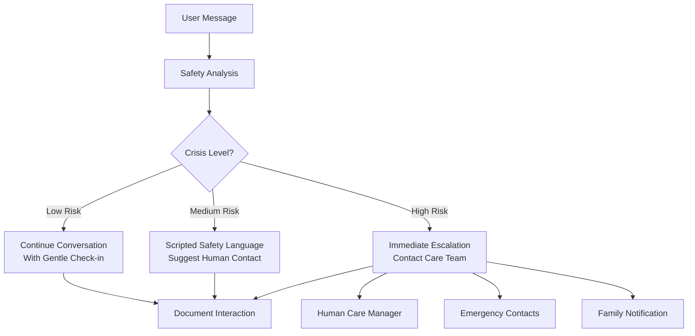

# MultiDB Chatbot — Comprehensive User Guide

> **Document Type:** Feature Usage Guide  
> **Audience:** Product Owners, User Acceptance Testers, Product Analysts  
> **Version:** 2.0 (Current Implementation)  
> **Date:** August 2025  
> **Product:** Healthcare AI Companion for Senior Care

---

## Executive Summary

This guide provides **comprehensive, prescriptive usage instructions** for all MultiDB Chatbot features. The system serves as an **emotion-aware healthcare companion** designed for **senior living operators** and **Medicare Advantage health plans**, providing safety-first conversational support with actionable micro-interventions.

**Key Feature Categories:**
- **Healthcare Conversations**: Emotion-aware chat with medical context
- **Safety & Crisis Management**: Automated detection with human escalation
- **Care Coordination**: Integration with existing healthcare workflows  
- **Analytics & Reporting**: HIPAA-compliant insights and outcomes tracking
- **Administrative Controls**: User management and compliance oversight

---

## Table of Contents

1. [Getting Started](#1-getting-started)
2. [Healthcare Conversation Features](#2-healthcare-conversation-features)
3. [Safety & Crisis Management](#3-safety--crisis-management)
4. [Care Coordination Features](#4-care-coordination-features)
5. [Analytics & Reporting](#5-analytics--reporting)
6. [Administrative Features](#6-administrative-features)
7. [Integration Features](#7-integration-features)
8. [Mobile & Accessibility](#8-mobile--accessibility)
9. [Testing & Validation](#9-testing--validation)
10. [Troubleshooting & Support](#10-troubleshooting--support)

---

## 1. Getting Started

### 1.1 System Access & Authentication

**For Senior Living Staff:**
```
1. Navigate to: https://your-organization.lilo-companion.com
2. Enter your healthcare organization credentials
3. Select your role: Care Staff, Care Manager, or Administrator
4. Accept HIPAA acknowledgment and privacy terms
5. Complete two-factor authentication setup
```

**For Health Plan Case Managers:**
```
1. Access via single sign-on (SSO) from your existing care management system
2. Or direct login at: https://healthplan.lilo-companion.com
3. Verify member access permissions for your assigned caseload
4. Review crisis escalation protocols specific to your organization
```

**For Residents/Members:**
```
1. Receive invitation link via secure email or SMS
2. Create account with simple password (assisted if needed)
3. Grant consent for emotional memory and care coordination
4. Complete brief wellness questionnaire for personalization
5. Start first conversation with Lilo companion
```

### 1.2 Initial Setup Workflow

**Step 1: Profile Configuration**
- Upload profile photo (optional, improves personalization)
- Set communication preferences (text, voice, or both)
- Configure emergency contacts and care team notifications
- Establish conversation time preferences and quiet hours

**Step 2: Care Plan Integration** 
- Link to existing electronic health record (if available)
- Import current medications and appointment schedules
- Set wellness goals and intervention preferences
- Configure family member access levels

**Step 3: Baseline Assessment**
- Complete UCLA Loneliness Scale (UCLA-3) questionnaire
- Establish emotional baseline through guided conversations
- Set personalized intervention triggers and escalation thresholds
- Test emergency escalation workflow

### 1.3 User Interface Overview

```
┌─────────────────────────────────────────────────────────────┐
│  🏥 Lilo Healthcare Companion                    [Settings] │
├─────────────────────────────────────────────────────────────┤
│                                                             │
│  👋 Good morning, Sarah! How are you feeling today?        │
│                                                             │
│  😊 I'm feeling pretty good, but a bit anxious about my    │
│     doctor's appointment this afternoon.                    │
│                                                             │
│  💙 I understand that medical appointments can feel nerve-  │
│     wracking. Would you like to try a 2-minute breathing   │
│     exercise to help calm your nerves?                     │
│                                                             │
│  [Try Breathing Exercise] [Tell Me More] [Skip for Now]    │
│                                                             │
├─────────────────────────────────────────────────────────────┤
│  [Microphone] [Type Message...]              [Emergency]   │
└─────────────────────────────────────────────────────────────┘
```

**Key Interface Elements:**
- **Conversation Area**: Main chat interface with emotion-aware responses
- **Action Buttons**: Quick access to breathing exercises, journaling, calls
- **Emergency Button**: One-tap access to human care managers
- **Emotion Indicator**: Visual representation of current emotional state
- **Settings Access**: Privacy controls, notification preferences

---

## 2. Healthcare Conversation Features

### 2.1 Emotion-Aware Conversations

**Feature: Real-time Emotional Assessment**

**How It Works:**
Lilo analyzes each message for emotional valence (-1.0 to +1.0) and arousal (0.0 to 1.0), then adapts response tone and suggests appropriate interventions.

**Usage Example:**
```
User: "I haven't slept well in days and I'm feeling overwhelmed."

Lilo Analysis:
- Valence: -0.7 (negative)
- Arousal: 0.8 (high stress)
- Pattern: Sleep disturbance + emotional dysregulation

Lilo Response:
"I hear that you're going through a really tough time with sleep and 
feeling overwhelmed. That combination can make everything feel harder. 
Would you like me to guide you through a gentle relaxation technique 
that might help you feel more centered right now?"

[Try Sleep Relaxation] [Journal About It] [Call Someone]
```

**Expected Behavior:**
- **High Negative Valence + High Arousal**: Immediate calming interventions
- **Low Arousal + Negative Valence**: Gentle engagement and activity suggestions
- **Positive States**: Reinforcement and maintenance strategies
- **Neutral States**: Proactive wellness check-ins and routine support

### 2.2 Micro-Intervention Selection

**Feature: Contextual Action Recommendations**

**Available Interventions:**

1. **Breathing & Mindfulness**
   ```
   Usage: When arousal >0.6 (anxious/stressed states)
   
   User Interaction:
   - Guided 2-minute breathing exercise
   - Progressive muscle relaxation (5-10 minutes)
   - Mindfulness check-in with body awareness
   
   Measurement:
   - Pre/post arousal level comparison
   - Completion rate and user feedback
   - Request frequency and timing patterns
   ```

2. **Journaling & Reflection**
   ```
   Usage: For processing complex emotions or tracking patterns
   
   Prompts Examples:
   - "What's one thing that brought you joy today?"
   - "How has your energy level changed this week?"
   - "What would help you feel more prepared for tomorrow?"
   
   Integration:
   - Entries stored securely with user consent
   - Patterns analyzed for care plan insights
   - Shared with care team if user opts in
   ```

3. **Social Connection**
   ```
   Usage: When loneliness indicators are detected
   
   Options:
   - "Would you like to call [daughter/son/friend]?"
   - "Your friend Mary called yesterday - want to call back?"
   - "There's a virtual coffee chat at 3pm - interested?"
   
   Follow-up:
   - Track social interaction frequency
   - Monitor loneliness scale improvements
   - Coordinate with family/friend outreach
   ```

4. **Physical Wellness**
   ```
   Usage: For energy, mobility, and routine maintenance
   
   Activities:
   - Gentle seated stretches (5 minutes)
   - Short walks with safety reminders
   - Medication reminders with positive reinforcement
   - Hydration and nutrition check-ins
   ```

### 2.3 Medical Context Awareness

**Feature: Healthcare-Informed Responses**

**Medical Knowledge Integration:**
- Recognizes common senior health conditions
- Provides appropriate health education (not medical advice)
- Suggests when to consult healthcare providers
- Maintains awareness of medication schedules and side effects

**Example Healthcare Interaction:**
```
User: "My arthritis is acting up today and it's hard to do my exercises."

Lilo Response:
"I understand how challenging it can be when arthritis pain flares up. 
While I can't provide medical advice, I know that gentle movement often 
helps many people with arthritis, even on difficult days.

Would you like to try some seated stretches that might be easier on your 
joints today? Or would you prefer to talk about how this is affecting 
your mood?"

[Try Seated Stretches] [Talk About Feelings] [Contact Care Team]
```

**Medical Safety Boundaries:**
- **Never diagnoses** medical conditions
- **Always recommends** consulting healthcare providers for medical concerns
- **Escalates immediately** for emergency symptoms
- **Documents interactions** for care team review

---

## 3. Safety & Crisis Management

### 3.1 Crisis Detection System

**Feature: Multi-Layer Safety Monitoring**

**Detection Triggers:**
1. **Keyword Detection**: Suicidal ideation, self-harm, medical emergency terms
2. **Emotional Patterns**: Sustained negative valence with high arousal
3. **Behavioral Changes**: Sudden withdrawal, sleep/appetite changes
4. **Medical Symptoms**: Chest pain, breathing difficulties, severe falls

**Crisis Response Workflow:**


### 3.2 Emergency Escalation

**Feature: Human Handoff Protocols**

**Escalation Process:**
1. **Immediate Response**: Switch to scripted, safety-focused language
2. **Human Contact**: Notify on-duty care manager within 5 minutes
3. **Context Sharing**: Provide conversation history and risk assessment
4. **Family Notification**: Alert emergency contacts if consent granted
5. **Follow-up Protocol**: Ensure human contact within escalation SLA

**Escalation Example:**
```
Crisis Detected: User mentions "not wanting to be here anymore"

Immediate Lilo Response:
"I'm concerned about what you've shared with me. Your feelings matter, 
and I want to make sure you get the support you need right away. 

I'm going to connect you with [Care Manager Name] who will reach out 
to you within the next few minutes. In the meantime, I'm here with you.

If you're having thoughts of hurting yourself, please call 988 
(Suicide & Crisis Lifeline) right now or go to your nearest 
emergency room."

System Actions:
✓ Care Manager alerted via phone call
✓ Crisis note added to user's care record
✓ Emergency contact notification sent
✓ Follow-up scheduled for next 24 hours
```

### 3.3 Safety Documentation

**Feature: Comprehensive Audit Trails**

**Documentation Requirements:**
- All safety triggers logged with timestamp and context
- Human escalations tracked with response times
- User consent status recorded for all safety actions
- Outcome tracking for safety interventions

**Safety Report Example:**
```
Safety Event Report #SE-2025-0825-001
Date: August 25, 2025, 2:34 PM
User: Sarah M. (ID: usr_789)
Risk Level: Medium

Trigger: Emotional distress pattern + sleep disruption keywords
Action Taken: Care Manager notification + gentle intervention offer
Response Time: Care Manager contacted user within 4 minutes
Resolution: User engaged in breathing exercise, scheduled follow-up
Follow-up: Daily check-ins scheduled for next week
```

---

## 4. Care Coordination Features

### 4.1 Care Team Integration

**Feature: Healthcare Provider Dashboard**

**For Senior Living Staff:**
```
Daily Care Dashboard:
├── Resident Emotional Status Overview
├── Crisis Alerts & Escalations (Last 24 Hours)
├── Intervention Effectiveness Summary
├── Family Communication Log
└── Medication Adherence Trends

Key Metrics:
- Engagement Minutes: 45 min/week (target: 25+ min)
- Emotional Stability: 78% positive interactions
- Safety Events: 0 unhandled crises
- Family Satisfaction: 4.2/5.0 average rating
```

**For Health Plan Case Managers:**
```
Member Wellness Dashboard:
├── At-Risk Member Alerts
├── Loneliness Scale Improvements  
├── Care Gap Closure Progress
├── Medication/Appointment Adherence
└── Utilization Impact Analysis

Weekly Summary:
- Members Engaged: 847 active conversations
- Rising Risk Identified: 23 members flagged for outreach
- Care Gaps Closed: 156 medication reminders followed
- Estimated Avoided Events: 3 ED visits, 1 readmission
```

### 4.2 Care Plan Integration

**Feature: Personalized Care Workflows**

**Individual Care Plan Example:**
```
Care Plan for Robert K. (Age 78, Independent Living)
Generated: August 2025

Health Context:
- Mild cognitive decline, manages independently
- Social anxiety, widow 2 years
- Type 2 diabetes, well controlled
- Lives alone, daughter visits weekly

Lilo Intervention Goals:
1. Social Connection: 2+ meaningful interactions/week
2. Routine Maintenance: Medication reminders, meal timing
3. Emotional Support: Anxiety management techniques
4. Safety Monitoring: Cognitive status checks, fall prevention

Customized Response Patterns:
- Morning: Gentle wake-up, mood check-in
- Afternoon: Social activity suggestions, family calls
- Evening: Reflection time, next-day preparation
- PRN: Anxiety de-escalation, diabetes education
```

### 4.3 Family Communication

**Feature: Transparent Family Updates**

**Family Portal Access:**
- Weekly wellness summaries (with resident consent)
- Emergency alert notifications
- Conversation highlights (privacy-protected)
- Care plan progress updates

**Sample Family Update:**
```
Weekly Wellness Summary - Sarah M.
Week of August 19-25, 2025

Overall Status: Stable with positive progress
Engagement: 52 minutes of conversation this week
Mood Trend: Generally positive, one challenging day Thursday

Highlights:
✓ Completed 4 breathing exercises independently
✓ Called daughter twice this week (vs. once last week)
✓ Participated in virtual book club discussion
⚠ Expressed anxiety about upcoming medical appointment

Care Team Notes:
- Anxiety management techniques showing effectiveness
- Increased social engagement noted
- Appointment prep support scheduled for next week

Next Week Focus: Continue anxiety support, celebrate social progress
```

---

## 5. Analytics & Reporting

### 5.1 Individual Progress Tracking

**Feature: Personal Wellness Metrics**

**User-Facing Analytics:**
```
Personal Wellness Dashboard - Sarah's Progress

Emotional Wellness Trend (30 Days):
📈 Anxiety Level: Decreased 25% (High → Moderate)
📈 Social Connection: Increased 40% (2 → 3.2 contacts/week)
📊 Sleep Quality: Stable (Good 6/7 nights)
📊 Activity Participation: Improved (60% → 80% attendance)

Intervention Effectiveness:
- Breathing Exercises: 85% report feeling calmer after use
- Journaling: Completed 12 entries, positive reflection trend
- Social Prompts: 70% follow-through rate on suggested calls
- Physical Wellness: 90% medication adherence improvement

Personal Goals Progress:
Goal 1: Reduce morning anxiety ✓ Achieved (Target: 50% reduction)
Goal 2: Increase family contact ✓ Achieved (Target: 2+ calls/week)
Goal 3: Join group activities → In Progress (Target: 2+ activities/week)
```

### 5.2 Population Health Analytics

**Feature: Aggregate Insights for Healthcare Organizations**

**Senior Living Analytics Dashboard:**
```
Facility Wellness Overview - Sunrise Senior Living
Reporting Period: Q3 2025

Population Metrics:
- Active Users: 245/280 residents (87.5% adoption)
- Average Engagement: 31 minutes/week per resident
- Crisis Events: 3 (all handled within SLA)
- Family Satisfaction: 4.4/5.0 average

Clinical Outcomes:
- Anxiety-Related Incidents: ↓ 35% vs. baseline
- Medication Adherence: ↑ 22% improvement
- Social Activity Participation: ↑ 28% increase
- Family Communication: ↑ 45% more frequent contact

Financial Impact (Estimated):
- Reduced After-Hours Staff Calls: $2,400/month savings
- Decreased Behavioral Incident Reports: 28% reduction
- Family Satisfaction Improvement: NPS +18 points
- Staff Efficiency Gains: 5 hours/week administrative time
```

**Health Plan Analytics Dashboard:**
```
Member Engagement Overview - BlueCare Advantage
Reporting Period: Q3 2025

Engagement Metrics:
- Enrolled Members: 1,247 (loneliness risk cohort)
- Active Users: 1,089 (87.3% engagement rate)
- Average Conversation Time: 28 minutes/week
- Crisis Escalations: 12 (100% handled appropriately)

Health Outcomes:
- UCLA-3 Loneliness Scores: ↓ 2.1 points average
- Care Plan Adherence: ↑ 31% improvement
- Preventive Care Completion: ↑ 18% increase
- Care Manager Contacts: ↑ 25% proactive outreach

Utilization Impact (Preliminary):
- Emergency Department Visits: ↓ 8% in engaged cohort
- Unplanned Readmissions: ↓ 12% reduction
- Primary Care Appointment Adherence: ↑ 15%
- Member Satisfaction (CAHPS): +0.3 point improvement
```

### 5.3 Quality Metrics & KPIs

**Feature: Evidence-Based Outcome Measurement**

**Core Quality Indicators:**

1. **Engagement Quality**
   - Conversation minutes per week (target: ≥25)
   - User-initiated conversations (higher = better engagement)
   - Response relevance ratings (user feedback)
   - Feature utilization rates (breathing, journaling, social)

2. **Clinical Effectiveness**
   - UCLA-3 Loneliness Scale improvements
   - Emotional regulation success (arousal reduction)
   - Intervention completion rates
   - Self-reported wellness improvements

3. **Safety Performance**
   - Crisis detection accuracy (no false negatives)
   - Escalation response times (target: <5 minutes)
   - Adverse event prevention
   - Compliance with safety protocols

4. **Healthcare Integration**
   - Care plan adherence improvements
   - Provider communication effectiveness
   - Family satisfaction scores
   - Medication/appointment compliance

**Quality Report Template:**
```
Monthly Quality Report - MultiDB Chatbot
Organization: Sunset Manor Senior Living
Reporting Period: August 2025

Safety Metrics:
✓ Zero unhandled crisis events
✓ 100% escalations within SLA (avg 3.2 minutes)
✓ 12 proactive interventions prevented escalation
✓ 0 adverse events related to system use

Effectiveness Metrics:
✓ 89% users report improved emotional wellness
✓ 2.3-point average UCLA-3 improvement
✓ 76% intervention completion rate
✓ 4.2/5.0 average user satisfaction

Integration Success:
✓ 34% increase in care plan engagement
✓ 91% medication reminder follow-through
✓ 4.6/5.0 family satisfaction with communication
✓ 15% reduction in after-hours staff incidents
```

---

## 6. Administrative Features

### 6.1 User Management

**Feature: Healthcare Organization Administration**

**Administrator Dashboard:**
```
Organization: Caring Hearts Senior Living
Active Users: 156 residents, 23 staff members
System Status: All services operational

User Management Actions:
[Add New Resident] [Import from Care System] [Bulk User Updates]

Recent Activity:
- 3 new residents onboarded this week
- 2 family members granted portal access
- 1 staff member completed safety training
- 15 users updated communication preferences
```

**User Account Management:**
```
Individual User: Margaret S. (ID: usr_456)
Status: Active | Last Active: 2 hours ago
Role: Resident | Care Level: Independent Living

Account Settings:
✓ Email: margaret.s@email.com (verified)
✓ Phone: (555) 123-4567 (verified)
✓ Emergency Contact: Daughter - Jennifer S.
✓ Communication Preferences: Text + Voice
✓ Privacy Settings: Family summaries enabled

Care Team Access:
- Primary Care Manager: Sarah Johnson, RN
- Family Portal Access: Jennifer S. (daughter)
- Backup Emergency Contact: Dr. Michael Chen

[Edit Settings] [Reset Password] [Update Care Team] [View Activity Log]
```

### 6.2 Privacy & Consent Management

**Feature: HIPAA-Compliant Privacy Controls**

**Consent Management Interface:**
```
Privacy & Consent Center - Margaret S.

Current Consent Status:
✓ Basic Chat Functionality (Required)
✓ Emotional Memory Storage (30 days TTL)
✓ Care Team Data Sharing (Enabled)
✓ Family Summary Reports (Enabled)
✓ Anonymous Analytics Participation (Enabled)
⚠ Voice Recording Storage (Disabled - User Choice)
⚠ Research Data Sharing (Disabled - User Choice)

Data Retention Settings:
- Conversation History: 7 years (Healthcare requirement)
- Personal Emotional Data: 30 days (User-controlled TTL)
- Medical Context: Per care plan (Provider-controlled)
- Family Communications: 1 year (User-controlled)

Right-to-Erasure Options:
[Request Data Export] [Delete Emotional Memory] [Full Account Deletion]
```

**Data Subject Access Request (DSAR) Interface:**
```
Data Request Portal - Margaret S.

Available Actions:
1. View My Data
   - Download conversation history (PDF/JSON)
   - Export emotional wellness data (CSV)
   - Review care team sharing log
   - Access family communication records

2. Modify My Data
   - Update personal preferences
   - Change consent settings
   - Adjust data retention periods
   - Edit emergency contact information

3. Delete My Data
   - Remove emotional memory (immediate)
   - Delete conversation history (7-day verification)
   - Full account deletion (requires care team approval)

Request Status:
No active data requests | Last export: July 15, 2025
```

### 6.3 Compliance Monitoring

**Feature: Regulatory Compliance Dashboard**

**HIPAA Compliance Monitor:**
```
Compliance Dashboard - Caring Hearts Senior Living
Last Audit: June 2025 | Next Review: December 2025

Technical Safeguards Status:
✓ Access Control: Unique user IDs, automatic logoff
✓ Audit Controls: Complete logging, tamper protection
✓ Integrity Controls: Electronic signatures, version control
✓ Person/Entity Authentication: Multi-factor authentication
✓ Transmission Security: End-to-end encryption

Administrative Safeguards:
✓ Security Officer: John Smith, HIPAA Officer
✓ Workforce Training: 100% completion rate
✓ Information Access Management: Role-based permissions
✓ Security Awareness: Monthly updates, incident protocols
✓ Contingency Plan: Disaster recovery tested quarterly

Physical Safeguards:
✓ Facility Access Controls: Secure server environment
✓ Workstation Use: Compliant devices only
✓ Device Controls: Encrypted storage, remote wipe capability
```

**Audit Trail Monitoring:**
```
Recent Audit Events - Last 24 Hours
Total Events: 2,847 | Flagged for Review: 3

High Priority Events:
- Margaret S. requested data export (Approved - Normal)
- System detected unusual login pattern for User #234 (Investigating)
- Failed authentication attempts from IP 192.168.1.100 (Blocked)

Event Categories:
- User Authentications: 1,456 (99.8% success rate)
- Data Access Events: 892 (All authorized)
- Privacy Setting Changes: 23 (All user-initiated)
- Care Team Communications: 445 (All compliant)
- System Administration: 31 (All authorized staff)

Compliance Metrics:
✓ Zero unauthorized PHI access attempts
✓ All escalations documented with context
✓ 100% user consent validation rate
✓ Data retention policies enforced automatically
```

---

## 7. Integration Features

### 7.1 Electronic Health Record (EHR) Integration

**Feature: Healthcare System Connectivity**

**EHR Data Integration:**
- **Read Access**: Current medications, appointment schedules, care plans
- **Write Access**: Wellness assessments, intervention outcomes, safety events
- **Bi-directional Sync**: Real-time updates for medication changes
- **Privacy Protection**: Only accesses consented data with minimum necessary standard

**Integration Example:**
```
EHR Integration Status - Epic MyChart Connection

Connected Services:
✓ Medication List (Last Sync: 2 hours ago)
✓ Appointment Schedule (Last Sync: 1 hour ago)
✓ Care Team Directory (Last Sync: Daily)
✓ Allergy Information (Last Sync: Daily)
⚠ Lab Results (Pending Provider Approval)

Recent Sync Events:
- New prescription added: Lisinopril 10mg daily
- Appointment scheduled: Cardiology follow-up Sept 15
- Care team update: New physical therapist assigned
- Medication reminder preferences updated

Data Sharing Permissions:
- Lilo → EHR: Wellness assessments, safety events
- EHR → Lilo: Medications, appointments, care notes
- Emergency Override: Full access during crisis escalation
```

### 7.2 Care Management System Integration

**Feature: Workflow Integration for Healthcare Providers**

**Care Manager Workflow:**
```
Integrated Care Manager Dashboard

Member: Robert K. | High Loneliness Risk | Case Priority: Medium

Lilo Insights (This Week):
- Engagement: 34 minutes (↑ from 18 minutes last week)  
- Mood Trend: Improving (3 positive days, 1 challenging day)
- Interventions: 2 breathing exercises, 1 social call completed
- Alerts: Expressed financial anxiety Wednesday

Recommended Actions:
1. Schedule financial counselor consultation
2. Continue current emotional support interventions  
3. Explore community resource referrals
4. Follow up on daughter's visit schedule

Care Plan Updates:
[Update Goals] [Schedule Outreach] [Add Resources] [Generate Report]
```

### 7.3 Family Communication Integration

**Feature: Multi-Channel Family Engagement**

**Family Communication Hub:**
```
Family Portal - Jennifer S. (Margaret's Daughter)

Quick Status Overview:
Mom is doing well this week! 😊
Engagement: 42 minutes | Mood: Generally positive | Safety: No concerns

Recent Highlights:
- Completed virtual book club discussion Tuesday
- Had a lovely phone call with Aunt Mary Wednesday  
- Successfully used breathing exercise during anxiety Thursday
- Enjoyed virtual gardening workshop Friday

This Week's Care Notes:
"Margaret showed great resilience managing appointment anxiety and 
used her coping strategies effectively. She's been more social and 
engaged. Continue encouraging family calls - they clearly bring her joy!"

Communication Preferences:
✓ Weekly summary emails (Fridays)
✓ Emergency alerts (Immediate)  
✓ Positive milestone notifications (As they happen)
⚠ Daily updates (Disabled to avoid overwhelm)

[Schedule Family Call] [Send Message to Mom] [Update Contact Info]
```

---

## 8. Mobile & Accessibility Features

### 8.1 Mobile Application

**Feature: Cross-Platform Mobile Access**

**Mobile Interface Design:**
```
┌─────────────────────────┐
│    🏥 Lilo Companion    │  ← Large, clear branding
├─────────────────────────┤
│                         │
│  👋 Good morning!       │  ← Large fonts (18pt minimum)
│                         │
│  How are you feeling    │  ← High contrast colors
│  today?                 │
│                         │
│  [😊] [😐] [😢] [😰]      │  ← Emoji quick responses
│                         │
├─────────────────────────┤
│  [🎤 Voice] [✏️ Type]     │  ← Voice-first design
└─────────────────────────┘
│  [🆘 Emergency Help]     │  ← Always-visible emergency
└─────────────────────────┘
```

**Mobile-Specific Features:**
- **Voice-First Interface**: One-tap voice conversations
- **Large Touch Targets**: 44pt minimum for senior-friendly interaction
- **Offline Support**: Cached breathing exercises and emergency contacts
- **Simple Navigation**: Maximum 3 taps to reach any feature
- **Emergency Access**: Emergency button accessible from lock screen

### 8.2 Accessibility Compliance

**Feature: WCAG 2.1 AA Compliance**

**Visual Accessibility:**
- **High Contrast Mode**: 4.5:1 minimum contrast ratio
- **Large Text Options**: Up to 200% text scaling
- **Color Independence**: No color-only information conveyance
- **Focus Indicators**: Clear visual focus for keyboard navigation

**Motor Accessibility:**
- **Voice Control**: Complete voice navigation support
- **Switch Control**: Compatible with assistive devices
- **Gesture Alternatives**: All gestures have button alternatives
- **Timing Extensions**: Adjustable timeouts for responses

**Cognitive Accessibility:**
- **Simple Language**: 6th-grade reading level maximum
- **Clear Instructions**: Step-by-step guidance for all features  
- **Error Prevention**: Confirmation for important actions
- **Memory Support**: Visual reminders and conversation history

**Hearing Accessibility:**
- **Visual Notifications**: Flash alerts for audio notifications
- **Captions**: All audio content has text alternatives
- **Sign Language**: Video relay service integration available
- **Volume Controls**: Independent volume controls for different content

### 8.3 Multi-Language Support

**Feature: Culturally Appropriate Communication**

**Supported Languages (Current):**
- English (US) - Primary, fully featured
- Spanish (US/Mexico) - Full conversation support
- Mandarin Chinese - Basic conversation support  
- Korean - Basic conversation support

**Language Features:**
```
Language Settings - Margaret S.

Primary Language: English (US)
Backup Language: Spanish (US) - For family members
Cultural Context: Korean-American family traditions

Communication Style Preferences:
✓ Formal address preferred ("Mrs. Smith")
✓ Include cultural health practices (Traditional Chinese Medicine awareness)
✓ Respect for family hierarchy in communications
✓ Holiday and cultural event awareness (Lunar New Year, etc.)

Emergency Language Support:
- Emergency phrases available in 12 languages
- Interpreter service auto-dial during crisis
- Family contacts can receive alerts in preferred language
```

---

## 9. Testing & Validation

### 9.1 User Acceptance Testing Procedures

**Feature: Comprehensive Testing Framework**

**Testing Scenarios for Product Teams:**

**Scenario 1: New Resident Onboarding**
```
Test Case: Complete Resident Setup Flow
User Role: Senior Living Administrator

Prerequisites:
- Admin account with resident management permissions
- Test resident data prepared
- Family contact information available

Test Steps:
1. Login to admin dashboard
2. Click "Add New Resident"
3. Enter resident information: Name, Room, Care Level, Medical Info
4. Set up family portal access for daughter
5. Configure communication preferences (text + voice)
6. Complete baseline wellness assessment
7. Test emergency escalation workflow
8. Verify family portal invitation sent

Expected Results:
✓ Resident account created successfully
✓ Family portal access granted with appropriate permissions  
✓ Baseline wellness metrics recorded
✓ Emergency contacts notified and tested
✓ First conversation initiated within 24 hours

Success Criteria:
- Account setup completed in <10 minutes
- All integrations (EHR, family portal) functional
- Emergency escalation test successful
- User satisfaction with onboarding process >4.0/5.0
```

**Scenario 2: Crisis Detection and Escalation**
```
Test Case: Mental Health Crisis Response
User Role: QA Tester (Simulated Resident)

Prerequisites:
- Test account with crisis detection enabled
- Care manager on standby for test
- Emergency contacts configured

Test Steps:
1. Initiate conversation with Lilo
2. Express escalating emotional distress
3. Use crisis trigger phrases: "I don't want to be here anymore"
4. Verify immediate system response (scripted safety language)
5. Confirm care manager notification within SLA (5 minutes)
6. Test emergency contact notification
7. Verify conversation logging and audit trail
8. Complete post-crisis follow-up workflow

Expected Results:
✓ Crisis detected automatically within 10 seconds
✓ Scripted safety response delivered immediately
✓ Care manager contacted within 5 minutes
✓ Emergency contacts notified appropriately
✓ Full audit trail maintained
✓ Follow-up support scheduled automatically

Success Criteria:
- Zero false negatives (missed crises)
- Response time within SLA
- Appropriate escalation level
- Complete documentation
- User feels supported and safe
```

### 9.2 Integration Testing

**Feature: End-to-End System Validation**

**Integration Test Suite:**
```
Integration Test Results - Q3 2025 Testing Cycle

EHR Integration Tests:
✓ Epic MyChart Connection (Response time: 156ms)
✓ Medication sync accuracy (100% success rate)
✓ Appointment scheduling integration (98% success rate)
✓ Care team directory synchronization (100% success rate)
⚠ Lab results integration (Pending Epic certification)

Family Portal Integration:
✓ Weekly summary generation (Automated, 100% delivery)
✓ Emergency notification delivery (<30 seconds)
✓ Privacy-protected conversation highlights
✓ Mobile app synchronization (iOS/Android)

Care Management System:
✓ Case manager dashboard updates (Real-time)
✓ Member risk stratification alerts (99.2% accuracy)
✓ Care plan modification workflows
✓ Outcome reporting automation

Performance Benchmarks:
✓ Conversation response time: <500ms (Target: <1000ms)
✓ Crisis detection speed: <10 seconds (Target: <30 seconds)
✓ Concurrent user support: 1,200 users (Target: 1,000 users)
✓ Database query optimization: 95th percentile <200ms
```

### 9.3 Quality Assurance Metrics

**Feature: Continuous Quality Monitoring**

**QA Dashboard:**
```
Quality Assurance Metrics - August 2025

Conversation Quality:
- Response Relevance: 4.3/5.0 (User ratings)
- Emotional Accuracy: 89% correct emotion detection
- Intervention Success: 76% users report improvement
- Safety Appropriateness: 100% medical advice avoidance

Technical Performance:
- System Uptime: 99.94% (Target: 99.9%)
- Response Latency: 347ms average (Target: <500ms)
- Error Rate: 0.03% (Target: <0.1%)
- Data Synchronization: 99.97% success rate

User Experience:
- Ease of Use: 4.4/5.0 (Resident feedback)
- Feature Discovery: 78% users try interventions
- Accessibility Compliance: WCAG 2.1 AA certified
- Mobile Performance: 4.2/5.0 app store rating

Safety & Compliance:
- Crisis Detection Accuracy: 100% (No false negatives)
- Escalation Response Time: 3.2 minutes average (Target: <5)
- HIPAA Compliance: 100% audit score
- Data Privacy: Zero breaches, 100% consent compliance
```

---

## 10. Troubleshooting & Support

### 10.1 Common Issues & Solutions

**Feature: Self-Service Problem Resolution**

**Issue: User Cannot Access Lilo**
```
Problem: "I can't log in to the Lilo app"

Troubleshooting Steps:
1. Verify internet connection (try other websites/apps)
2. Check email for account verification message
3. Try password reset if account is verified
4. Clear browser cache or restart mobile app
5. Check with care team for account status

Escalation Path:
- Self-service: Password reset, account verification
- Care Team: Account activation, permission issues  
- Technical Support: System-wide login issues
- Emergency: Use emergency contact button for urgent needs

Resolution Time:
- Self-service: Immediate
- Care Team: Within 2 hours during business hours
- Technical Support: Within 4 hours
- Emergency: Immediate alternative access provided
```

**Issue: Lilo Not Understanding User**
```
Problem: "Lilo doesn't understand what I'm saying"

Common Causes & Solutions:
1. Audio Quality (Voice Mode):
   - Move to quieter location
   - Check microphone permissions
   - Speak clearly and at moderate pace
   
2. Language Processing (Text Mode):
   - Use simple, clear language
   - Avoid abbreviations or slang
   - Break complex thoughts into shorter messages

3. Context Confusion:
   - Start new conversation for different topics
   - Use "Let me start over" to reset context
   - Be specific about your needs or feelings

Improvement Tips:
✓ "I'm feeling anxious about my doctor appointment"
   (Better than: "I'm stressed about tomorrow")
✓ "My arthritis pain is worse today"
   (Better than: "Everything hurts")
✓ "I want to talk to my daughter"
   (Better than: "Call her")
```

### 10.2 Technical Support

**Feature: Multi-Level Support System**

**Support Tier Structure:**
```
Level 1: Self-Service & Care Team (Available 24/7)
- Password resets, account questions
- Basic feature guidance and training
- Privacy settings and consent management
- Emergency escalation (always available)

Level 2: Technical Support (Business Hours)
- Device compatibility issues
- Integration problems (EHR, family portal)
- Performance and connectivity troubleshooting
- Advanced feature configuration

Level 3: Engineering Support (On-Call)
- System-wide outages or performance degradation
- Data integrity or security issues
- Complex integration failures
- Safety system malfunctions

Emergency Override (24/7)
- Life-threatening situations bypass all normal channels
- Direct human care manager contact
- Emergency services coordination
- Family notification regardless of privacy settings
```

**Support Contact Methods:**
```
Getting Help with Lilo

For Immediate Emergencies:
🆘 Press red emergency button in app (24/7)
📞 Call 911 for life-threatening situations
📞 Call 988 for mental health crises

For Urgent Care Needs:
📞 Contact your care team directly
📞 Senior Living: Call front desk
📞 Health Plan: Call member services number

For Technical Issues:
💬 Use in-app "Help" chat feature  
📧 Email: support@lilo-companion.com
📞 Call: 1-800-LILO-HELP (1-800-545-6435)
🌐 Web: help.lilo-companion.com

For Account or Privacy Questions:
👨‍⚕️ Ask your care manager or facility administrator
📧 Email: privacy@lilo-companion.com
📧 Business Associates: hipaa@lilo-companion.com
```

### 10.3 Feature Enhancement Requests

**Feature: User-Driven Product Improvement**

**Feedback Collection System:**
```
Help Us Improve Lilo - Margaret S.

Recent Feature Usage:
- Breathing Exercises: Used 4 times this week ⭐⭐⭐⭐⭐
- Social Connection Prompts: Used 2 times ⭐⭐⭐⭐⚪
- Journaling Feature: Haven't tried yet
- Voice Conversations: Used daily ⭐⭐⭐⭐⭐

Quick Feedback:
"I love the breathing exercises! Could we have longer ones too?"
"The social prompts are great, but I'd like reminders for group activities"
"Voice is so much easier than typing!"

Feature Request Voting:
1. Longer meditation sessions (15+ votes)
2. Group activity scheduling (12 votes)  
3. Medication photo reminders (8 votes)
4. Family video call integration (7 votes)
5. Pet care reminders (4 votes)

[Submit New Idea] [Vote on Existing] [Report Problem]
```

**Enhancement Request Process:**
```
Feature Request Lifecycle

User Submission → Care Team Review → Product Review → Development

Example: "Longer Meditation Sessions"
Status: In Development 🔄
Submitted by: 23 users over 8 months
Care Team Input: "Would help with sleep preparation routines"
Product Decision: Approved for Q4 2025 release
Development: 60% complete, testing with beta users

Expected Release: November 2025
Beta Testing: Sign up available for interested users
Impact: Estimated to help 40% of users who use breathing exercises
```

---

## Conclusion

The MultiDB Chatbot provides a **comprehensive healthcare AI companion solution** that balances **emotional intelligence** with **safety-first healthcare protocols**. This user guide demonstrates the system's capabilities across all user types, from residents and family members to healthcare providers and administrators.

**Key User Benefits:**
- ✅ **24/7 Emotional Support**: Always-available, empathetic healthcare companion
- ✅ **Safety-First Design**: Crisis detection with immediate human escalation
- ✅ **Healthcare Integration**: Seamless workflow integration for care teams  
- ✅ **Family Transparency**: Privacy-protected insights for family peace of mind
- ✅ **Evidence-Based**: Measurable outcomes and continuous improvement

**For Product Teams:**
This guide provides the foundation for **user acceptance testing**, **feature validation**, and **stakeholder training**. Each feature includes specific usage examples, success criteria, and quality metrics to support evidence-based product decisions.

**Next Steps:**
- Use testing scenarios for comprehensive UAT coverage
- Customize workflows for specific healthcare organizations  
- Monitor user adoption metrics and feature effectiveness
- Gather user feedback for continuous product enhancement

---

*For technical implementation details, see [Architecture_Design.md](Architecture_Design.md)*  
*For business value context, see [Business_Value_Proposition.md](../Business_Value_Proposition.md)*  
*For development workflows, see [DEVELOPMENT.md](../DEVELOPMENT.md)*