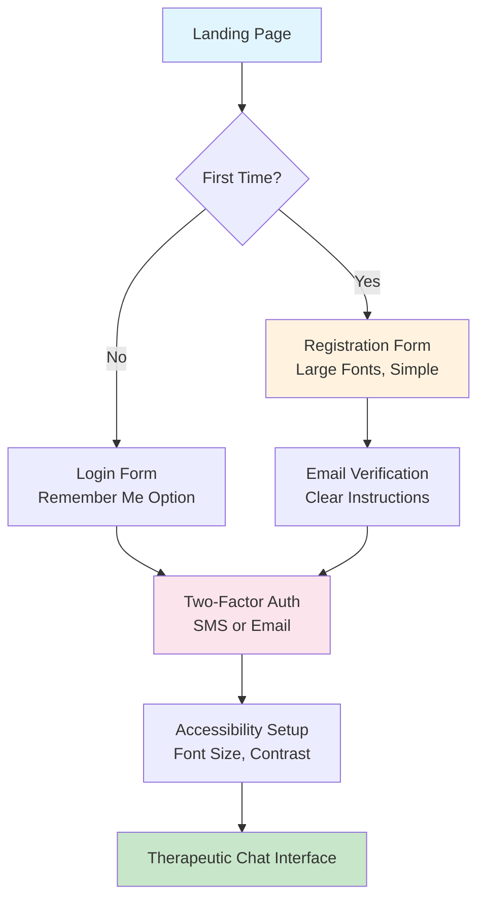
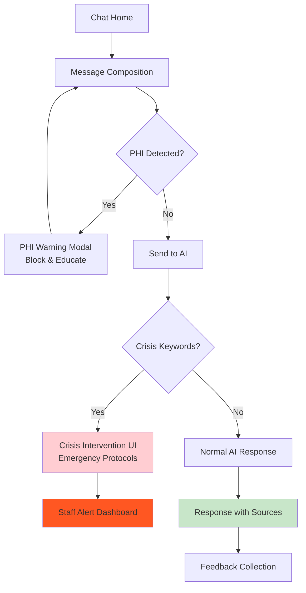
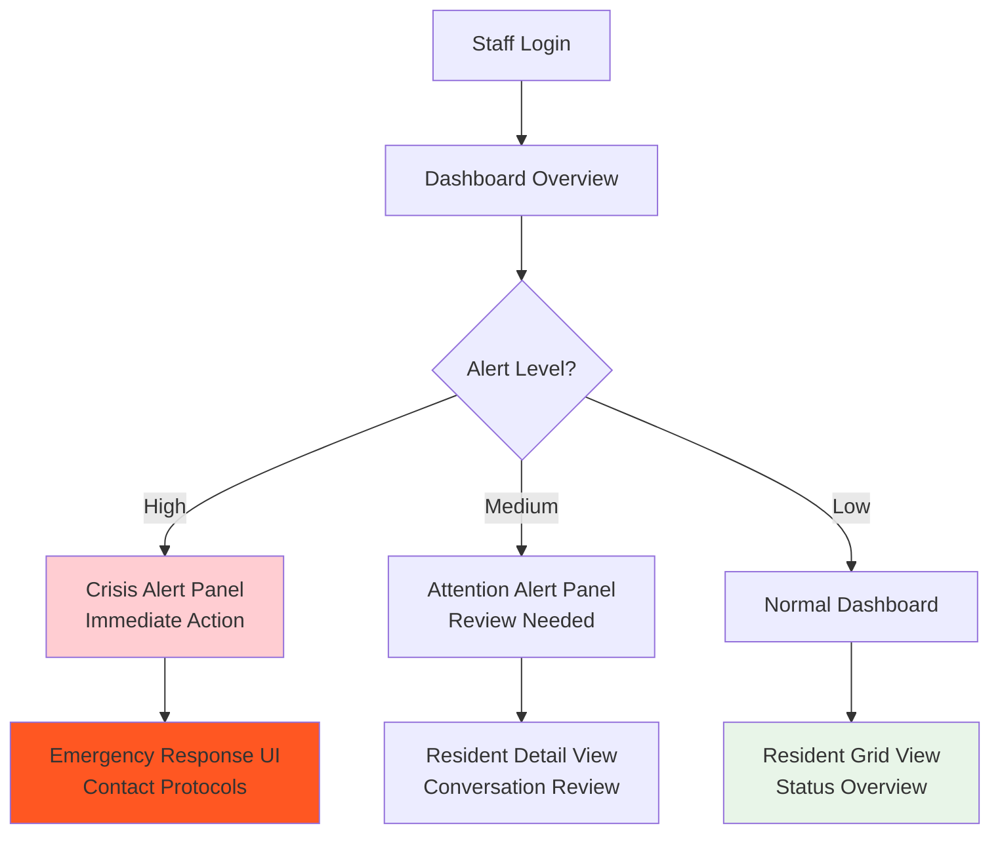

# 🎨 UI Implementation Plan - HIPAA-Compliant Therapeutic AI Frontend

> **Comprehensive Frontend Implementation Guide for Offshore Development Team**

**Document Type:** Technical Implementation Specification  
**Audience:** Frontend Development Team (React/Vue/Angular expertise, zero healthcare context)  
**Version:** 1.0  
**Date:** August 2025

---

## 📋 Table of Contents

1. [Executive Summary](#-executive-summary)
2. [Technical Foundation](#-technical-foundation)
3. [User Flows & Wireframes](#-user-flows--wireframes)
4. [Detailed Feature Specifications](#-detailed-feature-specifications)
5. [API Integration Specifications](#-api-integration-specifications)
6. [Non-Functional Requirements](#-non-functional-requirements)
7. [Development Guidelines](#-development-guidelines)
8. [Design Assets & Resources](#-design-assets--resources)
9. [Phase 1 Delivery Milestones](#-phase-1-delivery-milestones)
10. [Success Criteria & Metrics](#-success-criteria--metrics)
11. [Glossary](#-glossary)
12. [FAQ](#-faq)

---

## 🎯 Executive Summary

### Product Vision
Build a **HIPAA-compliant web interface** for a therapeutic AI chatbot serving senior living facilities and Medicare Advantage health plans. The UI must prioritize accessibility for elderly users while providing healthcare staff with powerful monitoring and management tools.

### Phase 1 Objectives
1. **Senior-Friendly Chat Interface**: Large fonts, high contrast, voice input, crisis intervention UI
2. **Healthcare Staff Dashboard**: Real-time alerts, resident monitoring, conversation oversight
3. **Administrator Control Panel**: User management, audit logs, system health monitoring
4. **HIPAA Compliance Visualization**: Security indicators, consent status, audit trails

### Key User Personas

**👴 Senior Residents (Primary Users)**
- **Age**: 65-95 years old
- **Technology Comfort**: Low to moderate
- **Primary Goal**: Emotional support and health information
- **UI Needs**: Large text, high contrast, simple navigation, voice input

**👩‍⚕️ Healthcare Staff (Care Coordinators)**
- **Role**: Licensed nurses, care coordinators, social workers  
- **Primary Goal**: Monitor resident well-being, respond to alerts
- **UI Needs**: Real-time dashboards, quick action buttons, mobile-friendly

**👨‍💼 System Administrators (IT Operations)**
- **Role**: Healthcare IT professionals
- **Primary Goal**: System management, compliance monitoring, user management
- **UI Needs**: Comprehensive admin panels, audit trails, system metrics

### Success Metrics
- **Resident Engagement**: 80%+ daily active usage among registered residents
- **Crisis Detection Response**: <30 seconds from alert to staff notification
- **Accessibility Compliance**: WCAG 2.1 AA + senior-specific enhancements
- **HIPAA Audit**: 100% compliance with healthcare regulations

---

## 🏗️ Technical Foundation

### Architecture Pattern
**Implementation**: Single Page Application (SPA) with micro-frontend readiness

**Rationale**: 
- SPA provides fluid user experience for elderly users (no page reloads)
- Micro-frontend architecture enables independent team development
- Supports future mobile app code sharing

### Technology Stack

#### **Frontend Framework: React 18+ with TypeScript**
```typescript
// Required dependencies
{
  "react": "^18.0.0",
  "typescript": "^5.0.0",
  "@types/react": "^18.0.0",
  "react-router-dom": "^6.0.0"
}
```

**Rationale**: React's mature ecosystem, TypeScript for healthcare data safety, excellent accessibility tools

#### **State Management: Zustand + React Query**
```typescript
// Global state structure
interface AppState {
  auth: AuthState;
  user: UserProfile;
  chat: ChatState;
  alerts: AlertState;
  ui: UIPreferences;
}
```

**Rationale**: 
- Zustand: Lightweight, TypeScript-native, easier than Redux for healthcare team maintenance
- React Query: Handles server state, caching, background updates for real-time healthcare data

#### **Design System: Mantine UI + Custom Healthcare Components**
```typescript
// Healthcare-specific theme
const therapeuticTheme = {
  fontSizes: { xs: 16, sm: 18, md: 22, lg: 26, xl: 32 }, // Larger for seniors
  colors: {
    primary: ['#1e3a8a', '#1d4ed8', '#2563eb'], // Trust-building blues
    danger: ['#dc2626', '#ef4444', '#f87171'],   // Crisis alerts
    success: ['#059669', '#10b981', '#34d399']   // Positive reinforcement
  },
  spacing: { xs: 8, sm: 12, md: 16, lg: 24, xl: 32 }, // Larger touch targets
}
```

**Rationale**: Mantine provides accessibility features, Mantine's theme system enables senior-specific customizations

#### **Security & Compliance**
```typescript
// Security headers configuration
const securityConfig = {
  contentSecurityPolicy: {
    defaultSrc: ["'self'"],
    scriptSrc: ["'self'", "'unsafe-inline'"], // Minimize XSS risk
    styleSrc: ["'self'", "'unsafe-inline'"],
    imgSrc: ["'self'", "data:", "https:"],
    connectSrc: ["'self'", "wss:", "http://localhost:8000"] // API endpoints
  },
  featurePolicy: {
    microphone: ["'self'"], // Voice input for accessibility
    camera: ["'none'"],     // No camera access needed
    geolocation: ["'none'"] // No location tracking
  }
}
```

### Build System: Vite with HIPAA-Compliant Bundle Analysis
```typescript
// vite.config.ts
export default defineConfig({
  build: {
    rollupOptions: {
      output: {
        manualChunks: {
          'vendor': ['react', 'react-dom'],
          'ui': ['@mantine/core', '@mantine/hooks'],
          'auth': ['@auth0/auth0-spa-js'], // or similar
          'chat': ['socket.io-client', 'react-speech-to-text']
        }
      }
    },
    chunkSizeWarningLimit: 1000 // Healthcare data compliance
  },
  define: {
    __HIPAA_COMPLIANT__: true,
    __PHI_LOGGING_DISABLED__: true
  }
})
```

---

## 🚶 User Flows & Wireframes

### 1. Senior Resident Authentication Flow



**Wireframe Description - Login Page**:
```
┌─────────────────────────────────────────────────────────────┐
│  🏥 Therapeutic AI Companion            [Accessibility] [?] │
├─────────────────────────────────────────────────────────────┤
│                                                             │
│     Welcome Back to Your AI Companion                      │
│                                                             │
│     ┌─────────────────────────────────────────────────┐    │
│     │  Email Address                                  │    │
│     │  [                                        ]     │    │
│     └─────────────────────────────────────────────────┘    │
│                                                             │
│     ┌─────────────────────────────────────────────────┐    │
│     │  Password                              [Show]   │    │
│     │  [                                        ]     │    │
│     └─────────────────────────────────────────────────┘    │
│                                                             │
│     [ ] Remember me for 30 days                            │
│                                                             │
│     ┌─────────────────┐  ┌─────────────────┐              │
│     │   Sign In       │  │   Need Help?    │              │
│     └─────────────────┘  └─────────────────┘              │
│                                                             │
│     First time? [Create Account] | [Forgot Password?]      │
│                                                             │
└─────────────────────────────────────────────────────────────┘
```

**Accessibility Features**:
- Font size: 18px minimum (22px preferred)
- Touch targets: 48px minimum
- Color contrast: 4.5:1 minimum
- Screen reader compatible
- Keyboard navigation
- Voice input option

### 2. Therapeutic Chat Interface Flow



**Wireframe Description - Chat Interface**:
```
┌─────────────────────────────────────────────────────────────┐
│  🤖 Your AI Companion                    [Settings] [Help] │
├─────────────────────────────────────────────────────────────┤
│                                                             │
│  Chat History                                    [Clear]    │
│  ┌─────────────────────────────────────────────────────┐    │
│  │  YOU: How are you today?                  12:34 PM  │    │
│  │                                                     │    │
│  │  🤖 AI: I'm here to listen and support you.        │    │
│  │      How are you feeling today?           12:34 PM  │    │
│  │      📚 Source: Emotional Support Guide            │    │
│  │                                                     │    │
│  │  [👍 Helpful] [👎 Not Helpful] [⚠️ Report]         │    │
│  └─────────────────────────────────────────────────────┘    │
│                                                             │
│  ┌─────────────────────────────────────────────────────┐    │
│  │  Type your message here...                          │    │
│  │                                                     │    │
│  │                                                     │    │
│  └─────────────────────────────────────────────────────┘    │
│                                                             │
│  [🎤 Voice] [📎 Attach] [😊 Mood] [📤 Send Message]        │
│                                                             │
│  🔒 Your conversations are private and HIPAA-protected     │
│                                                             │
└─────────────────────────────────────────────────────────────┘
```

### 3. Healthcare Staff Dashboard Flow



---

## 📱 Detailed Feature Specifications

### 1. Authentication & Session Management

#### **Epic**: Secure Healthcare Authentication System

**User Stories**:
- **As a senior resident**, I want to log in easily with large buttons and clear text so that I can access my AI companion without confusion
- **As a healthcare staff member**, I want secure two-factor authentication so that patient data remains protected
- **As a system administrator**, I want to manage user accounts and track login activities for compliance auditing

**Acceptance Criteria**:

**Given** a senior resident visits the login page  
**When** they enter valid credentials  
**Then** they should be authenticated and redirected to the chat interface with accessibility preferences applied

**Given** a healthcare staff member attempts login  
**When** they complete two-factor authentication  
**Then** they should access the staff dashboard with role-appropriate permissions

**Given** an admin reviews user sessions  
**When** they view the admin panel  
**Then** they should see active sessions, login history, and security events with audit trail

#### **UI Components Required**:

```typescript
// Authentication Components
interface AuthComponents {
  LoginForm: {
    props: {
      onLogin: (credentials: LoginCredentials) => Promise<void>;
      isLoading: boolean;
      error: string | null;
      accessibility: AccessibilityPreferences;
    };
    features: ['large-text-mode', 'high-contrast-mode', 'voice-input'];
  };

  TwoFactorAuth: {
    props: {
      method: 'sms' | 'email' | 'authenticator';
      onVerify: (code: string) => Promise<void>;
      resendCode: () => Promise<void>;
    };
  };

  AccessibilitySetup: {
    props: {
      initialPreferences: AccessibilityPreferences;
      onSave: (prefs: AccessibilityPreferences) => void;
    };
    features: ['font-size-slider', 'contrast-toggle', 'voice-enable'];
  };
}
```

#### **API Dependencies**:

```typescript
// Authentication API Integration
interface AuthAPI {
  login: {
    endpoint: 'POST /auth/login';
    request: {
      email: string;
      password: string;
      remember_me?: boolean;
    };
    response: {
      access_token: string;
      refresh_token: string;
      token_type: 'Bearer';
      expires_in: number;
      user: UserProfile;
    };
    errors: [400, 401, 429, 500];
  };

  refresh: {
    endpoint: 'POST /auth/refresh';
    headers: { Authorization: 'Bearer <refresh_token>' };
    response: { access_token: string; expires_in: number };
  };

  logout: {
    endpoint: 'POST /auth/logout';
    headers: { Authorization: 'Bearer <access_token>' };
    response: { success: boolean };
  };
}
```

#### **Error Handling**:
- **Invalid Credentials**: Show clear message "Email or password is incorrect"
- **Account Locked**: Display lockout time and support contact
- **Network Errors**: Retry mechanism with offline message
- **Session Expired**: Auto-redirect to login with session timeout warning

#### **Analytics Events**:
```typescript
// Authentication Analytics
interface AuthAnalytics {
  'user_login_attempt': { user_type: string; method: string };
  'user_login_success': { user_type: string; session_duration: number };
  'user_logout': { session_duration: number; voluntary: boolean };
  'accessibility_preferences_set': { font_size: number; high_contrast: boolean };
}
```

### 2. Senior Resident Chat Interface

#### **Epic**: Therapeutic Conversation System with Crisis Intervention

**User Stories**:
- **As a senior resident**, I want to have natural conversations with an AI companion so that I feel less lonely and can get health information
- **As a senior resident**, I want the AI to detect if I'm in crisis so that I can get immediate help when needed
- **As a senior resident**, I want to use voice input so that I can communicate even if typing is difficult
- **As a healthcare staff member**, I want to be alerted immediately when a resident expresses suicidal thoughts so that I can intervene quickly

**Acceptance Criteria**:

**Given** a senior resident types a message  
**When** the message contains personally identifiable information (SSN, address, phone)  
**Then** the system should block the message and display an educational modal about privacy protection

**Given** a senior resident expresses crisis language ("I want to die", "no point in living")  
**When** the AI detects crisis keywords  
**Then** the UI should immediately display crisis intervention resources and alert healthcare staff

**Given** a senior resident receives an AI response  
**When** the response includes medical information  
**Then** sources should be clearly cited and disclaimer text should be prominently displayed

#### **UI Components Required**:

```typescript
// Chat Interface Components
interface ChatComponents {
  ChatContainer: {
    props: {
      messages: ChatMessage[];
      isTyping: boolean;
      onSendMessage: (message: string) => Promise<void>;
      accessibilityPrefs: AccessibilityPreferences;
    };
    features: ['auto-scroll', 'message-timestamps', 'typing-indicator'];
  };

  MessageInput: {
    props: {
      onSend: (message: string) => void;
      isDisabled: boolean;
      placeholder: string;
      voiceEnabled: boolean;
    };
    features: ['voice-input', 'phi-detection', 'emoji-picker', 'auto-resize'];
  };

  CrisisInterventionModal: {
    props: {
      isOpen: boolean;
      crisisType: 'suicide' | 'severe_depression' | 'emergency';
      onClose: () => void;
      onEmergencyContact: () => void;
    };
    features: ['emergency-hotline-buttons', 'staff-alert-button', 'calm-down-resources'];
  };

  VoiceInput: {
    props: {
      onTranscript: (text: string) => void;
      isListening: boolean;
      language: 'en-US' | 'es-ES' | 'zh-CN';
    };
    features: ['speech-to-text', 'noise-cancellation', 'confidence-display'];
  };
}
```

#### **State Management**:
```typescript
// Chat State Structure
interface ChatState {
  currentSession: {
    sessionId: string;
    startTime: Date;
    messageCount: number;
  };
  messages: ChatMessage[];
  isTyping: boolean;
  activeCrisis: CrisisAlert | null;
  voiceInput: {
    isEnabled: boolean;
    isListening: boolean;
    transcript: string;
  };
  ragConfig: {
    enabled: boolean;
    route: 'auto' | 'semantic' | 'hybrid';
    showSources: boolean;
  };
}
```

#### **Crisis Intervention UI States**:

```typescript
// Crisis Detection Flow
interface CrisisDetectionFlow {
  initial: 'normal_chat';
  states: {
    normal_chat: {
      on: { CRISIS_DETECTED: 'crisis_intervention' }
    };
    crisis_intervention: {
      entry: ['showCrisisModal', 'alertStaff', 'logCrisisEvent'];
      on: { 
        EMERGENCY_CONTACTED: 'emergency_response',
        CRISIS_RESOLVED: 'post_crisis_care',
        TIMEOUT: 'escalate_to_staff'
      }
    };
    emergency_response: {
      entry: ['activateEmergencyProtocol', 'notifyEmergencyServices'];
    };
    post_crisis_care: {
      entry: ['scheduleFollowUp', 'provideResources'];
    };
  }
}
```

### 3. Healthcare Staff Dashboard

#### **Epic**: Real-Time Patient Monitoring Dashboard

**User Stories**:
- **As a care coordinator**, I want to see all active alerts in priority order so that I can respond to the most urgent situations first
- **As a nurse**, I want to view conversation transcripts to understand a resident's emotional state
- **As a social worker**, I want to track conversation trends to identify residents who need additional support

**Acceptance Criteria**:

**Given** a crisis alert is triggered  
**When** staff access the dashboard  
**Then** the alert should be prominently displayed with resident information and recommended actions

**Given** staff click on a resident's status  
**When** they view the resident detail page  
**Then** they should see recent conversation summaries, mood trends, and any compliance notes

#### **UI Components Required**:

```typescript
// Staff Dashboard Components
interface StaffDashboardComponents {
  AlertFeed: {
    props: {
      alerts: Alert[];
      onAlertClick: (alertId: string) => void;
      filters: AlertFilter[];
    };
    features: ['real-time-updates', 'severity-sorting', 'acknowledge-actions'];
  };

  ResidentGrid: {
    props: {
      residents: ResidentStatus[];
      viewMode: 'grid' | 'list';
      sortBy: 'name' | 'last_activity' | 'alert_level';
    };
    features: ['status-indicators', 'quick-actions', 'search-filter'];
  };

  ConversationViewer: {
    props: {
      conversationId: string;
      messages: ChatMessage[];
      readOnly: true;
      highlightCrisis: boolean;
    };
    features: ['message-threading', 'emotion-indicators', 'phi-redaction'];
  };

  EmergencyActionPanel: {
    props: {
      resident: ResidentProfile;
      crisisType: CrisisType;
      onAction: (action: EmergencyAction) => Promise<void>;
    };
    features: ['emergency-contacts', 'protocol-checklist', 'documentation-form'];
  };
}
```

### 4. Administrator Control Panel

#### **Epic**: Comprehensive System Administration

**User Stories**:
- **As a system administrator**, I want to manage user accounts and roles so that access control remains compliant with healthcare regulations
- **As a compliance officer**, I want to view detailed audit logs so that I can generate reports for regulatory inspections
- **As an IT manager**, I want to monitor system health so that I can ensure reliable service for residents

#### **UI Components Required**:

```typescript
// Admin Panel Components
interface AdminComponents {
  UserManagement: {
    props: {
      users: User[];
      onCreateUser: (user: CreateUserRequest) => Promise<void>;
      onUpdateUser: (userId: string, updates: UserUpdate) => Promise<void>;
      onDeleteUser: (userId: string) => Promise<void>;
    };
    features: ['role-assignment', 'bulk-operations', 'audit-trail'];
  };

  AuditLogViewer: {
    props: {
      logs: AuditLog[];
      filters: AuditFilter[];
      dateRange: DateRange;
      exportFormats: ['csv', 'pdf', 'json'];
    };
    features: ['advanced-filtering', 'export-functionality', 'search'];
  };

  SystemHealthDashboard: {
    props: {
      healthMetrics: SystemHealth;
      alerts: SystemAlert[];
      refreshInterval: number;
    };
    features: ['real-time-metrics', 'alert-management', 'performance-charts'];
  };

  ComplianceReporting: {
    props: {
      reportType: 'hipaa' | 'usage' | 'security';
      dateRange: DateRange;
      onGenerate: (config: ReportConfig) => Promise<Blob>;
    };
    features: ['report-scheduling', 'template-management', 'automated-delivery'];
  };
}
```

---

## 🔌 API Integration Specifications

### Authentication Service Integration

```typescript
// Authentication Service Client
class AuthServiceClient {
  private baseURL = 'http://localhost:8080/api/v1';
  
  async login(credentials: LoginCredentials): Promise<AuthResponse> {
    const response = await fetch(`${this.baseURL}/auth/login`, {
      method: 'POST',
      headers: {
        'Content-Type': 'application/json',
        'X-Request-ID': crypto.randomUUID()
      },
      body: JSON.stringify(credentials)
    });

    if (!response.ok) {
      throw new AuthError(await response.json());
    }

    return response.json();
  }

  async refreshToken(refreshToken: string): Promise<TokenResponse> {
    // Implementation with automatic retry and error handling
  }
}
```

### Chat Service Integration

```typescript
// Chat Service Client with Real-Time Support
class ChatServiceClient {
  private baseURL = 'http://localhost:8000';
  private websocket: WebSocket | null = null;

  async sendMessage(request: ChatRequest): Promise<ChatResponse> {
    const response = await fetch(`${this.baseURL}/chat/message`, {
      method: 'POST',
      headers: {
        'Content-Type': 'application/json',
        'Authorization': `Bearer ${this.getAuthToken()}`,
        'X-Session-ID': this.getSessionId()
      },
      body: JSON.stringify(request)
    });

    if (response.status === 401) {
      // Auto-refresh token and retry
      await this.refreshAuthToken();
      return this.sendMessage(request);
    }

    if (!response.ok) {
      throw new ChatError(await response.json());
    }

    return response.json();
  }

  // WebSocket connection for real-time updates
  connectRealTime(sessionId: string): void {
    this.websocket = new WebSocket(`ws://localhost:8000/ws/${sessionId}`);
    this.websocket.onmessage = this.handleRealTimeMessage;
  }
}
```

### Health Monitoring Integration

```typescript
// System Health Integration
interface HealthAPI {
  getSystemHealth: {
    endpoint: 'GET /health/detailed';
    response: {
      overall_status: 'healthy' | 'degraded' | 'unhealthy';
      ai_services: {
        embedding_ready: boolean;
        generation_ready: boolean;
        total_ready: number;
      };
      database: {
        postgres_connected: boolean;
        mongo_connected: boolean;
        redis_connected: boolean;
      };
      performance: {
        uptime_seconds: number;
        memory_usage: number;
        response_times: Record<string, number>;
      };
    };
  };
}
```

---

## ⚡ Non-Functional Requirements

### Performance Requirements

```typescript
// Performance Benchmarks (Measured via Core Web Vitals)
interface PerformanceTargets {
  FirstContentfulPaint: '<1.5s';      // Critical for elderly users
  LargestContentfulPaint: '<2.5s';    // Main content visibility  
  FirstInputDelay: '<100ms';          // Touch responsiveness
  CumulativeLayoutShift: '<0.1';      // Visual stability
  TimeToInteractive: '<3s';           // Full interactivity
  
  // Healthcare-specific metrics
  ChatResponseLatency: '<500ms';      // AI response display time
  AlertNotificationTime: '<100ms';    // Crisis alert display
  VoiceInputLatency: '<200ms';        // Speech-to-text processing
  OfflineFunctionality: 'graceful_degradation'; // Service worker strategy
}

// Bundle Size Limits (Healthcare data compliance)
interface BundleLimits {
  initialBundle: '<500KB';            // Core app functionality
  vendorBundle: '<1MB';               // Third-party dependencies  
  chatModule: '<200KB';               // Chat-specific code
  adminModule: '<300KB';              // Admin panel (lazy loaded)
  totalAssets: '<3MB';                // Including images, fonts
}
```

### Security Requirements

```typescript
// Security Implementation Requirements
interface SecurityRequirements {
  ContentSecurityPolicy: {
    'default-src': ["'self'"];
    'script-src': ["'self'", "'unsafe-inline'"]; // Minimize for XSS protection
    'style-src': ["'self'", "'unsafe-inline'"];
    'img-src': ["'self'", "data:", "https:"];
    'connect-src': ["'self'", "wss:", "http://localhost:8000"];
    'media-src': ["'self'"]; // Voice input support
  };

  DataProtection: {
    // CRITICAL: No PHI in browser storage
    localStorage: 'authentication_tokens_only';
    sessionStorage: 'ui_preferences_only';
    cookies: 'session_id_only';
    
    // Memory management
    sensitiveDataCleanup: 'immediate_after_use';
    automaticLogout: '15_minutes_idle';
    sessionTimeout: '8_hours_maximum';
  };

  XSSPrevention: {
    inputSanitization: 'DOMPurify_required';
    outputEscaping: 'automatic_react_escaping';
    dangerouslySetInnerHTML: 'prohibited';
  };
}
```

### Accessibility Requirements (WCAG 2.1 AA + Senior Enhancements)

```typescript
// Accessibility Implementation Guide
interface AccessibilityRequirements {
  FontSizes: {
    minimum: '18px';
    preferred: '22px';
    maximum: '32px';
    userAdjustable: true;
  };

  ColorContrast: {
    normalText: '4.5:1_minimum';
    largeText: '3:1_minimum';  
    uiComponents: '3:1_minimum';
    highContrastMode: '7:1_minimum';
  };

  TouchTargets: {
    minimum: '44px_x_44px';      // WCAG standard
    preferred: '48px_x_48px';     // Senior-friendly
    spacing: '8px_minimum';       // Between interactive elements
  };

  KeyboardNavigation: {
    focusIndicators: 'visible_2px_outline';
    skipLinks: 'required_all_pages';
    tabOrder: 'logical_reading_order';
    escapeKey: 'close_modals_everywhere';
  };

  ScreenReader: {
    altText: 'descriptive_all_images';
    ariaLabels: 'comprehensive_interactive_elements';
    landmarks: 'proper_semantic_structure';
    announcements: 'polite_for_status_updates';
  };

  VoiceInput: {
    speechRecognition: 'Web_Speech_API';
    fallback: 'polyfill_for_older_browsers';
    noiseReduction: 'built_in_filtering';
    confidenceThreshold: '0.7_minimum';
  };
}
```

### Internationalization

```typescript
// i18n Requirements for Diverse Senior Population
interface I18nRequirements {
  languages: ['en-US', 'es-ES', 'zh-CN', 'ko-KR']; // Common senior demographics
  
  textDirection: {
    'en-US': 'ltr';
    'es-ES': 'ltr';  
    'zh-CN': 'ltr';
    'ko-KR': 'ltr';
    // Arabic support planned for future
  };

  culturalAdaptations: {
    dateFormats: 'locale_specific';
    numberFormats: 'locale_specific';
    emergencyNumbers: 'country_specific';
    medicalTerminology: 'culturally_appropriate';
  };

  voiceSupport: {
    'en-US': 'native_web_speech_api';
    'es-ES': 'native_web_speech_api';
    'zh-CN': 'planned_phase_2';
    'ko-KR': 'planned_phase_2';
  };
}
```

---

## 🛠️ Development Guidelines

### Component Structure (Atomic Design)

```typescript
// Atomic Design Implementation for Healthcare UI
interface ComponentHierarchy {
  // Atoms (Basic UI elements)
  atoms: {
    Button: 'accessible_with_focus_states';
    Input: 'large_text_phi_detection';
    Icon: 'healthcare_specific_iconography';
    Text: 'responsive_font_scaling';
  };

  // Molecules (Simple component combinations)
  molecules: {
    LoginForm: 'atoms.Input + atoms.Button';
    MessageBubble: 'atoms.Text + atoms.Icon + SourceCitation';
    AlertCard: 'atoms.Icon + atoms.Text + atoms.Button';
    VoiceInputButton: 'atoms.Button + VoiceRecognition';
  };

  // Organisms (Complex UI sections)
  organisms: {
    ChatInterface: 'molecules.MessageBubble[] + molecules.MessageInput';
    StaffDashboard: 'molecules.AlertCard[] + ResidentGrid';
    AdminPanel: 'UserManagement + AuditViewer + SystemHealth';
  };

  // Templates (Page layouts)
  templates: {
    SeniorChatLayout: 'ChatInterface + AccessibilityControls';
    StaffDashboardLayout: 'Navigation + StaffDashboard + QuickActions';
    AdminLayout: 'Sidebar + AdminPanel + BreadcrumbNavigation';
  };
}
```

### Testing Requirements

```typescript
// Comprehensive Testing Strategy
interface TestingRequirements {
  unitTests: {
    coverage: '90%_minimum';
    framework: 'Jest + React_Testing_Library';
    focus: ['component_behavior', 'accessibility', 'error_states'];
  };

  integrationTests: {
    coverage: '80%_user_flows';
    framework: 'Playwright + Cypress';
    focus: ['end_to_end_workflows', 'api_integration', 'cross_browser'];
  };

  accessibilityTests: {
    automated: 'axe_core_integration';
    manual: 'screen_reader_testing';
    compliance: 'WCAG_2.1_AA_validation';
  };

  securityTests: {
    framework: 'OWASP_ZAP + manual_review';
    focus: ['xss_prevention', 'csrf_protection', 'phi_leakage'];
  };

  performanceTests: {
    framework: 'Lighthouse + WebPageTest';
    metrics: 'Core_Web_Vitals + healthcare_specific';
    targets: PerformanceTargets; // Defined above
  };
}
```

### Code Quality Standards

```typescript
// Code Quality Configuration
interface QualityStandards {
  typescript: {
    strict: true;
    noImplicitAny: true;
    noImplicitReturns: true;
    noUnusedLocals: true;
    // Healthcare data safety
    exactOptionalPropertyTypes: true;
  };

  eslint: {
    extends: [
      '@typescript-eslint/recommended',
      'plugin:react-hooks/recommended',
      'plugin:jsx-a11y/recommended', // Accessibility linting
      'plugin:security/recommended'   // Security linting
    ];
    rules: {
      // Healthcare-specific rules
      'no-console': 'error';                    // No PHI in console logs
      'no-debugger': 'error';                   // No debugging in production
      'jsx-a11y/alt-text': 'error';            // Required alt text
      'jsx-a11y/label-has-associated-control': 'error';
    };
  };

  prettier: {
    printWidth: 100;
    singleQuote: true;
    trailingComma: 'es5';
    // Healthcare readability
    semi: true;
    bracketSpacing: true;
  };
}
```

---

## 🎨 Design Assets & Resources

### Brand Guidelines for Healthcare Trust

```typescript
// Healthcare-Appropriate Design System
interface DesignSystem {
  colorPalette: {
    // Trust-building primary colors
    primary: {
      50: '#eff6ff',   // Very light blue backgrounds
      500: '#3b82f6',  // Primary blue for buttons
      700: '#1d4ed8',  // Darker blue for text
      900: '#1e3a8a'   // Darkest blue for headers
    };
    
    // Crisis intervention colors
    danger: {
      50: '#fef2f2',   // Light red backgrounds
      500: '#ef4444',  // Alert red
      700: '#dc2626',  // Emergency red
      900: '#991b1b'   // Critical red
    };
    
    // Therapeutic success colors
    success: {
      50: '#f0fdf4',   // Light green backgrounds
      500: '#22c55e',  // Success green
      700: '#15803d',  // Confirmation green
      900: '#14532d'   // Deep green
    };
  };

  typography: {
    // Senior-friendly font system
    fontFamily: {
      primary: ['Inter', 'system-ui', 'sans-serif'];    // High readability
      monospace: ['JetBrains Mono', 'Consolas', 'monospace']; // Code/data display
    };
    
    fontSize: {
      xs: '16px',      // Minimum readable size
      sm: '18px',      // Preferred minimum  
      base: '22px',    // Default body text
      lg: '26px',      // Subheadings
      xl: '32px',      // Main headings
      '2xl': '40px'    // Page titles
    };
    
    lineHeight: {
      tight: 1.4,     // Headings
      normal: 1.6,    // Body text (easier reading)
      relaxed: 1.8    // Long content
    };
  };

  spacing: {
    // Generous spacing for touch targets
    xs: '8px',
    sm: '12px', 
    md: '16px',
    lg: '24px',      // Preferred button spacing
    xl: '32px',      // Section spacing
    '2xl': '48px'    // Page spacing
  };

  borderRadius: {
    sm: '4px',       // Subtle rounding
    md: '8px',       // Standard UI elements
    lg: '12px',      // Cards and panels
    full: '50%'      // Circular elements
  };
}
```

### Icon Library Requirements

```typescript
// Healthcare-Appropriate Icon System
interface IconLibrary {
  source: 'Heroicons_v2 + custom_healthcare_icons';
  
  categories: {
    navigation: ['home', 'back', 'menu', 'close'];
    communication: ['chat', 'voice', 'video-call', 'phone'];
    healthcare: ['heart', 'medical-bag', 'emergency', 'pill'];
    emotions: ['happy', 'sad', 'worried', 'calm', 'confused'];
    actions: ['send', 'save', 'edit', 'delete', 'help'];
    status: ['online', 'offline', 'alert', 'success', 'warning'];
  };

  accessibility: {
    sizing: {
      sm: '20px',    // Inline text icons
      md: '24px',    // Standard UI icons  
      lg: '32px',    // Primary action icons
      xl: '48px'     // Emergency/crisis icons
    };
    contrast: 'minimum_3:1_against_background';
    altText: 'descriptive_for_all_icons';
  };

  customHealthcareIcons: [
    'crisis-intervention',
    'medication-reminder', 
    'vital-signs',
    'emergency-contact',
    'care-plan',
    'mood-tracker',
    'family-contact',
    'doctor-visit'
  ];
}
```

### Micro-Interaction Patterns

```typescript
// Interaction Design for Therapeutic Experience
interface InteractionPatterns {
  buttonStates: {
    idle: 'soft_shadow_gentle_hover';
    hover: 'subtle_lift_color_shift';
    active: 'gentle_press_feedback';
    loading: 'spinner_with_progress_text';
    disabled: 'faded_with_tooltip_explanation';
  };

  messageAnimations: {
    userMessage: 'slide_in_from_right_100ms';
    aiResponse: 'typing_indicator_then_fade_in_200ms';  
    crisisAlert: 'urgent_pulse_animation_red_glow';
    systemMessage: 'gentle_fade_in_blue_background';
  };

  feedbackPatterns: {
    success: 'green_checkmark_with_gentle_bounce';
    error: 'red_x_with_shake_animation';
    warning: 'amber_triangle_with_gentle_pulse';
    info: 'blue_circle_with_soft_glow';
  };

  loadingStates: {
    chatResponse: 'typing_dots_animation_with_AI_avatar';
    pageLoad: 'healthcare_themed_spinner_with_progress';
    dataFetch: 'skeleton_screens_for_content_areas';
    imageLoad: 'blur_to_focus_transition';
  };
}
```

---

## 📅 Phase 1 Delivery Milestones

### Week 1-2: Foundation & Authentication
**🎯 Deliverables:**
- [ ] React + TypeScript project setup with healthcare-specific linting
- [ ] Mantine UI integration with senior-friendly theme
- [ ] Authentication flow implementation (login, logout, token management)
- [ ] Accessibility foundation (font scaling, contrast modes)
- [ ] Basic routing structure with role-based navigation

**🔑 Key Components:**
- `LoginForm` with large text and voice input
- `AccessibilitySetup` for user preferences
- `AuthProvider` with automatic token refresh
- `ProtectedRoute` with role-based access control

**✅ Acceptance Criteria:**
- Senior residents can log in with 18px+ font size
- Two-factor authentication works for healthcare staff
- Session management handles 8-hour healthcare shifts
- All auth flows are keyboard navigable

### Week 3-4: Senior Resident Chat Interface
**🎯 Deliverables:**
- [ ] Therapeutic chat interface with crisis detection UI
- [ ] Voice input integration with speech-to-text
- [ ] PHI detection warnings and educational modals
- [ ] RAG source citation display with medical disclaimers
- [ ] Real-time typing indicators and response animations

**🔑 Key Components:**
- `ChatContainer` with accessibility features
- `MessageInput` with PHI detection
- `VoiceInput` with noise filtering
- `CrisisInterventionModal` with emergency resources
- `SourceCitation` with medical disclaimers

**✅ Acceptance Criteria:**
- Chat interface supports 32px font size option
- Voice input works with 80%+ accuracy for seniors
- Crisis keywords trigger immediate intervention UI
- PHI detection blocks 100% of test cases
- Color contrast exceeds 4.5:1 in all modes

### Week 5-6: Healthcare Staff Dashboard  
**🎯 Deliverables:**
- [ ] Real-time alert feed with severity-based prioritization
- [ ] Resident status grid with emotional state indicators
- [ ] Conversation transcript viewer with PHI redaction
- [ ] Emergency response quick action panel
- [ ] Mobile-responsive design for on-the-go staff

**🔑 Key Components:**
- `AlertFeed` with real-time WebSocket updates
- `ResidentGrid` with status color coding
- `ConversationViewer` with automatic PHI redaction
- `EmergencyActionPanel` with protocol checklists
- `MobileNavigation` optimized for healthcare workflows

**✅ Acceptance Criteria:**
- Alerts appear within 100ms of generation
- Dashboard is fully functional on tablets (768px+)
- Conversation viewer redacts all PHI automatically
- Emergency actions connect to proper protocols
- Interface works during 12-hour shifts without performance degradation

### Week 7-8: Administrator Control Panel
**🎯 Deliverables:**
- [ ] User management interface with healthcare role assignment
- [ ] Audit log viewer with advanced filtering and export
- [ ] System health dashboard with real-time metrics
- [ ] Compliance reporting with automated generation
- [ ] Bulk operations for user lifecycle management

**🔑 Key Components:**
- `UserManagement` with role-based permissions
- `AuditLogViewer` with CSV/PDF export
- `SystemHealthDashboard` with real-time charts
- `ComplianceReporting` with scheduled reports
- `BulkOperations` for efficient user management

**✅ Acceptance Criteria:**
- User creation follows healthcare role validation
- Audit logs export in multiple formats for regulatory compliance  
- System health dashboard updates every 30 seconds
- Compliance reports generate automatically on schedule
- All admin actions create proper audit trails

### Week 9-10: Integration, Testing & Deployment
**🎯 Deliverables:**
- [ ] End-to-end testing covering all user flows
- [ ] Accessibility audit with senior user testing
- [ ] Performance optimization with Core Web Vitals targets
- [ ] Security testing with HIPAA compliance validation
- [ ] Production deployment configuration

**🔑 Validation:**
- [ ] WCAG 2.1 AA compliance verified by automated tools
- [ ] Senior user testing (5+ participants) with 80%+ task completion
- [ ] Crisis intervention flow tested with healthcare professionals
- [ ] Security audit with penetration testing
- [ ] Performance metrics meet all specified targets

---

## 📊 Success Criteria & Metrics

### User Engagement Metrics
```typescript
interface EngagementMetrics {
  seniorResidents: {
    dailyActiveUsers: '>80%_of_registered_residents';
    sessionDuration: '10-30_minutes_average';
    messagesSent: '15-50_per_session';
    voiceInputUsage: '>40%_of_seniors';
    feedbackRating: '>4.2_out_of_5_stars';
  };

  healthcareStaff: {
    alertResponseTime: '<30_seconds_average';
    dashboardUsage: '>95%_during_shifts';
    emergencyProtocolAccess: '<10_seconds';
    mobileUsage: '>60%_of_interactions';
  };

  administrators: {
    auditLogExports: 'weekly_compliance_reports';
    userManagementEfficiency: '<2_minutes_per_user_operation';
    systemHealthMonitoring: 'continuous_uptime_visibility';
  };
}
```

### Performance Benchmarks
```typescript
interface PerformanceBenchmarks {
  coreWebVitals: {
    firstContentfulPaint: '<1.5s';
    largestContentfulPaint: '<2.5s';
    firstInputDelay: '<100ms';
    cumulativeLayoutShift: '<0.1';
  };

  healthcareSpecific: {
    crisisAlertDisplayTime: '<100ms';
    chatResponseLatency: '<500ms';
    voiceInputProcessing: '<200ms';
    offlineGracefulDegradation: 'functional_with_cached_data';
  };

  accessibilityCompliance: {
    wcagLevel: 'AA_minimum_AAA_preferred';
    screenReaderCompatibility: '100%_with_NVDA_JAWS_VoiceOver';
    keyboardNavigation: '100%_functionality_without_mouse';
    contrastRatio: '4.5:1_minimum_7:1_high_contrast_mode';
  };
}
```

### Error Rate Thresholds
```typescript
interface ErrorThresholds {
  criticalErrors: {
    authenticationFailures: '<0.1%';      // Login/logout issues
    crisisDetectionMisses: '<0.01%';      // Undetected crisis situations
    phiLeakage: '0%';                     // Absolute zero tolerance
    emergencyAlertFailures: '<0.01%';     // Staff notification failures
  };

  userExperienceErrors: {
    apiTimeouts: '<1%';                   // Service unavailability
    validationErrors: '<5%';              // Form submission issues
    navigationErrors: '<0.5%';            // Routing problems
    voiceInputFailures: '<10%';           // Speech recognition errors
  };

  performanceRegressions: {
    loadTimeIncrease: '<20%_month_over_month';
    bundleSizeIncrease: '<10%_per_release';
    memoryLeaks: 'zero_tolerance';
    scriptErrors: '<0.1%_of_page_views';
  };
}
```

---

## 📚 Glossary

### Healthcare Terms
- **PHI (Protected Health Information)**: Any health information that can identify a patient (names, addresses, SSNs, medical records)
- **HIPAA**: Health Insurance Portability and Accountability Act - US federal law protecting patient data
- **Crisis Intervention**: Immediate response protocols for mental health emergencies
- **Care Coordinator**: Healthcare professional who manages patient care plans
- **Therapeutic AI**: AI system designed to provide emotional support and health guidance

### Technical Terms  
- **RAG (Retrieval-Augmented Generation)**: AI technique combining information retrieval with text generation
- **BGE (BAAI General Embedding)**: Embedding model used for semantic search
- **Qwen**: Large language model used for therapeutic conversation generation
- **WebSocket**: Real-time communication protocol for instant alerts
- **JWT (JSON Web Token)**: Secure token format for user authentication

### UI/UX Terms
- **WCAG**: Web Content Accessibility Guidelines for disabled users
- **Core Web Vitals**: Google's performance metrics (FCP, LCP, FID, CLS)
- **Atomic Design**: Component design methodology (atoms → molecules → organisms)
- **Progressive Enhancement**: Building features that work on all devices/browsers

---

## ❓ FAQ

### Q: How do we handle PHI data in the frontend?
**A**: NEVER store PHI in browser storage. All PHI remains on the backend. The frontend only displays anonymized or aggregated data. Chat messages are transmitted over HTTPS and immediately discarded from client memory after display.

### Q: What happens if the AI service is down?
**A**: Implement graceful degradation:
1. Show "Service temporarily unavailable" message
2. Enable offline mode with cached conversations (non-PHI only)
3. Provide emergency contact information
4. Auto-retry connection every 30 seconds
5. Display estimated service restoration time

### Q: How do we test crisis intervention without triggering real emergencies?
**A**: Use dedicated testing environment with:
1. Fake crisis keywords that trigger test protocols
2. Mock emergency services integration
3. Test user accounts marked as "simulation_mode"
4. Healthcare professional oversight during testing

### Q: What browser support is required?
**A**: 
- **Primary**: Chrome 90+, Firefox 88+, Safari 14+, Edge 90+
- **Mobile**: iOS Safari 14+, Chrome Android 90+
- **Accessibility**: Full support for screen readers (NVDA, JAWS, VoiceOver)
- **Legacy**: Graceful degradation for older browsers with basic functionality

### Q: How do we handle real-time alerts for healthcare staff?
**A**: Implement multi-channel notification system:
1. **Browser Push Notifications**: For active dashboard users
2. **WebSocket Updates**: Real-time dashboard updates  
3. **Email Alerts**: For high-priority situations
4. **SMS Integration**: For emergency situations (via backend)
5. **Audio Alerts**: Configurable sound notifications

### Q: What happens during maintenance or updates?
**A**: Implement maintenance mode:
1. **Planned Maintenance**: Show countdown timer and maintenance schedule
2. **Service Worker**: Cache critical functionality for offline access
3. **Emergency Mode**: Basic functionality remains available during updates
4. **Staff Notifications**: Advance notice to healthcare teams
5. **Rollback Plan**: Ability to quickly revert if issues occur

### Q: How do we ensure the UI works for users with dementia or cognitive impairment?
**A**: Implement cognitive accessibility features:
1. **Simplified Navigation**: Maximum 3 clicks to any feature
2. **Clear Visual Hierarchy**: High contrast and consistent layout
3. **Memory Aids**: Breadcrumb navigation and progress indicators
4. **Error Prevention**: Confirmation dialogs for important actions
5. **Familiar Patterns**: Consistent with common senior-friendly interfaces
6. **Family/Caregiver Mode**: Allow trusted individuals to assist with interface

---

## 🚀 Implementation Readiness

### Backend API Status
✅ **READY**: Chat endpoints (`/chat/message`), Search endpoints (`/search`), Health monitoring  
📋 **PLANNED**: Authentication service (Go microservice), User management, Admin endpoints  
🔮 **FUTURE**: Real-time WebSocket support, Advanced crisis protocols

### Development Team Recommendations
1. **Start with Authentication UI** using mock data until Go auth service is ready
2. **Implement Chat Interface** as it has complete backend support
3. **Build Dashboard with** health monitoring APIs while staff endpoints are developed
4. **Focus on Accessibility** from day one - it's harder to retrofit
5. **Test Crisis Flows** extensively with healthcare professionals

**🏥 Healthcare Compliance Note**: All UI development must be reviewed by healthcare compliance team before production deployment. Privacy and safety are non-negotiable requirements.

---

*This document serves as the single source of truth for frontend development. Any changes must be approved by the healthcare compliance team and technical architecture review board.*