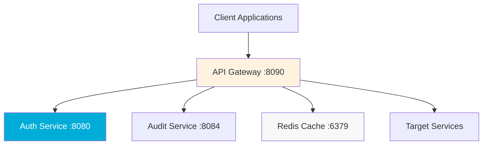

# API Gateway Service

> **Primary entry point for all client requests with authentication and routing**

## Purpose & Responsibilities

• **Request Routing**: Route client requests to appropriate microservices based on path and headers
• **Authentication**: Validate JWT tokens and manage session authentication
• **Load Balancing**: Distribute requests across healthy service instances
• **Rate Limiting**: Enforce per-user and per-endpoint rate limits for system protection
• **CORS Handling**: Manage cross-origin requests for web clients
• **Request/Response Transformation**: Standardize API contracts across services

**Service Level Objectives (SLO)**:
- Response time: <100ms (95th percentile)
- Availability: 99.9% uptime
- Throughput: 1000 requests/second

**In Scope**: External API management, authentication proxy, request routing
**Out of Scope**: Business logic processing, data persistence, AI model inference

## APIs

### Health Check Endpoint

```http
GET /health
Accept: application/json
```

**Response**:
```json
{
  "status": "healthy",
  "service": "api-gateway",
  "version": "1.0.0",
  "timestamp": "2025-09-01T12:00:00Z",
  "dependencies": {
    "auth-service": "healthy",
    "database": "healthy"
  }
}
```

### Authentication Endpoints

```http
POST /api/v1/auth/login
Content-Type: application/json

{
  "email": "provider@hospital.com",
  "password": "secure_password",
  "mfa_token": "123456"
}
```

**Response** (200 OK):
```json
{
  "access_token": "eyJhbGciOiJIUzI1NiIs...",
  "refresh_token": "eyJhbGciOiJIUzI1NiIs...",
  "expires_in": 7200,
  "user": {
    "id": "uuid-v4",
    "email": "provider@hospital.com",
    "role": "health_provider"
  }
}
```

### Proxy Endpoints

```http
GET /api/v1/chat/history?session_id=uuid
Authorization: Bearer <jwt_token>
```

Routes to: `chat-history-service:8002/api/v1/history`

**Error Codes**:
- `400`: Bad Request - Invalid request format
- `401`: Unauthorized - Invalid or expired token
- `403`: Forbidden - Insufficient permissions
- `404`: Not Found - Endpoint not found
- `429`: Too Many Requests - Rate limit exceeded
- `502`: Bad Gateway - Downstream service unavailable

## Config

### Environment Variables

| Variable | Default | Description | Security Considerations |
|----------|---------|-------------|------------------------|
| `PORT` | `8090` | Service port | Standard port allocation |
| `AUTH_SERVICE_URL` | `http://auth-rbac:8080` | Auth service endpoint | Internal network only |
| `JWT_SECRET` | - | JWT signing secret | **REQUIRED** - Use secret manager |
| `JWT_EXPIRES_IN` | `7200` | Token expiration (seconds) | HIPAA: Max 2 hours for PHI access |
| `RATE_LIMIT_PER_MINUTE` | `100` | Requests per minute per user | DoS protection |
| `CORS_ALLOWED_ORIGINS` | `*` | CORS allowed origins | **Production**: Restrict to known origins |
| `LOG_LEVEL` | `INFO` | Logging verbosity | `DEBUG` for development only |
| `ENABLE_METRICS` | `true` | Prometheus metrics | Always enabled in production |
| `TLS_CERT_FILE` | - | TLS certificate path | **Production REQUIRED** |
| `TLS_KEY_FILE` | - | TLS private key path | **Production REQUIRED** |

**Security Configuration**:
```bash
# Production security settings
JWT_SECRET="${SECRET_MANAGER_JWT_KEY}"  # Never hardcode
TLS_CERT_FILE="/etc/certs/api-gateway.crt"
TLS_KEY_FILE="/etc/certs/api-gateway.key"
CORS_ALLOWED_ORIGINS="https://app.healthcare.com,https://admin.healthcare.com"
RATE_LIMIT_PER_MINUTE="60"  # Conservative for healthcare
```

## Datastores

**No Direct Database Access** - Proxy service only

**Cache Dependencies**:
- **Redis**: Rate limiting counters, session validation cache
  - Keys: `rate_limit:{user_id}`, `session:{session_id}`
  - TTL: Rate limit (1 minute), Session (2 hours)
  - **No PHI stored in cache**

**Database Schema**: N/A (stateless proxy service)

**Backup Requirements**: Configuration only (no data to backup)

## Dependencies

### Internal Services (Required)
- **auth-rbac-service:8080** - JWT token validation, user context
- **audit-logging-service:8084** - Request audit logging
- **Redis:6379** - Rate limiting, session cache

### External Dependencies
- **Client Applications** - Web UI, mobile apps, API consumers
- **Load Balancer** - Production traffic distribution
- **Certificate Authority** - TLS certificate management



## Run & Test

### Local Development

```bash
# Prerequisites
make infrastructure  # Start Redis and dependencies

# Environment setup
export PORT=8090
export AUTH_SERVICE_URL="http://localhost:8080"
export JWT_SECRET="dev_secret_key_change_in_production"
export LOG_LEVEL="DEBUG"

# Start service
go run main.go

# Alternative: Use air for hot reload
air -c .air.toml
```

### Testing Commands

```bash
# Unit tests
go test ./... -v

# Integration tests
go test ./... -tags=integration -v

# Load testing
go test ./... -tags=load -v

# Security tests
go test ./... -tags=security -v
```

### Health Check Validation

```bash
# Basic health check
curl http://localhost:8090/health

# Authentication test
curl -X POST http://localhost:8090/api/v1/auth/login \
  -H "Content-Type: application/json" \
  -d '{"email":"test@example.com","password":"test123"}'

# Rate limit test
for i in {1..10}; do curl http://localhost:8090/health; done
```

### Seed Data

**No seed data required** - Stateless proxy service

**Test Users**: Use auth-rbac service test data for authentication testing

## Deploy

### Docker Configuration

```dockerfile
# Dockerfile
FROM golang:1.21-alpine AS builder

WORKDIR /app
COPY go.mod go.sum ./
RUN go mod download

COPY . .
RUN CGO_ENABLED=0 GOOS=linux go build -o api-gateway main.go

FROM alpine:latest
RUN apk --no-cache add ca-certificates
WORKDIR /root/

COPY --from=builder /app/api-gateway ./

EXPOSE 8090
CMD ["./api-gateway"]
```

### Kubernetes Deployment

```yaml
# k8s-deployment.yaml
apiVersion: apps/v1
kind: Deployment
metadata:
  name: api-gateway
  labels:
    app: api-gateway
    tier: gateway
spec:
  replicas: 3
  selector:
    matchLabels:
      app: api-gateway
  template:
    metadata:
      labels:
        app: api-gateway
    spec:
      containers:
      - name: api-gateway
        image: api-gateway:latest
        ports:
        - containerPort: 8090
        env:
        - name: PORT
          value: "8090"
        - name: JWT_SECRET
          valueFrom:
            secretKeyRef:
              name: api-gateway-secrets
              key: jwt-secret
        resources:
          requests:
            memory: "128Mi"
            cpu: "100m"
          limits:
            memory: "256Mi"
            cpu: "200m"
        livenessProbe:
          httpGet:
            path: /health
            port: 8090
          initialDelaySeconds: 30
          periodSeconds: 10
        readinessProbe:
          httpGet:
            path: /health
            port: 8090
          initialDelaySeconds: 5
          periodSeconds: 5
```

### Health Checks

**Liveness Probe**: `GET /health` - Service running and responsive
**Readiness Probe**: `GET /health` - Service ready to handle requests

**Health Check Logic**:
- Database connectivity (Redis cache)
- Downstream service availability (auth-rbac)
- Memory usage within limits
- Response time under threshold

### Autoscaling Configuration

```yaml
# hpa.yaml
apiVersion: autoscaling/v2
kind: HorizontalPodAutoscaler
metadata:
  name: api-gateway-hpa
spec:
  scaleTargetRef:
    apiVersion: apps/v1
    kind: Deployment
    name: api-gateway
  minReplicas: 3
  maxReplicas: 20
  metrics:
  - type: Resource
    resource:
      name: cpu
      target:
        type: Utilization
        averageUtilization: 70
  - type: Resource
    resource:
      name: memory
      target:
        type: Utilization
        averageUtilization: 80
```

## Observability

### Logs

**Structured Logging** (JSON format):
```json
{
  "timestamp": "2025-09-01T12:00:00Z",
  "level": "INFO",
  "service": "api-gateway",
  "request_id": "req-uuid-v4",
  "user_id": "user-uuid-v4",
  "method": "POST",
  "path": "/api/v1/chat",
  "status_code": 200,
  "response_time_ms": 45,
  "user_agent": "Mozilla/5.0...",
  "ip_address": "192.168.1.100"
}
```

**Log Levels**:
- `ERROR`: Service failures, authentication failures
- `WARN`: Rate limiting, slow responses
- `INFO`: Request processing, authentication success
- `DEBUG`: Detailed request/response data (development only)

### Metrics (Prometheus)

```go
// Key performance metrics
var (
    requestDuration = prometheus.NewHistogramVec(
        prometheus.HistogramOpts{
            Name: "api_gateway_request_duration_seconds",
            Help: "Request duration in seconds",
        },
        []string{"method", "path", "status"},
    )
    
    requestTotal = prometheus.NewCounterVec(
        prometheus.CounterOpts{
            Name: "api_gateway_requests_total",
            Help: "Total requests processed",
        },
        []string{"method", "path", "status"},
    )
    
    authenticationFailures = prometheus.NewCounterVec(
        prometheus.CounterOpts{
            Name: "api_gateway_auth_failures_total",
            Help: "Authentication failures",
        },
        []string{"reason"},
    )
    
    rateLimitExceeded = prometheus.NewCounter(
        prometheus.CounterOpts{
            Name: "api_gateway_rate_limit_exceeded_total",
            Help: "Rate limit exceeded events",
        },
    )
)
```

### Distributed Tracing

**OpenTelemetry Integration**:
- Trace all inbound requests with correlation IDs
- Propagate trace context to downstream services
- Track authentication and authorization spans
- Monitor service dependency latency

**Dashboard Links**:
- Grafana: `http://grafana.monitoring.svc.cluster.local/d/api-gateway`
- Jaeger: `http://jaeger.monitoring.svc.cluster.local/search`

### Alerts

**Critical Alerts** (PagerDuty/Slack):
- Service down (>1 minute)
- High error rate (>5% for 5 minutes)
- Authentication failures spike (>50 failures/minute)
- Response time degradation (>500ms for 5 minutes)

**Warning Alerts** (Slack only):
- Rate limiting active (>10 users affected)
- Memory usage high (>80% for 10 minutes)
- Dependency health issues

## Security

### Authentication & Authorization

**JWT Token Validation**:
- Verify token signature using shared secret
- Check token expiration and not-before claims
- Extract user context and healthcare role
- Validate token against revocation list

**RBAC Integration**:
```go
func validateHealthcareAccess(token string, requiredRole rbac.HealthcareRole) (*UserContext, error) {
    // 1. Validate JWT token
    claims, err := jwt.ValidateToken(token, jwtSecret)
    if err != nil {
        return nil, fmt.Errorf("invalid token: %w", err)
    }
    
    // 2. Check role permissions
    userRole := rbac.HealthcareRole(claims.Role)
    if !rbac.HasPermission(userRole, requiredRole) {
        return nil, fmt.Errorf("insufficient permissions: required %s, has %s", requiredRole, userRole)
    }
    
    // 3. Return user context
    return &UserContext{
        UserID: claims.UserID,
        Role: userRole,
        Permissions: rbac.GetPermissions(userRole),
    }, nil
}
```

**Healthcare Role Mappings**:
- `system`: Unattended jobs, service accounts
- `admin`: Platform owners, break-glass access (audited)
- `health_provider`: Clinical access to consented patients
- `care_staff`: Daily care coordination with limited PHI
- `family_member`: Delegated access with explicit consent
- `resident`: Self-access to personal health data

### Least-Privilege Access

**Request Context Enrichment**:
```go
func enrichRequestContext(r *http.Request, userContext *UserContext) *http.Request {
    // Add user context headers for downstream services
    r.Header.Set("X-User-ID", userContext.UserID)
    r.Header.Set("X-User-Role", string(userContext.Role))
    r.Header.Set("X-Request-ID", generateRequestID())
    r.Header.Set("X-PHI-Access-Level", userContext.PHIAccessLevel)
    
    return r
}
```

### Key Management

**JWT Secret Management**:
- Production: Retrieved from HashiCorp Vault or Kubernetes Secrets
- Development: Environment variable (non-production keys only)
- Rotation: Automated 90-day key rotation with overlap period

## Troubleshooting

### Common Issues

**Service Unavailable (502)**
```bash
# Check downstream service health
curl http://auth-rbac:8080/health
curl http://chat-history:8002/health

# Check service discovery
nslookup auth-rbac.default.svc.cluster.local
```

**Authentication Failures (401)**
```bash
# Validate JWT token
echo $JWT_TOKEN | base64 -d  # Check token format
curl -H "Authorization: Bearer $JWT_TOKEN" http://localhost:8090/api/v1/user/profile

# Check auth service
curl http://auth-rbac:8080/health
```

**Rate Limiting (429)**
```bash
# Check Redis rate limit counters
redis-cli GET "rate_limit:user_id_here"
redis-cli TTL "rate_limit:user_id_here"

# Reset rate limit for testing
redis-cli DEL "rate_limit:user_id_here"
```

**High Memory Usage**
```bash
# Check Go heap and goroutines
curl http://localhost:8090/debug/pprof/heap
curl http://localhost:8090/debug/pprof/goroutine

# Monitor garbage collection
curl http://localhost:8090/debug/vars
```

### Debugging Steps

1. **Check service health**: `curl http://localhost:8090/health`
2. **Validate configuration**: Check environment variables and secrets
3. **Test authentication**: Verify JWT token validation with auth service
4. **Check downstream services**: Validate all dependency health endpoints
5. **Monitor metrics**: Review Grafana dashboard for error patterns
6. **Analyze logs**: Search for error patterns in structured logs

### Playbook Links

- **[Incident Response](../../docs/operations/Runbooks.md#api-gateway-incidents)** - Emergency response procedures
- **[Performance Issues](../../docs/operations/Runbooks.md#performance-troubleshooting)** - Performance debugging guide
- **[Security Incidents](../../docs/operations/Runbooks.md#security-incidents)** - Security event response

---

**Service Contacts**:
- **Primary**: Platform Team (@platform-team)
- **Secondary**: Security Team (@security-team)
- **On-Call**: PagerDuty escalation policy "api-gateway"